# Netty 概述

> **前置知识**：无特殊要求；具备 Java 基础与 Socket/TCP 基本概念即可。

## 概述

Netty 是一个异步事件驱动的网络应用框架，用于快速开发可维护的高性能协议服务器与客户端。它位于应用程序与底层网络 I/O 之间，提供了统一的编程模型，屏蔽了不同操作系统和传输方式的差异。

在 Netty 整体架构中，本模块属于最顶层的概念层，为后续所有模块分析提供背景知识。

## 核心特性

### 异步事件驱动

所有 I/O 操作均为异步，调用立即返回 `ChannelFuture`，通过监听器模式获取结果：

```java
// 所有 I/O 操作立即返回 ChannelFuture
ChannelFuture f = channel.writeAndFlush(msg);
f.addListener(new ChannelFutureListener() {
    @Override
    public void operationComplete(ChannelFuture future) {
        if (future.isSuccess()) {
            System.out.println("写入成功");
        } else {
            future.cause().printStackTrace();
        }
    }
});
```

### 统一的 API

支持多种传输方式（NIO、Epoll、KQueue、io_uring），但提供统一的 `Channel` 接口：

```java
// 切换传输只需更换 EventLoopGroup 实现
// NIO 传输
EventLoopGroup group = new NioEventLoopGroup();
// Epoll 传输（Linux）
// EventLoopGroup group = new EpollEventLoopGroup();
// KQueue 传输（macOS）
// EventLoopGroup group = new KqueueEventLoopGroup();
```

### 高性能设计

- **零拷贝**：`CompositeByteBuf`、`FileRegion` 减少内存拷贝
- **对象池**：`Recycler`、`ByteBuf` 池化减少 GC 压力
- **内存对齐**：减少 CPU 缓存未命中
- **无锁设计**：单线程事件循环避免锁竞争

### 可扩展性

- 责任链模式的 `ChannelPipeline`
- 灵活的 `ChannelHandler` 机制
- 丰富的编解码器支持

## 版本演进

### Netty 3.x

- 早期版本，已停止维护
- 基于 `ChannelBuffer`（可变读写索引）
- 使用 `ChannelHandler` 作为单一接口

### Netty 4.0.x

- 重大重构，引入 `ByteBuf`（分离读写索引）
- 引入 `ChannelHandler` 拆分为 `ChannelInboundHandler` / `ChannelOutboundHandler`
- 引入 `ChannelPipeline` 双向链表结构
- 引入 `EventLoopGroup` / `EventLoop` 模型

### Netty 4.1.x

- 长期维护版本，广泛用于生产环境
- 引入 `ResourceLeakDetector` 资源泄漏检测
- 引入 `Recycler` 对象池
- 增强 HTTP/2 支持
- 引入 `ByteBufAllocator` 内存分配器接口

### Netty 4.2.x（当前版本）

主要变化：

1. **IoHandler 抽象**：将 I/O 处理抽象为 `IoHandler` 接口，解耦事件循环与具体 I/O 实现
2. **SingleThreadIoEventLoop**：替代原有的 `SingleThreadEventLoop`，支持更灵活的 I/O 处理
3. **IoRegistration**：引入 `IoRegistration` 机制管理 I/O 注册
4. **ChannelInitializerExtension**：支持通过 SPI 扩展 Channel 初始化
5. **io_uring 支持**：原生支持 Linux io_uring 异步 I/O

```java
// 4.2 中的 IoHandler 抽象
public interface IoHandler {
    void initialize();
    int run(IoHandlerContext context);
    void wakeup();
    IoRegistration register(IoHandle handle);
    void deregister(IoRegistration registration);
    boolean isCompatible(Class<? extends IoHandle> handleType);
    long completedIoTimeoutNanos();
    void destroy();
}
```

## 适用场景

| 场景 | 说明 |
|------|------|
| RPC 框架 | Dubbo、gRPC 等底层传输 |
| 消息中间件 | RocketMQ、Apache Kafka 客户端 |
| 游戏服务器 | 高并发、低延迟场景 |
| Web 服务器 | HTTP/1.1、HTTP/2、HTTP/3 |
| 代理服务器 | HAProxy、Nginx 类反向代理 |
| IoT 网关 | MQTT、CoAP 等物联网协议 |

## 模块全景图

Netty 4.2 包含 40+ 个 Maven 模块，按职责可分为以下层次：

```mermaid
graph TB
    subgraph 应用层
        example[example<br/>示例代码]
    end

    subgraph 协议编解码层
        codec[codec<br/>常用编解码器]
        codec-base[codec-base<br/>编解码器基础]
        codec-http[codec-http<br/>HTTP/1.x]
        codec-http2[codec-http2<br/>HTTP/2]
        codec-http3[codec-http3<br/>HTTP/3]
        codec-dns[codec-dns<br/>DNS]
        codec-haproxy[codec-haproxy<br/>HAProxy]
        codec-memcache[codec-memcache<br/>Memcache]
        codec-mqtt[codec-mqtt<br/>MQTT]
        codec-redis[codec-redis<br/>Redis]
        codec-smtp[codec-smtp<br/>SMTP]
        codec-socks[codec-socks<br/>SOCKS]
        codec-stomp[codec-stomp<br/>STOMP]
        codec-xml[codec-xml<br/>XML]
        codec-protobuf[codec-protobuf<br/>Protobuf]
        codec-marshalling[codec-marshalling<br/>Marshalling]
        codec-compression[codec-compression<br/>压缩]
        codec-classes-quic[codec-classes-quic<br/>QUIC 类]
        codec-native-quic[codec-native-quic<br/>QUIC 原生]
    end

    subgraph 处理器层
        handler[handler<br/>SSL/流量控制等]
        handler-proxy[handler-proxy<br/>代理支持]
        handler-ssl-ocsp[handler-ssl-ocsp<br/>OCSP]
    end

    subgraph 解析器层
        resolver[resolver<br/>DNS 解析]
        resolver-dns[resolver-dns<br/>DNS 解析器]
        resolver-dns-classes-macos[resolver-dns-classes-macos<br/>macOS DNS]
        resolver-dns-native-macos[resolver-dns-native-macos<br/>macOS DNS 原生]
    end

    subgraph 传输层
        transport[transport<br/>Channel/EventLoop/Bootstrap]
        transport-native-unix-common[transport-native-unix-common<br/>Unix 通用]
        transport-classes-epoll[transport-classes-epoll<br/>Epoll 类]
        transport-native-epoll[transport-native-epoll<br/>Linux Epoll]
        transport-classes-io_uring[transport-classes-io_uring<br/>io_uring 类]
        transport-native-io_uring[transport-native-io_uring<br/>Linux io_uring]
        transport-classes-kqueue[transport-classes-kqueue<br/>KQueue 类]
        transport-native-kqueue[transport-native-kqueue<br/>macOS KQueue]
        transport-rxtx[transport-rxtx<br/>串口]
        transport-sctp[transport-sctp<br/>SCTP]
        transport-udt[transport-udt<br/>UDT]
    end

    subgraph 核心层
        buffer[buffer<br/>ByteBuf 内存管理]
        common[common<br/>基础工具/并发]
    end

    subgraph 构建与测试
        all[all<br/>聚合模块]
        bom[bom<br/>依赖管理]
        dev-tools[dev-tools<br/>开发工具]
        testsuite[testsuite<br/>测试套件]
        microbench[microbench<br/>微基准测试]
    end

    应用层 --> 协议编解码层
    协议编解码层 --> 处理器层
    处理器层 --> 传输层
    解析器层 --> 传输层
    传输层 --> 核心层
```



## 设计哲学

### "Make it work, make it right, make it fast"

Netty 的设计遵循三个阶段：

1. **正确性优先**：所有操作都有完善的异常处理和资源管理
2. **性能优化**：在正确性基础上，通过对象池、零拷贝等手段优化性能
3. **易用性**：提供简洁的 API，降低学习成本

### 约定优于配置

- 默认值通常是最优选择
- 可通过 `ChannelOption` 自定义行为
- `ChannelConfig` 集中管理配置

## 与其他框架的对比

| 特性 | Netty | Mina | Java NIO |
|------|-------|------|----------|
| API 复杂度 | 低 | 中 | 高 |
| 性能 | 高 | 中 | 中 |
| 社区活跃度 | 高 | 低 | N/A |
| 学习曲线 | 平缓 | 陡峭 | 陡峭 |
| 协议支持 | 丰富 | 有限 | 需自行实现 |

## 学习要点

### 需要重点理解的关键点

1. **Reactor 模式**：理解事件驱动的核心思想
2. **Channel 抽象**：统一的 I/O 操作接口
3. **EventLoop 模型**：单线程事件循环的设计优势
4. **Pipeline 机制**：责任链模式在网络编程中的应用
5. **ByteBuf 设计**：读写索引分离的优势

### 常见面试问题

1. **Netty 的线程模型是什么？**
   - 基于 Reactor 模式，主从多 Reactor 线程模型
   - BossGroup 负责 Accept，WorkerGroup 负责 I/O 读写

2. **Netty 如何实现高性能？**
   - 非阻塞 I/O、对象池化、零拷贝、内存对齐

3. **ByteBuf 与 ByteBuffer 的区别？**
   - 读写索引分离、自动扩容、引用计数、池化

4. **ChannelPipeline 的工作原理？**
   - 双向链表、入站事件从头到尾、出站事件从尾到头

5. **Netty 如何处理半包/粘包？**
   - 通过 `ByteToMessageDecoder` 和各种解码器
