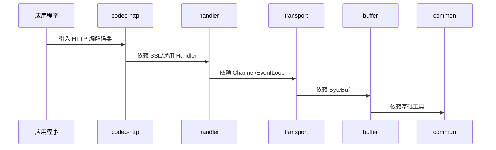

# 模块依赖关系图

## 概述

Netty 4.2 包含 40+ 个 Maven 模块，形成清晰的分层依赖结构。理解模块依赖关系有助于：

1. 明确各模块的职责边界
2. 理解代码的组织方式
3. 在需要修改某个功能时快速定位相关模块

在 Netty 整体架构中，模块依赖关系是理解代码结构的基础。

## 架构图

### 核心依赖层次

```mermaid
graph TB
    subgraph 用户层
        example[example]
    end

    subgraph 协议层
        codec-http3
        codec-http2
        codec-http
        codec-redis
        codec-mqtt
        codec-dns
        codec-haproxy
        codec-memcache
        codec-smtp
        codec-socks
        codec-stomp
        codec-xml
        codec-protobuf
        codec-marshalling
        codec-compression
        codec[codec 汇总]
        codec-classes-quic
        codec-native-quic
    end

    subgraph 处理器层
        handler
        handler-proxy
        handler-ssl-ocsp
    end

    subgraph 解析器层
        resolver
        resolver-dns
        resolver-dns-classes-macos
        resolver-dns-native-macos
    end

    subgraph 传输层
        transport
        transport-native-unix-common
        transport-classes-epoll
        transport-native-epoll
        transport-classes-io_uring
        transport-native-io_uring
        transport-classes-kqueue
        transport-native-kqueue
        transport-rxtx
        transport-sctp
        transport-udt
    end

    subgraph 核心层
        buffer
        codec-base
        common
    end

    %% 核心层依赖
    buffer --> common
    codec-base --> buffer
    codec-base --> common

    %% 传输层依赖
    transport --> buffer
    transport --> common
    transport-native-unix-common --> common
    transport-classes-epoll --> transport
    transport-classes-epoll --> transport-native-unix-common
    transport-native-epoll --> transport-classes-epoll
    transport-classes-io_uring --> transport
    transport-classes-io_uring --> transport-native-unix-common
    transport-native-io_uring --> transport-classes-io_uring
    transport-classes-kqueue --> transport
    transport-classes-kqueue --> transport-native-unix-common
    transport-native-kqueue --> transport-classes-kqueue

    %% 解析器层依赖
    resolver --> common
    resolver --> transport
    resolver-dns --> resolver
    resolver-dns --> codec-dns
    resolver-dns-classes-macos --> resolver-dns
    resolver-dns-native-macos --> resolver-dns-classes-macos

    %% 处理器层依赖
    handler --> transport
    handler --> buffer
    handler --> codec-base
    handler-proxy --> handler
    handler-proxy --> codec-socks
    handler-ssl-ocsp --> handler

    %% 协议层依赖
    codec --> codec-base
    codec-http --> codec-base
    codec-http --> handler
    codec-http2 --> codec-http
    codec-http2 --> handler
    codec-http3 --> codec-classes-quic
    codec-http3 --> handler
    codec-dns --> codec-base
    codec-haproxy --> codec-base
    codec-memcache --> codec-base
    codec-mqtt --> codec-base
    codec-redis --> codec-base
    codec-smtp --> codec-base
    codec-socks --> codec-base
    codec-stomp --> codec-base
    codec-xml --> codec-base
    codec-protobuf --> codec-base
    codec-marshalling --> codec-base
    codec-compression --> codec-base
    codec-classes-quic --> transport-native-unix-common
    codec-native-quic --> codec-classes-quic

    %% 用户层依赖
    example --> handler
    example --> codec-http
    example --> codec-http2
```



## 各模块定位

### 核心层

| 模块             | 定位                                     | 关键类                                                         |
| -------------- | -------------------------------------- | ----------------------------------------------------------- |
| **common**     | 基础工具库，提供并发工具、日志、内存管理、资源泄漏检测等           | `Future`, `Promise`, `Recycler`, `ResourceLeakDetector`     |
| **buffer**     | ByteBuf 抽象与内存池实现，是所有 I/O 操作的数据载体       | `ByteBuf`, `PooledByteBufAllocator`, `Unpooled`             |
| **codec-base** | 编解码器基础框架，提供 `ByteToMessageDecoder` 等抽象 | `ByteToMessageDecoder`, `MessageToByteEncoder`, `CodecBase` |

### 传输层

| 模块 | 定位 | 关键类 |
|------|------|--------|
| **transport** | 传输层核心，定义 `Channel`、`EventLoop`、`Bootstrap` 抽象 | `Channel`, `EventLoop`, `ServerBootstrap`, `ChannelPipeline` |
| **transport-native-unix-common** | Unix 系统原生传输的通用基础 | `DomainSocketChannel`, `UnixChannel` |
| **transport-classes-epoll** | Linux epoll 传输的类定义（不含 JNI） | `EpollEventLoopGroup`, `EpollSocketChannel` |
| **transport-native-epoll** | Linux epoll 传输的原生 JNI 实现 | JNI 绑定 |
| **transport-classes-io_uring** | Linux io_uring 传输的类定义 | `IoUringEventLoopGroup`, `IoUringSocketChannel` |
| **transport-native-io_uring** | Linux io_uring 传输的原生 JNI 实现 | JNI 绑定 |
| **transport-classes-kqueue** | macOS kqueue 传输的类定义 | `KQueueEventLoopGroup`, `KQueueSocketChannel` |
| **transport-native-kqueue** | macOS kqueue 传输的原生 JNI 实现 | JNI 绑定 |
| **transport-rxtx** | 串口（RXTX）传输支持 | `RxtxChannel` |
| **transport-sctp** | SCTP 协议传输支持 | `SctpChannel` |
| **transport-udt** | UDT 协议传输支持 | `UdtChannel` |

### 处理器层

| 模块 | 定位 | 关键类 |
|------|------|--------|
| **handler** | 高级处理器集合，提供 SSL/TLS、流量控制、日志等功能 | `SslHandler`, `FlowControlHandler`, `LoggingHandler` |
| **handler-proxy** | 代理协议支持（SOCKS、HTTP 代理） | `HttpProxyHandler`, `Socks4ProxyHandler` |
| **handler-ssl-ocsp** | SSL OCSP（在线证书状态协议）支持 | `OcspClientHandler` |

### 协议编解码层

| 模块                     | 定位                    | 关键类                                                  |
| ---------------------- | --------------------- | ---------------------------------------------------- |
| **codec**              | 常用编解码器汇总模块            | 汇聚多个子模块                                              |
| **codec-http**         | HTTP/1.x 协议编解码        | `HttpRequestDecoder`, `HttpResponseEncoder`          |
| **codec-http2**        | HTTP/2 协议编解码          | `Http2ConnectionHandler`, `Http2FrameCodec`          |
| **codec-http3**        | HTTP/3 协议编解码          | `Http3ClientConnectionHandler`                       |
| **codec-dns**          | DNS 协议编解码             | `DnsQueryEncoder`, `DnsResponseDecoder`              |
| **codec-haproxy**      | HAProxy 协议编解码         | `HAProxyMessageDecoder`                              |
| **codec-memcache**     | Memcache 协议编解码        | `MemcacheDecoder`, `MemcacheEncoder`                 |
| **codec-mqtt**         | MQTT 协议编解码            | `MqttDecoder`, `MqttEncoder`                         |
| **codec-redis**        | Redis 协议编解码           | `RedisDecoder`, `RedisEncoder`                       |
| **codec-smtp**         | SMTP 协议编解码            | `SmtpRequestDecoder`, `SmtpResponseEncoder`          |
| **codec-socks**        | SOCKS 协议编解码           | `SocksInitRequestDecoder`, `SocksAuthRequestDecoder` |
| **codec-stomp**        | STOMP 协议编解码           | `StompSubframeDecoder`, `StompSubframeEncoder`       |
| **codec-xml**          | XML 格式编解码             | `XMLDecoder`, `XMLEncoder`                           |
| **codec-protobuf**     | Protocol Buffers 编解码  | `ProtobufDecoder`, `ProtobufEncoder`                 |
| **codec-marshalling**  | JBoss Marshalling 编解码 | `MarshallingDecoder`, `MarshallingEncoder`           |
| **codec-compression**  | 数据压缩/解压缩              | `JdkZlibDecoder`, `SnappyFrameDecoder`               |
| **codec-classes-quic** | QUIC 协议类定义            | `QuicCodecBuilder`, `QuicChannel`                    |
| **codec-native-quic**  | QUIC 协议原生 JNI 实现      | JNI 绑定                                               |

### 解析器层

| 模块                             | 定位                   | 关键类                                                 |
| ------------------------------ | -------------------- | --------------------------------------------------- |
| **resolver**                   | 域名解析器抽象              | `AddressResolverGroup`, `InetSocketAddressResolver` |
| **resolver-dns**               | DNS 域名解析器实现          | `DnsNameResolver`, `DnsAddressResolverGroup`        |
| **resolver-dns-classes-macos** | macOS 平台 DNS 解析器类    | 平台适配                                                |
| **resolver-dns-native-macos**  | macOS 平台 DNS 解析器原生实现 | JNI 绑定                                              |

### 构建与测试

| 模块 | 定位 |
|------|------|
| **all** | 聚合模块，包含所有 Netty 模块 |
| **bom** | Bill of Materials，用于依赖版本管理 |
| **dev-tools** | 开发工具（代码格式化、静态检查） |
| **example** | 示例代码，演示 Netty 的使用方式 |
| **testsuite** | 核心功能测试套件 |
| **testsuite-common** | 测试通用工具 |
| **testsuite-http2** | HTTP/2 测试套件 |
| **testsuite-autobahn** | WebSocket Autobahn 测试套件 |
| **testsuite-jpms** | Java Platform Module System 测试 |
| **testsuite-karaf** | Apache Karaf OSGi 测试 |
| **testsuite-osgi** | OSGi 测试 |
| **testsuite-shading** | Maven Shade 插件测试 |
| **testsuite-native** | 原生传输测试 |
| **testsuite-native-image** | GraalVM Native Image 测试 |
| **microbench** | JMH 微基准测试 |
| **jfr-stub** | Java Flight Recorder 存根 |
| **varhandle-stub** | VarHandle 存根 |

## 设计思想

### 分层解耦

Netty 的模块设计遵循严格的分层原则：

1. **核心层**（common、buffer）：不依赖任何 Netty 其他模块
2. **传输层**（transport）：依赖核心层，定义 I/O 抽象
3. **处理器层**（handler）：依赖传输层，提供通用处理逻辑
4. **协议层**（codec-*）：依赖处理器层，实现具体协议

### 接口与实现分离

原生传输模块采用类/原生分离设计：

```
transport-classes-epoll    ← 纯 Java 类定义
transport-native-epoll     ← JNI 原生实现
```

这种设计使得：
- 类定义可以跨平台编译
- 原生实现仅在目标平台编译
- 用户通过 `pom.xml` 中的 profile 选择是否引入原生依赖

### SPI 扩展机制

Netty 4.2 引入 `ChannelInitializerExtension` SPI 机制，允许通过 `ServiceLoader` 扩展 Channel 初始化过程，而无需修改框架代码。

## 与其他模块的交互

### 典型依赖链路

**HTTP 服务器场景**：
```
codec-http → handler → transport → buffer → common
```

**HTTPS 服务器场景**：
```
codec-http → handler (SslHandler) → transport → buffer → common
```

**DNS 解析场景**：
```
resolver-dns → codec-dns → codec-base → buffer → common
```

## 关键流程

### 模块加载顺序



## 学习要点

### 需要重点理解的关键点

1. **分层结构**：核心层 → 传输层 → 处理器层 → 协议层
2. **接口与实现分离**：transport-classes-* 与 transport-native-* 的关系
3. **依赖方向**：上层依赖下层，下层不感知上层
4. **模块边界**：每个模块的职责范围和对外接口

### 常见面试问题

1. **Netty 的模块是如何组织的？**
   - 按职责分层：核心层、传输层、处理器层、协议层

2. **为什么 Netty 要把 transport 拆分为 classes 和 native 两个模块？**
   - 类定义可以跨平台编译，原生实现仅在目标平台编译，避免引入平台相关的 JNI 代码

3. **common 模块提供了哪些核心能力？**
   - 并发工具（Future/Promise）、对象池（Recycler）、资源泄漏检测（ResourceLeakDetector）
