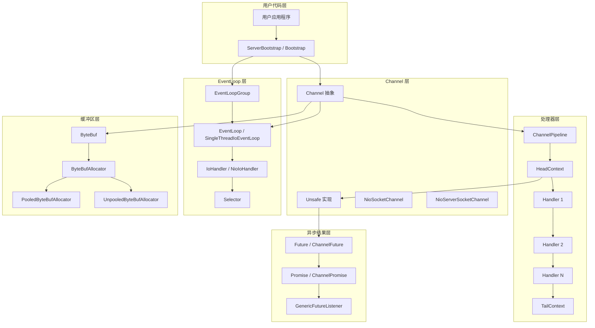
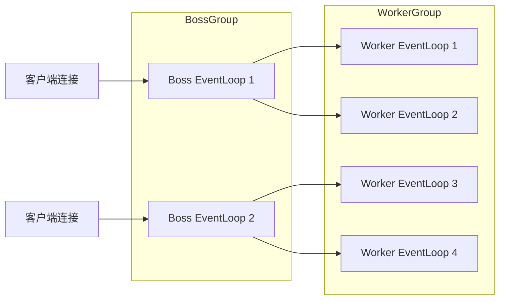
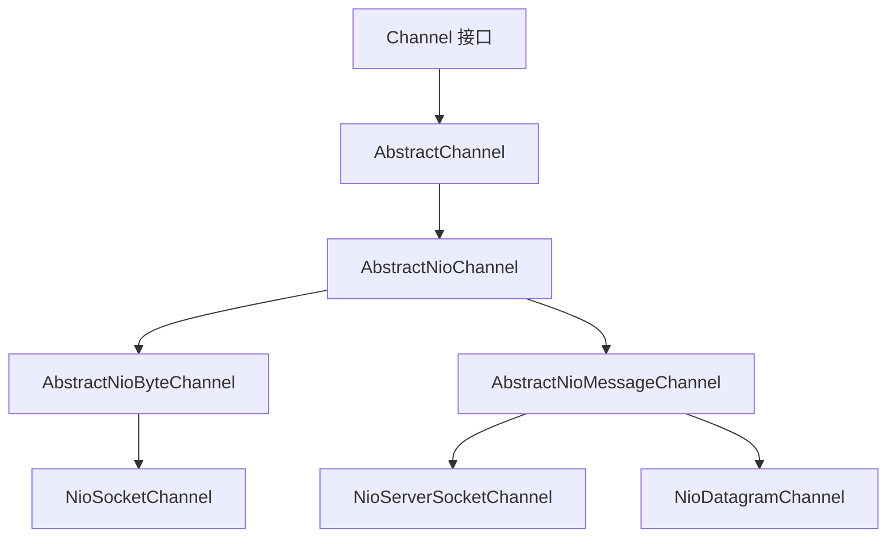
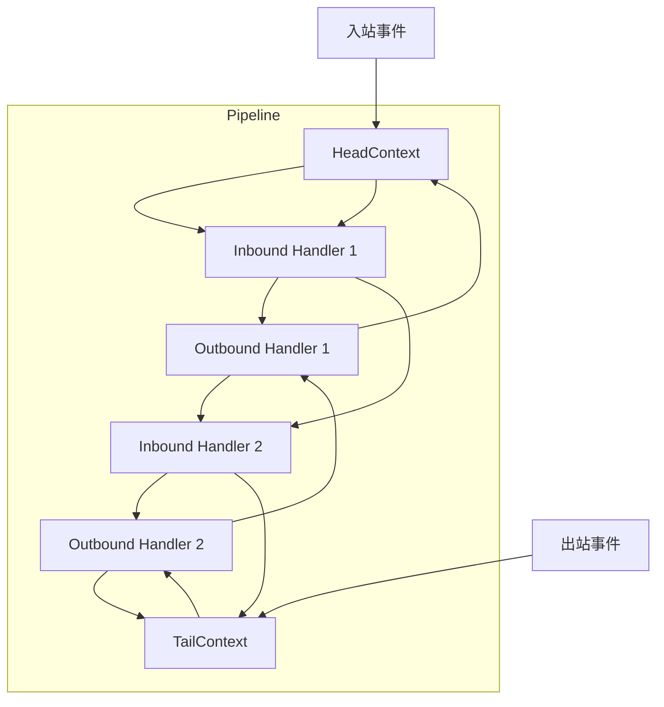
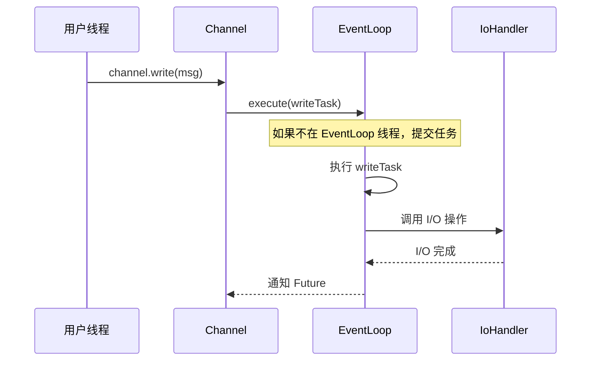
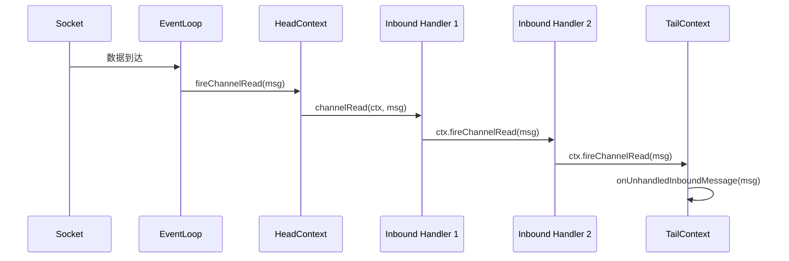
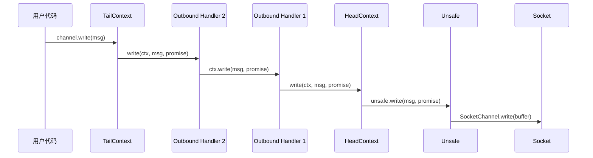

# 核心架构概述

## 概述

Netty 的核心架构基于 Reactor 模式，通过 `Channel`、`EventLoop`、`ChannelPipeline` 三大核心抽象，实现了高性能、可扩展的网络编程框架。

在 Netty 整体架构中，本文档描述的是最核心的设计模型，是理解所有其他模块的基础。

## 架构图

### 整体架构分层



### Reactor 线程模型



## 核心类分析

### Channel

`Channel` 是 Netty 对网络连接的抽象，代表一个开放的连接（如 TCP 连接）或一个能够进行 I/O 操作的实体。

**职责**：
- 提供当前连接的状态查询（`isOpen()`、`isActive()`、`isRegistered()`）
- 提供 I/O 操作接口（`read()`、`write()`、`connect()`、`bind()`、`close()`）
- 获取关联的 `ChannelPipeline` 和 `EventLoop`
- 获取配置参数（`ChannelConfig`）

**关键方法**：

```java
// transport/src/main/java/io/netty/channel/Channel.java:77
public interface Channel extends AttributeMap, ChannelOutboundInvoker, Comparable<Channel> {
    // 全局唯一标识
    ChannelId id();

    // 关联的 EventLoop
    EventLoop eventLoop();

    // 父 Channel（ServerChannel accept 产生的子 Channel 会指向 ServerChannel）
    Channel parent();

    // 配置
    ChannelConfig config();

    // 状态查询
    boolean isOpen();
    boolean isRegistered();
    boolean isActive();

    // 地址
    SocketAddress localAddress();
    SocketAddress remoteAddress();

    // Pipeline
    ChannelPipeline pipeline();

    // Unsafe 操作（框架内部使用）
    Unsafe unsafe();
}
```

**类层次结构**：



### EventLoopGroup / EventLoop

`EventLoopGroup` 是一组 `EventLoop` 的容器，`EventLoop` 是事件循环的核心，负责处理所有 I/O 事件。

**职责**：
- `EventLoopGroup`：管理一组 EventLoop，负责分配 Channel 到 EventLoop
- `EventLoop`：单线程事件循环，处理绑定到其上的所有 Channel 的 I/O 事件

**关键接口**：

```java
// transport/src/main/java/io/netty/channel/EventLoopGroup.java:25
public interface EventLoopGroup extends EventExecutorGroup {
    // 获取下一个 EventLoop
    @Override
    EventLoop next();

    // 注册 Channel 到 EventLoop
    ChannelFuture register(Channel channel);
    ChannelFuture register(ChannelPromise promise);
}
```

**EventLoop 运行机制**（4.2 中的新实现）：

```java
// transport/src/main/java/io/netty/channel/SingleThreadIoEventLoop.java:192
@Override
protected void run() {
    assert inEventLoop();
    ioHandler.initialize();
    do {
        // 执行 I/O 操作
        runIo();
        if (isShuttingDown()) {
            ioHandler.prepareToDestroy();
        }
        // 执行任务队列中的任务
        runAllTasks(maxTaskProcessingQuantumNs);
    } while (!confirmShutdown() && !canSuspend());
}
```

### ChannelPipeline

`ChannelPipeline` 是 Handler 链的容器，实现了责任链模式，管理 I/O 事件的传播。

**职责**：
- 管理 `ChannelHandler` 的生命周期
- 传播入站事件（从 Head 到 Tail）
- 传播出站事件（从 Tail 到 Head）

**双向链表结构**：

```java
// transport/src/main/java/io/netty/channel/DefaultChannelPipeline.java:45
public class DefaultChannelPipeline implements ChannelPipeline {
    final HeadContext head;
    final TailContext tail;

    private final Channel channel;

    protected DefaultChannelPipeline(Channel channel) {
        this.channel = ObjectUtil.checkNotNull(channel, "channel");
        tail = new TailContext(this);
        head = new HeadContext(this);
        // 双向链表：head <-> tail
        head.next = tail;
        tail.prev = head;
    }
}
```

**事件传播流程**：



### HeadContext / TailContext

`HeadContext` 和 `TailContext` 是 Pipeline 的头尾节点，作为哨兵节点存在。

**HeadContext**：同时实现 `ChannelOutboundHandler` 和 `ChannelInboundHandler`

```java
// transport/src/main/java/io/netty/channel/DefaultChannelPipeline.java:1324
final class HeadContext extends AbstractChannelHandlerContext
        implements ChannelOutboundHandler, ChannelInboundHandler {

    private final Unsafe unsafe;

    HeadContext(DefaultChannelPipeline pipeline) {
        super(pipeline, null, HEAD_NAME, HeadContext.class);
        unsafe = pipeline.channel().unsafe();
        setAddComplete();
    }

    // 出站操作委托给 Unsafe
    @Override
    public void bind(ChannelHandlerContext ctx, SocketAddress localAddress, ChannelPromise promise) {
        unsafe.bind(localAddress, promise);
    }

    @Override
    public void write(ChannelHandlerContext ctx, Object msg, ChannelPromise promise) {
        unsafe.write(msg, promise);
    }

    @Override
    public void flush(ChannelHandlerContext ctx) {
        unsafe.flush();
    }

    // 入站事件触发 handlerAdded 并继续传播
    @Override
    public void channelRegistered(ChannelHandlerContext ctx) {
        invokeHandlerAddedIfNeeded();
        ctx.fireChannelRegistered();
    }
}
```

**TailContext**：实现 `ChannelInboundHandler`，处理未被消费的入站事件

```java
// transport/src/main/java/io/netty/channel/DefaultChannelPipeline.java:1264
final class TailContext extends AbstractChannelHandlerContext implements ChannelInboundHandler {
    TailContext(DefaultChannelPipeline pipeline) {
        super(pipeline, null, TAIL_NAME, TailContext.class);
        setAddComplete();
    }

    // 未处理的入站消息，释放资源
    @Override
    public void channelRead(ChannelHandlerContext ctx, Object msg) {
        onUnhandledInboundMessage(ctx, msg);
    }

    // 未处理的异常，记录日志
    @Override
    public void exceptionCaught(ChannelHandlerContext ctx, Throwable cause) {
        onUnhandledInboundException(cause);
    }
}
```

### ChannelHandlerContext

`ChannelHandlerContext` 是 Handler 与 Pipeline 之间的桥梁，持有 Handler 的引用和双向链表指针。

**关键字段**：

```java
// transport/src/main/java/io/netty/channel/AbstractChannelHandlerContext.java:60
abstract class AbstractChannelHandlerContext implements ChannelHandlerContext, ResourceLeakHint {
    // 双向链表指针
    volatile AbstractChannelHandlerContext next;
    volatile AbstractChannelHandlerContext prev;

    private final DefaultChannelPipeline pipeline;
    private final String name;
    private final int executionMask;

    // 关联的 EventExecutor（可能与 Channel 的 EventLoop 不同）
    final EventExecutor childExecutor;
    EventExecutor contextExecutor;
}
```

### ByteBuf

`ByteBuf` 是 Netty 对字节缓冲区的抽象，替代 JDK 的 `ByteBuffer`。

**三区域模型**：

```
+-------------------+------------------+------------------+
| discardable bytes |  readable bytes  |  writable bytes  |
|                   |     (CONTENT)    |                  |
+-------------------+------------------+------------------+
|                   |                  |                  |
0      <=      readerIndex   <=   writerIndex    <=    capacity
```

**关键特性**：
- 读写索引分离
- 自动扩容
- 引用计数
- 池化支持

```java
// buffer/src/main/java/io/netty/buffer/ByteBuf.java:32
public abstract class ByteBuf implements ReferenceCounted, Comparable<ByteBuf> {
    // 容量
    public abstract int capacity();

    // 读索引
    public abstract int readerIndex();
    public abstract ByteBuf readerIndex(int readerIndex);

    // 写索引
    public abstract int writerIndex();
    public abstract ByteBuf writerIndex(int writerIndex);

    // 可读/可写字节数
    public abstract int readableBytes();
    public abstract int writableBytes();

    // 读操作
    public abstract byte readByte();
    public abstract short readShort();
    public abstract int readInt();

    // 写操作
    public abstract ByteBuf writeByte(int value);
    public abstract ByteBuf writeShort(int value);
    public abstract ByteBuf writeInt(int value);
}
```

### Future / Promise

`Future` 和 `Promise` 是 Netty 异步编程的核心，提供非阻塞的结果通知机制。

```java
// common/src/main/java/io/netty/util/concurrent/Future.java:26
public interface Future<V> extends java.util.concurrent.Future<V> {
    // 操作是否成功
    boolean isSuccess();

    // 操作是否可取消
    boolean isCancellable();

    // 失败原因
    Throwable cause();

    // 添加监听器
    Future<V> addListener(GenericFutureListener<? extends Future<? super V>> listener);

    // 同步等待
    Future<V> sync() throws InterruptedException;
    Future<V> syncUninterruptibly();

    // 异步等待
    Future<V> await() throws InterruptedException;
    Future<V> awaitUninterruptibly();
}
```

## 设计思想

### 单线程模型

EventLoop 采用单线程模型，每个 EventLoop 绑定一个线程，处理分配到其上的所有 Channel 的 I/O 事件。

**优势**：
1. 避免锁竞争：同一线程处理所有操作，无需同步
2. 顺序保证：事件处理顺序与到达顺序一致
3. 简化编程模型：无需考虑线程安全问题

**代码体现**：

```java
// transport/src/main/java/io/netty/channel/SingleThreadIoEventLoop.java:36
public class SingleThreadIoEventLoop extends SingleThreadEventLoop implements IoEventLoop {
    private final IoHandler ioHandler;

    @Override
    protected void run() {
        assert inEventLoop();
        ioHandler.initialize();
        do {
            runIo();  // 单线程处理 I/O
            runAllTasks(maxTaskProcessingQuantumNs);  // 单线程处理任务
        } while (!confirmShutdown() && !canSuspend());
    }
}
```

### 责任链模式

ChannelPipeline 采用责任链模式，Handler 按顺序组成链表，事件沿链表传播。

**入站事件传播**：Head → Tail（从头到尾）

```java
// transport/src/main/java/io/netty/channel/AbstractChannelHandlerContext.java:148
@Override
public ChannelHandlerContext fireChannelRegistered() {
    // 查找下一个支持该事件的入站 Handler
    AbstractChannelHandlerContext next = findContextInbound(MASK_CHANNEL_REGISTERED);
    if (next.executor().inEventLoop()) {
        // 在 EventLoop 线程中直接调用
        next.handler().channelRegistered(next);
    } else {
        // 提交到 Handler 关联的 EventExecutor
        next.executor().execute(this::fireChannelRegistered);
    }
    return this;
}
```

**出站事件传播**：Tail → Head（从尾到头）

```java
// HeadContext 最终委托给 Unsafe 执行实际 I/O
@Override
public void write(ChannelHandlerContext ctx, Object msg, ChannelPromise promise) {
    unsafe.write(msg, promise);
}
```

### 异步编程模型

所有 I/O 操作都是异步的，通过 Future/Promise 模式通知结果。

```java
// 用户代码
ChannelFuture f = channel.writeAndFlush(msg);
f.addListener(new ChannelFutureListener() {
    @Override
    public void operationComplete(ChannelFuture future) {
        if (future.isSuccess()) {
            // 成功处理
        } else {
            // 失败处理
            future.cause().printStackTrace();
        }
    }
});
```

### IoHandler 抽象（4.2 新增）

Netty 4.2 引入 `IoHandler` 接口，将 I/O 处理逻辑从 EventLoop 中解耦：

```java
// transport/src/main/java/io/netty/channel/IoHandler.java
public interface IoHandler {
    void initialize();                              // 初始化
    int run(IoHandlerContext context);              // 执行 I/O 操作
    void wakeup();                                  // 唤醒阻塞
    IoRegistration register(IoHandle handle);       // 注册 I/O 句柄
    void deregister(IoRegistration registration);   // 注销
    boolean isCompatible(Class<? extends IoHandle> handleType);
    long completedIoTimeoutNanos();
    void destroy();                                 // 销毁
}
```

## 与其他模块的交互

### Channel 与 EventLoop

- `Channel` 在创建后注册到 `EventLoop`
- 一个 `EventLoop` 可以服务多个 `Channel`
- `Channel` 的所有 I/O 操作都由其 `EventLoop` 线程执行



### Channel 与 Pipeline

- 每个 `Channel` 持有一个 `ChannelPipeline`
- `ChannelPipeline` 在 `Channel` 创建时自动创建
- I/O 事件通过 `ChannelPipeline` 传播给 `ChannelHandler`

### Channel 与 ByteBuf

- 读操作：从 `Channel` 读取数据到 `ByteBuf`
- 写操作：将 `ByteBuf` 写入 `Channel`
- `ByteBuf` 由 `ByteBufAllocator` 分配，与 `Channel` 关联

## 关键流程

### 入站事件处理流程



### 出站事件处理流程



## 学习要点

### 需要重点理解的关键点

1. **Channel 是什么**：网络连接的抽象，提供统一的 I/O 操作接口
2. **EventLoop 的单线程模型**：一个线程处理多个 Channel，避免锁竞争
3. **Pipeline 的责任链**：入站从 Head 到 Tail，出站从 Tail 到 Head
4. **HeadContext 的双重角色**：既是出站 Handler 的终点（委托 Unsafe），也是入站事件的起点
5. **Future/Promise 的异步模型**：所有 I/O 操作都是异步的

### 常见面试问题

1. **Channel、EventLoop、ChannelPipeline 的关系是什么？**
   - 每个 Channel 拥有一个 Pipeline，注册到一个 EventLoop
   - Channel 的 I/O 事件由 EventLoop 线程处理
   - 事件通过 Pipeline 中的 Handler 链传播

2. **HeadContext 和 TailContext 的作用是什么？**
   - HeadContext：出站操作的终点，委托给 Unsafe 执行实际 I/O；入站事件的起点
   - TailContext：入站事件的终点，处理未被消费的事件（释放资源、记录日志）

3. **为什么 EventLoop 采用单线程模型？**
   - 避免锁竞争，简化编程模型，保证事件处理顺序

4. **Netty 4.2 的 IoHandler 抽象解决了什么问题？**
   - 将 I/O 处理逻辑从 EventLoop 中解耦，支持多种 I/O 模型（NIO、Epoll、io_uring）
