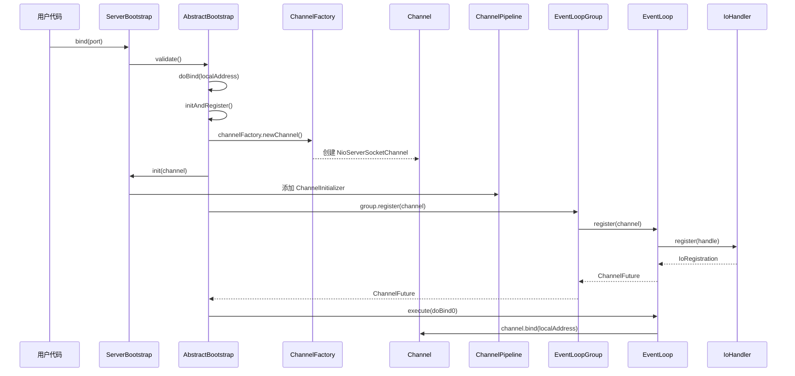
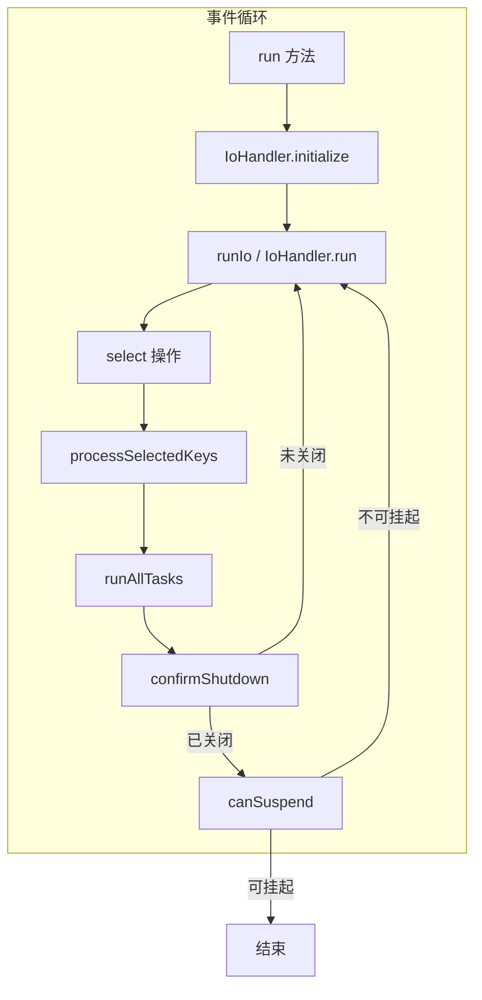
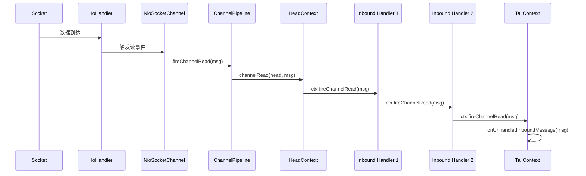
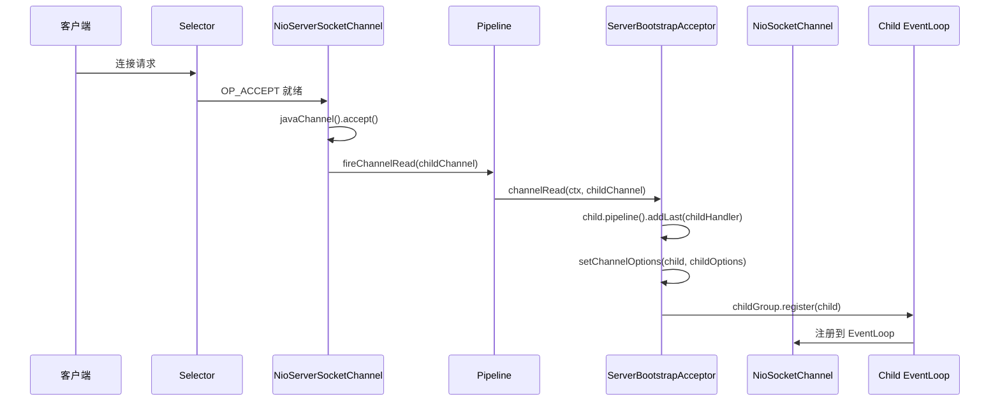
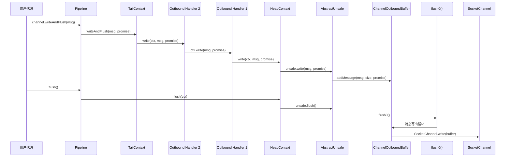

# 源码阅读地图

> **前置知识**：建议先读完 00-概述与导航 前三篇；会用 IDE 打开并跳转源码。

## 概述

本文档提供 Netty 核心流程的精确代码路径，帮助读者快速定位关键代码。每个流程都标注了模块名、类名和行号。

在 Netty 整体架构中，本文档是源码分析的导航工具，帮助读者按照正确的路径深入理解各个核心流程。

## 启动流程

### ServerBootstrap.bind() 完整路径

服务端启动从 `ServerBootstrap.bind()` 开始，经过 Channel 创建、初始化、注册、绑定等步骤。



**精确代码路径**：

1. **入口**：`ServerBootstrap.bind(int)` → `AbstractBootstrap.bind(SocketAddress)`
   - 文件：`transport/src/main/java/io/netty/bootstrap/AbstractBootstrap.java:286`

2. **验证**：`AbstractBootstrap.validate()`
   - 文件：`transport/src/main/java/io/netty/bootstrap/AbstractBootstrap.java:223`

3. **绑定核心逻辑**：`AbstractBootstrap.doBind(SocketAddress)`
   - 文件：`transport/src/main/java/io/netty/bootstrap/AbstractBootstrap.java:291`

4. **创建并注册**：`AbstractBootstrap.initAndRegister()`
   - 文件：`transport/src/main/java/io/netty/bootstrap/AbstractBootstrap.java:324`
   - 关键步骤：
     - `channelFactory.newChannel()` — 创建 Channel
     - `init(channel)` — 初始化 Channel（由子类实现）
     - `config().group().register(channel)` — 注册到 EventLoopGroup

5. **ServerBootstrap.init(Channel)**：
   - 文件：`transport/src/main/java/io/netty/bootstrap/ServerBootstrap.java:133`
   - 关键步骤：
     - 设置 ChannelOptions 和 Attributes
     - 添加 `ChannelInitializer`（后续添加 `ServerBootstrapAcceptor`）

6. **绑定操作**：`AbstractBootstrap.doBind0()`
   - 文件：`transport/src/main/java/io/netty/bootstrap/AbstractBootstrap.java:371`
   - 通过 `channel.eventLoop().execute()` 提交绑定任务
   - 最终调用 `channel.bind(localAddress, promise)`

7. **Unsafe.bind()**：`AbstractChannel.AbstractUnsafe.bind()`
   - 文件：`transport/src/main/java/io/netty/channel/AbstractChannel.java:409`
   - 关键步骤：
     - `doBind(localAddress)` — 实际绑定操作
     - `pipeline.fireChannelActive()` — 触发 Channel Active 事件

## 事件循环

### SingleThreadEventExecutor.run() 完整路径

事件循环是 Netty 的核心机制，负责处理所有 I/O 事件和异步任务。



**精确代码路径**：

1. **事件循环入口**：`SingleThreadIoEventLoop.run()`
   - 文件：`transport/src/main/java/io/netty/channel/SingleThreadIoEventLoop.java:192`
   - 核心循环：
     ```java
     protected void run() {
         assert inEventLoop();
         ioHandler.initialize();
         do {
             runIo();                              // 执行 I/O
             runAllTasks(maxTaskProcessingQuantumNs); // 执行任务
         } while (!confirmShutdown() && !canSuspend());
     }
     ```

2. **I/O 处理**：`SingleThreadIoEventLoop.runIo()`
   - 文件：`transport/src/main/java/io/netty/channel/SingleThreadIoEventLoop.java:223`
   - 委托给 `ioHandler.run(context)`

3. **NIO I/O 处理**：`NioIoHandler.run(IoHandlerContext)`
   - 文件：`transport/src/main/java/io/netty/channel/nio/NioIoHandler.java:419`
   - 关键步骤：
     - `selectStrategy.calculateStrategy()` — 计算 Select 策略
     - `select(context, wakenUp.getAndSet(false))` — 执行 Selector.select()
     - `processSelectedKeys()` — 处理就绪的 SelectionKey

4. **处理就绪 Key**：`NioIoHandler.processSelectedKeys()`
   - 文件：`transport/src/main/java/io/netty/channel/nio/NioIoHandler.java:510`
   - 根据是否使用优化的 KeySet 选择不同处理路径

5. **任务执行**：`SingleThreadEventExecutor.runAllTasks(long)`
   - 文件：`common/src/main/java/io/netty/util/concurrent/SingleThreadEventExecutor.java:521`
   - 关键逻辑：
     - 从 ScheduledTaskQueue 拉取到期任务到 TaskQueue
     - 循环执行 TaskQueue 中的任务
     - 每 64 个任务检查一次超时

6. **任务执行（简化版）**：`SingleThreadEventExecutor.runAllTasks()`
   - 文件：`common/src/main/java/io/netty/util/concurrent/SingleThreadEventExecutor.java:430`

## 数据读写

### Pipeline.fireChannelRead() 完整路径

数据读取流程从 I/O 层读取数据开始，经过 Pipeline 中的 Handler 链处理。



**精确代码路径**：

1. **Pipeline 入口**：`DefaultChannelPipeline.fireChannelRead(Object)`
   - 文件：`transport/src/main/java/io/netty/channel/DefaultChannelPipeline.java:915`
   - 代码：
     ```java
     public final ChannelPipeline fireChannelRead(Object msg) {
         if (head.executor().inEventLoop()) {
             if (head.invokeHandler()) {
                 head.channelRead(head, msg);
             } else {
                 head.fireChannelRead(msg);
             }
         } else {
             head.executor().execute(() -> fireChannelRead(msg));
         }
         return this;
     }
     ```

2. **HeadContext.channelRead()**：
   - 文件：`transport/src/main/java/io/netty/channel/DefaultChannelPipeline.java:1428`
   - 直接转发：`ctx.fireChannelRead(msg)`

3. **Context 传播**：`AbstractChannelHandlerContext.fireChannelRead()`
   - 文件：`transport/src/main/java/io/netty/channel/AbstractChannelHandlerContext.java:148`（类似结构）
   - 查找下一个入站 Handler 并调用

4. **TailContext.channelRead()**：
   - 文件：`transport/src/main/java/io/netty/channel/DefaultChannelPipeline.java:1314`
   - 调用 `onUnhandledInboundMessage(ctx, msg)` 释放未消费的消息

## Pipeline 传播

### DefaultChannelPipeline 完整调用链

Pipeline 是双向链表结构，入站事件从 Head 到 Tail，出站事件从 Tail 到 Head。

**Handler 添加流程**：

1. **添加 Handler**：`DefaultChannelPipeline.addLast(String, ChannelHandler)`
   - 文件：`transport/src/main/java/io/netty/channel/DefaultChannelPipeline.java:221`
   - 调用 `internalAdd(group, name, handler, null, AddStrategy.ADD_LAST)`

2. **内部添加**：`DefaultChannelPipeline.internalAdd()`
   - 文件：`transport/src/main/java/io/netty/channel/DefaultChannelPipeline.java:161`
   - 关键步骤：
     - `checkMultiplicity(handler)` — 检查 @Sharable 注解
     - `filterName(name, handler)` — 生成唯一名称
     - `newContext(group, name, handler)` — 创建 Context
     - `addLast0(newCtx)` — 插入链表尾部

3. **链表插入**：`DefaultChannelPipeline.addLast0()`
   - 文件：`transport/src/main/java/io/netty/channel/DefaultChannelPipeline.java:212`（addFirst0 类似）
   - 双向链表操作：
     ```java
     private void addFirst0(AbstractChannelHandlerContext newCtx) {
         AbstractChannelHandlerContext nextCtx = head.next;
         newCtx.prev = head;
         newCtx.next = nextCtx;
         head.next = newCtx;
         nextCtx.prev = newCtx;
     }
     ```

**入站事件传播**：

1. **查找下一个入站 Handler**：`AbstractChannelHandlerContext.findContextInbound()`
   - 从当前 Context 向后遍历，找到第一个支持该事件的入站 Handler
   - 使用 `executionMask` 位掩码快速判断

2. **事件调用**：根据 Handler 类型分派
   - `HeadContext`：特殊处理
   - `ChannelInboundHandlerAdapter`：直接调用
   - `ChannelInboundHandler`：通用调用

**出站事件传播**：

1. **查找下一个出站 Handler**：`AbstractChannelHandlerContext.findContextOutbound()`
   - 从当前 Context 向前遍历，找到第一个支持该事件的出站 Handler

2. **终点处理**：`HeadContext` 委托给 `Unsafe`
   - `bind()` → `unsafe.bind()`
   - `write()` → `unsafe.write()`
   - `flush()` → `unsafe.flush()`

## 连接建立

### Accept/Connect 完整路径

**服务端 Accept 流程**：



**精确代码路径**：

1. **Accept 事件处理**：`NioServerSocketChannel` 的 I/O 事件
   - 当 `Selector` 返回 `OP_ACCEPT` 事件时
   - 调用 `javaChannel().accept()` 接受连接
   - 创建 `NioSocketChannel` 并触发 `fireChannelRead(childChannel)`

2. **ServerBootstrapAcceptor.channelRead()**：
   - 文件：`transport/src/main/java/io/netty/bootstrap/ServerBootstrap.java:223`
   - 关键步骤：
     ```java
     public void channelRead(ChannelHandlerContext ctx, Object msg) {
         final Channel child = (Channel) msg;
         child.pipeline().addLast(childHandler);  // 添加用户 Handler
         setChannelOptions(child, childOptions);  // 设置选项
         setAttributes(child, childAttrs);        // 设置属性
         childGroup.register(child).addListener(...); // 注册到 WorkerGroup
     }
     ```

3. **子 Channel 注册**：`EventLoopGroup.register(Channel)`
   - 将子 Channel 注册到 WorkerGroup 的某个 EventLoop
   - EventLoop 调用 `IoHandler.register()` 注册到 Selector

**客户端 Connect 流程**：

1. **入口**：`Bootstrap.connect(SocketAddress)`
   - 文件：`transport/src/main/java/io/netty/bootstrap/AbstractBootstrap.java:286`（类似 bind）

2. **初始化**：`Bootstrap.init(Channel)`
   - 设置 ChannelOptions
   - 添加用户 Handler

3. **连接操作**：`AbstractChannel.AbstractUnsafe.connect()`
   - 调用 `doConnect(remoteAddress, localAddress)`
   - 注册 `OP_CONNECT` 到 Selector

4. **Connect 完成**：`NioSocketChannel` 处理 `OP_CONNECT` 事件
   - 检查连接结果
   - 触发 `pipeline.fireChannelActive()`

## 数据写出

### writeAndFlush → SocketChannel.write 完整路径

数据写出流程从用户调用 `writeAndFlush()` 开始，经过 Pipeline 中的出站 Handler 链，最终写入 Socket。



**精确代码路径**：

1. **入口**：`DefaultChannelPipeline.writeAndFlush(Object)`
   - 文件：`transport/src/main/java/io/netty/channel/DefaultChannelPipeline.java:1040`
   - 委托给 `tail.writeAndFlush(msg, promise)`

2. **出站传播**：经过出站 Handler 链（Tail → Head）

3. **HeadContext.write()**：
   - 文件：`transport/src/main/java/io/netty/channel/DefaultChannelPipeline.java:1385`
   - 委托给 `unsafe.write(msg, promise)`

4. **Unsafe.write()**：`AbstractChannel.AbstractUnsafe.write()`
   - 文件：`transport/src/main/java/io/netty/channel/AbstractChannel.java:710`
   - 关键步骤：
     ```java
     public final void write(Object msg, ChannelPromise promise) {
         assertEventLoop();
         ChannelOutboundBuffer outboundBuffer = this.outboundBuffer;
         // ... 检查和过滤消息
         msg = filterOutboundMessage(msg);
         size = pipeline.estimatorHandle().size(msg);
         outboundBuffer.addMessage(msg, size, promise); // 添加到缓冲区
     }
     ```

5. **Unsafe.flush()**：`AbstractChannel.AbstractUnsafe.flush()`
   - 文件：`transport/src/main/java/io/netty/channel/AbstractChannel.java:749`
   - 调用 `flush0()`

6. **实际写出**：`AbstractNioByteChannel.doWrite(ChannelOutboundBuffer)`
   - 遍历 `ChannelOutboundBuffer` 中的消息
   - 调用 `SocketChannel.write(ByteBuffer)` 写出数据

## 关键类索引

### 核心接口

| 接口 | 文件路径 | 职责 |
|------|----------|------|
| `Channel` | `transport/.../channel/Channel.java` | 网络连接抽象 |
| `EventLoop` | `transport/.../channel/EventLoop.java` | 事件循环 |
| `ChannelPipeline` | `transport/.../channel/ChannelPipeline.java` | Handler 链 |
| `ChannelHandler` | `transport/.../channel/ChannelHandler.java` | 处理器 |
| `ByteBuf` | `buffer/.../buffer/ByteBuf.java` | 字节缓冲区 |
| `Future` | `common/.../concurrent/Future.java` | 异步结果 |

### 核心实现

| 类 | 文件路径 | 职责 |
|----|----------|------|
| `DefaultChannelPipeline` | `transport/.../channel/DefaultChannelPipeline.java` | Pipeline 默认实现 |
| `AbstractChannel` | `transport/.../channel/AbstractChannel.java` | Channel 抽象基类 |
| `SingleThreadIoEventLoop` | `transport/.../channel/SingleThreadIoEventLoop.java` | 单线程事件循环 |
| `NioIoHandler` | `transport/.../channel/nio/NioIoHandler.java` | NIO I/O 处理器 |
| `ServerBootstrap` | `transport/.../bootstrap/ServerBootstrap.java` | 服务端启动器 |
| `AbstractBootstrap` | `transport/.../bootstrap/AbstractBootstrap.java` | 启动器基类 |

### Handler 体系

| 类 | 文件路径 | 职责 |
|----|----------|------|
| `ChannelInboundHandler` | `transport/.../channel/ChannelInboundHandler.java` | 入站处理器接口 |
| `ChannelOutboundHandler` | `transport/.../channel/ChannelOutboundHandler.java` | 出站处理器接口 |
| `ChannelInboundHandlerAdapter` | `transport/.../channel/ChannelInboundHandlerAdapter.java` | 入站处理器适配器 |
| `ChannelOutboundHandlerAdapter` | `transport/.../channel/ChannelOutboundHandlerAdapter.java` | 出站处理器适配器 |
| `ChannelDuplexHandler` | `transport/.../channel/ChannelDuplexHandler.java` | 双向处理器 |

## 学习要点

### 需要重点理解的关键点

1. **启动流程**：`bind()` → `initAndRegister()` → `init()` → `register()` → `doBind()`
2. **事件循环**：`run()` → `runIo()` → `select()` → `processSelectedKeys()` → `runAllTasks()`
3. **数据读取**：`fireChannelRead()` → Head → Handler 链 → Tail
4. **数据写出**：`writeAndFlush()` → Tail → Handler 链 → Head → Unsafe → ChannelOutboundBuffer → Socket
5. **连接建立**：Accept → `ServerBootstrapAcceptor` → 注册到 WorkerGroup

### 常见面试问题

1. **ServerBootstrap.bind() 的完整流程是什么？**
   - 创建 Channel → 初始化 Pipeline → 注册到 EventLoop → 绑定端口 → 触发 Active 事件

2. **EventLoop 的事件循环是如何工作的？**
   - 单线程循环：select I/O 事件 → 处理就绪事件 → 执行任务队列

3. **数据从 Socket 读取后是如何传递到用户 Handler 的？**
   - IoHandler 读取数据 → fireChannelRead() → Pipeline 入站传播 → 用户 Handler

4. **writeAndFlush 的数据是如何写出到 Socket 的？**
   - Pipeline 出站传播 → HeadContext → Unsafe.write() → ChannelOutboundBuffer → Unsafe.flush() → SocketChannel.write()
