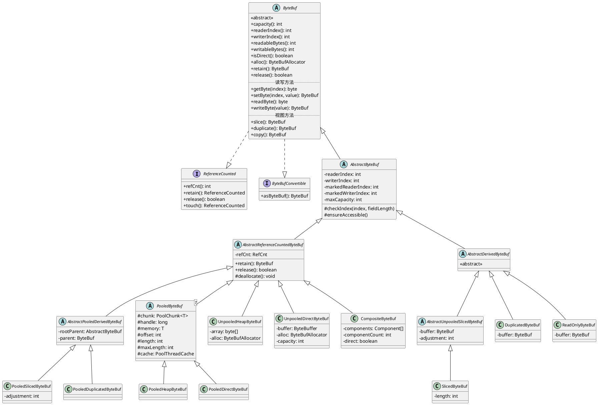
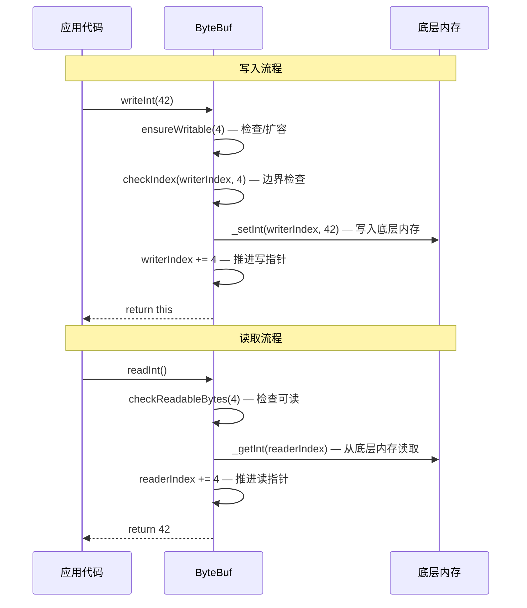

# ByteBuf 体系

> **前置知识**：Java NIO ByteBuffer 基础（学习计划任务 1.1）；了解堆内/直接内存概念。

## 概述

### ByteBuf 解决什么问题

Java NIO 的 `ByteBuffer` 存在诸多设计缺陷，Netty 为此重新设计了 `ByteBuf` 体系：

| 问题 | JDK ByteBuffer | Netty ByteBuf |
|------|----------------|---------------|
| 固定容量 | 分配后 capacity 不可变，需手动创建新 buffer 并拷贝 | 支持动态扩容，`ensureWritable()` 自动扩展 |
| 读写指针耦合 | `position` 和 `limit` 互相依赖，读写切换需 `flip()` | 独立的 `readerIndex` 和 `writerIndex`，读写互不干扰 |
| API 不友好 | 类型方法少，无链式调用 | 丰富的读写方法，全链式返回 `ByteBuf` |
| 缺少引用计数 | 依赖 GC 回收堆外内存，不可控 | 内置 `ReferenceCounted`，手动管理生命周期 |
| 无零拷贝支持 | 没有切片/复合视图的高效支持 | `slice()`、`duplicate()`、`CompositeByteBuf` 实现零拷贝 |
| 字节序不灵活 | 需通过 `order()` 切换全局字节序 | 提供 `getShortLE()`、`writeIntLE()` 等独立 LE 方法 |

### 在 Netty 整体架构中的位置

ByteBuf 是 Netty I/O 模型的核心数据载体，在整个架构中处于最底层：

```
应用层 (业务 Handler)
    |
    v
Pipeline (ChannelPipeline / ChannelHandler)
    |
    v
传输层 (Channel / EventLoop)
    |
    v
ByteBuf —— 数据读写的唯一载体
    |
    v
内存管理 (Pooled / Unpooled / Arena / Chunk)
```

- `Channel.read()` 从 socket 读取数据到 `ByteBuf`
- `Channel.write()` 将 `ByteBuf` 写入 socket
- `ChannelHandler.channelRead()` 接收 `ByteBuf` 作为消息
- 编解码器（`ByteToMessageDecoder`、`MessageToByteEncoder`）以 `ByteBuf` 为输入输出

---

## 架构图

### ByteBuf 完整类继承图



### 三指针模型示意图

```
+-------------------+------------------+------------------+
| discardable bytes |  readable bytes  |  writable bytes  |
|   (已读已消费)     |    (CONTENT)     |   (可写空间)      |
+-------------------+------------------+------------------+
|                   |                  |                  |
0      <=      readerIndex   <=   writerIndex    <=    capacity
```

**关键公式**（见 `AbstractByteBuf.java:177-188`）：

- `readableBytes() = writerIndex - readerIndex`
- `writableBytes() = capacity - writerIndex`
- `maxWritableBytes() = maxCapacity - writerIndex`
- `0 <= readerIndex <= writerIndex <= capacity <= maxCapacity`

---

## 核心类分析

### 1. ByteBuf — 核心抽象类

**文件**: `buffer/src/main/java/io/netty/buffer/ByteBuf.java`

**类声明**（第 248 行）：
```java
public abstract class ByteBuf implements ReferenceCounted, Comparable<ByteBuf>, ByteBufConvertible
```

ByteBuf 是整个缓冲区体系的顶层抽象，定义了所有子类必须实现的合约。它是一个**抽象类而非接口**，这是因为 Netty 需要提供大量带有默认实现的便利方法。

#### 容量管理方法

| 方法 | 行号 | 说明 |
|------|------|------|
| `capacity()` | 253 | 返回当前容量 |
| `capacity(int)` | 263 | 调整容量，可扩可缩 |
| `maxCapacity()` | 269 | 返回最大容量上限 |
| `alloc()` | 274 | 返回创建此 buffer 的分配器 |
| `isDirect()` | 311 | 是否为堆外（direct）内存 |
| `isReadOnly()` | 316 | 是否只读 |
| `asReadOnly()` | 321 | 返回只读视图 |
| `unwrap()` | 305 | 返回被包装的底层 buffer（视图类返回非 null） |

#### 三指针操作方法

| 方法 | 行号 | 说明 |
|------|------|------|
| `readerIndex()` | 326 | 获取读指针 |
| `readerIndex(int)` | 336 | 设置读指针，不能超过 writerIndex |
| `writerIndex()` | 341 | 获取写指针 |
| `writerIndex(int)` | 348 | 设置写指针，不能小于 readerIndex |
| `setIndex(int, int)` | 404 | 同时设置读写指针，避免调用顺序问题 |
| `readableBytes()` | 410 | 可读字节数 = writerIndex - readerIndex |
| `writableBytes()` | 416 | 可写字节数 = capacity - writerIndex |
| `maxWritableBytes()` | 422 | 最大可写字节数 = maxCapacity - writerIndex |
| `maxFastWritableBytes()` | 429 | 快速可写字节数（默认等于 writableBytes） |
| `isReadable()` | 438 | 是否有可读数据 |
| `isReadable(int)` | 443 | 是否有至少 N 个字节可读 |
| `isWritable()` | 450 | 是否有可写空间 |
| `isWritable(int)` | 456 | 是否有至少 N 个字节可写 |
| `clear()` | 467 | 将 readerIndex 和 writerIndex 重置为 0 |

#### 标记与重置方法

| 方法 | 行号 | 说明 |
|------|------|------|
| `markReaderIndex()` | 475 | 标记当前 readerIndex |
| `resetReaderIndex()` | 485 | 恢复到标记的 readerIndex |
| `markWriterIndex()` | 493 | 标记当前 writerIndex |
| `resetWriterIndex()` | 503 | 恢复到标记的 writerIndex |

#### 已读字节处理

| 方法 | 行号 | 说明 |
|------|------|------|
| `discardReadBytes()` | 513 | 丢弃已读字节，压缩 buffer（涉及内存拷贝） |
| `discardSomeReadBytes()` | 521 | 选择性丢弃，减少拷贝开销 |
| `ensureWritable(int)` | 535 | 确保有足够可写空间，不足则扩容 |
| `ensureWritable(int, boolean)` | 556 | 带状态码的扩容方法：0=足够 1=不足未扩 2=已扩 3=已扩至最大 |

#### 绝对访问方法（get/set 系列）—— 不移动指针

这些方法接受一个绝对索引参数，**不会修改** readerIndex 或 writerIndex。

**基本类型读取**：

| 方法 | 行号 | 字节数 | 说明 |
|------|------|--------|------|
| `getBoolean(int)` | 567 | 1 | 读布尔值 |
| `getByte(int)` | 578 | 1 | 读单字节 |
| `getUnsignedByte(int)` | 589 | 1 | 读无符号字节 |
| `getShort(int)` | 600 | 2 | 读短整型（大端） |
| `getShortLE(int)` | 611 | 2 | 读短整型（小端） |
| `getUnsignedShort(int)` | 622 | 2 | 读无符号短整型 |
| `getUnsignedShortLE(int)` | 634 | 2 | 读无符号短整型（小端） |
| `getMedium(int)` | 645 | 3 | 读 24 位中整型 |
| `getMediumLE(int)` | 656 | 3 | 读 24 位中整型（小端） |
| `getUnsignedMedium(int)` | 667 | 3 | 读无符号 24 位整型 |
| `getUnsignedMediumLE(int)` | 679 | 3 | 读无符号 24 位整型（小端） |
| `getInt(int)` | 690 | 4 | 读 32 位整型 |
| `getIntLE(int)` | 701 | 4 | 读 32 位整型（小端） |
| `getUnsignedInt(int)` | 712 | 4 | 读无符号 32 位整型 |
| `getUnsignedIntLE(int)` | 723 | 4 | 读无符号 32 位整型（小端） |
| `getLong(int)` | 734 | 8 | 读 64 位长整型 |
| `getLongLE(int)` | 745 | 8 | 读 64 位长整型（小端） |
| `getChar(int)` | 756 | 2 | 读 UTF-16 字符 |
| `getFloat(int)` | 767 | 4 | 读 32 位浮点数 |
| `getFloatLE(int)` | 779 | 4 | 读 32 位浮点数（小端） |
| `getDouble(int)` | 792 | 8 | 读 64 位浮点数 |
| `getDoubleLE(int)` | 804 | 8 | 读 64 位浮点数（小端） |

**批量数据读取**（`getBytes` 系列，第 824-976 行）：
- `getBytes(int, ByteBuf)` — 传输到另一个 ByteBuf
- `getBytes(int, ByteBuf, int, int)` — 传输到另一个 ByteBuf 的指定位置
- `getBytes(int, byte[])` — 传输到字节数组
- `getBytes(int, ByteBuffer)` — 传输到 NIO ByteBuffer
- `getBytes(int, OutputStream, int)` — 传输到输出流
- `getBytes(int, GatheringByteChannel, int)` — 传输到 GatheringByteChannel
- `getBytes(int, FileChannel, long, int)` — 传输到文件通道

**基本类型写入**（`set` 系列，第 988-1351 行）—— 与 `get` 系列一一对应，不再赘述。注意 `set` 方法也**不会移动** writerIndex。

**特殊写入方法**：
- `setZero(int, int)` — 第 1338 行，填充 NUL 字节
- `setCharSequence(int, CharSequence, Charset)` — 第 1351 行，写入字符序列

#### 顺序访问方法（read/write 系列）—— 移动指针

这些方法从当前 `readerIndex` 读取或从当前 `writerIndex` 写入，**自动推进**相应指针。

**顺序读取**（第 1360-1780 行）：

每个 `readXxx()` 方法的模式完全一致（以 `readByte()` 为例，AbstractByteBuf.java:736）：

```java
public byte readByte() {
    checkReadableBytes0(1);         // 1. 检查可读字节是否足够
    int i = readerIndex;            // 2. 获取当前读指针
    byte b = _getByte(i);           // 3. 读取数据
    readerIndex = i + 1;            // 4. 推进读指针
    return b;                       // 5. 返回数据
}
```

`readBytes()` 系列还支持：
- `readBytes(int)` — 读取指定长度，返回新的 ByteBuf（第 1578 行）
- `readSlice(int)` — 返回切片视图（第 1595 行）
- `readRetainedSlice(int)` — 返回带引用计数的切片（第 1613 行）
- `skipBytes(int)` — 跳过指定字节（第 1780 行）

**顺序写入**（第 1788-2078 行）：

每个 `writeXxx()` 方法会先调用 `ensureWritable()` 确保空间足够，然后写入并推进 writerIndex（以 `writeByte()` 为例，AbstractByteBuf.java:990）：

```java
public ByteBuf writeByte(int value) {
    ensureWritable0(1);             // 1. 确保可写空间 >= 1，不足则扩容
    _setByte(writerIndex++, value); // 2. 在 writerIndex 处写入，并推进指针
    return this;                    // 3. 返回 this 支持链式调用
}
```

#### get/set vs read/write 的核心区别

| 特性 | get/set 系列 | read/write 系列 |
|------|-------------|----------------|
| 索引方式 | 绝对索引（参数传入） | 从 readerIndex/writerIndex 开始 |
| 指针移动 | 不移动任何指针 | 自动推进 readerIndex 或 writerIndex |
| 边界检查 | 检查 index + N <= capacity | 检查 readableBytes >= N 或调用 ensureWritable |
| 典型用途 | 随机访问、协议头解析中的预读 | 顺序消费数据、构建响应报文 |

#### 视图与拷贝方法

| 方法 | 行号 | 说明 |
|------|------|------|
| `slice()` | 2207 | 返回可读区域的切片视图（不增加引用计数） |
| `slice(int, int)` | 2233 | 返回指定区域的切片视图 |
| `retainedSlice()` | 2221 | 返回带引用计数的切片 |
| `retainedSlice(int, int)` | 2246 | 返回指定区域的带引用计数切片 |
| `duplicate()` | 2261 | 返回共享整个容量的副本（独立指针） |
| `retainedDuplicate()` | 2275 | 返回带引用计数的 duplicate |
| `copy()` | 2186 | 深拷贝可读区域 |
| `copy(int, int)` | 2194 | 深拷贝指定区域 |

#### 搜索方法

| 方法 | 行号 | 说明 |
|------|------|------|
| `indexOf(int, int, byte)` | 2097 | 在指定范围查找字节 |
| `bytesBefore(byte)` | 2110 | 从 readerIndex 查找字节 |
| `forEachByte(ByteProcessor)` | 2150 | 正向遍历可读字节 |
| `forEachByteDesc(ByteProcessor)` | 2167 | 反向遍历可读字节 |

#### NIO 互操作方法

| 方法 | 行号 | 说明 |
|------|------|------|
| `nioBuffer()` | 2308 | 将可读区域转为 NIO ByteBuffer |
| `nioBuffer(int, int)` | 2325 | 将指定区域转为 NIO ByteBuffer |
| `nioBuffers()` | 2348 | 转为 ByteBuffer 数组（CompositeByteBuf 可能返回多个） |
| `nioBufferCount()` | 2290 | 底层 ByteBuffer 数量 |
| `hasArray()` | 2372 | 是否有 backing byte[] |
| `array()` | 2380 | 获取 backing byte[] |
| `arrayOffset()` | 2389 | backing byte[] 的起始偏移 |
| `hasMemoryAddress()` | 2395 | 是否有直接内存地址 |
| `memoryAddress()` | 2403 | 获取直接内存地址 |
| `isContiguous()` | 2414 | 是否由单一连续内存区域支持 |

#### 引用计数方法（继承自 ReferenceCounted）

| 方法 | 行号 | 说明 |
|------|------|------|
| `retain()` | 2493 | 引用计数 +1 |
| `retain(int)` | 2490 | 引用计数 +N |
| `release()` | 继承 | 引用计数 -1，归零时释放 |
| `release(int)` | 继承 | 引用计数 -N |
| `touch()` | 2496 | 记录访问位置（泄漏检测用） |
| `touch(Object)` | 2499 | 记录访问位置和附加信息 |
| `isAccessible()` | 2505 | 内部方法，检查 refCnt != 0 |

#### Object 方法覆写

| 方法 | 行号 | 说明 |
|------|------|------|
| `toString(Charset)` | 2438 | 用指定字符集解码为字符串 |
| `toString(int, int, Charset)` | 2445 | 解码指定区域 |
| `hashCode()` | 2454 | 基于内容计算哈希 |
| `equals(Object)` | 2469 | 基于内容比较 |
| `compareTo(ByteBuf)` | 2478 | 基于内容比较大小 |
| `toString()` | 2487 | 返回 ridx/widx/cap 的调试字符串 |

---

### 2. ReferenceCounted — 引用计数接口

**文件**: `common/src/main/java/io/netty/util/ReferenceCounted.java`

这是 Netty 资源生命周期管理的核心接口。每个 `ReferenceCounted` 对象初始引用计数为 1。

```java
// ReferenceCounted.java:32-77
public interface ReferenceCounted {
    int refCnt();                    // 返回当前引用计数
    ReferenceCounted retain();       // 引用计数 +1
    ReferenceCounted retain(int increment);  // 引用计数 +N
    ReferenceCounted touch();        // 记录访问位置
    ReferenceCounted touch(Object hint);     // 记录附加信息
    boolean release();               // 引用计数 -1，归零时 deallocate
    boolean release(int decrement);  // 引用计数 -N
}
```

**工作流程**：
1. 分配时引用计数 = 1
2. 每次传递给新的 Handler / 线程时调用 `retain()` +1
3. 每个使用者处理完毕后调用 `release()` -1
4. 当引用计数降为 0 时，自动调用 `deallocate()` 释放底层内存
5. 访问已释放的对象会抛出 `IllegalReferenceCountException`

---

### 3. ByteBufAllocator — 分配器接口

**文件**: `buffer/src/main/java/io/netty/buffer/ByteBufAllocator.java`

分配器是 ByteBuf 的工厂，所有 ByteBuf 的创建都应通过分配器进行。

```java
// ByteBufAllocator.java:22-134
public interface ByteBufAllocator {
    ByteBufAllocator DEFAULT = ByteBufUtil.DEFAULT_ALLOCATOR; // 全局默认分配器

    // 通用分配（根据实现决定 heap 或 direct）
    ByteBuf buffer();
    ByteBuf buffer(int initialCapacity);
    ByteBuf buffer(int initialCapacity, int maxCapacity);

    // 优先分配 direct buffer（适合 I/O）
    ByteBuf ioBuffer();
    ByteBuf ioBuffer(int initialCapacity);
    ByteBuf ioBuffer(int initialCapacity, int maxCapacity);

    // 堆内存分配
    ByteBuf heapBuffer();
    ByteBuf heapBuffer(int initialCapacity);
    ByteBuf heapBuffer(int initialCapacity, int maxCapacity);

    // 堆外内存分配
    ByteBuf directBuffer();
    ByteBuf directBuffer(int initialCapacity);
    ByteBuf directBuffer(int initialCapacity, int maxCapacity);

    // 复合缓冲区分配
    CompositeByteBuf compositeBuffer();
    CompositeByteBuf compositeBuffer(int maxNumComponents);
    CompositeByteBuf compositeHeapBuffer();
    CompositeByteBuf compositeHeapBuffer(int maxNumComponents);
    CompositeByteBuf compositeDirectBuffer();
    CompositeByteBuf compositeDirectBuffer(int maxNumComponents);

    boolean isDirectBufferPooled();  // direct buffer 是否池化
    int calculateNewCapacity(int minNewCapacity, int maxCapacity);  // 计算新容量
}
```

**容量增长策略**（`AbstractByteBufAllocator.java:232-259`）：

```java
public int calculateNewCapacity(int minNewCapacity, int maxCapacity) {
    final int threshold = CALCULATE_THRESHOLD; // 4 MiB

    if (minNewCapacity == threshold) {
        return threshold;
    }

    // 超过 4MB 时：按 4MB 步长增长
    if (minNewCapacity > threshold) {
        int newCapacity = minNewCapacity / threshold * threshold;
        if (newCapacity > maxCapacity - threshold) {
            newCapacity = maxCapacity;
        } else {
            newCapacity += threshold;
        }
        return newCapacity;
    }

    // 4MB 以内：取 >= max(minNewCapacity, 64) 的最小 2 的幂
    final int newCapacity = MathUtil.findNextPositivePowerOfTwo(Math.max(minNewCapacity, 64));
    return Math.min(newCapacity, maxCapacity);
}
```

这意味着：
- 64B 以下按 64B 分配
- 64B ~ 4MB 按 2 的幂增长（64 -> 128 -> 256 -> ... -> 4MB）
- 4MB 以上按 4MB 步长线性增长

---

### 4. AbstractByteBuf — 骨架实现

**文件**: `buffer/src/main/java/io/netty/buffer/AbstractByteBuf.java`

这是所有 ByteBuf 实现的骨架类，提供了大量模板方法实现。

#### 核心字段（第 71-75 行）

```java
int readerIndex;               // 读指针（包访问权限，子类可直接访问）
int writerIndex;               // 写指针
private int markedReaderIndex; // 标记的读指针
private int markedWriterIndex; // 标记的写指针
private int maxCapacity;       // 最大容量
```

#### 边界检查机制

通过系统属性控制（第 49-66 行）：
- `io.netty.buffer.checkAccessible`（默认 true）：访问前检查 buffer 是否已释放
- `io.netty.buffer.checkBounds`（默认 true）：访问前检查索引是否越界

```java
// AbstractByteBuf.java:1385-1392
protected final void checkIndex(int index, int fieldLength) {
    ensureAccessible();    // 先检查是否已释放
    checkIndex0(index, fieldLength);  // 再检查索引是否越界
}

// AbstractByteBuf.java:1478-1482
protected final void ensureAccessible() {
    if (checkAccessible && !isAccessible()) {
        throw new IllegalReferenceCountException(0);
    }
}
```

#### 模板方法模式

`AbstractByteBuf` 定义了 `_getXxx` / `_setXxx` 系列的**抽象方法**，由具体子类实现底层内存访问：

```java
// AbstractByteBuf.java:354-359
public byte getByte(int index) {
    checkIndex(index);      // 公共方法做边界检查
    return _getByte(index); // 委托给子类实现
}
protected abstract byte _getByte(int index); // 子类必须实现
```

这种设计将**安全检查**（公共层）与**内存访问**（实现层）分离，避免在每个子类中重复编写检查逻辑。

#### ensureWritable 扩容流程

```java
// AbstractByteBuf.java:284-306
final void ensureWritable0(int minWritableBytes) {
    final int writerIndex = writerIndex();
    final int targetCapacity = writerIndex + minWritableBytes;
    if (targetCapacity >= 0 & targetCapacity <= capacity()) {
        ensureAccessible();
        return; // 空间足够，直接返回
    }
    // 空间不足，计算新容量
    final int fastWritable = maxFastWritableBytes();
    int newCapacity = fastWritable >= minWritableBytes
        ? writerIndex + fastWritable
        : alloc().calculateNewCapacity(targetCapacity, maxCapacity);
    capacity(newCapacity); // 扩容
}
```

#### discardReadBytes 流程

```java
// AbstractByteBuf.java:216-233
public ByteBuf discardReadBytes() {
    if (readerIndex == 0) {
        ensureAccessible();
        return this; // 无需处理
    }
    if (readerIndex != writerIndex) {
        // 有可读数据：将 [readerIndex, writerIndex) 拷贝到 [0, ...)
        setBytes(0, this, readerIndex, writerIndex - readerIndex);
        writerIndex -= readerIndex;
        adjustMarkers(readerIndex); // 调整标记位置
        readerIndex = 0;
    } else {
        // 无可读数据：直接归零
        ensureAccessible();
        adjustMarkers(readerIndex);
        writerIndex = readerIndex = 0;
    }
    return this;
}
```

注意 `discardSomeReadBytes()`（第 236-255 行）更保守——只有当 `readerIndex >= capacity() >>> 1`（已读超过一半容量）时才执行压缩，减少内存拷贝频率。

---

### 5. AbstractReferenceCountedByteBuf — 引用计数实现

**文件**: `buffer/src/main/java/io/netty/buffer/AbstractReferenceCountedByteBuf.java`

在 `AbstractByteBuf` 基础上添加引用计数能力。

```java
// AbstractReferenceCountedByteBuf.java:24-102
public abstract class AbstractReferenceCountedByteBuf extends AbstractByteBuf {
    private final RefCnt refCnt = new RefCnt(); // 引用计数器

    public int refCnt() {
        return RefCnt.refCnt(refCnt);
    }

    public ByteBuf retain() {
        RefCnt.retain(refCnt);  // 原子递增
        return this;
    }

    public boolean release() {
        return handleRelease(RefCnt.release(refCnt)); // 原子递减
    }

    private boolean handleRelease(boolean result) {
        if (result) {
            deallocate(); // 引用计数归零时释放资源
        }
        return result;
    }

    protected abstract void deallocate(); // 子类实现具体的资源释放
}
```

---

### 6. ByteBufHolder — 消息载体接口

**文件**: `buffer/src/main/java/io/netty/buffer/ByteBufHolder.java`

`ByteBufHolder` 是包含 `ByteBuf` 内容的容器接口，常用于协议消息对象（如 `HttpRequest`、`HttpContent`）。

```java
// ByteBufHolder.java:23-63
public interface ByteBufHolder extends ReferenceCounted {
    ByteBuf content();              // 获取内部 ByteBuf
    ByteBufHolder copy();           // 深拷贝
    ByteBufHolder duplicate();      // 浅副本（共享内容，独立指针）
    ByteBufHolder retainedDuplicate(); // 带引用计数的浅副本
    ByteBufHolder replace(ByteBuf content); // 替换内部 ByteBuf
}
```

---

### 7. UnpooledHeapByteBuf — 非池化堆内存实现

**文件**: `buffer/src/main/java/io/netty/buffer/UnpooledHeapByteBuf.java`

基于 `byte[]` 的堆内存 ByteBuf 实现。

**核心字段**（第 40-42 行）：
```java
private final ByteBufAllocator alloc; // 创建此 buffer 的分配器
byte[] array;                         // 底层字节数组（包访问权限）
private ByteBuffer tmpNioBuf;         // 缓存的 NIO ByteBuffer 视图
```

**关键方法**：

```java
// UnpooledHeapByteBuf.java:112-115
public int capacity() {
    return array.length; // 容量直接等于数组长度
}

// UnpooledHeapByteBuf.java:118-138 — 扩容实现
public ByteBuf capacity(int newCapacity) {
    checkNewCapacity(newCapacity);
    byte[] oldArray = array;
    int oldCapacity = oldArray.length;
    if (newCapacity == oldCapacity) return this;
    int bytesToCopy = Math.min(oldCapacity, newCapacity);
    byte[] newArray = allocateArray(newCapacity); // 分配新数组
    System.arraycopy(oldArray, 0, newArray, 0, bytesToCopy); // 拷贝数据
    setArray(newArray);
    freeArray(oldArray);
    return this;
}

// UnpooledHeapByteBuf.java:140-143
public boolean hasArray() { return true; }  // 堆内存一定有 backing array
public byte[] array() { ensureAccessible(); return array; }
public int arrayOffset() { return 0; }
public boolean hasMemoryAddress() { return false; } // 堆内存没有直接地址
```

**底层访问**——通过 `HeapByteBufUtil` 工具类（第 332-422 行）：
```java
protected byte _getByte(int index) {
    return HeapByteBufUtil.getByte(array, index); // 直接数组访问
}
protected short _getShort(int index) {
    return HeapByteBufUtil.getShort(array, index); // 位移组合读取
}
```

**资源释放**（第 548-551 行）：
```java
protected void deallocate() {
    freeArray(array);               // 调用子类的 freeArray
    array = EmptyArrays.EMPTY_BYTES; // 置为空数组，避免持有大数组引用
}
```

---

### 8. UnpooledDirectByteBuf — 非池化堆外内存实现

**文件**: `buffer/src/main/java/io/netty/buffer/UnpooledDirectByteBuf.java`

基于 NIO `ByteBuffer.allocateDirect()` 的堆外内存实现。

**核心字段**（第 41-47 行）：
```java
private final ByteBufAllocator alloc;
CleanableDirectBuffer cleanable;    // 可清理的直接缓冲区引用
ByteBuffer buffer;                  // 底层 NIO 直接 ByteBuffer
private ByteBuffer tmpNioBuf;       // 缓存的临时 NIO buffer
private int capacity;               // 缓存的容量值
private boolean doNotFree;          // 是否需要释放（包装外部 buffer 时可能为 true）
```

**与 UnpooledHeapByteBuf 的关键差异**：

| 特性 | UnpooledHeapByteBuf | UnpooledDirectByteBuf |
|------|---------------------|----------------------|
| 内存位置 | JVM 堆内（byte[]） | 堆外（DirectByteBuffer） |
| `hasArray()` | true | false |
| `hasMemoryAddress()` | false | 取决于平台 |
| GC 可回收 | 是 | 否（需手动释放或等 Cleaner） |
| I/O 性能 | 需额外拷贝到内核缓冲区 | 可直接用于 native I/O |
| 底层访问 | `System.arraycopy` / 数组下标 | `ByteBuffer.get/put` 或 VarHandle |

**VarHandle 优化**（第 282-294 行）：
```java
protected short _getShort(int index) {
    if (PlatformDependent.hasVarHandle()) {
        return VarHandleByteBufferAccess.getShortBE(buffer, index);
    }
    return buffer.getShort(index); // 回退到 ByteBuffer API
}
```

Direct buffer 在 Java 9+ 上使用 VarHandle 进行高性能内存访问，避免 ByteBuffer 的边界检查开销。

**资源释放**（第 781-797 行）：
```java
protected void deallocate() {
    ByteBuffer buffer = this.buffer;
    if (buffer == null) return;
    this.buffer = null;
    if (!doNotFree) {
        if (cleanable != null) {
            cleanable.clean();  // 通过 Cleaner 释放
        } else {
            freeDirect(buffer); // 传统方式释放
        }
    }
}
```

---

### 9. PooledByteBuf — 池化 ByteBuf 基类

**文件**: `buffer/src/main/java/io/netty/buffer/PooledByteBuf.java`

池化 ByteBuf 通过内存池分配，避免频繁的系统内存分配/释放。

**核心字段**（第 32-43 行）：
```java
private final EnhancedHandle<PooledByteBuf<T>> recyclerHandle; // 对象回收句柄

protected PoolChunk<T> chunk;    // 所属的内存块
protected long handle;           // 在 chunk 中的分配句柄（编码了 offset 和 bitmap）
protected T memory;              // 底层内存（byte[] 或 ByteBuffer）
protected int offset;            // 在 memory 中的起始偏移
protected int length;            // 当前逻辑容量
int maxLength;                   // 分配的最大长度（用于 sub-page 管理）
PoolThreadCache cache;           // 线程本地缓存
ByteBuffer tmpNioBuf;            // 缓存的 NIO ByteBuffer 视图
private ByteBufAllocator allocator;
```

**初始化流程**（第 50-79 行）：
```java
void init(PoolChunk<T> chunk, ByteBuffer nioBuffer,
          long handle, int offset, int length, int maxLength,
          PoolThreadCache cache, boolean threadLocal) {
    chunk.incrementPinnedMemory(maxLength); // 增加钉住内存计数
    this.chunk = chunk;
    memory = chunk.memory;
    this.handle = handle;
    this.offset = offset;
    this.length = length;
    this.maxLength = maxLength;
}
```

**池化扩容的优势**（第 102-128 行）：
```java
public final ByteBuf capacity(int newCapacity) {
    if (newCapacity == length) { ... return this; }
    if (!chunk.unpooled) {
        if (newCapacity > length) {
            if (newCapacity <= maxLength) {
                length = newCapacity; // 在 maxLength 范围内，仅更新长度，无需重新分配
                return this;
            }
        } else if (newCapacity > maxLength >>> 1 && (maxLength > 512 || newCapacity > maxLength - 16)) {
            length = newCapacity; // 缩小时如果不太小，也仅更新长度
            return this;
        }
    }
    // 真正需要重新分配
    chunk.arena.reallocate(this, newCapacity);
    return this;
}
```

池化的关键优势：因为 sub-page 分配时预留了 `maxLength`，在 `length <= maxLength` 范围内调整容量只需修改一个整数，不需要内存拷贝。

**对象回收**（第 174-186 行）：
```java
protected final void deallocate() {
    if (handle >= 0) {
        final long handle = this.handle;
        this.handle = -1;         // 标记为已释放
        memory = null;
        chunk.arena.free(chunk, tmpNioBuf, handle, maxLength, cache); // 归还到内存池
        tmpNioBuf = null;
        chunk = null;
        cache = null;
        this.recyclerHandle.unguardedRecycle(this); // 对象本身也回收到 Recycler
    }
}
```

`PooledByteBuf` 不仅内存在池中，连 **ByteBuf 对象本身**也通过 `Recycler` 池化，减少 GC 压力。

**索引计算**（第 188-190 行）：
```java
protected final int idx(int index) {
    return offset + index; // 逻辑索引 + chunk 内偏移 = 物理索引
}
```

---

### 10. PooledHeapByteBuf / PooledDirectByteBuf

**文件**:
- `buffer/src/main/java/io/netty/buffer/PooledHeapByteBuf.java`
- `buffer/src/main/java/io/netty/buffer/PooledDirectByteBuf.java`

这两个类是 `PooledByteBuf` 的具体实现，分别对应堆内存和堆外内存。

**PooledHeapByteBuf**（`PooledByteBuf<byte[]>`）：

```java
// PooledHeapByteBuf.java:26
class PooledHeapByteBuf extends PooledByteBuf<byte[]> {
    // 使用 Recycler 池化 ByteBuf 对象
    private static final Recycler<PooledHeapByteBuf> RECYCLER = ...;

    static PooledHeapByteBuf newInstance(int maxCapacity) {
        PooledHeapByteBuf buf = RECYCLER.get(); // 从对象池获取
        buf.reuse(maxCapacity);                  // 重置状态
        return buf;
    }

    public final boolean isDirect() { return false; }
    public final boolean hasArray() { return true; }
    public final boolean hasMemoryAddress() { return false; }

    // 底层访问通过 HeapByteBufUtil（与 UnpooledHeapByteBuf 相同）
    protected byte _getByte(int index) {
        return HeapByteBufUtil.getByte(memory, idx(index));
    }
}
```

**PooledDirectByteBuf**（`PooledByteBuf<ByteBuffer>`）：

```java
// PooledDirectByteBuf.java:28
final class PooledDirectByteBuf extends PooledByteBuf<ByteBuffer> {
    private static final Recycler<PooledDirectByteBuf> RECYCLER = ...;

    public boolean isDirect() { return true; }
    public final boolean hasArray() { return false; }

    // 底层访问通过 NIO ByteBuffer API
    protected byte _getByte(int index) {
        return memory.get(idx(index));
    }

    // 内存地址支持（用于 Unsafe 访问优化）
    public boolean hasMemoryAddress() {
        PoolChunk<ByteBuffer> chunk = this.chunk;
        return chunk != null && chunk.cleanable.hasMemoryAddress();
    }
    public long memoryAddress() {
        ensureAccessible();
        return chunk.cleanable.memoryAddress() + offset;
    }
}
```

---

### 11. CompositeByteBuf — 复合缓冲区

**文件**: `buffer/src/main/java/io/netty/buffer/CompositeByteBuf.java`

将多个 ByteBuf 组合为一个逻辑上的连续 ByteBuf，是零拷贝的关键实现。

**核心字段**（第 54-61 行）：
```java
private final ByteBufAllocator alloc;
private final boolean direct;
private final int maxNumComponents;
private int componentCount;
private Component[] components;  // 组件数组
private boolean freed;
```

**Component 内部结构**（第 1913-1947 行）：
```java
private static final class Component {
    final ByteBuf srcBuf;    // 原始添加的 buffer
    final ByteBuf buf;       // 解包后的 buffer

    int srcAdjustment;       // srcBuf 中的起始偏移
    int adjustment;          // buf 中的起始偏移
    int offset;              // 在 CompositeByteBuf 中的偏移
    int endOffset;           // 在 CompositeByteBuf 中的结束偏移

    int length() { return endOffset - offset; }
    int idx(int index) { return index + adjustment; } // 逻辑索引 -> 物理索引
}
```

CompositeByteBuf 的核心思想：**不拷贝数据，通过组件索引映射来实现逻辑连续访问**。当访问索引 `i` 时，先定位到对应的 Component，再转换为该 Component 内部的物理索引。

---

### 12. 视图类：SlicedByteBuf / DuplicatedByteBuf / ReadOnlyByteBuf

#### SlicedByteBuf

**文件**: `buffer/src/main/java/io/netty/buffer/SlicedByteBuf.java`

提供父 buffer 指定区域的**只读视图**，共享底层内存，独立的 readerIndex/writerIndex。

核心机制在 `AbstractUnpooledSlicedByteBuf`（`AbstractUnpooledSlicedByteBuf.java:36-53`）：
```java
AbstractUnpooledSlicedByteBuf(ByteBuf buffer, int index, int length) {
    super(length);
    if (buffer instanceof AbstractUnpooledSlicedByteBuf) {
        // 避免多层嵌套：直接引用最底层 buffer
        this.buffer = ((AbstractUnpooledSlicedByteBuf) buffer).buffer;
        adjustment = ((AbstractUnpooledSlicedByteBuf) buffer).adjustment + index;
    } else {
        this.buffer = buffer;
        adjustment = index;
    }
    writerIndex(length);
}
```

关键特性：
- 不分配新内存，共享父 buffer 的底层数据
- 有独立的 readerIndex/writerIndex
- `adjustment` 字段记录切片在父 buffer 中的起始偏移
- 不增加引用计数（调用 `retainedSlice()` 才增加）

#### DuplicatedByteBuf

**文件**: `buffer/src/main/java/io/netty/buffer/DuplicatedByteBuf.java`

共享父 buffer **全部容量**的视图（slice 只共享可读区域）。

```java
// DuplicatedByteBuf.java:37-59
public class DuplicatedByteBuf extends AbstractDerivedByteBuf {
    private final ByteBuf buffer;

    DuplicatedByteBuf(ByteBuf buffer, int readerIndex, int writerIndex) {
        super(buffer.maxCapacity());
        // 避免多层嵌套
        if (buffer instanceof DuplicatedByteBuf) {
            this.buffer = ((DuplicatedByteBuf) buffer).buffer;
        } else if (buffer instanceof AbstractPooledDerivedByteBuf) {
            this.buffer = buffer.unwrap();
        } else {
            this.buffer = buffer;
        }
        setIndex(readerIndex, writerIndex);
    }
}
```

所有数据操作直接委托给 `unwrap()` 的父 buffer：
```java
public byte getByte(int index) { return unwrap().getByte(index); }
public ByteBuf setByte(int index, int value) { unwrap().setByte(index, value); return this; }
```

#### ReadOnlyByteBuf

**文件**: `buffer/src/main/java/io/netty/buffer/ReadOnlyByteBuf.java`

对父 buffer 的只读包装，所有写操作抛出 `ReadOnlyBufferException`。

```java
// ReadOnlyByteBuf.java:38-51
public class ReadOnlyByteBuf extends AbstractDerivedByteBuf {
    private final ByteBuf buffer;

    public ReadOnlyByteBuf(ByteBuf buffer) {
        super(buffer.maxCapacity());
        // 解包 ReadOnlyByteBuf 和 DuplicatedByteBuf
        if (buffer instanceof ReadOnlyByteBuf || buffer instanceof DuplicatedByteBuf) {
            this.buffer = buffer.unwrap();
        } else {
            this.buffer = buffer;
        }
    }

    public boolean isReadOnly() { return true; }
    public boolean isWritable() { return false; }

    public ByteBuf setByte(int index, int value) {
        throw new ReadOnlyBufferException(); // 所有写操作都被禁止
    }
    // ... 所有 set/write 方法都抛出 ReadOnlyBufferException
}
```

---

### 13. ByteBufInputStream / ByteBufOutputStream — 流适配器

#### ByteBufInputStream

**文件**: `buffer/src/main/java/io/netty/buffer/ByteBufInputStream.java`

将 ByteBuf 包装为 `InputStream` + `DataInput`，便于与 Java I/O 体系集成。

**核心字段**（第 47-57 行）：
```java
private final ByteBuf buffer;
private final int startIndex;     // 构造时的 readerIndex
private final int endIndex;       // 可读的结束位置（startIndex + length）
private boolean closed;
private final boolean releaseOnClose; // 关闭时是否释放 buffer
```

**关键实现**：
```java
// ByteBufInputStream.java:167-173
public int read() throws IOException {
    int available = available();
    if (available == 0) return -1;
    return buffer.readByte() & 0xff; // 从 buffer 读取并推进 readerIndex
}

// ByteBufInputStream.java:130-135
public int available() throws IOException {
    return endIndex - buffer.readerIndex(); // 剩余可读字节数
}
```

`available()` 值在构造时固定，后续修改 `writerIndex` 不影响已创建的流。

#### ByteBufOutputStream

**文件**: `buffer/src/main/java/io/netty/buffer/ByteBufOutputStream.java`

将 ByteBuf 包装为 `OutputStream` + `DataOutput`。

```java
// ByteBufOutputStream.java:38-188
public class ByteBufOutputStream extends OutputStream implements DataOutput {
    private final ByteBuf buffer;
    private final int startIndex; // 构造时的 writerIndex

    public int writtenBytes() {
        return buffer.writerIndex() - startIndex; // 已写入字节数
    }

    public void write(int b) throws IOException {
        buffer.writeByte(b); // 写入 buffer 并推进 writerIndex
    }

    public void writeUTF(String s) throws IOException {
        DataOutputStream out = utf8out;
        if (out == null) {
            utf8out = out = new DataOutputStream(this); // 懒初始化
        }
        out.writeUTF(s);
    }
}
```

---

### 14. Unpooled / UnpooledByteBufAllocator — 工厂类

#### Unpooled

**文件**: `buffer/src/main/java/io/netty/buffer/Unpooled.java`

静态工具类，提供创建非池化 ByteBuf 的便捷方法。

```java
// Unpooled.java:73-92
public final class Unpooled {
    private static final ByteBufAllocator ALLOC = UnpooledByteBufAllocator.DEFAULT;

    public static final ByteOrder BIG_ENDIAN = ByteOrder.BIG_ENDIAN;
    public static final ByteOrder LITTLE_ENDIAN = ByteOrder.LITTLE_ENDIAN;
    public static final ByteBuf EMPTY_BUFFER = ALLOC.buffer(0, 0); // 空 buffer 单例

    // 创建堆 buffer
    public static ByteBuf buffer() { return ALLOC.heapBuffer(); }
    public static ByteBuf buffer(int initialCapacity) { return ALLOC.heapBuffer(initialCapacity); }

    // 创建 direct buffer
    public static ByteBuf directBuffer() { return ALLOC.directBuffer(); }
    public static ByteBuf directBuffer(int initialCapacity) { return ALLOC.directBuffer(initialCapacity); }
}
```

#### UnpooledByteBufAllocator

**文件**: `buffer/src/main/java/io/netty/buffer/UnpooledByteBufAllocator.java`

非池化分配器，每次分配都创建新的 ByteBuf。

```java
// UnpooledByteBufAllocator.java:28-98
public final class UnpooledByteBufAllocator extends AbstractByteBufAllocator {
    public static final UnpooledByteBufAllocator DEFAULT =
            new UnpooledByteBufAllocator(PlatformDependent.directBufferPreferred());

    protected ByteBuf newHeapBuffer(int initialCapacity, int maxCapacity) {
        // 根据是否有 Unsafe 选择实现
        return PlatformDependent.hasUnsafe()
            ? new InstrumentedUnpooledUnsafeHeapByteBuf(this, initialCapacity, maxCapacity)
            : new InstrumentedUnpooledHeapByteBuf(this, initialCapacity, maxCapacity);
    }

    protected ByteBuf newDirectBuffer(int initialCapacity, int maxCapacity) {
        ByteBuf buf;
        if (PlatformDependent.hasUnsafe()) {
            buf = noCleaner
                ? new InstrumentedUnpooledUnsafeNoCleanerDirectByteBuf(...)
                : new InstrumentedUnpooledUnsafeDirectByteBuf(...);
        } else {
            buf = new InstrumentedUnpooledDirectByteBuf(...);
        }
        return disableLeakDetector ? buf : toLeakAwareBuffer(buf); // 包装泄漏检测
    }
}
```

---

## 设计思想

### 1. 对比 JDK ByteBuffer 的改进

**三指针 vs position/limit/capacity**：

JDK ByteBuffer 的 `flip()` 操作是 bug 高发区。Netty 的三指针模型使得读写完全解耦：

```java
// JDK ByteBuffer 的问题
ByteBuffer buf = ByteBuffer.allocate(256);
buf.put(data);         // position 移动
buf.flip();            // 必须 flip 才能读！忘记 flip 就是 bug
buf.get();             // 现在可以读了

// Netty ByteBuf
ByteBuf buf = Unpooled.buffer(256);
buf.writeBytes(data);  // writerIndex 移动
buf.readByte();        // 直接读，readerIndex 自动移动
// 永远不需要 flip！
```

### 2. 体现的设计模式

#### 模板方法模式（Template Method）

`AbstractByteBuf` 是最典型的模板方法应用：

```java
// 公共逻辑（模板方法）：边界检查 + 委托
public short getShort(int index) {
    checkIndex(index, 2);    // 通用检查逻辑
    return _getShort(index); // 委托给子类实现
}

// 子类只需实现底层访问
protected abstract short _getShort(int index);
```

#### 工厂方法模式（Factory Method）

`ByteBufAllocator` 接口 + `AbstractByteBufAllocator` 抽象类：

```java
// AbstractByteBufAllocator 中的模板方法
public ByteBuf heapBuffer(int initialCapacity, int maxCapacity) {
    return newHeapBuffer(initialCapacity, maxCapacity); // 工厂方法
}

protected abstract ByteBuf newHeapBuffer(int initialCapacity, int maxCapacity);
```

子类（`UnpooledByteBufAllocator`、`PooledByteBufAllocator`）只需实现 `newHeapBuffer()` / `newDirectBuffer()`。

#### 装饰器模式（Decorator）

视图类（`SlicedByteBuf`、`DuplicatedByteBuf`、`ReadOnlyByteBuf`）都是装饰器——不改变底层数据，只改变访问行为。

#### 享元模式（Flyweight）

池化的 `PooledByteBuf` 通过 `Recycler` 对象池和 `Arena` 内存池实现对象复用。

### 3. 零拷贝设计

Netty 的零拷贝体现在三个层面：

**层面一：切片（Slice）**
```
原始 buffer: [header | payload | trailer]
                    ^
                    slice(payload_offset, payload_length)
                    返回共享内存的视图，无拷贝
```

**层面二：复合（Composite）**
```
buffer1: [part1]
buffer2: [part2]
buffer3: [part3]
CompositeByteBuf: [part1 | part2 | part3]  -- 逻辑连续，物理不连续，无拷贝
```

**层面三：文件传输（FileRegion）**
```
FileRegion.transferTo(channel) -- 直接在内核空间完成文件到 socket 的传输
                                  不经过用户空间，零拷贝
```

---

## 与其他模块的交互

### ByteBuf 与 Channel

```
SocketChannel.read(ByteBuf)  --> 从 socket 读数据到 ByteBuf
SocketChannel.write(ByteBuf) --> 将 ByteBuf 数据写入 socket
```

NioSocketChannel 的读操作最终调用 `ByteBuf.writeBytes(ScatteringByteChannel)` 从 socket channel 读取数据。

### ByteBuf 与 Pipeline / Handler

```
Inbound 数据流:
  Socket.read() -> ByteBuf
    -> HeadContext.fireChannelRead(ByteBuf)
      -> Decoder.decode(ctx, ByteBuf) -> List<Object>
        -> BusinessHandler.channelRead(ctx, msg)

Outbound 数据流:
  BusinessHandler.write(ctx, ByteBuf)
    -> Encoder.encode(ctx, msg, ByteBuf)
      -> HeadContext.write(ByteBuf)
        -> Socket.write(ByteBuf)
```

编解码器是 ByteBuf 和业务对象之间的桥梁：
- `ByteToMessageDecoder`：接收 `ByteBuf`，输出业务对象
- `MessageToByteEncoder`：接收业务对象，输出 `ByteBuf`

### ByteBuf 与内存管理

```
PooledByteBufAllocator
  -> Arena（内存竞技场）
    -> PoolChunk（内存块，通常 16MB）
      -> PoolSubpage（小内存页，处理 <= pageSize 的分配）
      -> PoolChunkList（不同使用率的 chunk 链表）
    -> PoolThreadCache（线程本地缓存，减少锁竞争）
```

---

## 关键流程

### 1. 内存分配流程

```mermaid
flowchart TD
    A[调用 allocator.buffer] --> B{preferDirect?}
    B -->|true| C[directBuffer]
    B -->|false| D[heapBuffer]
    C --> E{Pooled?}
    D --> E
    E -->|Pooled| F[PooledByteBufAllocator.newDirectBuffer / newHeapBuffer]
    E -->|Unpooled| G[UnpooledByteBufAllocator.newDirectBuffer / newHeapBuffer]
    F --> H[从 Arena 分配内存]
    H --> I{快速路径: ThreadLocal 缓存命中?}
    I -->|是| J[直接从 PoolThreadCache 获取]
    I -->|否| K[从 PoolChunk 分配]
    J --> L[初始化 PooledByteBuf]
    K --> L
    G --> M[创建新 byte[] 或 DirectByteBuffer]
    M --> N[初始化 UnpooledByteBuf]
    L --> O[返回 ByteBuf]
    N --> O
```

### 2. 读写操作流程



### 3. 引用计数管理流程

```mermaid
flowchart TD
    A[ByteBuf 分配, refCnt = 1] --> B[传递给 Handler 1]
    B --> C["Handler 1: retain(), refCnt = 2"]
    C --> D[Handler 1 处理完毕, release(), refCnt = 1]
    D --> E[传递给 Handler 2]
    E --> F["Handler 2: retain(), refCnt = 2"]
    F --> G[Handler 2 处理完毕, release(), refCnt = 1]
    G --> H[最后一个使用者 release(), refCnt = 0]
    H --> I["deallocate() 释放底层内存"]

    style A fill:#d4edda
    style I fill:#f8d7da
```

**常见错误**：
- 忘记 `release()` -> 内存泄漏
- 多次 `release()` -> 提前释放 -> `IllegalReferenceCountException`
- 已释放后继续使用 -> 访问违规

---

## 学习要点

### 需要重点理解的关键点

1. **三指针模型**：理解 `readerIndex`、`writerIndex`、`capacity` 之间的约束关系和各方法对它们的影响
2. **get/set vs read/write**：前者是绝对索引不移动指针，后者是顺序访问自动移动指针
3. **引用计数生命周期**：`retain()` / `release()` 的配对使用，以及 `deallocate()` 的触发时机
4. **零拷贝原理**：`slice()` / `duplicate()` / `CompositeByteBuf` 如何共享底层内存而不拷贝
5. **池化 vs 非池化**：池化 ByteBuf 通过 `Recycler` + `Arena` + `PoolThreadCache` 三重优化减少分配开销
6. **堆内 vs 堆外**：`hasArray()` / `hasMemoryAddress()` 的含义，以及对 I/O 操作的影响
7. **扩容策略**：4MB 以内按 2 的幂，4MB 以上按 4MB 步长
8. **模板方法模式**：`_getXxx` / `_setXxx` 抽象方法体系如何将安全检查与底层访问分离

### 常见面试问题

**Q1: ByteBuf 和 JDK ByteBuffer 的主要区别？**

三指针模型（无需 flip）、动态扩容、引用计数内存管理、零拷贝视图、链式 API、丰富的类型读写方法（含 LE 变体）。

**Q2: ByteBuf 的三指针模型是什么？**

`readerIndex`（已读/可读边界）、`writerIndex`（可读/可写边界）、`capacity`（已分配容量）。约束：`0 <= readerIndex <= writerIndex <= capacity`。`readableBytes = writerIndex - readerIndex`，`writableBytes = capacity - writerIndex`。

**Q3: slice() 和 duplicate() 的区别？**

`slice()` 只暴露 `[readerIndex, writerIndex)` 区域，`duplicate()` 暴露整个 `[0, capacity)` 区域。两者都共享底层内存，都有独立的读写指针和标记，都不增加引用计数（对应的 `retainedSlice()` / `retainedDuplicate()` 会增加）。

**Q4: 什么是 CompositeByteBuf？解决什么问题？**

将多个 ByteBuf 逻辑上合并为一个连续 ByteBuf，避免数据拷贝。典型场景：HTTP 协议中 header 和 body 来自不同来源，用 CompositeByteBuf 组合后作为一个整体传递。

**Q5: 引用计数的工作原理？**

初始 refCnt=1，每次 `retain()` +1，每次 `release()` -1。当 refCnt 降为 0 时触发 `deallocate()` 释放底层内存。池化的 ByteBuf 不仅释放内存归还到 Arena，对象本身也通过 Recycler 回收。

**Q6: 池化 vs 非池化 ByteBuf 的区别？**

池化 ByteBuf 通过 `PooledByteBufAllocator` 分配，利用 Arena/Chunk/ThreadCache 减少分配开销和内存碎片。非池化 ByteBuf 每次分配都是新的 byte[] 或 DirectByteBuffer。在高并发场景下，池化可显著降低 GC 压力和分配延迟。

**Q7: getByte() 和 readByte() 的区别？**

`getByte(index)` 是绝对访问，传入索引，不移动指针。`readByte()` 从 readerIndex 读取，读完自动将 readerIndex +1。类似地，`setByte(index, value)` 不移动 writerIndex，而 `writeByte(value)` 会自动推进 writerIndex。

**Q8: 如何理解 ByteBuf 的零拷贝？**

Netty 的零拷贝有三层含义：(1) slice/duplicate 创建共享内存视图，避免用户空间内存拷贝；(2) CompositeByteBuf 组合多个 buffer 为逻辑整体，避免合并拷贝；(3) FileRegion 利用 Linux sendfile 系统调用，避免内核态/用户态之间的数据拷贝。
