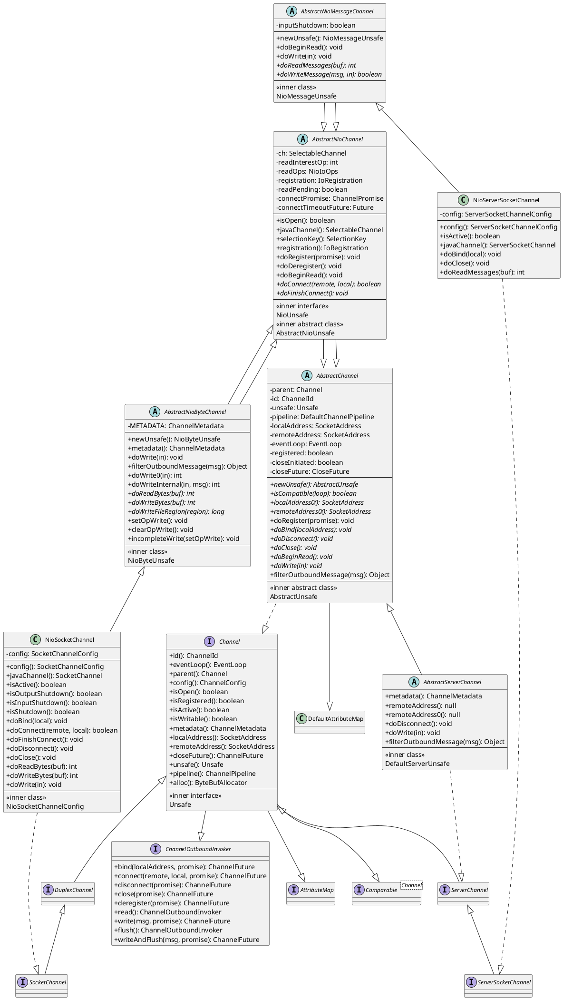

# Channel 抽象

> **前置知识**：Java NIO Channel/Selector 概念（学习计划任务 1.2/1.3）；Socket 编程基础。

## 概述

Channel 是 Netty 对网络连接的抽象，是整个框架的核心概念之一。它代表了一个到网络套接字或能够进行 I/O 操作（如读、写、连接、绑定）的组件的连接点（nexus）。

### Channel 解决的问题

1. **统一 I/O 模型**：将不同传输层（NIO、Epoll、KQueue 等）的差异封装在统一的接口背后，用户无需关心底层实现
2. **异步 I/O**：所有 I/O 操作都是异步的，立即返回 `ChannelFuture`，通过回调机制通知操作结果
3. **事件驱动**：每个 Channel 关联一个 `ChannelPipeline`，I/O 事件通过 Pipeline 中的 Handler 链进行处理
4. **生命周期管理**：定义清晰的 Channel 生命周期状态（open -> registered -> active -> inactive -> unregistered -> closed）

### 在 Netty 整体架构中的位置

Channel 处于 Netty 架构的中心位置，连接了以下核心组件：

- **EventLoop**：提供 I/O 线程，执行实际的 I/O 操作
- **ChannelPipeline**：组织 ChannelHandler 链，处理 I/O 事件和请求
- **ByteBuf**：高效的数据容器，用于读写数据
- **ChannelConfig**：管理 Channel 的配置参数

```
用户代码
   |
   v
Channel.write(msg) --> Pipeline --> ChannelHandler --> Unsafe --> JDK Channel --> OS
                                                                              |
Channel.read() <--- Pipeline <--- ChannelHandler <--- Unsafe <--- JDK Channel <-
```

## 架构图

### Channel 完整类继承图



### Channel 生命周期状态机

```mermaid
stateDiagram-v2
    [*] --> Unregistered: 创建 Channel

    state "Unregistered" as UR {
        state "isOpen=true" as Open1
        state "isRegistered=false" as Reg1
        state "isActive=false" as Act1
    }

    Unregistered --> Registered: register()

    state "Registered" as R {
        state "isOpen=true" as Open2
        state "isRegistered=true" as Reg2
        state "isActive=false" as Act2
    }

    Registered --> Active: bind()/connect()

    state "Active" as A {
        state "isOpen=true" as Open3
        state "isRegistered=true" as Reg3
        state "isActive=true" as Act3
    }

    Active --> Inactive: disconnect()

    state "Inactive" as IA {
        state "isOpen=true" as Open4
        state "isRegistered=true" as Reg4
        state "isActive=false" as Act4
    }

    Inactive --> Active: connect()
    Inactive --> Unregistered: deregister()

    Active --> Closed: close()
    Registered --> Closed: close()
    Unregistered --> Closed: close()

    state "Closed" as C {
        state "isOpen=false" as Open5
        state "isRegistered=false" as Reg5
        state "isActive=false" as Act5
    }

    Closed --> [*]

    note right of Unregistered
        Channel 已创建但未注册到 EventLoop
        此时 isOpen()=true, isRegistered()=false, isActive()=false
    end note

    note right of Registered
        Channel 已注册到 EventLoop 但尚未绑定或连接
        此时 isOpen()=true, isRegistered()=true, isActive()=false
    end note

    note right of Active
        Channel 处于活跃状态，可以进行数据传输
        TCP: 已连接; Server: 已绑定并监听
        此时 isOpen()=true, isRegistered()=true, isActive()=true
    end note

    note right of Inactive
        Channel 从活跃状态断开（如 TCP 断连），
        但仍可重新连接或重新绑定
        此时 isOpen()=true, isRegistered()=true, isActive()=false
    end note

    note right of Closed
        Channel 已永久关闭，不可复用
        此时 isOpen()=false, isRegistered()=false, isActive()=false
    end note
```



## 核心类分析

### 1. Channel 接口

**文件位置**：`transport/src/main/java/io/netty/channel/Channel.java`

Channel 接口是整个 Channel 层的核心抽象，它同时继承了三个父接口：

```java
public interface Channel extends AttributeMap, ChannelOutboundInvoker, Comparable<Channel> {
```

- **AttributeMap**：允许用户为 Channel 附加自定义属性
- **ChannelOutboundInvoker**：定义出站 I/O 操作（bind、connect、write 等）
- **Comparable\<Channel\>**：基于 ChannelId 进行比较

#### 核心方法分类

**状态查询方法**：

```java
// Channel 的全局唯一标识
ChannelId id();

// Channel 是否打开（底层 socket 是否未关闭）
boolean isOpen();

// Channel 是否已注册到 EventLoop
boolean isRegistered();

// Channel 是否活跃（TCP 已连接 / Server 已绑定监听）
boolean isActive();

// Channel 是否可写（写缓冲区水位未超限）
default boolean isWritable() {
    ChannelOutboundBuffer buf = unsafe().outboundBuffer();
    return buf != null && buf.isWritable();
}
```

**组件关联方法**：

```java
// 获取关联的 EventLoop（即 I/O 线程）
EventLoop eventLoop();

// 获取父 Channel（如 NioSocketChannel 的父 Channel 是 NioServerSocketChannel）
Channel parent();

// 获取 Channel 配置
ChannelConfig config();

// 获取 Channel 关联的 Pipeline（事件处理链）
ChannelPipeline pipeline();

// 获取内部 Unsafe 操作对象
Unsafe unsafe();
```

**I/O 操作的委托模式**：Channel 接口中的 I/O 操作（read、write、flush、bind、connect 等）全部委托给 Pipeline：

```java
@Override
default Channel read() {
    pipeline().read();
    return this;
}

@Override
default ChannelFuture writeAndFlush(Object msg) {
    return pipeline().writeAndFlush(msg);
}

@Override
default ChannelFuture connect(SocketAddress remoteAddress, ChannelPromise promise) {
    return pipeline().connect(remoteAddress, localAddress, promise);
}
```

这种设计确保了所有 I/O 操作都经过 Pipeline 中的 Handler 链处理，使得用户可以在任意位置拦截和修改 I/O 行为。

#### Unsafe 内部接口

Unsafe 接口是 Channel 中一个关键的内部接口，用于执行实际的传输层操作：

```java
interface Unsafe {
    // 获取接收缓冲区分配器的句柄
    RecvByteBufAllocator.Handle recvBufAllocHandle();

    // 获取本地/远程地址
    SocketAddress localAddress();
    SocketAddress remoteAddress();

    // 注册到 EventLoop
    void register(EventLoop eventLoop, ChannelPromise promise);

    // 绑定本地地址
    void bind(SocketAddress localAddress, ChannelPromise promise);

    // 连接远程地址
    void connect(SocketAddress remoteAddress, SocketAddress localAddress, ChannelPromise promise);

    // 断开连接
    void disconnect(ChannelPromise promise);

    // 关闭 Channel
    void close(ChannelPromise promise);

    // 强制关闭（不触发事件）
    void closeForcibly();

    // 从 EventLoop 注销
    void deregister(ChannelPromise promise);

    // 发起读操作
    void beginRead();

    // 写数据到出站缓冲区
    void write(Object msg, ChannelPromise promise);

    // 刷出所有待写数据
    void flush();

    // 获取出站缓冲区
    ChannelOutboundBuffer outboundBuffer();
}
```

### 2. ChannelOutboundInvoker 接口

**文件位置**：`transport/src/main/java/io/netty/channel/ChannelOutboundInvoker.java`

定义了所有出站 I/O 操作的接口，是 Channel 的父接口之一。每个操作都有两个版本：

- 无 Promise 版本：自动创建新的 ChannelPromise
- 带 Promise 版本：使用调用方提供的 ChannelPromise

```java
// 无 Promise 版本，内部创建新 Promise
default ChannelFuture bind(SocketAddress localAddress) {
    return bind(localAddress, newPromise());
}

// 带 Promise 版本，实际执行操作
ChannelFuture bind(SocketAddress localAddress, ChannelPromise promise);
```

核心操作包括：

| 操作 | 说明 |
|------|------|
| `bind(localAddress)` | 绑定本地地址 |
| `connect(remoteAddress)` | 连接远程地址 |
| `disconnect()` | 断开连接 |
| `close()` | 关闭 Channel |
| `deregister()` | 从 EventLoop 注销 |
| `read()` | 触发读操作 |
| `write(msg)` | 写数据（不刷新） |
| `flush()` | 刷出待写数据 |
| `writeAndFlush(msg)` | 写数据并刷新 |

### 3. ChannelMetadata 类

**文件位置**：`transport/src/main/java/io/netty/channel/ChannelMetadata.java`

描述 Channel 实现的元数据属性：

```java
public final class ChannelMetadata {
    private final boolean hasDisconnect;          // 是否支持 disconnect 操作
    private final int defaultMaxMessagesPerRead;   // 默认每次读取的最大消息数

    public ChannelMetadata(boolean hasDisconnect) {
        this(hasDisconnect, 16);
    }

    public boolean hasDisconnect() {
        return hasDisconnect;
    }

    public int defaultMaxMessagesPerRead() {
        return defaultMaxMessagesPerRead;
    }
}
```

- **hasDisconnect**：UDP 通道支持 disconnect 后重新 connect（`true`），TCP 通道不支持（`false`）
- **defaultMaxMessagesPerRead**：控制单次读循环中读取消息数的上限，默认 16

### 4. ServerChannel 接口

**文件位置**：`transport/src/main/java/io/netty/channel/ServerChannel.java`

标记接口，标识服务端 Channel：

```java
public interface ServerChannel extends Channel {
    // 标记接口，无额外方法
}
```

ServerChannel 代表接受传入连接的 Channel，如 `NioServerSocketChannel`。

### 5. AbstractChannel 抽象类

**文件位置**：`transport/src/main/java/io/netty/channel/AbstractChannel.java`

Channel 接口的骨架实现，是所有 Channel 实现的基类。

#### 核心字段

```java
public abstract class AbstractChannel extends DefaultAttributeMap implements Channel {

    private final Channel parent;                    // 父 Channel
    private final ChannelId id;                      // 全局唯一标识
    private final Unsafe unsafe;                     // 内部 Unsafe 实现
    private final DefaultChannelPipeline pipeline;   // 事件处理 Pipeline
    private final VoidChannelPromise unsafeVoidPromise;
    private final CloseFuture closeFuture;           // 关闭 Future

    private volatile SocketAddress localAddress;     // 本地地址（缓存）
    private volatile SocketAddress remoteAddress;    // 远程地址（缓存）
    private volatile EventLoop eventLoop;            // 关联的 EventLoop
    private volatile boolean registered;             // 是否已注册
    private boolean closeInitiated;                  // 是否已发起关闭
    private Throwable initialCloseCause;             // 首次关闭原因
}
```

#### 构造方法

```java
protected AbstractChannel(Channel parent) {
    this.parent = parent;
    id = newId();                    // 生成唯一 ID
    unsafe = newUnsafe();            // 由子类创建具体 Unsafe 实现
    pipeline = newChannelPipeline(); // 创建默认 Pipeline
}
```

关键设计点：`newUnsafe()` 是模板方法，由子类决定创建哪种 Unsafe 实现。

#### 地址缓存机制

```java
@Override
public SocketAddress localAddress() {
    SocketAddress localAddress = this.localAddress;
    if (localAddress == null) {
        try {
            this.localAddress = localAddress = unsafe().localAddress();
        } catch (Throwable t) {
            return null;
        }
    }
    return localAddress;
}
```

采用懒加载 + 缓存策略：首次访问时通过 Unsafe 获取底层地址并缓存，后续直接返回缓存值。

#### 抽象方法定义

子类必须实现的方法：

```java
// 判断 EventLoop 是否兼容
protected abstract boolean isCompatible(EventLoop loop);

// 获取底层本地地址
protected abstract SocketAddress localAddress0();

// 获取底层远程地址
protected abstract SocketAddress remoteAddress0();

// 绑定本地地址
protected abstract void doBind(SocketAddress localAddress) throws Exception;

// 断开连接
protected abstract void doDisconnect() throws Exception;

// 关闭 Channel
protected abstract void doClose() throws Exception;

// 开始读操作
protected abstract void doBeginRead() throws Exception;

// 写数据
protected abstract void doWrite(ChannelOutboundBuffer in) throws Exception;

// 创建 Unsafe 实例
protected abstract AbstractUnsafe newUnsafe();
```

#### AbstractUnsafe 内部类

AbstractUnsafe 是 AbstractChannel 的核心内部类，实现了 Unsafe 接口的大部分操作。

**注册流程**：

```java
@Override
public final void register(EventLoop eventLoop, final ChannelPromise promise) {
    // 1. 参数校验
    ObjectUtil.checkNotNull(eventLoop, "eventLoop");
    if (isRegistered()) {
        promise.setFailure(new IllegalStateException("registered to an event loop already"));
        return;
    }
    if (!isCompatible(eventLoop)) {
        promise.setFailure(new IllegalStateException("incompatible event loop type: " + eventLoop.getClass().getName()));
        return;
    }

    // 2. 设置 EventLoop
    AbstractChannel.this.eventLoop = eventLoop;

    // 3. 清除 Pipeline 中 Handler 的缓存 Executor
    AbstractChannelHandlerContext context = pipeline.tail;
    do {
        context.contextExecutor = null;
        context = context.prev;
    } while (context != null);

    // 4. 在 EventLoop 线程中执行注册
    if (eventLoop.inEventLoop()) {
        register0(promise);
    } else {
        eventLoop.execute(() -> register0(promise));
    }
}
```

**注册的内部实现 `register0`**：

```java
private void register0(ChannelPromise promise) {
    if (!promise.setUncancellable() || !ensureOpen(promise)) {
        return;
    }

    ChannelPromise registerPromise = newPromise();
    boolean firstRegistration = neverRegistered;
    registerPromise.addListener(future -> {
        if (future.isSuccess()) {
            neverRegistered = false;
            registered = true;

            // 确保在通知 Promise 之前调用 handlerAdded
            pipeline.invokeHandlerAddedIfNeeded();

            safeSetSuccess(promise);
            pipeline.fireChannelRegistered();

            // 仅在首次注册且 Channel 活跃时触发 channelActive
            if (isActive()) {
                if (firstRegistration) {
                    pipeline.fireChannelActive();
                } else if (config().isAutoRead()) {
                    beginRead();
                }
            }
        } else {
            close(newPromise());
            closeFuture.setClosed();
            safeSetFailure(promise, future.cause());
        }
    });

    // 调用子类的 doRegister 完成实际注册
    doRegister(registerPromise);
}
```

**写操作**：

```java
@Override
public final void write(Object msg, ChannelPromise promise) {
    assertEventLoop();

    ChannelOutboundBuffer outboundBuffer = this.outboundBuffer;
    if (outboundBuffer == null) {
        // Channel 已关闭，释放消息并设置失败
        ReferenceCountUtil.release(msg);
        safeSetFailure(promise, newClosedChannelException(...));
        return;
    }

    int size;
    try {
        // 过滤消息（如将堆缓冲转为直接缓冲）
        msg = filterOutboundMessage(msg);
        // 估算消息大小
        size = pipeline.estimatorHandle().size(msg);
        if (size < 0) {
            size = 0;
        }
    } catch (Throwable t) {
        ReferenceCountUtil.release(msg);
        safeSetFailure(promise, t);
        return;
    }

    // 添加到出站缓冲区
    outboundBuffer.addMessage(msg, size, promise);
}
```

**刷出操作**：

```java
@Override
public final void flush() {
    assertEventLoop();

    ChannelOutboundBuffer outboundBuffer = this.outboundBuffer;
    if (outboundBuffer == null) {
        return;
    }

    // 标记所有待写消息为已刷出
    outboundBuffer.addFlush();
    // 执行实际刷出
    flush0();
}

protected void flush0() {
    if (inFlush0) {
        return; // 避免重入
    }

    final ChannelOutboundBuffer outboundBuffer = this.outboundBuffer;
    if (outboundBuffer == null || outboundBuffer.isEmpty()) {
        return;
    }

    inFlush0 = true;

    if (!isActive()) {
        // Channel 不活跃，标记所有刷出消息为失败
        if (isOpen()) {
            outboundBuffer.failFlushed(new NotYetConnectedException(), true);
        } else {
            outboundBuffer.failFlushed(newClosedChannelException(...), false);
        }
        inFlush0 = false;
        return;
    }

    try {
        // 调用子类的 doWrite 执行实际写入
        doWrite(outboundBuffer);
    } catch (Throwable t) {
        handleWriteError(t);
    } finally {
        inFlush0 = false;
    }
}
```

**关闭流程**：

```java
protected void close(final ChannelPromise promise, final Throwable cause,
                   final ClosedChannelException closeCause) {
    if (!promise.setUncancellable()) {
        return;
    }

    if (closeInitiated) {
        // 已经在关闭中，等待关闭完成
        if (closeFuture.isDone()) {
            safeSetSuccess(promise);
        } else if (!(promise instanceof VoidChannelPromise)) {
            closeFuture.addListener(future -> promise.setSuccess());
        }
        return;
    }

    closeInitiated = true;

    final boolean wasActive = isActive();
    final ChannelOutboundBuffer outboundBuffer = this.outboundBuffer;
    this.outboundBuffer = null; // 禁止再添加消息

    // 准备关闭（子类可提供独立的关闭 Executor）
    Executor closeExecutor = prepareToClose();
    if (closeExecutor != null) {
        closeExecutor.execute(() -> {
            try {
                doClose0(promise);
            } finally {
                invokeLater(() -> {
                    if (outboundBuffer != null) {
                        outboundBuffer.failFlushed(cause, false);
                        outboundBuffer.close(closeCause);
                    }
                    fireChannelInactiveAndDeregister(wasActive);
                });
            }
        });
    } else {
        try {
            doClose0(promise);
        } finally {
            if (outboundBuffer != null) {
                outboundBuffer.failFlushed(cause, false);
                outboundBuffer.close(closeCause);
            }
        }
        fireChannelInactiveAndDeregister(wasActive);
    }
}
```

### 6. AbstractServerChannel 抽象类

**文件位置**：`transport/src/main/java/io/netty/channel/AbstractServerChannel.java`

服务端 Channel 的骨架实现，禁止了数据传输相关的操作：

```java
public abstract class AbstractServerChannel extends AbstractChannel implements ServerChannel {

    private static final ChannelMetadata METADATA = new ChannelMetadata(false, 16);

    // 服务端 Channel 没有远程地址
    @Override
    public SocketAddress remoteAddress() {
        return null;
    }

    // 服务端 Channel 不支持 disconnect
    @Override
    protected void doDisconnect() throws Exception {
        throw new UnsupportedOperationException();
    }

    // 服务端 Channel 不支持写操作
    @Override
    protected void doWrite(ChannelOutboundBuffer in) throws Exception {
        throw new UnsupportedOperationException();
    }

    // 服务端 Channel 不支持过滤出站消息
    @Override
    protected final Object filterOutboundMessage(Object msg) {
        throw new UnsupportedOperationException();
    }

    // 使用特殊的 Unsafe 实现
    @Override
    protected AbstractUnsafe newUnsafe() {
        return new DefaultServerUnsafe();
    }

    // DefaultServerUnsafe 禁止连接操作
    private final class DefaultServerUnsafe extends AbstractUnsafe {
        @Override
        public void connect(SocketAddress remoteAddress, SocketAddress localAddress, ChannelPromise promise) {
            safeSetFailure(promise, new UnsupportedOperationException());
        }
    }
}
```

### 7. AbstractNioChannel 抽象类

**文件位置**：`transport/src/main/java/io/netty/channel/nio/AbstractNioChannel.java`

基于 Java NIO Selector 的 Channel 实现基类。

#### 核心字段

```java
public abstract class AbstractNioChannel extends AbstractChannel {

    private final SelectableChannel ch;           // 底层 Java NIO Channel
    protected final int readInterestOp;           // 感兴趣的读操作（OP_READ 或 OP_ACCEPT）
    protected final NioIoOps readOps;             // 读操作的 NioIoOps 封装
    volatile IoRegistration registration;          // I/O 注册对象（封装 SelectionKey）
    boolean readPending;                           // 是否有待处理的读操作

    // 连接相关
    private ChannelPromise connectPromise;         // 连接 Promise
    private Future<?> connectTimeoutFuture;        // 连接超时 Future
    private SocketAddress requestedRemoteAddress;  // 请求连接的远程地址
}
```

#### 构造方法中的关键操作

```java
protected AbstractNioChannel(Channel parent, SelectableChannel ch, NioIoOps readOps) {
    super(parent);
    this.ch = ch;
    this.readInterestOp = ObjectUtil.checkNotNull(readOps, "readOps").value;
    this.readOps = readOps;
    try {
        // 构造时立即配置为非阻塞模式
        ch.configureBlocking(false);
    } catch (IOException e) {
        try {
            ch.close();
        } catch (IOException e2) {
            logger.warn("Failed to close a partially initialized socket.", e2);
        }
        throw new ChannelException("Failed to enter non-blocking mode.", e);
    }
}
```

#### SelectionKey 管理

```java
// 添加操作到 interestOps 并提交
protected void addAndSubmit(NioIoOps addOps) {
    int interestOps = selectionKey().interestOps();
    if (!addOps.isIncludedIn(interestOps)) {
        try {
            registration().submit(NioIoOps.valueOf(interestOps).with(addOps));
        } catch (Exception e) {
            throw new ChannelException(e);
        }
    }
}

// 从 interestOps 移除操作并提交
protected void removeAndSubmit(NioIoOps removeOps) {
    int interestOps = selectionKey().interestOps();
    if (removeOps.isIncludedIn(interestOps)) {
        try {
            registration().submit(NioIoOps.valueOf(interestOps).without(removeOps));
        } catch (Exception e) {
            throw new ChannelException(e);
        }
    }
}
```

#### NioUnsafe 接口

在 Unsafe 基础上扩展了 NIO 特有的操作：

```java
public interface NioUnsafe extends Unsafe {
    SelectableChannel ch();     // 获取底层 Java NIO Channel
    void finishConnect();        // 完成连接
    void read();                 // 执行读操作
    void forceFlush();           // 强制刷新
}
```

#### AbstractNioUnsafe 的 connect 实现

```java
@Override
public final void connect(final SocketAddress remoteAddress, final SocketAddress localAddress,
                         final ChannelPromise promise) {
    if (promise.isDone() || !ensureOpen(promise)) {
        return;
    }

    try {
        if (connectPromise != null) {
            throw new ConnectionPendingException(); // 已有连接进行中
        }

        boolean wasActive = isActive();
        if (doConnect(remoteAddress, localAddress)) {
            // 连接立即成功（如本地连接）
            fulfillConnectPromise(promise, wasActive);
        } else {
            // 连接未立即完成，保存 Promise 等待 OP_CONNECT 事件
            connectPromise = promise;
            requestedRemoteAddress = remoteAddress;

            // 调度连接超时
            final int connectTimeoutMillis = config().getConnectTimeoutMillis();
            if (connectTimeoutMillis > 0) {
                connectTimeoutFuture = eventLoop().schedule(() -> {
                    ChannelPromise connectPromise = AbstractNioChannel.this.connectPromise;
                    if (connectPromise != null && !connectPromise.isDone()
                            && connectPromise.tryFailure(new ConnectTimeoutException(...))) {
                        close(voidPromise());
                    }
                }, connectTimeoutMillis, TimeUnit.MILLISECONDS);
            }

            // 连接 Promise 被取消时关闭 Channel
            promise.addListener(future -> {
                if (future.isCancelled()) {
                    if (connectTimeoutFuture != null) {
                        connectTimeoutFuture.cancel(false);
                    }
                    connectPromise = null;
                    close(voidPromise());
                }
            });
        }
    } catch (Throwable t) {
        promise.tryFailure(annotateConnectException(t, remoteAddress));
        closeIfClosed();
    }
}
```

#### I/O 事件处理

```java
@Override
public void handle(IoRegistration registration, IoEvent event) {
    try {
        NioIoEvent nioEvent = (NioIoEvent) event;
        NioIoOps nioReadyOps = nioEvent.ops();

        // 先处理 CONNECT
        if (nioReadyOps.contains(NioIoOps.CONNECT)) {
            removeAndSubmit(NioIoOps.CONNECT); // 移除 OP_CONNECT 防止 Selector 空转
            unsafe().finishConnect();
        }

        // 再处理 WRITE（优先写以释放内存）
        if (nioReadyOps.contains(NioIoOps.WRITE)) {
            forceFlush();
        }

        // 最后处理 READ/ACCEPT
        if (nioReadyOps.contains(NioIoOps.READ_AND_ACCEPT) || nioReadyOps.equals(NioIoOps.NONE)) {
            read();
        }
    } catch (CancelledKeyException ignored) {
        close(voidPromise());
    }
}
```

### 8. AbstractNioByteChannel 抽象类

**文件位置**：`transport/src/main/java/io/netty/channel/nio/AbstractNioByteChannel.java`

面向字节流的 NIO Channel 基类（如 TCP Socket）。

#### NioByteUnsafe 的 read 实现

这是字节流数据读取的核心方法：

```java
@Override
public final void read() {
    final ChannelConfig config = config();
    if (shouldBreakReadReady(config)) {
        clearReadPending();
        return;
    }

    final ChannelPipeline pipeline = pipeline();
    final ByteBufAllocator allocator = config.getAllocator();
    final RecvByteBufAllocator.Handle allocHandle = recvBufAllocHandle();
    allocHandle.reset(config);

    ByteBuf byteBuf = null;
    boolean close = false;
    try {
        do {
            // 1. 分配 ByteBuf
            byteBuf = allocHandle.allocate(allocator);

            // 2. 从底层 Channel 读取字节
            allocHandle.lastBytesRead(doReadBytes(byteBuf));

            if (allocHandle.lastBytesRead() <= 0) {
                byteBuf.release();
                byteBuf = null;
                close = allocHandle.lastBytesRead() < 0; // EOF
                if (close) {
                    readPending = false;
                }
                break;
            }

            // 3. 统计读取的消息数
            allocHandle.incMessagesRead(1);
            readPending = false;

            // 4. 触发 Pipeline 的 channelRead 事件
            pipeline.fireChannelRead(byteBuf);
            byteBuf = null;
        } while (allocHandle.continueReading()); // 继续读取直到分配器说停

        // 5. 读取完成
        allocHandle.readComplete();
        pipeline.fireChannelReadComplete();

        if (close) {
            closeOnRead(pipeline);
        }
    } catch (Throwable t) {
        handleReadException(pipeline, byteBuf, t, close, allocHandle);
    } finally {
        // 如果没有 readPending 且不是 autoRead，移除 READ 操作
        if (!readPending && !config.isAutoRead()) {
            removeReadOp();
        }
    }
}
```

#### 写操作实现

```java
@Override
protected void doWrite(ChannelOutboundBuffer in) throws Exception {
    int writeSpinCount = config().getWriteSpinCount();
    do {
        Object msg = in.current();
        if (msg == null) {
            clearOpWrite(); // 所有消息已写完，清除 OP_WRITE
            return;
        }
        writeSpinCount -= doWriteInternal(in, msg);
    } while (writeSpinCount > 0);

    incompleteWrite(writeSpinCount < 0);
}

// 处理不完整的写入
protected final void incompleteWrite(boolean setOpWrite) {
    if (setOpWrite) {
        setOpWrite(); // 设置 OP_WRITE，等待 Selector 通知可写
    } else {
        clearOpWrite();
        // 调度稍后再次刷新
        eventLoop().execute(flushTask);
    }
}
```

### 9. AbstractNioMessageChannel 抽象类

**文件位置**：`transport/src/main/java/io/netty/channel/nio/AbstractNioMessageChannel.java`

面向消息的 NIO Channel 基类（如 ServerSocketChannel、DatagramChannel）。

#### NioMessageUnsafe 的 read 实现

```java
@Override
public void read() {
    assert eventLoop().inEventLoop();
    final ChannelConfig config = config();
    final ChannelPipeline pipeline = pipeline();
    final RecvByteBufAllocator.Handle allocHandle = unsafe().recvBufAllocHandle();
    allocHandle.reset(config);

    boolean closed = false;
    Throwable exception = null;
    try {
        try {
            do {
                // 读取消息（如 accept 新连接）
                int localRead = doReadMessages(readBuf);
                if (localRead == 0) {
                    break;
                }
                if (localRead < 0) {
                    closed = true;
                    break;
                }
                allocHandle.incMessagesRead(localRead);
            } while (continueReading(allocHandle));
        } catch (Throwable t) {
            exception = t;
        }

        // 触发 Pipeline 的 channelRead 事件
        int size = readBuf.size();
        for (int i = 0; i < size; i++) {
            readPending = false;
            pipeline.fireChannelRead(readBuf.get(i));
        }
        readBuf.clear();

        allocHandle.readComplete();
        pipeline.fireChannelReadComplete();

        if (exception != null) {
            closed = closeOnReadError(exception);
            pipeline.fireExceptionCaught(exception);
        }

        if (closed) {
            inputShutdown = true;
            if (isOpen()) {
                close(voidPromise());
            }
        }
    } finally {
        if (!readPending && !config.isAutoRead()) {
            removeReadOp();
        }
    }
}
```

### 10. NioSocketChannel

**文件位置**：`transport/src/main/java/io/netty/channel/socket/nio/NioSocketChannel.java`

基于 Java NIO 的 TCP Socket Channel 实现。

#### 继承关系

```
NioSocketChannel
  extends AbstractNioByteChannel（字节流 Channel）
    extends AbstractNioChannel（NIO Channel 基类）
      extends AbstractChannel（Channel 骨架实现）
  implements SocketChannel（TCP Socket 接口）
    extends DuplexChannel（双工 Channel）
      extends Channel
```

#### 关键实现

**活跃状态判断**：

```java
@Override
public boolean isActive() {
    SocketChannel ch = javaChannel();
    return ch.isOpen() && ch.isConnected();
}
```

**连接实现**：

```java
@Override
protected boolean doConnect(SocketAddress remoteAddress, SocketAddress localAddress) throws Exception {
    if (localAddress != null) {
        doBind0(localAddress);
    }

    boolean success = false;
    try {
        boolean connected = SocketUtils.connect(javaChannel(), remoteAddress);
        if (!connected) {
            addAndSubmit(NioIoOps.CONNECT); // 未立即完成，注册 OP_CONNECT
        }
        success = true;
        return connected;
    } finally {
        if (!success) {
            doClose();
        }
    }
}
```

**聚合写实现**（Gathering Write）：

```java
@Override
protected void doWrite(ChannelOutboundBuffer in) throws Exception {
    SocketChannel ch = javaChannel();
    int writeSpinCount = config().getWriteSpinCount();
    do {
        if (in.isEmpty()) {
            clearOpWrite();
            return;
        }

        int maxBytesPerGatheringWrite = ((NioSocketChannelConfig) config).getMaxBytesPerGatheringWrite();
        // 将 ByteBuf 转换为 ByteBuffer 数组
        ByteBuffer[] nioBuffers = in.nioBuffers(1024, maxBytesPerGatheringWrite);
        int nioBufferCnt = in.nioBufferCount();

        switch (nioBufferCnt) {
            case 0:
                // 非 ByteBuf 消息，走默认路径
                writeSpinCount -= doWrite0(in);
                break;
            case 1:
                // 单缓冲写
                ByteBuffer buffer = nioBuffers[0];
                int attemptedBytes = buffer.remaining();
                final int localWrittenBytes = ch.write(buffer);
                if (localWrittenBytes <= 0) {
                    incompleteWrite(true);
                    return;
                }
                adjustMaxBytesPerGatheringWrite(attemptedBytes, localWrittenBytes, maxBytesPerGatheringWrite);
                in.removeBytes(localWrittenBytes);
                --writeSpinCount;
                break;
            default:
                // 聚合写（Gathering Write）
                long attemptedBytes = in.nioBufferSize();
                final long localWrittenBytes = ch.write(nioBuffers, 0, nioBufferCnt);
                if (localWrittenBytes <= 0) {
                    incompleteWrite(true);
                    return;
                }
                adjustMaxBytesPerGatheringWrite((int) attemptedBytes, (int) localWrittenBytes, maxBytesPerGatheringWrite);
                in.removeBytes(localWrittenBytes);
                --writeSpinCount;
                break;
        }
    } while (writeSpinCount > 0);

    incompleteWrite(writeSpinCount < 0);
}
```

**SO_LINGER 处理**：

```java
private final class NioSocketChannelUnsafe extends NioByteUnsafe {
    @Override
    protected Executor prepareToClose() {
        try {
            if (javaChannel().isOpen() && config().getSoLinger() > 0) {
                // 设置了 SO_LINGER，需要注销 Key 防止 EventLoop 空转
                doDeregister();
                return GlobalEventExecutor.INSTANCE;
            }
        } catch (Throwable ignore) {
        }
        return null;
    }
}
```

### 11. NioServerSocketChannel

**文件位置**：`transport/src/main/java/io/netty/channel/socket/nio/NioServerSocketChannel.java`

基于 Java NIO 的 TCP Server Socket Channel 实现。

#### 继承关系

```
NioServerSocketChannel
  extends AbstractNioMessageChannel（消息 Channel 基类）
    extends AbstractNioChannel（NIO Channel 基类）
      extends AbstractChannel（Channel 骨架实现）
  implements ServerSocketChannel（TCP Server Socket 接口）
    extends ServerChannel
      extends Channel
```

#### 关键实现

**构造方法**：

```java
public NioServerSocketChannel(ServerSocketChannel channel) {
    super(null, channel, SelectionKey.OP_ACCEPT);  // 父 Channel 为 null，关注 OP_ACCEPT
    config = new NioServerSocketChannelConfig(this, javaChannel().socket());
}
```

**活跃状态判断**：

```java
@Override
public boolean isActive() {
    // 需要额外检查 isOpen，因为 isBound() 在 Channel 关闭后仍返回 true
    return isOpen() && javaChannel().socket().isBound();
}
```

**接受连接（核心方法）**：

```java
@Override
protected int doReadMessages(List<Object> buf) throws Exception {
    SocketChannel ch = SocketUtils.accept(javaChannel());

    try {
        if (ch != null) {
            // 创建 NioSocketChannel 作为子 Channel
            buf.add(new NioSocketChannel(this, ch));
            return 1;
        }
    } catch (Throwable t) {
        logger.warn("Failed to create a new channel from an accepted socket.", t);
        try {
            ch.close();
        } catch (Throwable t2) {
            logger.warn("Failed to close a socket.", t2);
        }
    }

    return 0;
}
```

**不支持的操作**：

```java
@Override
protected boolean doConnect(SocketAddress remoteAddress, SocketAddress localAddress) throws Exception {
    throw new UnsupportedOperationException();
}

@Override
protected boolean doWriteMessage(Object msg, ChannelOutboundBuffer in) throws Exception {
    throw new UnsupportedOperationException();
}

@Override
protected final Object filterOutboundMessage(Object msg) throws Exception {
    throw new UnsupportedOperationException();
}
```

### 12. NioIoOps 类

**文件位置**：`transport/src/main/java/io/netty/channel/nio/NioIoOps.java`

Netty 4.2 引入的 I/O 操作类型封装，替代直接使用 `SelectionKey` 的常量。

```java
public final class NioIoOps implements IoOps {
    public static final NioIoOps NONE = new NioIoOps(0);
    public static final NioIoOps ACCEPT = new NioIoOps(SelectionKey.OP_ACCEPT);
    public static final NioIoOps CONNECT = new NioIoOps(SelectionKey.OP_CONNECT);
    public static final NioIoOps WRITE = new NioIoOps(SelectionKey.OP_WRITE);
    public static final NioIoOps READ = new NioIoOps(SelectionKey.OP_READ);
    public static final NioIoOps READ_AND_ACCEPT = new NioIoOps(SelectionKey.OP_READ | SelectionKey.OP_ACCEPT);
    public static final NioIoOps READ_AND_WRITE = new NioIoOps(SelectionKey.OP_READ | SelectionKey.OP_WRITE);

    private final int value;

    // 组合操作
    public NioIoOps with(NioIoOps ops) {
        if (contains(ops)) {
            return this;
        }
        return valueOf(value | ops.value());
    }

    // 移除操作
    public NioIoOps without(NioIoOps ops) {
        if (!contains(ops)) {
            return this;
        }
        return valueOf(value & ~ops.value());
    }

    // 检查是否包含指定操作
    public boolean isIncludedIn(int ops) {
        return (ops & value) != 0;
    }
}
```

## 设计思想

### 为什么这样设计

#### 1. 接口与实现分离

Channel 采用接口 -> 抽象类 -> 具体类的三层结构：

- **接口层**（Channel、ServerChannel）：定义用户可见的 API，不暴露实现细节
- **抽象层**（AbstractChannel、AbstractNioChannel）：实现通用逻辑，定义模板方法
- **实现层**（NioSocketChannel、NioServerSocketChannel）：实现传输层特定逻辑

这种分层设计使得：
- 用户代码只依赖接口，可以透明切换传输层实现
- 通用逻辑（如状态管理、Pipeline 集成）只需实现一次
- 新增传输层只需实现少量模板方法

#### 2. 组合优于继承

Channel 通过组合方式关联其他核心组件：

- `ChannelPipeline pipeline`：事件处理链
- `ChannelConfig config`：配置管理
- `EventLoop eventLoop`：I/O 线程
- `Unsafe unsafe`：底层操作委托

而不是通过继承来获得这些能力，保持了类层次的清晰。

#### 3. 异步 Future/Promise 模式

所有 I/O 操作都返回 ChannelFuture，操作结果通过回调通知：

```java
ChannelFuture future = channel.write(msg);
future.addListener(f -> {
    if (f.isSuccess()) {
        // 写成功
    } else {
        // 写失败
    }
});
```

这种设计避免了阻塞等待，提高了系统的并发处理能力。

#### 4. 模板方法模式

AbstractChannel 定义了一系列 `do*` 抽象方法，子类只需实现传输层特定的逻辑：

| 模板方法 | 职责 |
|----------|------|
| `doBind()` | 绑定本地地址 |
| `doConnect()` | 连接远程地址 |
| `doDisconnect()` | 断开连接 |
| `doClose()` | 关闭底层资源 |
| `doBeginRead()` | 注册读兴趣 |
| `doWrite()` | 写数据到网络 |
| `doReadBytes()` / `doReadMessages()` | 读取数据 |

### Unsafe 接口的设计意图

Unsafe 接口的设计有几个关键目的：

#### 1. 访问控制

Unsafe 中的操作只应在 I/O 线程中调用，标记为 "unsafe" 是为了提醒用户不要在业务代码中直接使用：

```java
/**
 * Unsafe operations that should never be called from user-code. These methods
 * are only provided to implement the actual transport, and must be invoked from
 * an I/O thread except for the following methods:
 */
interface Unsafe {
    ...
}
```

#### 2. 职责分离

Unsafe 负责底层的、与传输层相关的操作，而 Channel 接口负责面向用户的高级操作。这种分离使得：

- Channel 接口保持简洁和稳定
- 底层实现可以灵活变化而不影响用户 API
- Pipeline 可以在不修改 Channel 接口的情况下拦截和修改操作

#### 3. 直接操作的性能通道

对于某些需要高性能的场景（如内部的连接管理），可以直接通过 Unsafe 操作 Channel，绕过 Pipeline 的开销：

```java
// 内部关闭时直接调用 Unsafe
channel.unsafe().closeForcibly();
```

### Channel 与 NioSocketChannel vs NioServerSocketChannel 的差异

| 特性 | NioSocketChannel | NioServerSocketChannel |
|------|------------------|------------------------|
| 继承基类 | AbstractNioByteChannel | AbstractNioMessageChannel |
| 数据模型 | 字节流 | 消息（连接） |
| interestOps | OP_READ | OP_ACCEPT |
| 主要操作 | 读写字节数据 | 接受新连接 |
| 子 Channel | 无（或作为子 Channel） | 创建 NioSocketChannel |
| remoteAddress | 连接的对端地址 | null |
| disconnect | 不支持 | 不支持 |
| write | 支持 | 不支持 |
| metadata.hasDisconnect | false | false |
| isActive 判断 | isOpen && isConnected | isOpen && isBound |

## 与其他模块的交互

### Channel 与 EventLoop

Channel 和 EventLoop 是一对一的关系：

```java
// Channel 注册到 EventLoop
channel.register(eventLoop);

// 注册后，所有 I/O 操作都在 EventLoop 线程中执行
channel.eventLoop().execute(() -> {
    channel.write(msg);
});
```

EventLoop 负责：
- 运行 Selector 事件循环
- 执行 Channel 的 I/O 操作
- 处理 I/O 事件并分发给 Channel

### Channel 与 Pipeline

每个 Channel 关联一个 ChannelPipeline，Pipeline 是事件处理的链式结构：

```java
// Channel 的 I/O 操作委托给 Pipeline
channel.write(msg);
// 等价于
channel.pipeline().write(msg);

// I/O 事件通过 Pipeline 传播
pipeline.fireChannelRead(msg);  // 入站事件：Head -> Tail
pipeline.fireChannelActive();   // 入站事件
```

Pipeline 中的 Handler 可以拦截和修改所有 I/O 操作和事件。

### Channel 与 ByteBuf

Channel 通过 ByteBuf 进行数据读写：

```java
// 读取数据到 ByteBuf
protected int doReadBytes(ByteBuf buf) throws Exception {
    return buf.writeBytes(javaChannel(), buf.writableBytes());
}

// 从 ByteBuf 写数据
protected int doWriteBytes(ByteBuf buf) throws Exception {
    return buf.readBytes(javaChannel(), buf.readableBytes());
}
```

Channel 通过 `ChannelConfig.getAllocator()` 获取 ByteBufAllocator 来分配 ByteBuf。

### Channel 与 ChannelOutboundBuffer

ChannelOutboundBuffer 是 Channel 内部的写出缓冲区，存储待写出的消息：

```java
// write 操作添加消息到缓冲区
outboundBuffer.addMessage(msg, size, promise);

// flush 操作标记消息为已刷出
outboundBuffer.addFlush();

// doWrite 操作从缓冲区取出并写出
Object msg = in.current();
// ... 写出操作 ...
in.remove(); // 或 in.removeBytes(bytes);

// isWritable 基于缓冲区的水位判断
public boolean isWritable() {
    return totalPendingSize < writeBufferHighWaterMark;
}
```

## 关键流程

### Channel 注册流程

```
用户代码                     Channel                    EventLoop
    |                           |                          |
    |-- channel.register(el) -->|                          |
    |                           |-- register(el, prom) --->|
    |                           |                          |
    |                           |  if inEventLoop():       |
    |                           |    register0(prom)       |
    |                           |  else:                   |
    |                           |    execute(register0)    |
    |                           |                          |
    |                           |<-- register0() ----------|
    |                           |                          |
    |                           |  1. doRegister()         |
    |                           |     - JDK Channel 注册到 Selector
    |                           |     - 获取 SelectionKey  |
    |                           |                          |
    |                           |  2. listener callback    |
    |                           |     - registered = true  |
    |                           |     - invokeHandlerAdded |
    |                           |     - prom.setSuccess()  |
    |                           |     - fireChannelRegistered
    |                           |     - if isActive():     |
    |                           |       fireChannelActive  |
    |                           |                          |
    |<-- prom notified ---------|                          |
```

### 连接建立流程

```
用户代码                     Channel                    NioUnsafe
    |                           |                          |
    |-- ch.connect(addr) ------>|                          |
    |                           |-- pipeline.connect() --->|
    |                           |                          |
    |                           |  TailContext.connect()   |
    |                           |    --> unsafe.connect()  |
    |                           |                          |
    |                           |<-- connect() ------------|
    |                           |                          |
    |                           |  1. doConnect()          |
    |                           |     - 非阻塞 connect     |
    |                           |     - 未完成则注册       |
    |                           |       OP_CONNECT         |
    |                           |                          |
    |                           |  2. 如果立即完成:         |
    |                           |     fulfillConnectPromise|
    |                           |     fireChannelActive    |
    |                           |                          |
    |                           |  3. 如果未完成:           |
    |                           |     保存 connectPromise  |
    |                           |     设置连接超时         |
    |                           |                          |
Selector 触发 OP_CONNECT        |                          |
    |                           |                          |
    |-- handle(event) --------->|                          |
    |                           |-- finishConnect() ------>|
    |                           |                          |
    |                           |  1. doFinishConnect()    |
    |                           |     - 完成连接           |
    |                           |                          |
    |                           |  2. fulfillConnectPromise|
    |                           |     - prom.setSuccess()  |
    |                           |     - fireChannelActive  |
```

### 数据读写流程

#### 读流程

```
Selector                    Channel                    Pipeline
    |                           |                          |
    |-- OP_READ ready --------->|                          |
    |                           |-- read() --------------->|
    |                           |                          |
    |                           |  unsafe.read()           |
    |                           |                          |
    |                           |  do {                    |
    |                           |    buf = alloc();        |
    |                           |    n = doReadBytes(buf); |
    |                           |    if (n <= 0) break;    |
    |                           |    fireChannelRead(buf); |---> channelRead(ctx, buf)
    |                           |  } while (continueReading)|
    |                           |                          |
    |                           |  fireChannelReadComplete |---> channelReadComplete(ctx)
```

#### 写流程

```
用户代码                     Channel                    Pipeline
    |                           |                          |
    |-- ch.write(msg) --------->|                          |
    |                           |-- pipeline.write() ----->|
    |                           |                          |
    |                           |  --> TailContext.write() |
    |                           |  --> unsafe.write(msg)   |
    |                           |                          |
    |                           |  filterOutboundMessage() |
    |                           |  estimator.size(msg)     |
    |                           |  outboundBuffer.addMessage
    |                           |                          |
    |-- ch.flush() ------------>|                          |
    |                           |-- pipeline.flush() ----->|
    |                           |                          |
    |                           |  --> unsafe.flush()      |
    |                           |                          |
    |                           |  outboundBuffer.addFlush |
    |                           |  flush0()                |
    |                           |    --> doWrite(buffer)   |
    |                           |        实际写到网络       |
```

## 学习要点

1. **Channel 是接口而非类**：Channel 只定义了 API 契约，具体实现由 AbstractChannel 及其子类提供。理解接口与实现的分层是理解 Netty 架构的基础。

2. **Unsafe 的"不安全"含义**：Unsafe 中的操作只能在 I/O 线程中调用，直接操作底层资源，绕过了 Pipeline 的处理。它为传输层实现者提供了一个"逃生通道"。

3. **生命周期是状态机**：Channel 的状态（isOpen/isRegistered/isActive）构成一个严格的状态机，理解状态转换对于正确使用 Channel 至关重要。

4. **模板方法模式的运用**：AbstractChannel 定义了操作骨架（如 register -> doRegister），子类只需实现 `do*` 方法。这是理解 Channel 体系的关键设计模式。

5. **字节流 vs 消息**：AbstractNioByteChannel（TCP）和 AbstractNioMessageChannel（Server/UDP）代表了两种不同的数据模型，理解它们的差异有助于理解 Channel 层的设计决策。

6. **全异步设计**：所有 I/O 操作通过 ChannelFuture/Promise 实现异步，操作不会阻塞调用线程。理解 Future/Promise 模式是使用 Netty 的前提。

7. **Pipeline 是事件总线**：Channel 的 I/O 操作全部委托给 Pipeline，Pipeline 中的 Handler 链负责处理事件。这种设计使得 I/O 处理逻辑可以灵活组合和复用。

8. **ChannelConfig 的配置管理**：通过 ChannelOption 机制实现类型安全的配置管理，支持通用配置和传输层特定配置的分层设计。

9. **SelectionKey 的管理**：AbstractNioChannel 通过 NioIoOps 封装了 SelectionKey 的 interestOps 管理，提供 `addAndSubmit`/`removeAndSubmit` 方法进行安全的操作位管理。

10. **聚合写优化**：NioSocketChannel 实现了 Gathering Write（聚合写），将多个 ByteBuf 转换为 ByteBuffer 数组一次性写出，减少系统调用次数，提高写性能。
