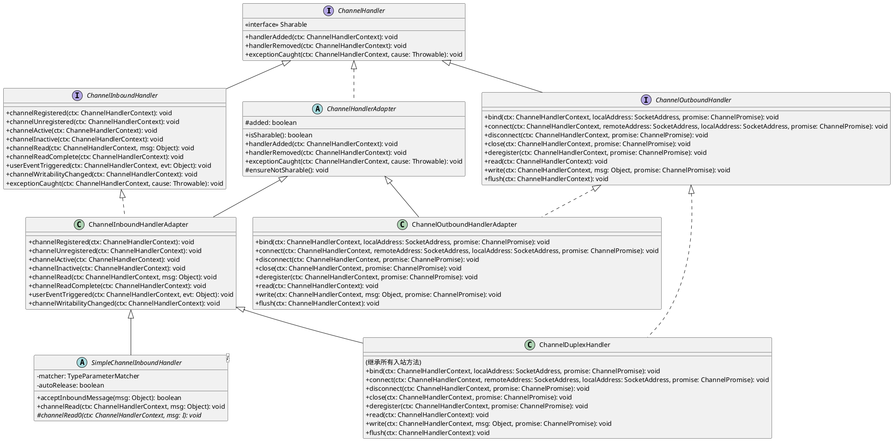
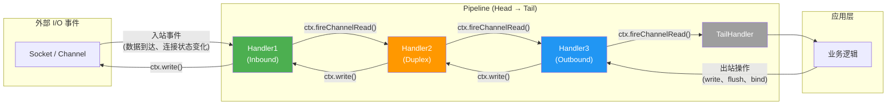
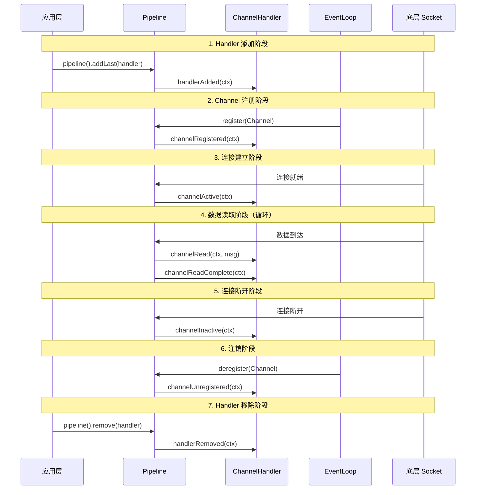
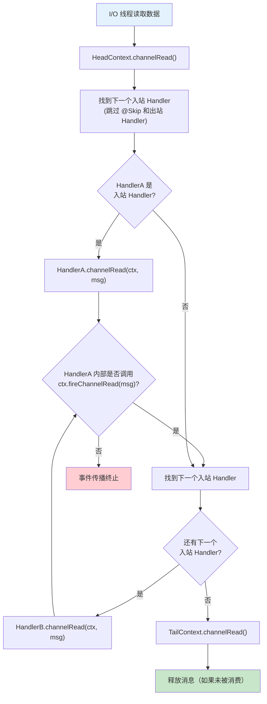
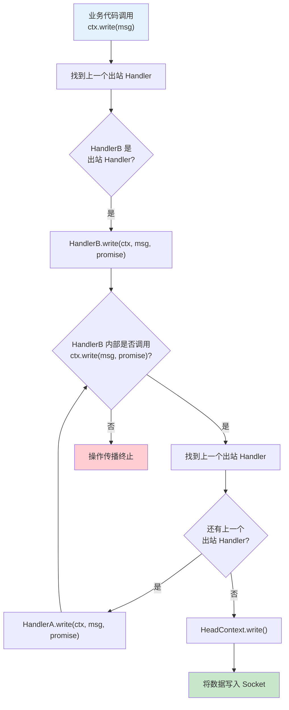

# ChannelHandler 体系

## 概述

ChannelHandler 是 Netty 中处理 I/O 事件和拦截 I/O 操作的核心抽象。它解决了以下问题：

- **统一事件处理模型**：将所有 I/O 操作（读、写、连接、绑定等）和状态变更（注册、激活、失活等）统一抽象为事件，通过 Handler 链逐个处理
- **职责分离**：通过区分入站（Inbound）和出站（Outbound）两种 Handler，将"接收数据"和"发送数据"的逻辑解耦
- **可扩展的处理管道**：Handler 以链表形式组织在 Pipeline 中，每个 Handler 只关注自己擅长的处理逻辑，实现了类似 Unix 管道的流式处理模式
- **代码复用**：通过适配器模式和泛型基类，减少样板代码

在 Netty 整体架构中，ChannelHandler 位于 `Channel → ChannelPipeline → ChannelHandler → ChannelHandlerContext` 的核心链路中。Channel 持有 Pipeline，Pipeline 管理一组 Handler，每个 Handler 通过 Context 与 Pipeline 和其他 Handler 交互。

## 架构图

### Handler 接口体系类图



### 入站/出站事件处理方向图



## 核心类分析

### 1. ChannelHandler -- 根接口

**文件路径**：`transport/src/main/java/io/netty/channel/ChannelHandler.java`

ChannelHandler 是整个 Handler 体系的根接口，定义了三个基础方法：

```java
public interface ChannelHandler {

    // Handler 被添加到 Pipeline 后调用
    void handlerAdded(ChannelHandlerContext ctx) throws Exception;

    // Handler 从 Pipeline 移除后调用
    void handlerRemoved(ChannelHandlerContext ctx) throws Exception;

    // 异常捕获（已废弃，建议在 ChannelInboundHandler 中处理）
    @Deprecated
    void exceptionCaught(ChannelHandlerContext ctx, Throwable cause) throws Exception;
}
```

**关键设计点**：

- `handlerAdded` 和 `handlerRemoved` 是所有 Handler 共有的生命周期回调，无论入站还是出站
- `exceptionCaught` 被标记为 `@Deprecated`，是因为异常处理本质上属于入站事件，应由 `ChannelInboundHandler` 的同名方法替代

**`@Sharable` 注解定义**：

```java
@Inherited
@Documented
@Target(ElementType.TYPE)
@Retention(RetentionPolicy.RUNTIME)
@interface Sharable {
    // no value
}
```

`@Sharable` 注解在 ChannelHandler 接口内部定义，具有以下元注解特征：
- `@Inherited`：子类会继承父类的 `@Sharable` 注解
- `@Retention(RUNTIME)`：运行时可通过反射读取
- `@Target(TYPE)`：只能标注在类/接口上

### 2. ChannelInboundHandler -- 入站事件接口

**文件路径**：`transport/src/main/java/io/netty/channel/ChannelInboundHandler.java`

定义了 9 个入站事件回调方法：

```java
public interface ChannelInboundHandler extends ChannelHandler {

    // Channel 注册到 EventLoop
    void channelRegistered(ChannelHandlerContext ctx) throws Exception;

    // Channel 从 EventLoop 注销
    void channelUnregistered(ChannelHandlerContext ctx) throws Exception;

    // Channel 激活（连接建立完成）
    void channelActive(ChannelHandlerContext ctx) throws Exception;

    // Channel 失活（连接断开）
    void channelInactive(ChannelHandlerContext ctx) throws Exception;

    // 收到对端发送的数据
    void channelRead(ChannelHandlerContext ctx, Object msg) throws Exception;

    // 本次读取操作完成（一批数据全部读完）
    void channelReadComplete(ChannelHandlerContext ctx) throws Exception;

    // 用户自定义事件触发
    void userEventTriggered(ChannelHandlerContext ctx, Object evt) throws Exception;

    // Channel 可写状态变化（写缓冲区满/空）
    void channelWritabilityChanged(ChannelHandlerContext ctx) throws Exception;

    // 异常捕获
    @Override
    void exceptionCaught(ChannelHandlerContext ctx, Throwable cause) throws Exception;
}
```

**方法分类**：

| 类别 | 方法 | 说明 |
|------|------|------|
| 生命周期 | `channelRegistered`、`channelUnregistered` | Channel 与 EventLoop 的绑定/解绑 |
| 连接状态 | `channelActive`、`channelInactive` | 连接建立/断开 |
| 数据读取 | `channelRead`、`channelReadComplete` | 数据到达通知 |
| 其他 | `userEventTriggered`、`channelWritabilityChanged` | 自定义事件、写缓冲区状态 |
| 异常 | `exceptionCaught` | 异常处理 |

### 3. ChannelOutboundHandler -- 出站操作接口

**文件路径**：`transport/src/main/java/io/netty/channel/ChannelOutboundHandler.java`

定义了 8 个出站操作拦截方法：

```java
public interface ChannelOutboundHandler extends ChannelHandler {

    // 绑定本地地址
    void bind(ChannelHandlerContext ctx, SocketAddress localAddress, ChannelPromise promise) throws Exception;

    // 连接远程地址
    void connect(ChannelHandlerContext ctx, SocketAddress remoteAddress,
                 SocketAddress localAddress, ChannelPromise promise) throws Exception;

    // 断开连接
    void disconnect(ChannelHandlerContext ctx, ChannelPromise promise) throws Exception;

    // 关闭 Channel
    void close(ChannelHandlerContext ctx, ChannelPromise promise) throws Exception;

    // 从 EventLoop 注销
    void deregister(ChannelHandlerContext ctx, ChannelPromise promise) throws Exception;

    // 触发读操作
    void read(ChannelHandlerContext ctx) throws Exception;

    // 写数据
    void write(ChannelHandlerContext ctx, Object msg, ChannelPromise promise) throws Exception;

    // 刷新写缓冲区
    void flush(ChannelHandlerContext ctx) throws Exception;
}
```

**与入站接口的关键区别**：

- 出站方法都带有 `ChannelPromise` 参数（`read` 除外），用于异步操作结果通知
- 出站方法的传播方向与入站相反：入站从 Pipeline 头部向尾部传播，出站从尾部向头部传播
- `read` 方法比较特殊：它是一个出站操作，用于向底层发起读请求，而非接收数据

### 4. ChannelHandlerAdapter -- 骨架实现

**文件路径**：`transport/src/main/java/io/netty/channel/ChannelHandlerAdapter.java`

```java
public abstract class ChannelHandlerAdapter implements ChannelHandler {

    // 非 volatile，仅用于健全性检查（sanity check）
    boolean added;

    protected void ensureNotSharable() {
        if (isSharable()) {
            throw new IllegalStateException(
                "ChannelHandler " + getClass().getName() + " is not allowed to be shared");
        }
    }

    public boolean isSharable() {
        // 利用 ThreadLocal + WeakHashMap 缓存注解检测结果，避免重复反射
        Class<?> clazz = getClass();
        Map<Class<?>, Boolean> cache = InternalThreadLocalMap.get().handlerSharableCache();
        Boolean sharable = cache.get(clazz);
        if (sharable == null) {
            sharable = clazz.isAnnotationPresent(Sharable.class);
            cache.put(clazz, sharable);
        }
        return sharable;
    }

    @Override
    public void handlerAdded(ChannelHandlerContext ctx) throws Exception {
        // 默认空实现
    }

    @Override
    public void handlerRemoved(ChannelHandlerContext ctx) throws Exception {
        // 默认空实现
    }

    @Override
    @Deprecated
    public void exceptionCaught(ChannelHandlerContext ctx, Throwable cause) throws Exception {
        // 默认透传异常到下一个 Handler
        ctx.fireExceptionCaught(cause);
    }
}
```

**关键设计点**：

- `added` 字段用于防止同一个 Handler 实例被重复添加到同一个 Pipeline
- `isSharable()` 使用 `InternalThreadLocalMap` 中的 `WeakHashMap` 缓存 `@Sharable` 注解检测结果。使用 `WeakHashMap` 是为了避免类卸载时的内存泄漏（参见 [Netty #2289](https://github.com/netty/netty/issues/2289)）。每个线程持有独立的 Map 实例，避免了并发竞争
- `ensureNotSharable()` 供非共享 Handler 在添加时调用，如果发现 Handler 标注了 `@Sharable` 则抛出异常

### 5. ChannelInboundHandlerAdapter -- 入站适配器

**文件路径**：`transport/src/main/java/io/netty/channel/ChannelInboundHandlerAdapter.java`

```java
public class ChannelInboundHandlerAdapter extends ChannelHandlerAdapter
        implements ChannelInboundHandler {

    // 所有方法都标记了 @Skip，表示默认实现只做透传
    @Skip
    @Override
    public void channelRegistered(ChannelHandlerContext ctx) throws Exception {
        ctx.fireChannelRegistered();  // 直接传播给下一个入站 Handler
    }

    @Skip
    @Override
    public void channelRead(ChannelHandlerContext ctx, Object msg) throws Exception {
        ctx.fireChannelRead(msg);  // 直接传播给下一个入站 Handler
    }

    // ... 其他方法同理，全部透传
}
```

**`@Skip` 注解的作用**：

`@Skip` 注解定义在 `ChannelHandlerMask` 中，用于标记"该方法只是透传，没有自定义逻辑"。`ChannelHandlerMask` 在初始化时通过反射检查每个 Handler 类的方法是否标注了 `@Skip`，构建一个位掩码（bitmask）。当事件传播时，Pipeline 只调用那些"未被跳过"的 Handler 方法，从而跳过纯粹透传的 Handler，提升性能。

```java
// ChannelHandlerMask 中的位掩码定义
static final int MASK_CHANNEL_REGISTERED = 1 << 1;
static final int MASK_CHANNEL_READ = 1 << 5;
// ...

// 如果方法标注了 @Skip，则清除对应位
if (isSkippable(handlerType, "channelRegistered", ChannelHandlerContext.class)) {
    mask &= ~MASK_CHANNEL_REGISTERED;
}
```

当用户子类重写了 `channelRead` 等方法时，由于 `@Skip` 不是 `@Inherited` 的，子类中的重写方法不再具有 `@Skip` 注解，Pipeline 就会正常调用该方法。这是一个精巧的设计：默认透传不消耗性能，自定义处理自动生效。

### 6. ChannelOutboundHandlerAdapter -- 出站适配器

**文件路径**：`transport/src/main/java/io/netty/channel/ChannelOutboundHandlerAdapter.java`

结构与 `ChannelInboundHandlerAdapter` 完全对称：

```java
public class ChannelOutboundHandlerAdapter extends ChannelHandlerAdapter
        implements ChannelOutboundHandler {

    @Skip
    @Override
    public void bind(ChannelHandlerContext ctx, SocketAddress localAddress,
                     ChannelPromise promise) throws Exception {
        ctx.bind(localAddress, promise);  // 透传给出站方向的下一个 Handler
    }

    @Skip
    @Override
    public void write(ChannelHandlerContext ctx, Object msg,
                      ChannelPromise promise) throws Exception {
        ctx.write(msg, promise);  // 透传给出站方向的下一个 Handler
    }

    // ... 其他方法同理
}
```

### 7. ChannelDuplexHandler -- 双向处理器

**文件路径**：`transport/src/main/java/io/netty/channel/ChannelDuplexHandler.java`

```java
public class ChannelDuplexHandler extends ChannelInboundHandlerAdapter
        implements ChannelOutboundHandler {
    // 继承 ChannelInboundHandlerAdapter 的所有入站方法（透传实现）
    // 实现 ChannelOutboundHandler 的所有出站方法（透传实现）
}
```

**设计意图**：当一个 Handler 需要同时处理入站和出站事件时（例如编解码器），可以继承 `ChannelDuplexHandler`，无需同时实现两个接口。它是 `ChannelInboundHandlerAdapter` + `ChannelOutboundHandler` 的组合。

### 8. SimpleChannelInboundHandler -- 泛型入站基类

**文件路径**：`transport/src/main/java/io/netty/channel/SimpleChannelInboundHandler.java`

```java
public abstract class SimpleChannelInboundHandler<I> extends ChannelInboundHandlerAdapter {

    // 类型匹配器，利用泛型擦除后保留的信息自动推断类型 I
    private final TypeParameterMatcher matcher;

    // 是否自动释放已处理的消息（默认 true）
    private final boolean autoRelease;

    protected SimpleChannelInboundHandler() {
        this(true);
    }

    protected SimpleChannelInboundHandler(boolean autoRelease) {
        // TypeParameterMatcher 通过反射获取泛型参数 I 的实际类型
        matcher = TypeParameterMatcher.find(this, SimpleChannelInboundHandler.class, "I");
        this.autoRelease = autoRelease;
    }

    protected SimpleChannelInboundHandler(Class<? extends I> inboundMessageType) {
        this(inboundMessageType, true);
    }

    protected SimpleChannelInboundHandler(Class<? extends I> inboundMessageType,
                                          boolean autoRelease) {
        matcher = TypeParameterMatcher.get(inboundMessageType);
        this.autoRelease = autoRelease;
    }

    public boolean acceptInboundMessage(Object msg) throws Exception {
        return matcher.match(msg);
    }

    @Override
    public void channelRead(ChannelHandlerContext ctx, Object msg) throws Exception {
        boolean release = true;
        try {
            if (acceptInboundMessage(msg)) {
                // 类型匹配，强转后交给子类处理
                @SuppressWarnings("unchecked")
                I imsg = (I) msg;
                channelRead0(ctx, imsg);
            } else {
                // 类型不匹配，不释放，直接传播给下一个 Handler
                release = false;
                ctx.fireChannelRead(msg);
            }
        } finally {
            if (autoRelease && release) {
                // 自动释放已处理的消息（减少引用计数）
                ReferenceCountUtil.release(msg);
            }
        }
    }

    // 子类只需实现这个方法，处理特定类型的消息
    protected abstract void channelRead0(ChannelHandlerContext ctx, I msg) throws Exception;
}
```

**自动释放消息的设计分析**：

`SimpleChannelInboundHandler` 的核心价值在于消息生命周期管理：

1. **类型过滤**：通过 `TypeParameterMatcher` 自动匹配泛型类型 `I`，不匹配的消息直接向后传播，不做任何处理
2. **自动释放**：对于匹配的消息，`channelRead` 方法在 `finally` 块中调用 `ReferenceCountUtil.release(msg)`，确保即使 `channelRead0` 抛出异常也能释放消息
3. **`release` 标志位**：当消息类型不匹配时，`release = false`，消息不会被释放，由后续 Handler 负责释放
4. **`autoRelease` 开关**：可以通过构造参数关闭自动释放，但一般不建议这样做

**与 `ChannelInboundHandlerAdapter` 的区别**：`ChannelInboundHandlerAdapter.channelRead()` 不会自动释放消息，需要使用者手动管理消息的引用计数。

## 设计思想

### 入站 vs 出站的区分设计

Netty 将 Handler 分为入站和出站两种，本质上是基于 **数据流动方向** 的自然抽象：

| 维度 | 入站 (Inbound) | 出站 (Outbound) |
|------|---------------|-----------------|
| 数据方向 | 从网络到应用 | 从应用到网络 |
| 传播方向 | Pipeline 头 → 尾 | Pipeline 尾 → 头 |
| 典型操作 | 读数据、连接状态变化 | 写数据、bind、connect |
| 方法签名 | 无 Promise 参数 | 多数带 Promise 参数 |
| 调用方式 | `ctx.fireXxx()` | `ctx.xxx()` |

这种分离使得每个 Handler 可以专注于单一方向的事件处理，降低了复杂度。当需要同时处理两个方向时，使用 `ChannelDuplexHandler` 组合即可。

### @Sharable 注解的作用

`@Sharable` 注解的核心语义是：**标注了此注解的 Handler 实例可以被添加到多个 Pipeline 中共享使用**。

**可以共享的场景**：
- Handler 没有成员变量状态（无状态 Handler）
- Handler 的状态通过 `ChannelHandlerContext.attr()` 存储（状态绑定到 Context 而非 Handler 实例）
- Handler 的成员变量是线程安全的（如 `AtomicInteger`、`ConcurrentHashMap`）

**不可以共享的场景**：
- Handler 有非线程安全的成员变量（如 `boolean loggedIn`、`StringBuilder`）
- Handler 的成员变量与特定连接相关联

**运行时检查机制**：

```java
// ChannelHandlerAdapter 中的检查
protected void ensureNotSharable() {
    if (isSharable()) {
        throw new IllegalStateException(...);
    }
}

// isSharable() 使用缓存避免重复反射
public boolean isSharable() {
    Class<?> clazz = getClass();
    Map<Class<?>, Boolean> cache = InternalThreadLocalMap.get().handlerSharableCache();
    Boolean sharable = cache.get(clazz);
    if (sharable == null) {
        sharable = clazz.isAnnotationPresent(Sharable.class);
        cache.put(clazz, sharable);
    }
    return sharable;
}
```

当一个非 `@Sharable` 的 Handler 被尝试添加到多个 Pipeline 时，`AbstractChannelHandlerContext` 会在构造时调用 `ensureNotSharable()` 检查并抛出异常。

### 适配器模式的应用

Netty 的 Handler 体系大量使用适配器模式，形成了清晰的层次结构：

```
ChannelHandler (接口，3 个方法)
    └── ChannelHandlerAdapter (抽象类，提供默认实现)
        ├── ChannelInboundHandlerAdapter (入站适配器，全部透传)
        │   └── SimpleChannelInboundHandler (泛型入站基类，自动释放)
        ├── ChannelOutboundHandlerAdapter (出站适配器，全部透传)
        └── ChannelDuplexHandler (双向适配器 = InboundAdapter + Outbound接口)
```

适配器的核心价值：
- **减少样板代码**：用户只需重写关心的方法，不需要实现所有回调
- **默认透传**：未重写的方法自动将事件传播给下一个 Handler，保证 Pipeline 链不中断
- **`@Skip` 优化**：透传方法标注 `@Skip`，Pipeline 运行时可以跳过这些方法调用

## 与其他模块的交互

### Handler 与 Pipeline 的协作

Pipeline 是 Handler 的容器，负责：
- 管理 Handler 的添加、删除、替换
- 按照入站/出站方向依次调用 Handler 的回调方法
- 维护 Head 和 Tail 两个哨兵节点

Pipeline 中的事件传播通过 `ChannelHandlerContext` 完成。每个 Handler 被包装在 `DefaultChannelHandlerContext` 中，Context 持有对 Handler 的引用以及对下一个入站/出站 Context 的指针。

```
Pipeline 内部结构（双向链表）：

HeadContext ←→ HandlerA_Context ←→ HandlerB_Context ←→ TailContext

入站事件传播：Head → A → B → Tail
出站事件传播：Tail → B → A → Head
```

### Handler 与 Channel 的协作

Channel 通过 Pipeline 间接与 Handler 交互：
- 当底层 Socket 有数据到达时，EventLoop 调用 `Channel.read()`，最终触发 Pipeline 的入站事件
- 当应用调用 `Channel.write()` 时，触发 Pipeline 的出站事件

### Handler 与 EventLoop 的协作

EventLoop 保证 Handler 的回调方法在正确的线程中执行：
- 入站事件由 EventLoop 线程触发，Handler 回调在 EventLoop 线程中执行
- 出站操作可以在任意线程调用，但最终的 I/O 操作会在 EventLoop 线程中执行
- 如果 Handler 需要在特定线程中执行，可以通过 `ChannelHandlerAdapter.isSharable()` 或在 `ChannelInitializer` 中配置 `EventExecutorGroup`

## 关键流程

### Handler 生命周期回调顺序



完整生命周期顺序：

```
handlerAdded → channelRegistered → channelActive → [channelRead → channelReadComplete]* → channelInactive → channelUnregistered → handlerRemoved
```

各阶段触发时机：

| 回调 | 触发时机 |
|------|----------|
| `handlerAdded` | Handler 被添加到 Pipeline 后立即调用 |
| `channelRegistered` | Channel 注册到 EventLoop 后调用（此时 Channel 已绑定到 Selector） |
| `channelActive` | Channel 连接建立完成，可以开始读写数据 |
| `channelRead` | 每读取到一个消息调用一次（可能一次事件循环中调用多次） |
| `channelReadComplete` | 本次读取操作完成，所有可读数据已读完 |
| `channelInactive` | 连接断开或 Channel 关闭 |
| `channelUnregistered` | Channel 从 EventLoop 注销 |
| `handlerRemoved` | Handler 从 Pipeline 中移除 |

### 入站事件处理流程

以 `channelRead` 为例，展示入站事件在 Pipeline 中的传播：



**代码层面的传播路径**：

```java
// 1. 业务代码触发入站事件
ctx.fireChannelRead(msg);

// 2. DefaultChannelPipeline 找到下一个入站 Context
// AbstractChannelHandlerContext.fireChannelRead()
public ChannelHandlerContext fireChannelRead(final Object msg) {
    // invokeChannelRead 找到下一个入站 Handler 的 Context
    invokeChannelRead(findContextInbound(MASK_CHANNEL_READ), msg);
    return this;
}

// 3. 调用 Handler 的 channelRead 方法
static void invokeChannelRead(final AbstractChannelHandlerContext next, Object msg) {
    final Object m = next.pipeline.touch(ObjectUtil.checkNotNull(msg, "msg"), next);
    EventExecutor executor = next.executor();
    if (executor.inEventLoop()) {
        next.invokeChannelRead(m);  // 直接调用
    } else {
        executor.execute(() -> next.invokeChannelRead(m));  // 切换到 EventLoop 线程
    }
}

// 4. Handler 内部的处理
// ChannelInboundHandlerAdapter.channelRead() 默认透传
public void channelRead(ChannelHandlerContext ctx, Object msg) throws Exception {
    ctx.fireChannelRead(msg);  // 继续传播
}
```

### 出站事件处理流程

以 `write` 为例，展示出站操作在 Pipeline 中的传播：



**入站和出站传播方向相反的根本原因**：

入站事件由外部触发（网络数据到达），需要从底层（Head，靠近 Socket）向应用层（Tail）传播；出站操作由应用层发起，需要从应用层（Tail）向底层（Head，靠近 Socket）传播。这样设计使得：

- 入站 Handler 链路中，越靠后的 Handler 越接近业务逻辑
- 出站 Handler 链路中，越靠前的 Handler 越接近底层 I/O
- 一个 Handler 如果同时在入站和出站链路中，它在两个方向上的位置是对称的

### fireChannelRead vs channelRead 的区别

| 方法 | 含义 | 谁调用 |
|------|------|--------|
| `channelRead(ctx, msg)` | 当前 Handler 处理消息 | Pipeline 自动调用（事件到达时） |
| `ctx.fireChannelRead(msg)` | 将消息传播给下一个入站 Handler | Handler 内部主动调用 |

**关键区别**：
- `channelRead` 是 Handler 的回调方法，由 Pipeline 调用，表示"有消息到达"
- `ctx.fireChannelRead` 是 Handler 主动触发传播的方法，表示"我处理完了，交给下一个 Handler"
- 如果 Handler 在 `channelRead` 中没有调用 `ctx.fireChannelRead`，消息传播链在此中断
- `SimpleChannelInboundHandler` 对于类型不匹配的消息会自动调用 `ctx.fireChannelRead`；对于匹配的消息，由 `channelRead0` 处理后不再传播

## 学习要点

1. **入站和出站的区分是 Netty Handler 体系的根本设计**：入站处理"收到什么"，出站处理"发出什么"，两者传播方向相反

2. **`@Sharable` 的本质是线程安全声明**：标注此注解意味着 Handler 实例可以安全地被多个线程/Channel 共享，但 Netty 不做运行时线程安全检查，由开发者自行保证

3. **适配器 + `@Skip` 是性能优化的关键**：`ChannelInboundHandlerAdapter` 的所有方法标注了 `@Skip`，Pipeline 运行时通过位掩码跳过纯透传方法，避免不必要的方法调用开销

4. **`SimpleChannelInboundHandler` 解决了两个痛点**：类型过滤（避免 `instanceof` 判断）和消息释放（避免内存泄漏）

5. **Handler 的生命周期回调是有序的**：`handlerAdded` 最先、`handlerRemoved` 最后，中间是 Channel 的注册/激活/读写/失活/注销流程

6. **`channelRead` 处理单条消息，`channelReadComplete` 表示一批消息读完**：一次 I/O 事件可能触发多次 `channelRead`（如一次 `read` 系统调用读出多条消息），但只触发一次 `channelReadComplete`

7. **Handler 的默认行为是透传**：所有适配器类的默认实现都是将事件传播给下一个 Handler，子类重写方法时如果忘记调用 `fireXxx()`/`ctx.xxx()` 会导致事件传播中断

8. **出站方法的 `ChannelPromise` 参数是异步结果通知机制**：当操作完成时，通过 `promise.setSuccess()` 或 `promise.setFailure()` 通知调用方
