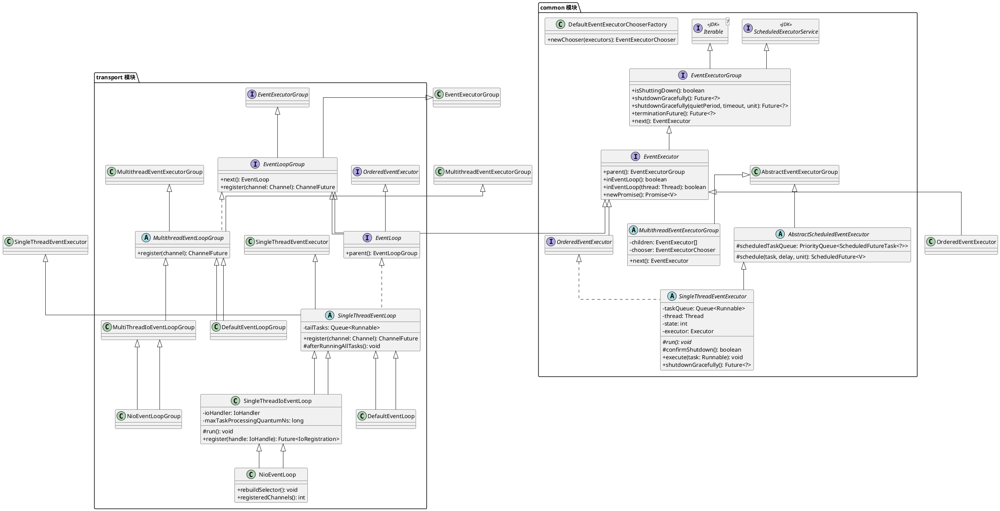
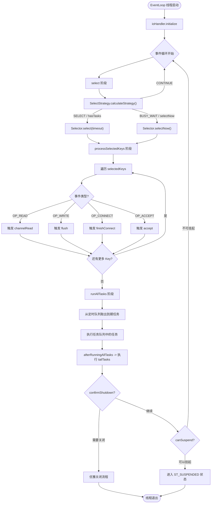
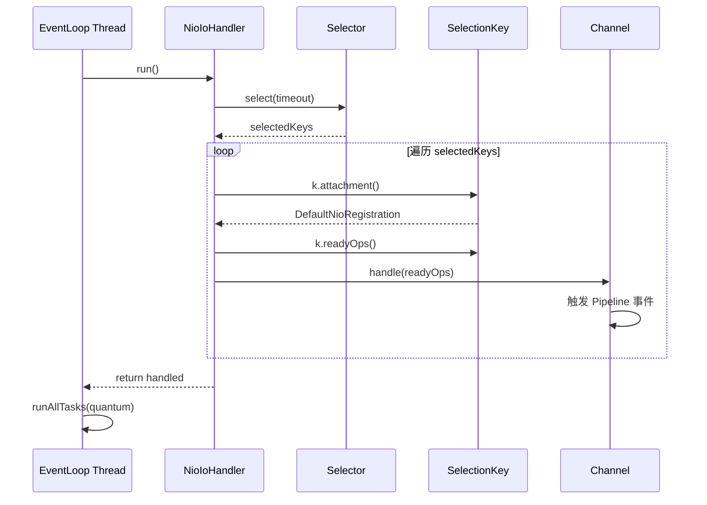
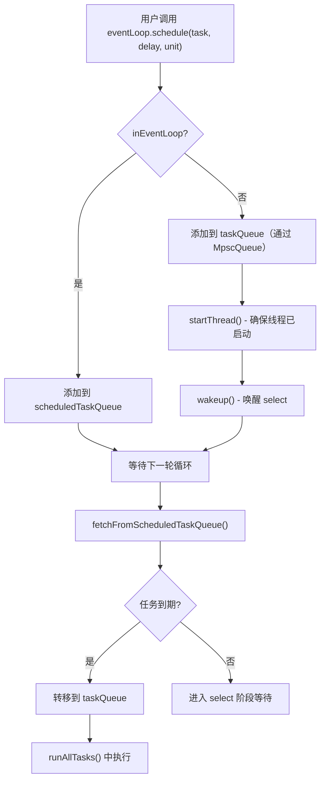
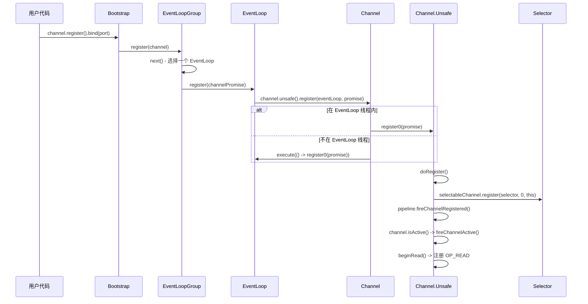

# EventLoop 体系

## 概述

### EventLoop 解决什么问题

EventLoop 是 Netty 对 **Reactor 模式**的核心实现。在网络编程中，服务端需要同时处理成千上万的客户端连接，传统的"一个连接一个线程"模型在高并发场景下会导致线程资源耗尽。Reactor 模式通过 **I/O 多路复用**（Java NIO 的 Selector）机制，让单个线程就能高效管理多个连接的 I/O 事件。

EventLoop 正是这一模式的具体载体：它是一个 **无限循环的事件处理器**，在一个线程内不断执行以下三件事：

1. **轮询 I/O 事件**：通过 Selector 监听所有注册的 Channel 上发生的网络事件（连接就绪、可读、可写等）
2. **处理 I/O 事件**：将就绪的事件分发给对应的 Channel Handler 处理
3. **处理任务队列**：执行用户提交的异步任务和定时任务

### 在 Netty 整体架构中的位置

EventLoop 处于 Netty 架构的 **transport 层**，是连接底层 I/O 模型和上层 Channel/Pipeline 的桥梁：

```
用户代码
  |
  v
ChannelPipeline (业务逻辑)
  |
  v
Channel (抽象)
  |
  v
EventLoop (事件循环)  <--- 本文重点
  |
  v
Selector / IoHandler (I/O 多路复用)
  |
  v
JDK NIO / epoll / io_uring
```

每个 `Channel` 在其生命周期内只会绑定到 **一个** `EventLoop`，而每个 `EventLoop` 可以服务 **多个** `Channel`。这种绑定关系保证了同一个 Channel 上的所有 I/O 事件和任务都在同一线程中执行，从根本上消除了并发问题。

---

## 架构图

### EventLoop 接口体系类图



### 事件循环流程图



---

## 核心类分析

### 1. EventExecutorGroup（接口层 - 线程池抽象）

**源码位置**：`common/src/main/java/io/netty/util/concurrent/EventExecutorGroup.java`

**职责**：定义线程池级别的抽象，继承自 JDK 的 `ScheduledExecutorService`，提供获取子执行器和优雅关闭的能力。

**关键方法**：

| 方法 | 说明 |
|------|------|
| `next()` | 轮询获取下一个 EventExecutor |
| `shutdownGracefully(quietPeriod, timeout, unit)` | 优雅关闭：静默期内无新任务则关闭，超时强制关闭 |
| `isShuttingDown()` | 是否正在关闭中 |
| `terminationFuture()` | 关闭完成的 Future 通知 |

### 2. EventExecutor（接口层 - 单线程执行器抽象）

**源码位置**：`common/src/main/java/io/netty/util/concurrent/EventExecutor.java`

**职责**：在 `EventExecutorGroup` 基础上增加 **单线程亲和性** 判断，代表一个具体的执行单元。

**核心设计**：`inEventLoop(Thread)` 方法是整个线程安全模型的基石。通过判断当前线程是否就是 EventLoop 绑定的线程，决定任务是 **直接执行** 还是 **入队等待**。

```java
// EventExecutor.java - 核心方法
public interface EventExecutor extends EventExecutorGroup, ThreadAwareExecutor {

    EventExecutorGroup parent();

    // 判断给定线程是否是此 EventLoop 的线程
    boolean inEventLoop(Thread thread);

    // 判断当前线程是否是此 EventLoop 的线程
    default boolean inEventLoop() {
        return inEventLoop(Thread.currentThread());
    }
}
```

### 3. SingleThreadEventExecutor（核心实现 - 单线程执行引擎）

**源码位置**：`common/src/main/java/io/netty/util/concurrent/SingleThreadEventExecutor.java`

**职责**：EventLoop 体系中最关键的基类。实现了"一个线程 + 一个任务队列"的执行模型，管理线程生命周期、任务队列、优雅关闭等核心逻辑。

#### 状态机

```java
// 线程生命周期状态
private static final int ST_NOT_STARTED = 1;   // 未启动
private static final int ST_SUSPENDING = 2;     // 正在挂起
private static final int ST_SUSPENDED = 3;      // 已挂起（线程可释放）
private static final int ST_STARTED = 4;        // 已启动
private static final int ST_SHUTTING_DOWN = 5;  // 正在关闭
private static final int ST_SHUTDOWN = 6;        // 已关闭（不再接受任务）
private static final int ST_TERMINATED = 7;      // 已终止
```

状态转换流程：

```
ST_NOT_STARTED  --startThread()--> ST_STARTED
ST_STARTED      --run()结束/空闲--> ST_SUSPENDING --> ST_SUSPENDED
ST_SUSPENDED    --execute(task)--> ST_STARTED
ST_STARTED      --shutdownGracefully()--> ST_SHUTTING_DOWN
ST_SHUTTING_DOWN --confirmShutdown()完成--> ST_SHUTDOWN --> ST_TERMINATED
```

#### 关键字段

| 字段 | 类型 | 说明 |
|------|------|------|
| `taskQueue` | `Queue<Runnable>` | 核心任务队列，存储用户提交的普通任务 |
| `thread` | `Thread` | EventLoop 绑定的线程 |
| `executor` | `Executor` | 用于启动线程的 Executor（通常是 `ThreadPerTaskExecutor`） |
| `state` | `volatile int` | 当前状态（通过 AtomicIntegerFieldUpdater CAS 更新） |
| `addTaskWakesUp` | `boolean` | 添加任务时是否唤醒线程 |
| `maxPendingTasks` | `int` | 任务队列最大容量 |
| `rejectedExecutionHandler` | `RejectedExecutionHandler` | 队列满时的拒绝策略 |
| `shutdownHooks` | `Set<Runnable>` | 关闭时的钩子任务 |

#### 任务队列的创建

```java
// SingleThreadEventExecutor.java
// 默认实现使用 LinkedBlockingQueue（有界阻塞队列）
protected Queue<Runnable> newTaskQueue(int maxPendingTasks) {
    return new LinkedBlockingQueue<Runnable>(maxPendingTasks);
}
```

子类 `SingleThreadIoEventLoop` 重写此方法，使用 **JCTools 的 MpscQueue**（多生产者单消费者无锁队列），因为 EventLoop 的任务队列天然符合 Mpsc 模型——多个外部线程提交任务，一个 EventLoop 线程消费任务：

```java
// SingleThreadIoEventLoop.java
protected static Queue<Runnable> newTaskQueue0(int maxPendingTasks) {
    // EventLoop 从不调用 takeTask()，不需要阻塞语义
    return maxPendingTasks == Integer.MAX_VALUE
        ? PlatformDependent.<Runnable>newMpscQueue()
        : PlatformDependent.<Runnable>newMpscQueue(maxPendingTasks);
}
```

#### execute() 方法 -- 任务提交入口

这是所有任务进入 EventLoop 的入口，理解它至关重要：

```java
// SingleThreadEventExecutor.java
private void execute(Runnable task, boolean immediate) {
    // 1. 判断调用线程是否就是 EventLoop 线程
    boolean inEventLoop = inEventLoop();

    // 2. 将任务加入队列
    addTask(task);

    // 3. 如果不是 EventLoop 线程，需要确保 EventLoop 线程已启动
    if (!inEventLoop) {
        startThread();
        // 如果已关闭，尝试移除任务并拒绝
        if (isShutdown()) {
            boolean reject = false;
            try {
                if (removeTask(task)) {
                    reject = true;
                }
            } catch (UnsupportedOperationException e) {
                // 队列不支持移除，跳过
            }
            if (reject) {
                reject();
            }
        }
    }

    // 4. 唤醒 EventLoop 线程（如果需要）
    if (!addTaskWakesUp && immediate) {
        wakeup(inEventLoop);
    }
}
```

**关键设计点**：
- 当从 EventLoop 线程内部调用 `execute()` 时，不会调用 `wakeup()`（避免自己唤醒自己）
- 当从外部线程调用时，会调用 `wakeup()` 让阻塞在 Selector.select() 的线程立即醒来
- `LazyRunnable` 类型的任务不会触发唤醒，适合非紧急的后台任务

#### startThread() -- 懒启动线程

```java
// SingleThreadEventExecutor.java
private void startThread() {
    int currentState = state;
    if (currentState == ST_NOT_STARTED || currentState == ST_SUSPENDED) {
        // CAS 将状态从 NOT_STARTED/SUSPENDED 改为 STARTED
        if (STATE_UPDATER.compareAndSet(this, currentState, ST_STARTED)) {
            resetIdleCycles();
            resetBusyCycles();
            boolean success = false;
            try {
                doStartThread();
                success = true;
            } finally {
                if (!success) {
                    // 启动失败，回退状态
                    STATE_UPDATER.compareAndSet(this, ST_STARTED, ST_NOT_STARTED);
                }
            }
        }
    }
}
```

`doStartThread()` 通过 `executor.execute()` 提交一个 Runnable，在其中调用子类的 `run()` 方法。这个 Runnable 内部还包含了完整的异常处理、关闭确认和状态转换逻辑。

#### runAllTasks() -- 任务执行

```java
// SingleThreadEventExecutor.java
protected boolean runAllTasks() {
    assert inEventLoop();
    boolean fetchedAll;
    boolean ranAtLeastOne = false;

    do {
        // 1. 先从定时任务队列中取出所有到期任务，放入 taskQueue
        fetchedAll = fetchFromScheduledTaskQueue(taskQueue);
        // 2. 执行 taskQueue 中的所有任务
        if (runAllTasksFrom(taskQueue)) {
            ranAtLeastOne = true;
        }
    } while (!fetchedAll); // 循环直到所有定时任务都被拉取

    if (ranAtLeastOne) {
        lastExecutionTime = getCurrentTimeNanos();
    }
    // 3. 执行子类定义的收尾任务（如 tailTasks）
    afterRunningAllTasks();
    return ranAtLeastOne;
}
```

**带超时的 runAllTasks(long timeoutNanos)**：用于在 I/O 处理后限制任务执行时间，避免长时间运行任务阻塞 I/O：

```java
// SingleThreadEventExecutor.java
protected boolean runAllTasks(long timeoutNanos) {
    fetchFromScheduledTaskQueue(taskQueue);
    Runnable task = pollTask();
    if (task == null) {
        afterRunningAllTasks();
        return false;
    }

    final long deadline = timeoutNanos > 0 ? getCurrentTimeNanos() + timeoutNanos : 0;
    long runTasks = 0;

    for (;;) {
        safeExecute(task);
        runTasks++;

        // 每 64 个任务检查一次超时（nanoTime() 开销较大）
        if ((runTasks & 0x3F) == 0) {
            if (getCurrentTimeNanos() >= deadline) {
                break;
            }
        }

        task = pollTask();
        if (task == null) {
            break;
        }
    }

    afterRunningAllTasks();
    return true;
}
```

#### confirmShutdown() -- 关闭确认

```java
// SingleThreadEventExecutor.java
protected boolean confirmShutdown() {
    if (!isShuttingDown()) {
        return false;
    }

    if (!inEventLoop()) {
        throw new IllegalStateException("must be invoked from an event loop");
    }

    // 取消所有定时任务
    cancelScheduledTasks();

    if (gracefulShutdownStartTime == 0) {
        gracefulShutdownStartTime = getCurrentTimeNanos();
    }

    // 执行剩余任务和关闭钩子
    if (runAllTasks() || runShutdownHooks()) {
        if (isShutdown()) {
            return true; // 已经被强制关闭
        }
        // 还有任务在处理，继续等待
        if (gracefulShutdownQuietPeriod == 0) {
            return true;
        }
        taskQueue.offer(WAKEUP_TASK);
        return false;
    }

    final long nanoTime = getCurrentTimeNanos();

    // 超过最大等待时间，强制关闭
    if (isShutdown() || nanoTime - gracefulShutdownStartTime > gracefulShutdownTimeout) {
        return true;
    }

    // 静默期内仍有任务提交，等待
    if (nanoTime - lastExecutionTime <= gracefulShutdownQuietPeriod) {
        taskQueue.offer(WAKEUP_TASK);
        try {
            Thread.sleep(100); // 每 100ms 检查一次
        } catch (InterruptedException e) {
            // Ignore
        }
        return false;
    }

    // 静默期内无新任务，可以安全关闭
    return true;
}
```

#### shutdownGracefully() -- 优雅关闭

```java
// SingleThreadEventExecutor.java
public Future<?> shutdownGracefully(long quietPeriod, long timeout, TimeUnit unit) {
    ObjectUtil.checkPositiveOrZero(quietPeriod, "quietPeriod");
    if (timeout < quietPeriod) {
        throw new IllegalArgumentException(
                "timeout: " + timeout + " (expected >= quietPeriod (" + quietPeriod + "))");
    }

    shutdown0(unit.toNanos(quietPeriod), unit.toNanos(timeout), ST_SHUTTING_DOWN);
    return terminationFuture();
}
```

`shutdown0()` 通过 CAS 将状态更新为 `ST_SHUTTING_DOWN`，设置静默期和超时参数，然后唤醒 EventLoop 线程开始关闭流程。

### 4. SingleThreadEventLoop（transport 层 - EventLoop 基类）

**源码位置**：`transport/src/main/java/io/netty/channel/SingleThreadEventLoop.java`

**职责**：在 `SingleThreadEventExecutor` 基础上增加 Channel 注册能力和 **tailTasks** 队列。

#### tailTasks 设计

tailTasks 是一个 **后置任务队列**，在每轮事件循环的 **所有普通任务执行完毕后** 才执行。这为用户提供了一个精确的"本轮事件循环结束"的钩子：

```java
// SingleThreadEventLoop.java
// 在每轮事件循环最后执行 tailTasks
@Override
protected void afterRunningAllTasks() {
    runAllTasksFrom(tailTasks);
}

// 用户可以将低优先级任务放入 tailTasks
public final void executeAfterEventLoopIteration(Runnable task) {
    if (!tailTasks.offer(task)) {
        reject(task);
    }
    if (wakesUpForTask(task)) {
        wakeup(inEventLoop());
    }
}
```

#### Channel 注册

```java
// SingleThreadEventLoop.java
@Override
public ChannelFuture register(ChannelPromise promise) {
    ObjectUtil.checkNotNull(promise, "promise");
    // 调用 Channel 的 Unsafe 进行底层注册
    promise.channel().unsafe().register(this, promise);
    return promise;
}
```

### 5. SingleThreadIoEventLoop（I/O 事件循环核心）

**源码位置**：`transport/src/main/java/io/netty/channel/SingleThreadIoEventLoop.java`

**职责**：将 `SingleThreadEventLoop` 与 `IoHandler` 结合，形成完整的 I/O 事件循环。这是 Netty 4.2 中事件循环的核心实现。

#### run() 方法 -- 事件循环主方法

```java
// SingleThreadIoEventLoop.java
@Override
protected void run() {
    assert inEventLoop();
    // 1. 初始化 IoHandler（如打开 Selector）
    ioHandler.initialize();
    do {
        // 2. 执行 I/O 处理（select + processSelectedKeys）
        runIo();
        if (isShuttingDown()) {
            ioHandler.prepareToDestroy();
        }
        // 3. 执行所有待处理任务（有时间限制）
        runAllTasks(maxTaskProcessingQuantumNs);
        // 4. 持续循环，直到确认关闭或可以挂起
    } while (!confirmShutdown() && !canSuspend());
}
```

**与旧版 NioEventLoop.run() 的对比**：

旧版 `NioEventLoop`（Netty 4.1）的 `run()` 方法将 select、processSelectedKeys、runAllTasks 三个阶段放在一个方法体内，并使用 `ioRatio` 来分配 I/O 和任务的时间比例。

Netty 4.2 的重构将 I/O 处理委托给 `IoHandler.run()`，任务执行使用 `runAllTasks(maxTaskProcessingQuantumNs)`，架构更加清晰。

#### runIo() 方法

```java
// SingleThreadIoEventLoop.java
protected int runIo() {
    assert inEventLoop();
    return ioHandler.run(context);
}
```

实际的 I/O 操作委托给 `IoHandler` 实现（如 `NioIoHandler`）。`IoHandlerContext` 提供了延迟时间和阻塞判断等信息：

```java
// SingleThreadIoEventLoop.java - 匿名内部类
private final IoHandlerContext context = new IoHandlerContext() {
    @Override
    public boolean canBlock() {
        // 只有当没有待处理任务和定时任务时才能阻塞
        return !hasTasks() && !hasScheduledTasks();
    }

    @Override
    public long delayNanos(long currentTimeNanos) {
        return SingleThreadIoEventLoop.this.delayNanos(currentTimeNanos);
    }

    @Override
    public long deadlineNanos() {
        return SingleThreadIoEventLoop.this.deadlineNanos();
    }

    @Override
    public void reportActiveIoTime(long activeNanos) {
        SingleThreadIoEventLoop.this.reportActiveIoTime(activeNanos);
    }
};
```

#### 任务队列选择

```java
// SingleThreadIoEventLoop.java
protected static Queue<Runnable> newTaskQueue0(int maxPendingTasks) {
    // EventLoop 从不调用 takeTask()，不需要阻塞语义
    return maxPendingTasks == Integer.MAX_VALUE
        ? PlatformDependent.<Runnable>newMpscQueue()
        : PlatformDependent.<Runnable>newMpscQueue(maxPendingTasks);
}
```

使用 JCTools 的 MpscQueue 而非 JDK 的 LinkedBlockingQueue，因为：
- **MpscQueue**（Multi-Producer Single-Consumer）：多个外部线程可以无锁地并发 `offer()`，单个 EventLoop 线程 `poll()`，性能极高
- **不需要阻塞**：EventLoop 采用 `select()` 阻塞等待 I/O，而不是在任务队列上阻塞
- **有界容量**：通过 `maxPendingTasks` 限制队列大小，防止 OOM

### 6. NioIoHandler（NIO Selector 处理器）

**源码位置**：`transport/src/main/java/io/netty/channel/nio/NioIoHandler.java`

**职责**：封装 Java NIO Selector 的所有操作，包括 select、processSelectedKeys、Selector 重建等。

#### 核心字段

| 字段 | 类型 | 说明 |
|------|------|------|
| `selector` | `Selector` | 包装后的 Selector（可能使用了优化的 KeySet） |
| `unwrappedSelector` | `Selector` | 原始未包装的 Selector |
| `selectedKeys` | `SelectedSelectionKeySet` | 优化的 selectedKeys 集合（数组实现） |
| `wakenUp` | `AtomicBoolean` | 唤醒标志位，用于协调 select() 和 wakeup() |
| `selectStrategy` | `SelectStrategy` | 选择策略，决定是阻塞 select 还是立即返回 |
| `cancelledKeys` | `int` | 已取消的 key 计数 |
| `needsToSelectAgain` | `boolean` | 是否需要再次 select 以清除 cancelled key |

#### run() 方法 -- I/O 事件处理入口

```java
// NioIoHandler.java
@Override
public int run(IoHandlerContext context) {
    int handled = 0;
    try {
        try {
            // 1. 选择策略计算
            switch (selectStrategy.calculateStrategy(selectNowSupplier, !context.canBlock())) {
                case SelectStrategy.CONTINUE:
                    // 有待处理任务，跳过本次 select，立即进入下一轮
                    if (context.shouldReportActiveIoTime()) {
                        context.reportActiveIoTime(0);
                    }
                    return 0;

                case SelectStrategy.BUSY_WAIT:
                    // NIO 不支持 busy-wait，降级为 SELECT
                case SelectStrategy.SELECT:
                    // 阻塞式 select
                    select(context, wakenUp.getAndSet(false));
                    if (wakenUp.get()) {
                        selector.wakeup();
                    }
                    break;
                default:
                    // selectNow 返回值 >= 0，表示有事件就绪，直接处理
            }
        } catch (IOException e) {
            rebuildSelector0();
            handleLoopException(e);
            return 0;
        }

        cancelledKeys = 0;
        needsToSelectAgain = false;

        // 2. 处理就绪的 SelectionKey
        if (context.shouldReportActiveIoTime()) {
            long activeIoStartTimeNanos = System.nanoTime();
            handled = processSelectedKeys();
            long activeIoEndTimeNanos = System.nanoTime();
            context.reportActiveIoTime(activeIoEndTimeNanos - activeIoStartTimeNanos);
        } else {
            handled = processSelectedKeys();
        }
    } catch (Throwable t) {
        handleLoopException(t);
    }
    return handled;
}
```

#### select() 方法 -- 阻塞式事件等待

```java
// NioIoHandler.java
private void select(IoHandlerContext runner, boolean oldWakenUp) throws IOException {
    Selector selector = this.selector;
    try {
        int selectCnt = 0;
        long currentTimeNanos = System.nanoTime();

        // 计算到下一个定时任务的延迟时间
        final long delayNanos = runner.delayNanos(currentTimeNanos);
        long selectDeadLineNanos = Long.MAX_VALUE;
        if (delayNanos != Long.MAX_VALUE) {
            selectDeadLineNanos = currentTimeNanos + delayNanos;
        }

        for (;;) {
            final long timeoutMillis;
            if (delayNanos != Long.MAX_VALUE) {
                long millisBeforeDeadline = millisBeforeDeadline(selectDeadLineNanos, currentTimeNanos);
                if (millisBeforeDeadline <= 0) {
                    if (selectCnt == 0) {
                        selector.selectNow();
                        selectCnt = 1;
                    }
                    break;
                }
                timeoutMillis = millisBeforeDeadline;
            } else {
                // 无定时任务，无限期阻塞
                timeoutMillis = 0;
            }

            // 关键检查：在 select 前再次检查是否有待处理任务
            // 防止在 wakenUp=true 期间提交的任务被遗漏
            if (!runner.canBlock() && wakenUp.compareAndSet(false, true)) {
                selector.selectNow();
                selectCnt = 1;
                break;
            }

            // 执行阻塞式 select
            int selectedKeys = selector.select(timeoutMillis);
            selectCnt++;

            // 有事件就绪 / 被唤醒 / 有待处理任务 -> 退出循环
            if (selectedKeys != 0 || oldWakenUp || wakenUp.get() || !runner.canBlock()) {
                break;
            }

            if (Thread.interrupted()) {
                selectCnt = 1;
                break;
            }

            // 处理 JDK NIO bug：Selector.select() 空轮询
            long time = System.nanoTime();
            if (time - TimeUnit.MILLISECONDS.toNanos(timeoutMillis) >= currentTimeNanos) {
                selectCnt = 1;
            } else if (SELECTOR_AUTO_REBUILD_THRESHOLD > 0 &&
                    selectCnt >= SELECTOR_AUTO_REBUILD_THRESHOLD) {
                // 空轮询次数超过阈值（默认 512），重建 Selector
                selector = selectRebuildSelector(selectCnt);
                selectCnt = 1;
                break;
            }

            currentTimeNanos = time;
        }

        if (selectCnt > MIN_PREMATURE_SELECTOR_RETURNS) {
            if (logger.isDebugEnabled()) {
                logger.debug("Selector.select() returned prematurely {} times in a row for Selector {}.",
                        selectCnt - 1, selector);
            }
        }
    } catch (CancelledKeyException e) {
        if (logger.isDebugEnabled()) {
            logger.debug(CancelledKeyException.class.getSimpleName() + " raised by a Selector {} - JDK bug?",
                    selector, e);
        }
    }
}
```

**Select 空轮询 Bug 处理**：这是 Netty 中一个著名的防御性编程实践。JDK 的 `Selector.select()` 在某些情况下会无理由地立即返回（返回值为 0），导致 CPU 空转 100%。Netty 通过计数器检测这种行为，当连续空轮询次数超过 `SELECTOR_AUTO_REBUILD_THRESHOLD`（默认 512）时，自动 **重建 Selector** 并迁移所有 Channel。

#### processSelectedKeys() -- 处理就绪事件

```java
// NioIoHandler.java
private int processSelectedKeys() {
    if (selectedKeys != null) {
        return processSelectedKeysOptimized();  // 优化路径
    } else {
        return processSelectedKeysPlain(selector.selectedKeys());  // 普通路径
    }
}

private int processSelectedKeysOptimized() {
    int handled = 0;
    for (int i = 0; i < selectedKeys.size; ++i) {
        final SelectionKey k = selectedKeys.keys[i];
        // 置 null 以便 GC
        selectedKeys.keys[i] = null;
        processSelectedKey(k);
        ++handled;
        if (needsToSelectAgain) {
            selectedKeys.reset(i + 1);
            selectAgain();
            i = -1;
        }
    }
    return handled;
}

private void processSelectedKey(SelectionKey k) {
    final DefaultNioRegistration registration = (DefaultNioRegistration) k.attachment();
    if (!registration.isValid()) {
        try {
            registration.handle.close();
        } catch (Exception e) {
            logger.debug("Exception during closing " + registration.handle, e);
        }
        return;
    }
    // 委托给注册时关联的 handle 处理
    registration.handle(k.readyOps());
}
```

**优化路径 vs 普通路径**：
- **优化路径**：使用 Netty 自定义的 `SelectedSelectionKeySet`（数组实现），通过反射替换 JDK Selector 内部的 `HashSet`，避免了 `Iterator` 的创建开销
- **普通路径**：当优化失败时，回退到 JDK 默认的 `Set<SelectionKey>`

### 7. SelectedSelectionKeySet（Selector 优化）

**源码位置**：`transport/src/main/java/io/netty/channel/nio/SelectedSelectionKeySet.java`

**职责**：用数组替代 JDK 默认的 `HashSet<SelectionKey>` 存储已就绪的 SelectionKey，提升遍历性能。

```java
// SelectedSelectionKeySet.java
final class SelectedSelectionKeySet extends AbstractSet<SelectionKey> {
    SelectionKey[] keys;  // 数组存储，连续内存，缓存友好
    int size;

    SelectedSelectionKeySet() {
        keys = new SelectionKey[1024];
    }

    @Override
    public boolean add(SelectionKey o) {
        if (o == null) return false;
        if (size == keys.length) {
            increaseCapacity();  // 自动扩容
        }
        keys[size++] = o;  // O(1) 添加
        return true;
    }

    // remove 不支持，因为已就绪的 key 不需要移除
    @Override
    public boolean remove(Object o) {
        return false;
    }

    void reset(int start) {
        Arrays.fill(keys, start, size, null);  // 批量清理
        size = 0;
    }
}
```

**性能优势**：`HashSet` 的遍历需要创建 `Iterator`，涉及链表遍历；数组遍历只需简单的 `for` 循环，在高频调用场景下差距显著。

### 8. NioEventLoop（NIO EventLoop 实现）

**源码位置**：`transport/src/main/java/io/netetty/channel/nio/NioEventLoop.java`

**职责**：NIO 传输层的 EventLoop 实现。在 Netty 4.2 中，`NioEventLoop` 已被标记为 `@Deprecated`，核心逻辑已迁移到 `SingleThreadIoEventLoop` + `NioIoHandler`。但它仍保留了一些 NIO 特有的功能。

**关键方法**：

```java
// NioEventLoop.java

// 注册非 Netty 创建的 SelectableChannel
public void register(final SelectableChannel ch, final int interestOps, final NioTask<?> task) {
    // 验证参数
    if (interestOps == 0) {
        throw new IllegalArgumentException("interestOps must be non-zero.");
    }
    if ((interestOps & ~ch.validOps()) != 0) {
        throw new IllegalArgumentException("invalid interestOps: " + interestOps);
    }

    if (inEventLoop()) {
        register0(ch, interestOps, nioTask);
    } else {
        // 必须在 EventLoop 线程中注册，避免 JDK 内部锁竞争
        submit(() -> register0(ch, interestOps, nioTask)).sync();
    }
}

// 重建 Selector（解决 epoll 100% CPU bug）
public void rebuildSelector() {
    if (!inEventLoop()) {
        execute(() -> ((NioIoHandler) ioHandler()).rebuildSelector0());
        return;
    }
    ((NioIoHandler) ioHandler()).rebuildSelector0();
}
```

### 9. NioEventLoopGroup

**源码位置**：`transport/src/main/java/io/netty/channel/nio/NioEventLoopGroup.java`

**职责**：管理一组 `NioEventLoop`，已被标记为 `@Deprecated`，推荐使用 `MultiThreadIoEventLoopGroup` + `NioIoHandler.newFactory()`。

**关键设计**：`newChild()` 方法负责创建子 EventLoop：

```java
// NioEventLoopGroup.java
@Override
protected IoEventLoop newChild(Executor executor, IoHandlerFactory ioHandlerFactory, Object... args) {
    RejectedExecutionHandler rejectedExecutionHandler = (RejectedExecutionHandler) args[0];
    EventLoopTaskQueueFactory taskQueueFactory = null;
    EventLoopTaskQueueFactory tailTaskQueueFactory = null;
    // 从 args 中提取配置
    if (args.length > 1) taskQueueFactory = (EventLoopTaskQueueFactory) args[1];
    if (args.length > 2) tailTaskQueueFactory = (EventLoopTaskQueueFactory) args[2];
    return new NioEventLoop(this, executor, ioHandlerFactory,
            taskQueueFactory, tailTaskQueueFactory, rejectedExecutionHandler);
}
```

### 10. DefaultEventLoop / DefaultEventLoopGroup

**源码位置**：`transport/src/main/java/io/netty/channel/DefaultEventLoop.java`

**职责**：不涉及任何 I/O 的纯任务执行 EventLoop，用于非网络场景（如 Local 传输）。

```java
// DefaultEventLoop.java
@Override
protected void run() {
    for (;;) {
        // 从任务队列中阻塞获取任务
        Runnable task = takeTask();
        if (task != null) {
            runTask(task);
            updateLastExecutionTime();
        }
        if (confirmShutdown()) {
            break;
        }
    }
}
```

与 `NioEventLoop` 的关键区别：`DefaultEventLoop` 没有 I/O 处理，使用 `takeTask()` 阻塞等待任务（底层是 `LinkedBlockingQueue.take()`），而不是 NIO 的 `Selector.select()`。

### 11. SelectStrategy / DefaultSelectStrategy

**源码位置**：`transport/src/main/java/io/netty/channel/SelectStrategy.java`

**职责**：决定事件循环在每次迭代时是执行阻塞式 select、非阻塞式 selectNow，还是跳过 select 直接处理任务。

```java
// SelectStrategy.java - 常量定义
int SELECT = -1;     // 执行阻塞式 select
int CONTINUE = -2;   // 跳过 select，直接进入下一轮循环
int BUSY_WAIT = -3;  // 忙等待（NIO 不支持，降级为 SELECT）
```

```java
// DefaultSelectStrategy.java - 默认策略实现
final class DefaultSelectStrategy implements SelectStrategy {
    static final SelectStrategy INSTANCE = new DefaultSelectStrategy();

    @Override
    public int calculateStrategy(IntSupplier selectSupplier, boolean hasTasks) throws Exception {
        // 有任务待处理 -> 立即 selectNow()（不阻塞）
        // 无任务 -> 阻塞式 select
        return hasTasks ? selectSupplier.get() : SelectStrategy.SELECT;
    }
}
```

### 12. MultithreadEventExecutorGroup / EventExecutorChooser

**源码位置**：`common/src/main/java/io/netty/util/concurrent/MultithreadEventExecutorGroup.java`

**职责**：管理多个 EventExecutor 的父类，提供轮询选择器。

```java
// MultithreadEventExecutorGroup.java - 构造器核心逻辑
protected MultithreadEventExecutorGroup(int nThreads, Executor executor,
                                        EventExecutorChooserFactory chooserFactory, Object... args) {
    children = new EventExecutor[nThreads];

    // 创建所有子 EventExecutor
    for (int i = 0; i < nThreads; i++) {
        boolean success = false;
        try {
            children[i] = newChild(executor, args);
            success = true;
        } catch (Exception e) {
            throw new IllegalStateException("failed to create a child event loop", e);
        } finally {
            if (!success) {
                // 创建失败时关闭已创建的
                for (int j = 0; j < i; j++) {
                    children[j].shutdownGracefully();
                }
            }
        }
    }

    // 创建选择器（轮询策略）
    chooser = chooserFactory.newChooser(children);
}
```

**DefaultEventExecutorChooserFactory** 的选择策略：

```java
// DefaultEventExecutorChooserFactory.java
public EventExecutorChooser newChooser(EventExecutor[] executors) {
    if (isPowerOfTwo(executors.length)) {
        // 数量为 2 的幂次 -> 用位运算代替取模，性能更高
        return new PowerOfTwoEventExecutorChooser(executors);
    } else {
        return new GenericEventExecutorChooser(executors);
    }
}

// 2的幂次优化：用 & 替代 %
private static final class PowerOfTwoEventExecutorChooser implements EventExecutorChooser {
    private final AtomicInteger idx = new AtomicInteger();

    @Override
    public EventExecutor next() {
        return executors[idx.getAndIncrement() & (executors.length - 1)];
    }
}

// 通用实现：使用 long 计数器避免 32 位溢出问题
private static final class GenericEventExecutorChooser implements EventExecutorChooser {
    private final AtomicLong idx = new AtomicLong();

    @Override
    public EventExecutor next() {
        return executors[(int) Math.abs(idx.getAndIncrement() % executors.length)];
    }
}
```

---

## 设计思想

### 单线程模型的优势

Netty 的 EventLoop 采用 **单线程模型**，即一个 EventLoop 只使用一个线程处理所有 I/O 和任务。这看似限制了并发能力，但实际上带来了巨大的好处：

1. **无锁化**：同一个 Channel 上的所有操作（读、写、定时任务）都在同一线程中执行，无需加锁。这消除了大量的锁竞争和上下文切换开销。

2. **内存可见性**：单线程内天然满足 happens-before 关系，不需要 volatile 或 synchronized 来保证变量可见性。

3. **简化编程模型**：开发者无需担心 Channel Handler 中的线程安全问题，降低了编程复杂度。

4. **可预测的延迟**：由于没有锁竞争，任务的执行延迟更加可预测。

5. **事件有序性**：同一 Channel 上的事件严格按照发生顺序处理，不会出现乱序。

对于 CPU 密集型任务，Netty 提供了 `DefaultEventLoopGroup` 来分流，避免阻塞 I/O 线程。

### 任务队列设计

Netty 的任务队列设计体现了对性能的极致追求：

**三层队列架构**：

```
用户提交的任务
    |
    v
taskQueue (MPSC 无锁队列)  <--- 普通任务和已到期的定时任务
    |
    v
scheduledTaskQueue (PriorityQueue)  <--- 定时任务，到期后转移到 taskQueue
    |
    v
tailTasks (MPSC 无锁队列)  <--- 后置任务，在每轮循环最后执行
```

- **taskQueue**：主任务队列。`SingleThreadIoEventLoop` 使用 JCTools 的 `MpscChunkedArrayQueue`（无锁多生产者单消费者队列），外部线程 `offer()` 无锁，EventLoop 线程 `poll()` 也无锁。
- **scheduledTaskQueue**：定时任务队列，使用最小堆（`PriorityQueue<ScheduledFutureTask>`），到期任务会被转移到 `taskQueue`。
- **tailTasks**：后置队列，在每轮事件循环的所有任务执行完毕后才处理，适合低优先级的清理任务。

**为什么不使用 JDK 的 `LinkedBlockingQueue`**：
- `LinkedBlockingQueue` 的 `offer()` 和 `poll()` 都需要加锁（`ReentrantLock`）
- MpscQueue 利用 CAS 实现无锁的多生产者入队，单消费者出队无需任何同步原语
- EventLoop 天然满足 Mpsc 模型（多个外部线程提交，一个 EventLoop 线程消费）

### maxTaskProcessingQuantumNs 的作用

`maxTaskProcessingQuantumNs`（默认 100ms，可通过 `io.netty.eventLoop.maxTaskProcessingQuantumMs` 系统属性配置）限制了每轮事件循环中 **任务执行的最大时间**。

```java
// SingleThreadIoEventLoop.java
private static final long DEFAULT_MAX_TASK_PROCESSING_QUANTUM_NS =
    TimeUnit.MILLISECONDS.toNanos(Math.max(100,
        SystemPropertyUtil.getInt("io.netty.eventLoop.maxTaskProcessingQuantumMs", 1000)));
```

**设计目的**：如果没有时间限制，当任务队列中积压大量任务时，事件循环可能长时间停留在任务执行阶段，导致 I/O 事件无法及时处理，进而引发连接超时或消息积压。通过时间限制，确保事件循环能在合理的时间内回到 I/O 处理阶段。

**与 ioRatio 的关系**：在 Netty 4.1 中，使用 `ioRatio`（默认 50）来分配 I/O 和任务的时间比例。Netty 4.2 简化了这一设计，使用固定的 `maxTaskProcessingQuantumNs` 来限制任务执行时间，`ioRatio` 相关方法已被废弃。

### 挂起（Suspension）机制

Netty 4.2 引入了 EventLoop 挂起机制，允许在没有注册任何 Channel 时释放线程资源：

```java
// SingleThreadIoEventLoop.java
@Override
protected boolean canSuspend(int state) {
    // 只有当没有注册的 Channel 时才允许挂起
    return super.canSuspend(state) && numRegistrations.get() == 0;
}
```

挂起条件：
1. 状态为 `ST_SUSPENDING` 或 `ST_SUSPENDED`
2. 没有待处理的任务
3. 没有待触发的定时任务
4. 没有注册的 Channel

当有新任务提交时，挂起的 EventLoop 会被重新激活。

---

## 与其他模块的交互

### EventLoop 与 Channel

一个 Channel 在创建后必须注册到某个 EventLoop 才能开始工作。注册过程将 Channel 与 EventLoop 绑定：

```
Channel 创建
    |
    v
Bootstrap.register()
    |
    v
EventLoopGroup.next()  --> 选择一个 EventLoop
    |
    v
EventLoop.register(ChannelPromise)
    |
    v
channel.unsafe().register(eventLoop, promise)
    |
    v
Channel 与 EventLoop 绑定（此后 Channel 的所有操作都在此 EventLoop 线程中执行）
    |
    v
Channel 的 unsafe 将底层 SelectableChannel 注册到 Selector
```

绑定后，Channel 的 `eventLoop()` 方法返回其绑定的 EventLoop。Netty 通过 `inEventLoop()` 检查确保线程安全：

```java
// AbstractChannel.java（典型用法）
if (eventLoop().inEventLoop()) {
    // 在 EventLoop 线程内，直接操作
    register0(promise);
} else {
    // 不在 EventLoop 线程，提交任务
    eventLoop().execute(() -> register0(promise));
}
```

### EventLoop 与 Selector

在 NIO 传输中，EventLoop 通过 `NioIoHandler` 管理 Selector：

1. **Channel 注册**：`Channel` 底层的 `SelectableChannel` 通过 `java.nio.channels.spi.AbstractSelectableChannel.register(Selector, int)` 注册到 Selector，关联一个 `SelectionKey`
2. **InterestOps 管理**：通过 `SelectionKey.interestOps()` 动态调整关注的事件类型
3. **事件轮询**：`Selector.select()` / `select(timeout)` 阻塞等待事件
4. **事件处理**：遍历 `selectedKeys`，根据 `readyOps()` 触发对应的 Channel 事件



### EventLoop 与 Task

EventLoop 中的任务来源有三种：

1. **用户主动提交**：通过 `eventLoop.execute(task)` / `eventLoop.schedule(task, delay, unit)`
2. **Channel 事件驱动**：I/O 事件处理过程中触发的任务（如 `channelRead` 中发起的写操作）
3. **内部调度**：如 `ScheduledFutureTask` 到期后的自动触发

任务提交的线程安全保证：

```java
// SingleThreadEventExecutor.execute() 核心逻辑
private void execute(Runnable task, boolean immediate) {
    boolean inEventLoop = inEventLoop();
    addTask(task);  // 加入队列（MpscQueue，外部线程安全）
    if (!inEventLoop) {
        startThread();  // 懒启动线程
        // 关闭检查...
    }
    if (!addTaskWakesUp && immediate) {
        wakeup(inEventLoop);  // 唤醒 select
    }
}
```

---

## 关键流程

### NioEventLoop.run() 事件循环详解（Netty 4.2 版本）

Netty 4.2 的事件循环由 `SingleThreadIoEventLoop.run()` 和 `NioIoHandler.run()` 共同完成：

#### 阶段一：select（事件等待）

**入口**：`NioIoHandler.run()` -> `select()`

```java
// NioIoHandler.run() 中的 select 阶段
switch (selectStrategy.calculateStrategy(selectNowSupplier, !context.canBlock())) {
    case SelectStrategy.CONTINUE:
        return 0;  // 有待处理任务，跳过 select

    case SelectStrategy.SELECT:
        select(context, wakenUp.getAndSet(false));  // 阻塞式 select
        break;
    default:
        // selectNow 返回值 >= 0，表示有事件就绪
}
```

`select()` 方法的核心逻辑：
1. 计算到下一个定时任务的超时时间
2. 循环调用 `selector.select(timeout)`，处理以下情况：
   - 有事件就绪 -> 退出循环
   - 被 wakeup -> 退出循环
   - 有待处理任务 -> 退出循环
   - 空轮询（JDK Bug）-> 计数器累加，超过阈值重建 Selector

#### 阶段二：processSelectedKeys（I/O 事件处理）

**入口**：`NioIoHandler.run()` -> `processSelectedKeys()`

对每个就绪的 SelectionKey：
1. 获取其 attachment（`DefaultNioRegistration`）
2. 检查 registration 是否有效
3. 调用 `registration.handle(k.readyOps())` 触发事件处理
4. 最终到达 Channel 的 Pipeline，触发 `channelRead`、`channelActive` 等事件

#### 阶段三：runAllTasks（任务处理）

**入口**：`SingleThreadIoEventLoop.run()` -> `runAllTasks(maxTaskProcessingQuantumNs)`

1. 从 `scheduledTaskQueue` 中取出所有到期任务放入 `taskQueue`
2. 循环执行 `taskQueue` 中的任务，每 64 个任务检查一次是否超时
3. 超时后退出，确保 I/O 能及时被处理
4. 执行 `afterRunningAllTasks()` -> 运行 `tailTasks` 中的任务

### 任务调度流程



### Channel 注册到 EventLoop 的流程



核心代码路径：

```java
// MultithreadEventLoopGroup.register()
@Override
public ChannelFuture register(Channel channel) {
    return next().register(channel);  // 选择 EventLoop 并注册
}

// SingleThreadEventLoop.register()
@Override
public ChannelFuture register(ChannelPromise promise) {
    promise.channel().unsafe().register(this, promise);
    return promise;
}

// AbstractChannel.AbstractUnsafe.register()
@Override
public final void register(EventLoop eventLoop, final ChannelPromise promise) {
    // 绑定 EventLoop
    AbstractChannel.this.eventLoop = eventLoop;

    if (eventLoop.inEventLoop()) {
        register0(promise);
    } else {
        eventLoop.execute(() -> register0(promise));
    }
}

private void register0(ChannelPromise promise) {
    doRegister();  // 底层 NIO 注册
    pipeline.fireChannelRegistered();
    if (isActive()) {
        pipeline.fireChannelActive();
        beginRead();  // 注册读事件
    }
}
```

---

## 学习要点

1. **单线程模型**是 Netty 高性能的基石。一个 EventLoop 绑定一个线程，一个 Channel 绑定一个 EventLoop，从根本上消除了 Channel 层面的并发问题。

2. **MpscQueue 优于 LinkedBlockingQueue**。在"多生产者单消费者"场景下，无锁队列的性能远超有锁队列。理解 JCTools 的 MpscQueue 是理解 Netty 任务队列的关键。

3. **事件循环三阶段**（select -> processSelectedKeys -> runAllTasks）是理解 NioEventLoop 的核心。Netty 4.2 将这些逻辑拆分到 `IoHandler` 和 `SingleThreadIoEventLoop` 中，架构更清晰。

4. **SelectStrategy** 决定了事件循环的行为：有待处理任务时用 `selectNow()`（不阻塞），无任务时用 `select(timeout)`（阻塞等待），定时任务快到期时用精确超时。

5. **Selector 空轮询 Bug 的防御**是 Netty 最经典的防御性编程实践之一。通过计数器 + 自动重建 Selector 的机制，有效规避了 JDK 的已知缺陷。

6. **优雅关闭**的"静默期"设计：`shutdownGracefully(quietPeriod, timeout, unit)` 在静默期内持续检查是否有新任务提交，只有连续 `quietPeriod` 时间内无新任务才真正关闭，保证正在处理的请求不会被中断。

7. **EventExecutorChooser** 的轮询选择策略：默认使用 Round-Robin，当 EventLoop 数量为 2 的幂次时使用位运算优化（`idx & (length - 1)` 替代 `idx % length`），体现了对性能的极致追求。

8. **tailTasks** 提供了一个"每轮事件循环结束"的精确钩子，在所有 I/O 和普通任务处理完毕后执行，适合放低优先级的清理逻辑。

9. **maxTaskProcessingQuantumNs**（替代了旧版的 ioRatio）限制了任务执行时间，防止任务积压导致 I/O 饥饿。

10. **挂起机制**允许空闲的 EventLoop 释放线程资源，当有新任务或 Channel 注册时自动恢复，在资源利用率和响应性之间取得平衡。
