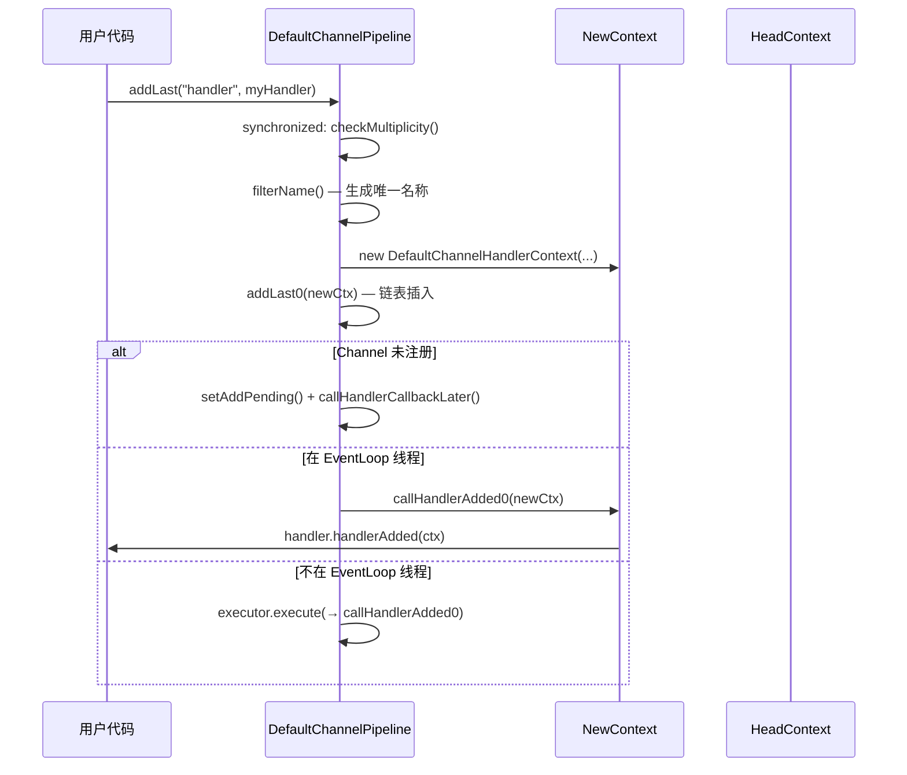
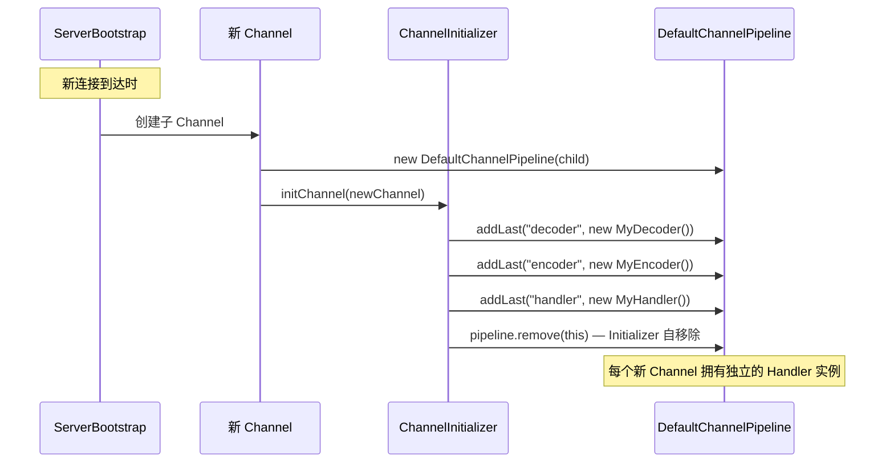

# Pipeline 架构：Handler 链与 Context 链

> **前置知识**：先读 01-核心抽象 四篇。

## 概述

ChannelPipeline 是 Netty I/O 事件处理的核心骨架。它是一条由 ChannelHandler 组成的双向链表，所有入站（Inbound）和出站（Outbound）事件都沿着这条链表传播。每个 ChannelHandler 被包装为一个 ChannelHandlerContext 节点，Context 节点之间通过 `prev`/`next` 指针串联。

Pipeline 解决的核心问题：
- 将复杂的网络 I/O 处理拆分为多个职责单一的 Handler（编解码、业务逻辑、流量控制等）
- 提供统一的事件传播机制，使 Handler 之间解耦
- 支持运行时动态添加、删除、替换 Handler

在 Netty 整体架构中，Pipeline 处于 Channel 和 Handler 之间的桥梁位置：每个 Channel 拥有一个 Pipeline，Pipeline 持有 Head 和 Tail 两个哨兵节点，用户 Handler 安插在两者之间。

## 架构图

### 类继承体系

```
ChannelPipeline (接口)
    └── DefaultChannelPipeline (实现)
            ├── HeadContext (内部类, 同时实现 ChannelInboundHandler + ChannelOutboundHandler)
            └── TailContext (内部类, 实现 ChannelInboundHandler)

ChannelHandlerContext (接口)
    └── AbstractChannelHandlerContext (抽象类, 双向链表节点)
            ├── DefaultChannelHandlerContext (包装用户 Handler)
            ├── HeadContext (同时是 Context 又是 Handler)
            └── TailContext (同时是 Context 又是 Handler)
```

### 双向链表结构

```
 ┌──────────────────────────────────────────────────────────────────────────────┐
 │                           DefaultChannelPipeline                             │
 │                                                                              │
 │  head                                        tail                            │
 │  ┌──────────┐    ┌──────────┐    ┌──────────┐    ┌──────────┐               │
 │  │HeadContext│───▶│Handler1  │───▶│Handler2  │───▶│TailContext│               │
 │  │          │◀───│  Ctx     │◀───│  Ctx     │◀───│          │               │
 │  └──────────┘    └──────────┘    └──────────┘    └──────────┘               │
 │  prev: null      prev: head      prev: H1        prev: H2                   │
 │  next: H1        next: H2        next: tail      next: null                  │
 │                                                                              │
 │  出站事件起点 ◄───────────────────────────────────── 入站事件终点            │
 │  入站事件起点 ─────────────────────────────────────▶ 出站事件终点            │
 └──────────────────────────────────────────────────────────────────────────────┘
```

### Handler 与 Context 的关系

```
  ChannelHandler (用户编写)          ChannelHandlerContext (Netty 管理)
  ┌─────────────────────┐           ┌─────────────────────────────┐
  │ ChannelInboundHandler│           │ AbstractChannelHandlerContext│
  │  - channelRead()     │◄─────────│  - handler (引用)            │
  │  - channelActive()   │           │  - prev / next (链表指针)    │
  │  - ...               │           │  - pipeline (所属 Pipeline)  │
  ├─────────────────────┤           │  - executionMask (方法掩码)  │
  │ ChannelOutboundHandler│          │  - handlerState (生命周期)   │
  │  - write()           │◄─────────│  - childExecutor (专属线程)  │
  │  - flush()           │           └─────────────────────────────┘
  │  - ...               │
  └─────────────────────┘

  一个 Handler 实例只能被添加到一个 Pipeline（除非 @Sharable）
  一个 Handler 对应一个 Context，Context 是链表中的实际节点
```

## 核心类分析

### 1. ChannelPipeline 接口

**文件**：`transport/src/main/java/io/netty/channel/ChannelPipeline.java`

ChannelPipeline 接口继承了三个父接口：
- `ChannelInboundInvoker` — 定义入站事件触发方法（fireXxx 系列）
- `ChannelOutboundInvoker` — 定义出站操作方法（bind/connect/write/flush 等）
- `Iterable<Map.Entry<String, ChannelHandler>>` — 支持遍历

核心方法分类：

| 类别 | 方法 | 说明 |
|------|------|------|
| 添加 | `addFirst()`, `addLast()`, `addBefore()`, `addAfter()` | 在链表指定位置插入 Handler |
| 删除 | `remove()`, `removeFirst()`, `removeLast()` | 从链表中移除 Handler |
| 替换 | `replace()` | 替换链表中的 Handler |
| 查询 | `get()`, `context()`, `first()`, `last()`, `names()` | 查找 Handler 或 Context |
| 入站事件 | `fireChannelRegistered()`, `fireChannelRead()` 等 | 从 Head 开始触发入站事件 |
| 出站操作 | `bind()`, `write()`, `flush()` 等 | 从 Tail 开始触发出站操作 |

### 2. DefaultChannelPipeline 实现

**文件**：`transport/src/main/java/io/netty/channel/DefaultChannelPipeline.java`

#### 核心字段

```java
public class DefaultChannelPipeline implements ChannelPipeline {
    final HeadContext head;           // 链表头哨兵节点
    final TailContext tail;           // 链表尾哨兵节点
    private final Channel channel;    // 所属 Channel
    private boolean registered;       // Channel 是否已注册到 EventLoop
    private PendingHandlerCallback pendingHandlerCallbackHead; // 注册前的待处理回调链
}
```

#### 构造函数（第 91-101 行）

```java
protected DefaultChannelPipeline(Channel channel) {
    this.channel = ObjectUtil.checkNotNull(channel, "channel");
    succeededFuture = new SucceededChannelFuture(channel, null);
    voidPromise = new VoidChannelPromise(channel, true);

    tail = new TailContext(this);    // 创建尾节点
    head = new HeadContext(this);    // 创建头节点

    head.next = tail;                // 初始时 head 直接指向 tail
    tail.prev = head;                // tail 直接指向 head
}
```

构造时只有 Head 和 Tail 两个节点，形成一个空的双向链表。

#### 添加 Handler — internalAdd 方法（第 161-205 行）

这是所有 add 方法的统一入口，内部通过 `AddStrategy` 枚举区分四种插入策略：

```java
private ChannelPipeline internalAdd(EventExecutorGroup group, String name,
                                    ChannelHandler handler, String baseName,
                                    AddStrategy addStrategy) {
    final AbstractChannelHandlerContext newCtx;
    synchronized (this) {
        checkMultiplicity(handler);          // 检查非 @Sharable 的 Handler 不能重复添加
        name = filterName(name, handler);    // 过滤/生成唯一名称
        newCtx = newContext(group, name, handler);  // 创建 Context 包装

        switch (addStrategy) {
            case ADD_FIRST:  addFirst0(newCtx);  break;
            case ADD_LAST:   addLast0(newCtx);   break;
            case ADD_BEFORE: addBefore0(getContextOrDie(baseName), newCtx); break;
            case ADD_AFTER:  addAfter0(getContextOrDie(baseName), newCtx);  break;
        }

        // Channel 尚未注册：延迟回调
        if (!registered) {
            newCtx.setAddPending();
            callHandlerCallbackLater(newCtx, true);
            return this;
        }

        EventExecutor executor = newCtx.executor();
        if (!executor.inEventLoop()) {
            // 不在 EventLoop 线程：提交任务到对应线程
            callHandlerAddedInEventLoop(newCtx, executor);
            return this;
        }
    }
    // 在 EventLoop 线程中：立即回调 handlerAdded()
    callHandlerAdded0(newCtx);
    return this;
}
```

关键设计点：
- `synchronized(this)` 保证链表修改的线程安全
- Handler 的 `handlerAdded()` 回调有三种时机：立即执行、延迟到注册后、提交到专属线程
- `checkMultiplicity()` 检查非 `@Sharable` Handler 的 `added` 标志，防止重复添加

#### 链表操作的四个底层方法

```java
// addFirst0: 在 head 之后插入（第 212-218 行）
private void addFirst0(AbstractChannelHandlerContext newCtx) {
    AbstractChannelHandlerContext nextCtx = head.next;
    newCtx.prev = head;
    newCtx.next = nextCtx;
    head.next = newCtx;
    nextCtx.prev = newCtx;
}

// addLast0: 在 tail 之前插入（第 230-236 行）
private void addLast0(AbstractChannelHandlerContext newCtx) {
    AbstractChannelHandlerContext prev = tail.prev;
    newCtx.prev = prev;
    newCtx.next = tail;
    prev.next = newCtx;
    tail.prev = newCtx;
}

// addBefore0: 在指定节点之前插入（第 249-254 行）
private static void addBefore0(AbstractChannelHandlerContext ctx,
                                AbstractChannelHandlerContext newCtx) {
    newCtx.prev = ctx.prev;
    newCtx.next = ctx;
    ctx.prev.next = newCtx;
    ctx.prev = newCtx;
}

// addAfter0: 在指定节点之后插入（第 275-280 行）
private static void addAfter0(AbstractChannelHandlerContext ctx,
                               AbstractChannelHandlerContext newCtx) {
    newCtx.prev = ctx;
    newCtx.next = ctx.next;
    ctx.next.prev = newCtx;
    ctx.next = newCtx;
}
```

这些操作都是标准的双向链表插入，通过 `synchronized` 块保证原子性。

#### 删除 Handler — remove 方法（第 401-428 行）

```java
private AbstractChannelHandlerContext remove(final AbstractChannelHandlerContext ctx) {
    assert ctx != head && ctx != tail;  // 不能删除哨兵节点

    synchronized (this) {
        atomicRemoveFromHandlerList(ctx);  // 原子地从链表中摘除

        if (!registered) {
            callHandlerCallbackLater(ctx, false);  // 延迟回调 handlerRemoved
            return ctx;
        }

        EventExecutor executor = ctx.executor();
        if (!executor.inEventLoop()) {
            executor.execute(() -> callHandlerRemoved0(ctx));
            return ctx;
        }
    }
    callHandlerRemoved0(ctx);
    return ctx;
}

// 原子摘除操作（第 433-438 行）
private synchronized void atomicRemoveFromHandlerList(AbstractChannelHandlerContext ctx) {
    AbstractChannelHandlerContext prev = ctx.prev;
    AbstractChannelHandlerContext next = ctx.next;
    prev.next = next;
    next.prev = prev;
}
```

#### 替换 Handler — replace 方法（第 474-524 行）

```java
private ChannelHandler replace(final AbstractChannelHandlerContext ctx,
                                String newName, ChannelHandler newHandler) {
    assert ctx != head && ctx != tail;

    final AbstractChannelHandlerContext newCtx;
    synchronized (this) {
        checkMultiplicity(newHandler);
        // ... 名称检查 ...
        newCtx = newContext(ctx.childExecutor, newName, newHandler);
        replace0(ctx, newCtx);
        // ... 注册状态检查、线程检查 ...
    }
    // 先调用新 Handler 的 handlerAdded，再调用旧 Handler 的 handlerRemoved
    // 因为 handlerRemoved 可能触发 channelRead/flush，这些事件需要新 Handler 已就绪
    callHandlerAdded0(newCtx);
    callHandlerRemoved0(ctx);
    return ctx.handler();
}
```

`replace0` 的实现（第 526-542 行）：

```java
private static void replace0(AbstractChannelHandlerContext oldCtx,
                              AbstractChannelHandlerContext newCtx) {
    AbstractChannelHandlerContext prev = oldCtx.prev;
    AbstractChannelHandlerContext next = oldCtx.next;
    newCtx.prev = prev;
    newCtx.next = next;

    prev.next = newCtx;    // 前驱指向新节点
    next.prev = newCtx;    // 后继指向新节点

    // 旧节点的 prev/next 指向新节点，确保已缓冲的内容能正确转发
    oldCtx.prev = newCtx;
    oldCtx.next = newCtx;
}
```

#### 出站操作的委托模式（第 957-1047 行）

所有出站操作（bind、connect、write、flush、close 等）都委托给 `tail`：

```java
@Override
public final ChannelFuture bind(SocketAddress localAddress, ChannelPromise promise) {
    return tail.bind(localAddress, promise);  // 从 Tail 开始向 Head 方向传播
}

@Override
public final ChannelFuture write(Object msg, ChannelPromise promise) {
    return tail.write(msg, promise);
}

@Override
public final ChannelPipeline flush() {
    tail.flush();
    return this;
}
```

这是因为出站事件的传播方向是 Tail → Head，从 Pipeline 级别发起时自然从 Tail 开始。

#### 入站事件的委托模式（第 763-954 行）

所有入站事件（fireChannelRegistered、fireChannelRead 等）都委托给 `head`：

```java
@Override
public final ChannelPipeline fireChannelRegistered() {
    if (head.executor().inEventLoop()) {
        if (head.invokeHandler()) {
            head.channelRegistered(head);   // 直接调用 HeadContext 的处理方法
        } else {
            head.fireChannelRegistered();   // 跳过，向后传播
        }
    } else {
        head.executor().execute(this::fireChannelRegistered);  // 提交到 EventLoop
    }
    return this;
}
```

入站事件从 Head 开始，因为 Head 是链表的第一个节点，入站方向是 Head → Tail。

#### Handler 名称生成机制（第 336-362 行）

```java
private String generateName(ChannelHandler handler) {
    Map<Class<?>, String> cache = nameCaches.get();  // FastThreadLocal 缓存
    Class<?> handlerType = handler.getClass();
    String name = cache.get(handlerType);
    if (name == null) {
        name = generateName0(handlerType);  // "简单类名#0"
        cache.put(handlerType, name);
    }

    // 处理同类型 Handler 多次添加的情况
    if (context0(name) != null) {
        String baseName = name.substring(0, name.length() - 1);  // 去掉末尾的 "0"
        for (int i = 1;; i++) {
            String newName = baseName + i;
            if (context0(newName) == null) {
                name = newName;
                break;
            }
        }
    }
    return name;
}
```

名称规则：`SimpleClassName#0`、`SimpleClassName#1`、... 使用 `FastThreadLocal` 缓存避免重复计算。

#### Pipeline 销毁机制（第 800-856 行）

Channel 关闭时需要销毁 Pipeline 中所有 Handler，采用两阶段策略：

```java
private synchronized void destroy() {
    destroyUp(head.next, false);  // 先从 Head 向 Tail 遍历
}

// 第一阶段：从 Head 向 Tail 遍历，确保所有事件处理完毕
private void destroyUp(AbstractChannelHandlerContext ctx, boolean inEventLoop) { ... }

// 第二阶段：从 Tail 向 Head 遍历，逐个移除 Handler
private void destroyDown(Thread currentThread, AbstractChannelHandlerContext ctx,
                          boolean inEventLoop) {
    for (;;) {
        if (ctx == head) break;
        // ... 线程检查 ...
        atomicRemoveFromHandlerList(ctx);
        callHandlerRemoved0(ctx);
        ctx = ctx.prev;  // 向 Head 方向回溯
    }
}
```

先 `destroyUp` 再 `destroyDown` 的设计确保了：在移除 Handler 之前，所有正在传播的事件已经处理完毕，不会出现 Handler 被移除后仍有事件传递到它的竞态问题。

### 3. AbstractChannelHandlerContext

**文件**：`transport/src/main/java/io/netty/channel/AbstractChannelHandlerContext.java`

这是 Pipeline 中链表节点的核心抽象实现。

#### 核心字段

```java
abstract class AbstractChannelHandlerContext implements ChannelHandlerContext, ResourceLeakHint {
    volatile AbstractChannelHandlerContext next;  // 后继节点（volatile 保证可见性）
    volatile AbstractChannelHandlerContext prev;  // 前驱节点

    private final DefaultChannelPipeline pipeline;
    private final String name;
    private final boolean ordered;          // 是否有序执行
    private final int executionMask;        // 方法执行掩码，决定哪些方法需要调用
    final EventExecutor childExecutor;      // 专属线程执行器（可为 null）
    EventExecutor contextExecutor;          // 缓存的执行器
    private volatile int handlerState;      // Handler 生命周期状态
}
```

#### Handler 生命周期状态机

```
  INIT(0) ──setAddPending()──▶ ADD_PENDING(1) ──setAddComplete()──▶ ADD_COMPLETE(2)
                                                                        │
                                                                   setRemoved()
                                                                        │
                                                                        ▼
                                                              REMOVE_COMPLETE(3)
```

- `INIT`：初始状态，Handler 刚创建
- `ADD_PENDING`：handlerAdded() 即将被调用
- `ADD_COMPLETE`：handlerAdded() 已调用，Handler 可以正常处理事件
- `REMOVE_COMPLETE`：handlerRemoved() 已调用，Handler 不再处理事件

#### executionMask 方法掩码机制

构造时通过 `ChannelHandlerMask.mask(handlerClass)` 计算出一个整数掩码，每一位代表一个方法是否需要被调用：

```java
// ChannelHandlerMask 中定义的掩码常量
static final int MASK_EXCEPTION_CAUGHT      = 1;        // bit 0
static final int MASK_CHANNEL_REGISTERED    = 1 << 1;   // bit 1
static final int MASK_CHANNEL_UNREGISTERED  = 1 << 2;   // bit 2
static final int MASK_CHANNEL_ACTIVE        = 1 << 3;   // bit 3
static final int MASK_CHANNEL_INACTIVE      = 1 << 4;   // bit 4
static final int MASK_CHANNEL_READ          = 1 << 5;   // bit 5
static final int MASK_CHANNEL_READ_COMPLETE = 1 << 6;   // bit 6
static final int MASK_USER_EVENT_TRIGGERED  = 1 << 7;   // bit 7
static final int MASK_CHANNEL_WRITABILITY_CHANGED = 1 << 8; // bit 8
static final int MASK_BIND                  = 1 << 9;   // bit 9
static final int MASK_CONNECT               = 1 << 10;  // bit 10
static final int MASK_DISCONNECT            = 1 << 11;  // bit 11
static final int MASK_CLOSE                 = 1 << 12;  // bit 12
static final int MASK_DEREGISTER            = 1 << 13;  // bit 13
static final int MASK_READ                  = 1 << 14;  // bit 14
static final int MASK_WRITE                 = 1 << 15;  // bit 15
static final int MASK_FLUSH                 = 1 << 16;  // bit 16
```

掩码计算逻辑（`ChannelHandlerMask.mask0()`）：
1. 初始包含 `MASK_EXCEPTION_CAUGHT`
2. 如果 Handler 实现了 `ChannelInboundHandler`，包含所有入站掩码
3. 如果 Handler 实现了 `ChannelOutboundHandler`，包含所有出站掩码
4. 对于标注了 `@Skip` 注解的方法（即仅做透传的方法），清除对应掩码位

`@Skip` 注解的作用：`ChannelInboundHandlerAdapter` 和 `ChannelOutboundHandlerAdapter` 中所有默认实现方法都标注了 `@Skip`，因为它们只是简单地将事件转发给下一个 Handler。如果用户的 Handler 继承了这些 Adapter 但没有重写某个方法，该方法对应的掩码位会被清除，传播时直接跳过该 Handler，减少不必要的方法调用开销。

#### invokeHandler() 判断（第 1013-1017 行）

```java
boolean invokeHandler() {
    int handlerState = this.handlerState;
    return handlerState == ADD_COMPLETE || (!ordered && handlerState == ADD_PENDING);
}
```

- `ADD_COMPLETE`：Handler 已就绪，可以调用
- 非有序执行器 + `ADD_PENDING`：允许在 handlerAdded() 调用之前就开始处理事件（提升吞吐量）

#### 入站事件传播 — findContextInbound（第 927-934 行）

```java
private AbstractChannelHandlerContext findContextInbound(int mask) {
    AbstractChannelHandlerContext ctx = this;
    EventExecutor currentExecutor = executor();
    do {
        ctx = ctx.next;  // 向后（Tail 方向）查找
    } while (skipContext(ctx, currentExecutor, mask, MASK_ONLY_INBOUND));
    return ctx;
}
```

#### 出站事件传播 — findContextOutbound（第 936-943 行）

```java
private AbstractChannelHandlerContext findContextOutbound(int mask) {
    AbstractChannelHandlerContext ctx = this;
    EventExecutor currentExecutor = executor();
    do {
        ctx = ctx.prev;  // 向前（Head 方向）查找
    } while (skipContext(ctx, currentExecutor, mask, MASK_ONLY_OUTBOUND));
    return ctx;
}
```

#### skipContext 跳过逻辑（第 945-954 行）

```java
private static boolean skipContext(AbstractChannelHandlerContext ctx,
                                    EventExecutor currentExecutor, int mask, int onlyMask) {
    return (ctx.executionMask & (onlyMask | mask)) == 0 ||
            (ctx.executor() == currentExecutor && (ctx.executionMask & mask) == 0);
}
```

跳过条件（满足任一即可）：
1. 该节点既不属于对应的 Handler 类型（onlyMask），也不处理当前事件（mask）
2. 该节点与当前节点在同一线程执行，且不处理当前事件（同线程时可以安全跳过）

注意：如果目标 Handler 使用不同的 EventExecutor，即使它不处理当前事件也不能跳过（必须保持事件顺序），参见 Netty issue #10067。

#### fireChannelRead 的典型传播流程（第 341-369 行）

```java
@Override
public ChannelHandlerContext fireChannelRead(final Object msg) {
    // 1. 找到下一个处理 channelRead 的入站 Handler
    AbstractChannelHandlerContext next = findContextInbound(MASK_CHANNEL_READ);

    if (next.executor().inEventLoop()) {
        final Object m = pipeline.touch(msg, next);  // 泄漏检测标记
        if (next.invokeHandler()) {
            try {
                // 2. 根据 Handler 类型分派调用（性能优化，避免接口调用的 JDK bug）
                final ChannelHandler handler = next.handler();
                final DefaultChannelPipeline.HeadContext headContext = pipeline.head;
                if (handler == headContext) {
                    headContext.channelRead(next, m);
                } else if (handler instanceof ChannelDuplexHandler) {
                    ((ChannelDuplexHandler) handler).channelRead(next, m);
                } else {
                    ((ChannelInboundHandler) handler).channelRead(next, m);
                }
            } catch (Throwable t) {
                next.invokeExceptionCaught(t);  // 3. 异常传播
            }
        } else {
            next.fireChannelRead(m);  // Handler 未就绪，直接向后传播
        }
    } else {
        // 4. 跨线程：提交到目标 Handler 的执行器
        next.executor().execute(() -> fireChannelRead(msg));
    }
    return this;
}
```

代码中大量的 `if/else if` 分派逻辑是为了规避 JDK-8180450 的接口调用性能问题。直接通过具体类型调用方法比通过接口调用更快。

### 4. DefaultChannelHandlerContext

**文件**：`transport/src/main/java/io/netty/channel/DefaultChannelHandlerContext.java`

这是一个极简的实现，仅持有 ChannelHandler 引用：

```java
final class DefaultChannelHandlerContext extends AbstractChannelHandlerContext {
    private final ChannelHandler handler;

    DefaultChannelHandlerContext(DefaultChannelPipeline pipeline, EventExecutor executor,
                                  String name, ChannelHandler handler) {
        super(pipeline, executor, name, handler.getClass());
        this.handler = handler;
    }

    @Override
    public ChannelHandler handler() {
        return handler;
    }
}
```

注意构造时传入的是 `handler.getClass()`，用于计算 executionMask。

### 5. HeadContext 内部类

**文件**：`DefaultChannelPipeline.java` 第 1324-1454 行

HeadContext 是链表的头节点，同时实现了 `ChannelInboundHandler` 和 `ChannelOutboundHandler`。

```java
final class HeadContext extends AbstractChannelHandlerContext
        implements ChannelOutboundHandler, ChannelInboundHandler {

    private final Unsafe unsafe;  // 持有 Channel 的 Unsafe 实例

    HeadContext(DefaultChannelPipeline pipeline) {
        super(pipeline, null, HEAD_NAME, HeadContext.class);
        unsafe = pipeline.channel().unsafe();
        setAddComplete();  // 哨兵节点直接标记为已完成
    }
}
```

**出站操作**：HeadContext 是出站事件的终点，所有出站操作最终由它委托给 Channel.Unsafe 执行真正的 I/O：

```java
@Override
public void bind(ChannelHandlerContext ctx, SocketAddress localAddress, ChannelPromise promise) {
    unsafe.bind(localAddress, promise);       // 实际绑定
}

@Override
public void connect(ChannelHandlerContext ctx, SocketAddress remoteAddress,
                     SocketAddress localAddress, ChannelPromise promise) {
    unsafe.connect(remoteAddress, localAddress, promise);  // 实际连接
}

@Override
public void write(ChannelHandlerContext ctx, Object msg, ChannelPromise promise) {
    unsafe.write(msg, promise);               // 写入缓冲区
}

@Override
public void flush(ChannelHandlerContext ctx) {
    unsafe.flush();                           // 刷出到 Socket
}

@Override
public void read(ChannelHandlerContext ctx) {
    unsafe.beginRead();                       // 开始读取
}
```

**入站事件**：HeadContext 是入站事件的起点，负责将事件传递给下一个 Handler：

```java
@Override
public void channelRegistered(ChannelHandlerContext ctx) {
    invokeHandlerAddedIfNeeded();  // 注册时触发所有待处理的 handlerAdded 回调
    ctx.fireChannelRegistered();   // 向后传播
}

@Override
public void channelActive(ChannelHandlerContext ctx) {
    ctx.fireChannelActive();       // 向后传播
    readIfIsAutoRead();            // 如果开启了自动读，发起 read
}

@Override
public void channelRead(ChannelHandlerContext ctx, Object msg) {
    ctx.fireChannelRead(msg);      // 向后传播
}
```

特殊处理：
- `channelRegistered`：在传播前调用 `invokeHandlerAddedIfNeeded()`，处理 Channel 注册前添加的 Handler
- `channelActive`：传播后检查 `AUTO_READ` 配置，自动发起 read
- `channelUnregistered`：传播后检查 Channel 是否已关闭，如果是则调用 `destroy()` 销毁 Pipeline

### 6. TailContext 内部类

**文件**：`DefaultChannelPipeline.java` 第 1264-1322 行

TailContext 是链表的尾节点，只实现了 `ChannelInboundHandler`，是入站事件的终点。

```java
final class TailContext extends AbstractChannelHandlerContext implements ChannelInboundHandler {

    TailContext(DefaultChannelPipeline pipeline) {
        super(pipeline, null, TAIL_NAME, TailContext.class);
        setAddComplete();  // 哨兵节点直接标记为已完成
    }

    @Override
    public void channelRegistered(ChannelHandlerContext ctx) { }      // 空实现

    @Override
    public void channelActive(ChannelHandlerContext ctx) {
        onUnhandledInboundChannelActive();   // 日志告警
    }

    @Override
    public void channelRead(ChannelHandlerContext ctx, Object msg) {
        onUnhandledInboundMessage(ctx, msg); // 日志 + 释放消息
    }

    @Override
    public void exceptionCaught(ChannelHandlerContext ctx, Throwable cause) {
        onUnhandledInboundException(cause);  // 日志告警 + 释放异常
    }
}
```

TailContext 的核心职责是**兜底处理**：
- 未被任何 Handler 处理的入站消息会到达 Tail，被记录日志后释放（防止内存泄漏）
- 未被处理的异常会被记录告警日志

### 7. PendingHandlerCallback 机制

**文件**：`DefaultChannelPipeline.java` 第 1456-1529 行

当 Handler 在 Channel 注册到 EventLoop 之前被添加时，不能立即调用 `handlerAdded()`，需要延迟到注册后执行。

```java
private abstract static class PendingHandlerCallback implements Runnable {
    final AbstractChannelHandlerContext ctx;
    PendingHandlerCallback next;  // 链表结构
    abstract void execute();
}

// handlerAdded 的延迟任务
private final class PendingHandlerAddedTask extends PendingHandlerCallback {
    @Override
    void execute() {
        EventExecutor executor = ctx.executor();
        if (executor.inEventLoop()) {
            callHandlerAdded0(ctx);
        } else {
            try {
                executor.execute(this);  // 提交到 Handler 的专属线程
            } catch (RejectedExecutionException e) {
                // 线程池拒绝：移除 Handler
                atomicRemoveFromHandlerList(ctx);
                ctx.setRemoved();
            }
        }
    }
}
```

注册完成后，`invokeHandlerAddedIfNeeded()` 遍历整个 PendingHandlerCallback 链表，逐个执行。

## 设计思想

### 1. 责任链模式（Chain of Responsibility）

Pipeline 是经典责任链模式的实现。每个 Handler 可以：
- 处理事件后决定是否继续传播
- 完全拦截事件不向后传递
- 转换事件内容后继续传播

### 2. 拦截过滤器模式（Intercepting Filter）

ChannelPipeline 的 Javadoc 明确提到它实现了 Intercepting Filter 模式的高级形式。Handler 可以在事件传播路径上进行拦截、转换、增强。

### 3. 哨兵节点模式

Head 和 Tail 作为哨兵节点，消除了链表操作中的边界检查：
- 插入时不需要判断链表是否为空
- 删除时不需要特殊处理首尾节点
- Head/Tail 永远不会被删除

### 4. 位掩码优化（Bitmask）

使用 `executionMask` 整数的每一位代表一个方法是否需要调用，通过位运算快速判断是否跳过某个 Handler。这是一种空间换时间的优化，比反射调用 `isAnnotationPresent()` 快得多。

### 5. 读写分离的双向链表

入站事件沿 `next` 指针传播（Head → Tail），出站事件沿 `prev` 指针传播（Tail → Head）。这种设计使两种事件在同一条链表上以相反方向流动，避免了维护两条独立链表。

### 6. Context 包装器模式

Handler 本身不直接参与链表，而是被包装在 Context 中。这样做的好处：
- 同一个 Handler（@Sharable）可以被多个 Pipeline 共享
- Context 持有线程执行器、生命周期状态等元数据，与 Handler 的业务逻辑分离
- 通过 Context 调用 `fireXxx()` 可以精确定位到"下一个"节点

## 与其他模块的交互

### 与 Channel 的交互
- 每个 Channel 创建时自动创建一个 DefaultChannelPipeline
- Channel 的 Unsafe 操作通过 HeadContext 间接调用
- Channel 注册到 EventLoop 时触发 `invokeHandlerAddedIfNeeded()`

### 与 EventLoop 的交互
- Handler 可以绑定专属的 EventExecutor（通过 `addLast(group, name, handler)`）
- 事件传播时检查目标 Handler 的执行器，跨线程时提交任务
- `SINGLE_EVENTEXECUTOR_PER_GROUP` 选项控制同一 Channel 是否固定使用同一个子执行器

### 与 ChannelHandler 的交互
- Handler 通过 `@Sharable` 注解声明是否可以共享
- Handler 通过 `@Skip` 注解（在 Adapter 类上）声明透传方法
- `handlerAdded()` / `handlerRemoved()` 生命周期回调

### 与内存管理的交互
- `touch()` 方法在传播过程中标记消息，用于泄漏检测
- TailContext 负责释放未被处理的消息（`ReferenceCountUtil.release()`）

## 关键流程

### Pipeline 初始化流程

```mermaid
sequenceDiagram
    participant Server as ServerBootstrap
    participant Channel as AbstractChannel
    participant Pipeline as DefaultChannelPipeline
    participant Head as HeadContext
    participant Tail as TailContext

    Server->>Channel: 创建 Channel
    Channel->>Pipeline: new DefaultChannelPipeline(this)
    Pipeline->>Tail: new TailContext(this)
    Pipeline->>Head: new HeadContext(this)
    Pipeline->>Pipeline: head.next = tail; tail.prev = head

    Note over Pipeline: 此时只有 Head 和 Tail 两个节点

    Server->>Channel: register(eventLoop)
    Channel->>Pipeline: fireChannelRegistered()
    Pipeline->>Head: head.channelRegistered(head)
    Head->>Pipeline: invokeHandlerAddedIfNeeded()
    Pipeline->>Pipeline: callHandlerAddedForAllHandlers()
    Note over Pipeline: 执行所有 PendingHandlerCallback
```

### Handler 动态添加流程



### ServerBootstrap Handler 复制流程



## 学习要点

### 需要重点理解的关键点

1. **双向链表的结构**：Head 和 Tail 是永远存在的哨兵节点，用户 Handler 安插在两者之间。入站事件 next 方向传播，出站事件 prev 方向传播。

2. **Context 与 Handler 的分离**：Handler 是业务逻辑的载体，Context 是链表节点 + 元数据的载体。同一个 Handler 实例（@Sharable）可以对应多个 Context。

3. **executionMask 的优化意义**：通过位运算判断是否跳过某个 Handler，避免了运行时反射。`@Skip` 注解标记的透传方法会被清除掩码位，在传播时直接跳过。

4. **线程安全机制**：
   - 链表修改操作（add/remove/replace）使用 `synchronized(this)`
   - Handler 回调通过 EventExecutor 保证在正确线程执行
   - `handlerState` 使用 `AtomicIntegerFieldUpdater` 原子更新
   - `next`/`prev` 指针使用 `volatile` 保证可见性

5. **HeadContext 的双重角色**：既是入站事件的起点（转发给下一个 Handler），又是出站事件的终点（委托 Unsafe 执行实际 I/O）。

6. **TailContext 的兜底职责**：未被处理的入站消息和异常到达 Tail 后被记录日志并释放，防止资源泄漏。

7. **延迟回调机制**：Channel 注册前添加的 Handler，其 `handlerAdded()` 被延迟到注册后统一执行，通过 `PendingHandlerCallback` 链表管理。

### 常见面试问题

1. **Netty Pipeline 使用什么数据结构？为什么选择这种结构？**
   双向链表。因为需要支持入站（Head→Tail）和出站（Tail→Head）两个方向的遍历，同时需要在任意位置高效地插入和删除 Handler。

2. **HeadContext 和 TailContext 分别有什么作用？**
   HeadContext：入站事件的起点（转发），出站事件的终点（Unsafe 操作）。TailContext：入站事件的终点（兜底释放/告警）。两者作为哨兵节点消除边界检查。

3. **addLast() 添加 Handler 后 handlerAdded() 什么时候被调用？**
   三种情况：(1) Channel 未注册时延迟到注册后调用；(2) 在 EventLoop 线程中立即调用；(3) 不在 EventLoop 线程时提交到对应线程执行。

4. **@Sharable 注解的作用是什么？**
   标记一个 Handler 可以被多个 Pipeline 共享。非 @Sharable 的 Handler 有 `added` 标志，只能被添加一次。

5. **Pipeline 如何保证线程安全？**
   链表操作使用 synchronized 互斥；Handler 回调通过 EventExecutor 保证在正确线程执行；volatile 保证指针可见性；CAS 保证状态原子更新。

6. **为什么出站操作从 Tail 开始，入站事件从 Head 开始？**
   出站操作（如 write）需要经过所有出站 Handler 的处理（如编码），最终到达 Head 由 Unsafe 执行实际 I/O；入站事件（如 channelRead）由 Head 转发，经过所有入站 Handler 处理后到达 Tail 兜底。

7. **executionMask 机制是如何工作的？**
   每个 Handler 类在添加时通过反射计算一个整数掩码，每一位对应一个事件方法。标注了 @Skip 的方法（仅透传）对应位为 0。传播时通过位运算快速判断是否跳过该 Handler。
