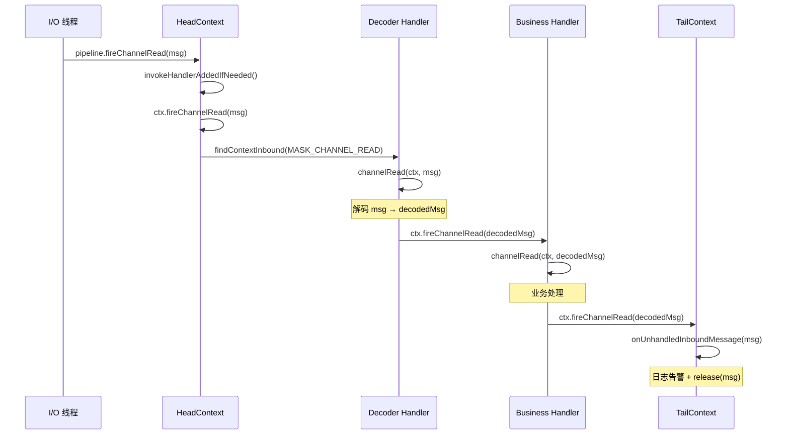
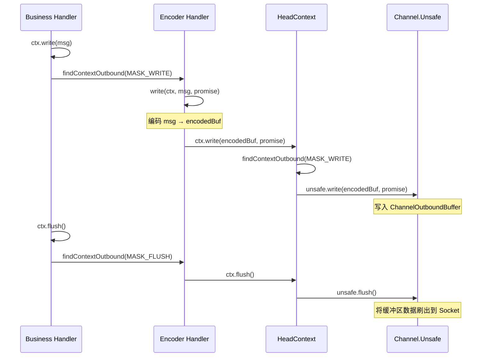
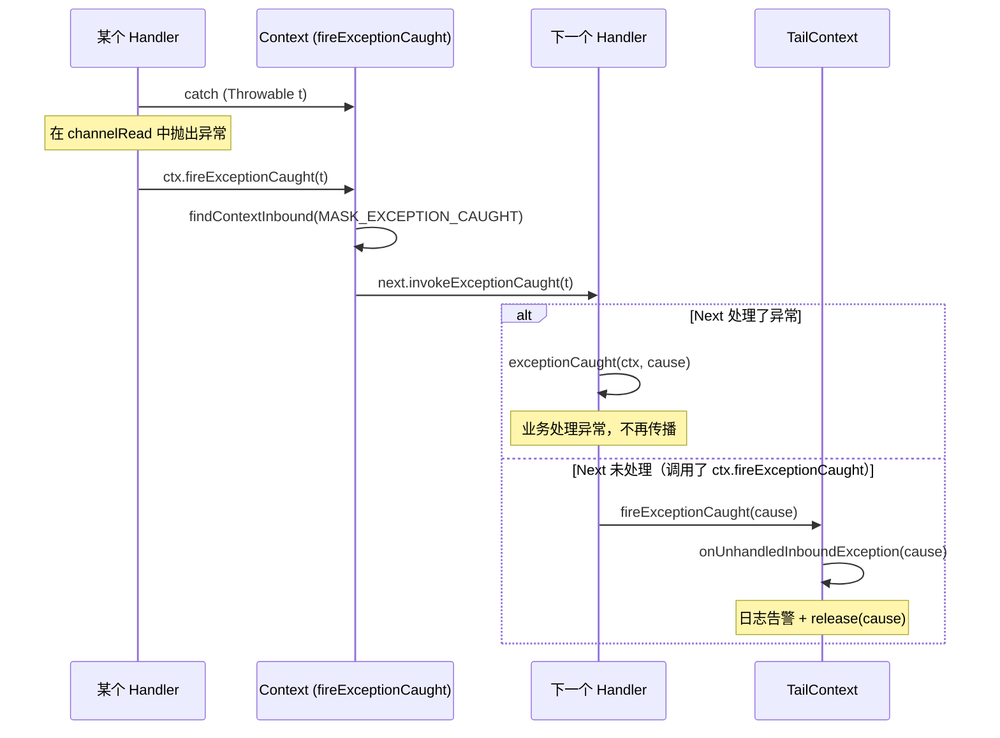
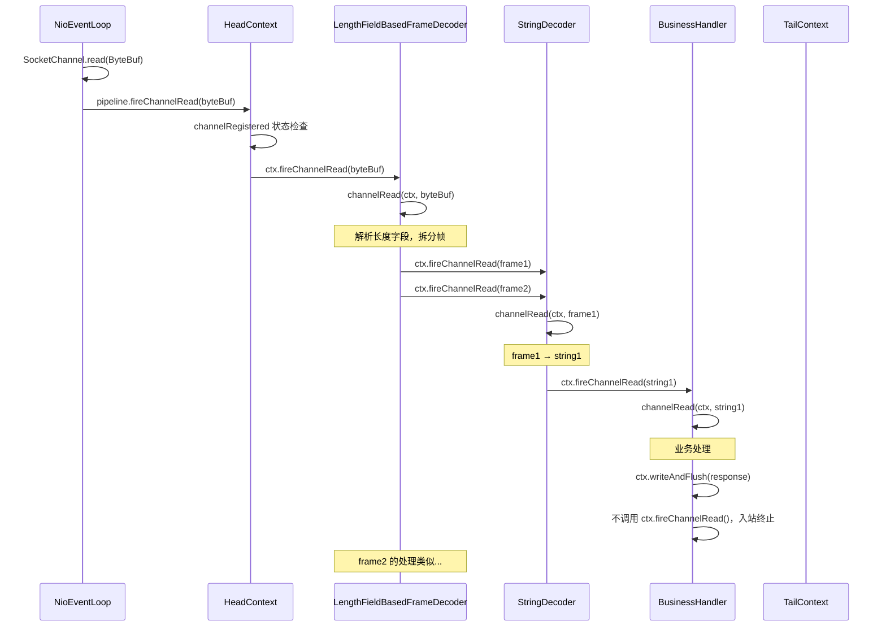
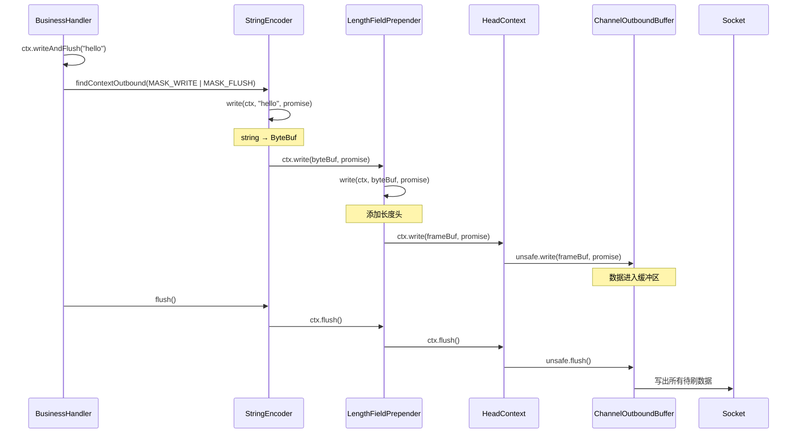
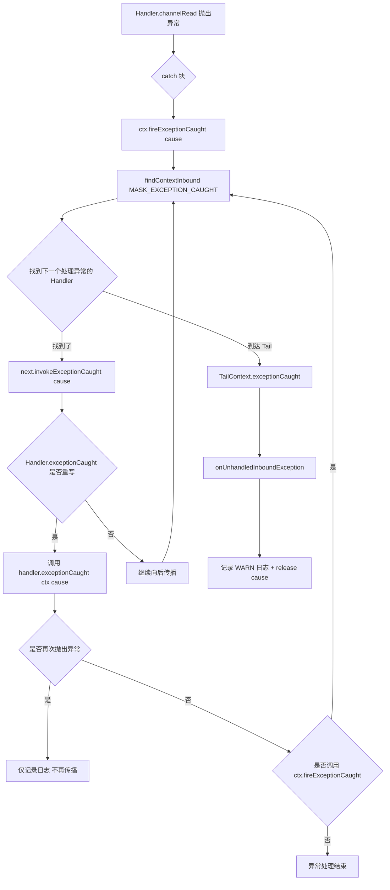

# 事件传播机制：入站/出站流与异常处理

## 概述

Netty 的事件传播机制是 Pipeline 架构的核心运行逻辑。所有 I/O 事件通过 Pipeline 中的 Handler 链有序传播，每个 Handler 可以处理事件、转换事件、或直接透传。事件分为两大类：入站事件（Inbound）和出站事件（Outbound），它们沿相反方向在同一条双向链表上传播。

在 Netty 整体架构中，事件传播机制是连接底层 I/O 模型与上层业务逻辑的桥梁。底层 I/O 线程产生的原始事件（数据到达、连接建立等）通过入站传播逐层解码、处理；上层业务的写操作请求通过出站传播逐层编码、刷出。

## 架构图

### 事件传播的总体流向

```
  用户业务代码
       │
       │ write(msg) / bind() / connect()
       ▼
 ┌─────────────────────────────────────────────────────────────────────────┐
 │                         ChannelPipeline                                 │
 │                                                                         │
 │   入站方向 (Head ─────────────────────────────────────────▶ Tail)       │
 │   ┌──────────┐    ┌──────────┐    ┌──────────┐    ┌──────────┐        │
 │   │HeadContext│───▶│ Decoder  │───▶│ Handler  │───▶│TailContext│        │
 │   │          │◀───│          │◀───│          │◀───│          │        │
 │   └──────────┘    └──────────┘    └──────────┘    └──────────┘        │
 │   出站方向 (Head ◀───────────────────────────────────────── Tail)       │
 │                                                                         │
 │   channelRead() ◀────── fireChannelRead() ────── I/O 线程读取数据      │
 │   unsafe.write() ◀──── write() ────────────────── 用户业务代码          │
 └─────────────────────────────────────────────────────────────────────────┘
       │
       │ unsafe.bind() / unsafe.write() / unsafe.flush()
       ▼
  操作系统 Socket
```

### 入站事件传播时序



### 出站事件传播时序



### 异常传播路径



## 核心类分析

### 1. ChannelInboundInvoker 接口

**文件**：`transport/src/main/java/io/netty/channel/ChannelInboundInvoker.java`

定义了所有入站事件的触发方法：

| 方法 | 对应 Handler 回调 | 说明 |
|------|-------------------|------|
| `fireChannelRegistered()` | `channelRegistered(ctx)` | Channel 注册到 EventLoop |
| `fireChannelUnregistered()` | `channelUnregistered(ctx)` | Channel 从 EventLoop 注销 |
| `fireChannelActive()` | `channelActive(ctx)` | Channel 激活（连接建立） |
| `fireChannelInactive()` | `channelInactive(ctx)` | Channel 失活（连接断开） |
| `fireExceptionCaught(cause)` | `exceptionCaught(ctx, cause)` | 异常发生 |
| `fireUserEventTriggered(evt)` | `userEventTriggered(ctx, evt)` | 用户自定义事件 |
| `fireChannelRead(msg)` | `channelRead(ctx, msg)` | 数据可读 |
| `fireChannelReadComplete()` | `channelReadComplete(ctx)` | 读操作完成 |
| `fireChannelWritabilityChanged()` | `channelWritabilityChanged(ctx)` | 可写状态变化 |

**命名规则**：
- `fireXxx()` — 触发事件，向下一个 Handler 传播
- `xxx()` — 处理事件，是 Handler 中的实际回调方法

### 2. ChannelOutboundInvoker 接口

**文件**：`transport/src/main/java/io/netty/channel/ChannelOutboundInvoker.java`

定义了所有出站操作的触发方法：

| 方法 | 对应 Handler 回调 | 说明 |
|------|-------------------|------|
| `bind(addr, promise)` | `bind(ctx, addr, promise)` | 绑定本地地址 |
| `connect(remote, local, promise)` | `connect(ctx, remote, local, promise)` | 连接远程地址 |
| `disconnect(promise)` | `disconnect(ctx, promise)` | 断开连接 |
| `close(promise)` | `close(ctx, promise)` | 关闭 Channel |
| `deregister(promise)` | `deregister(ctx, promise)` | 注销 EventLoop |
| `read()` | `read(ctx)` | 触发读操作 |
| `write(msg, promise)` | `write(ctx, msg, promise)` | 写数据到缓冲区 |
| `flush()` | `flush(ctx)` | 刷出缓冲区到 Socket |
| `writeAndFlush(msg, promise)` | write + flush 组合 | 写并立即刷出 |

### 3. 入站事件传播的核心实现

**文件**：`transport/src/main/java/io/netty/channel/AbstractChannelHandlerContext.java`

#### fireChannelRead 详解（第 341-369 行）

```java
@Override
public ChannelHandlerContext fireChannelRead(final Object msg) {
    // 步骤1：找到下一个处理 channelRead 的入站 Handler
    AbstractChannelHandlerContext next = findContextInbound(MASK_CHANNEL_READ);

    if (next.executor().inEventLoop()) {
        // 步骤2：touch 用于泄漏检测（记录消息的分配点和最后访问点）
        final Object m = pipeline.touch(msg, next);

        if (next.invokeHandler()) {
            try {
                // 步骤3：根据 Handler 具体类型分派调用
                // 这里使用 instanceof 分派而非直接接口调用，
                // 是为了规避 JDK-8180450 的接口调用性能问题
                final ChannelHandler handler = next.handler();
                final DefaultChannelPipeline.HeadContext headContext = pipeline.head;
                if (handler == headContext) {
                    headContext.channelRead(next, m);
                } else if (handler instanceof ChannelDuplexHandler) {
                    ((ChannelDuplexHandler) handler).channelRead(next, m);
                } else {
                    ((ChannelInboundHandler) handler).channelRead(next, m);
                }
            } catch (Throwable t) {
                // 步骤4：异常通过 invokeExceptionCaught 传播
                next.invokeExceptionCaught(t);
            }
        } else {
            // 步骤5：Handler 未就绪（handlerAdded 尚未调用），直接向后传播
            next.fireChannelRead(m);
        }
    } else {
        // 步骤6：跨线程 —— 提交到目标 Handler 的 EventExecutor
        next.executor().execute(() -> fireChannelRead(msg));
    }
    return this;
}
```

#### findContextInbound 查找逻辑（第 927-934 行）

```java
private AbstractChannelHandlerContext findContextInbound(int mask) {
    AbstractChannelHandlerContext ctx = this;
    EventExecutor currentExecutor = executor();
    do {
        ctx = ctx.next;  // 沿 next 指针向 Tail 方向遍历
    } while (skipContext(ctx, currentExecutor, mask, MASK_ONLY_INBOUND));
    return ctx;
}
```

#### skipContext 跳过判断（第 945-954 行）

```java
private static boolean skipContext(AbstractChannelHandlerContext ctx,
                                    EventExecutor currentExecutor,
                                    int mask, int onlyMask) {
    // 条件1：该节点不属于当前 Handler 类型 OR 不处理当前事件
    // 条件2：同线程下该节点不处理当前事件（可以安全跳过）
    return (ctx.executionMask & (onlyMask | mask)) == 0 ||
            (ctx.executor() == currentExecutor && (ctx.executionMask & mask) == 0);
}
```

**为什么需要区分 onlyMask 和 mask？**

- `onlyMask`（如 `MASK_ONLY_INBOUND`）：判断节点是否属于当前 Handler 类型（入站/出站）
- `mask`（如 `MASK_CHANNEL_READ`）：判断节点是否处理当前具体事件

一个 `ChannelDuplexHandler` 同时属于入站和出站类型，所以 `onlyMask` 检查不会跳过它。但如果它没有重写 `channelRead()` 方法（掩码位为 0），且与当前节点在同一 Executor，就会被跳过。

**跨线程时不能跳过的理由**（Netty issue #10067）：

如果目标 Handler 使用不同的 EventExecutor，即使它不处理当前事件，也必须将事件提交到它的线程执行。因为不同线程之间需要保持事件顺序，跳过会导致事件乱序。

#### 其他入站事件的传播模式

所有入站事件的传播遵循相同的模式：

```java
// fireChannelActive — 第 208-235 行
@Override
public ChannelHandlerContext fireChannelActive() {
    AbstractChannelHandlerContext next = findContextInbound(MASK_CHANNEL_ACTIVE);
    if (next.executor().inEventLoop()) {
        if (next.invokeHandler()) {
            try {
                final ChannelHandler handler = next.handler();
                // ... 类型分派 ...
                handler.channelActive(next);
            } catch (Throwable t) {
                next.invokeExceptionCaught(t);
            }
        } else {
            next.fireChannelActive();
        }
    } else {
        next.executor().execute(this::fireChannelActive);
    }
    return this;
}
```

统一模式为：`findContextInbound(mask)` → 线程检查 → invokeHandler 检查 → 类型分派调用 → 异常传播。

### 4. 出站事件传播的核心实现

#### write 方法详解（第 780-841 行）

```java
void write(Object msg, boolean flush, ChannelPromise promise) {
    // 步骤1：参数校验
    if (validateWrite(msg, promise)) {
        // 步骤2：找到下一个出站 Handler
        // 如果同时 flush，需要查找同时处理 WRITE 和 FLUSH 的 Handler
        final AbstractChannelHandlerContext next = findContextOutbound(
                flush ? MASK_WRITE | MASK_FLUSH : MASK_WRITE);

        final Object m = pipeline.touch(msg, next);
        EventExecutor executor = next.executor();

        if (executor.inEventLoop()) {
            if (next.invokeHandler()) {
                promise = ensurePromiseUseCorrectExecutor(promise);
                try {
                    // 步骤3：类型分派调用 write
                    final ChannelHandler handler = next.handler();
                    // ... instanceof 分派 ...
                    handler.write(next, msg, promise);
                } catch (Throwable t) {
                    notifyOutboundHandlerException(t, promise);
                }

                if (flush) {
                    try {
                        // 步骤4：如果需要 flush，继续调用 flush
                        // ... instanceof 分派 ...
                        handler.flush(next);
                    } catch (Throwable t) {
                        next.invokeExceptionCaught(t);
                    }
                }
            } else {
                next.write(msg, flush, promise);
            }
        } else {
            // 步骤5：跨线程 —— 使用 WriteTask（带对象池优化）
            final WriteTask task = WriteTask.newInstance(this, m, promise, flush);
            if (!safeExecute(executor, task, promise, m, !flush)) {
                task.cancel();
            }
        }
    }
}
```

**WriteTask 的对象池优化**（第 1073-1153 行）：

```java
static final class WriteTask implements Runnable {
    private static final Recycler<WriteTask> RECYCLER = ...;  // 对象池

    static WriteTask newInstance(AbstractChannelHandlerContext ctx,
                                  Object msg, ChannelPromise promise, boolean flush) {
        WriteTask task = RECYCLER.get();  // 从对象池获取
        init(task, ctx, msg, promise, flush);
        return task;
    }

    @Override
    public void run() {
        try {
            decrementPendingOutboundBytes();  // 更新待写字节数
            ctx.write(msg, size < 0, promise);  // size 的符号位标记 flush
        } finally {
            recycle();  // 归还对象池
        }
    }
}
```

WriteTask 使用 Recycler 对象池减少 GC 压力。`size` 字段的最高位（符号位）用于标记是否需要 flush，避免额外的 boolean 字段开销。

#### findContextOutbound 查找逻辑（第 936-943 行）

```java
private AbstractChannelHandlerContext findContextOutbound(int mask) {
    AbstractChannelHandlerContext ctx = this;
    EventExecutor currentExecutor = executor();
    do {
        ctx = ctx.prev;  // 沿 prev 指针向 Head 方向遍历
    } while (skipContext(ctx, currentExecutor, mask, MASK_ONLY_OUTBOUND));
    return ctx;
}
```

与 `findContextInbound` 对称，区别在于遍历方向是 `ctx.prev`（向 Head）。

#### bind 方法的典型出站传播（第 481-519 行）

```java
@Override
public ChannelFuture bind(final SocketAddress localAddress, ChannelPromise promise) {
    ObjectUtil.checkNotNull(localAddress, "localAddress");
    if (isNotValidPromise(promise, false)) {
        return promise;
    }

    // 找到下一个出站 Handler
    final AbstractChannelHandlerContext next = findContextOutbound(MASK_BIND);
    EventExecutor executor = next.executor();

    if (executor.inEventLoop()) {
        if (next.invokeHandler()) {
            promise = ensurePromiseUseCorrectExecutor(promise);
            try {
                // 类型分派：HeadContext / ChannelDuplexHandler / ChannelOutboundHandlerAdapter / ChannelOutboundHandler
                final ChannelHandler handler = next.handler();
                final DefaultChannelPipeline.HeadContext headContext = pipeline.head;
                if (handler == headContext) {
                    headContext.bind(next, localAddress, promise);
                } else if (handler instanceof ChannelDuplexHandler) {
                    ((ChannelDuplexHandler) handler).bind(next, localAddress, promise);
                } else if (handler instanceof ChannelOutboundHandlerAdapter) {
                    ((ChannelOutboundHandlerAdapter) handler).bind(next, localAddress, promise);
                } else {
                    ((ChannelOutboundHandler) handler).bind(next, localAddress, promise);
                }
            } catch (Throwable t) {
                notifyOutboundHandlerException(t, promise);  // 出站异常通过 promise 通知
            }
        } else {
            next.bind(localAddress, promise);
        }
    } else {
        final ChannelPromise p = promise;
        safeExecute(executor, () -> bind(localAddress, p), promise, null, false);
    }
    return promise;
}
```

#### ensurePromiseUseCorrectExecutor（第 471-478 行）

```java
private ChannelPromise ensurePromiseUseCorrectExecutor(ChannelPromise promise) {
    if (promise instanceof DefaultChannelPromise &&
            !((DefaultChannelPromise) promise).executor().inEventLoop()) {
        ChannelPromise newPromise = newPromise();  // 创建在当前 Executor 上的新 Promise
        PromiseNotifier.cascade(newPromise, promise);  // 级联通知
        return newPromise;
    }
    return promise;
}
```

这个方法确保 Promise 的 Listener 在正确的线程上执行。如果原始 Promise 的 Executor 不是当前 Handler 的 Executor，就创建一个新 Promise 并级联。

### 5. 异常传播机制

#### 异常的产生来源

1. **Handler 方法抛出异常**：在 `channelRead()`、`write()` 等方法中抛出
2. **I/O 操作失败**：底层 Socket 操作失败
3. **业务逻辑异常**：用户代码主动调用 `ctx.fireExceptionCaught(cause)`

#### 入站异常传播（第 268-307 行）

```java
@Override
public ChannelHandlerContext fireExceptionCaught(final Throwable cause) {
    ObjectUtil.checkNotNull(cause, "cause");
    // 异常也是入站事件，沿 next 方向传播
    AbstractChannelHandlerContext next = findContextInbound(MASK_EXCEPTION_CAUGHT);

    if (next.executor().inEventLoop()) {
        next.invokeExceptionCaught(cause);
    } else {
        try {
            next.executor().execute(() -> next.invokeExceptionCaught(cause));
        } catch (Throwable t) {
            // 异常传播本身失败：记录日志
            if (logger.isWarnEnabled()) {
                logger.warn("Failed to submit an exceptionCaught() event.", t);
                logger.warn("The exceptionCaught() event that was failed to submit was:", cause);
            }
        }
    }
    return this;
}

@SuppressWarnings("deprecation")
private void invokeExceptionCaught(final Throwable cause) {
    if (invokeHandler()) {
        try {
            handler().exceptionCaught(this, cause);
        } catch (Throwable error) {
            // Handler 的 exceptionCaught 本身又抛异常：只记录日志，不再传播
            // 防止无限循环
            if (logger.isDebugEnabled()) {
                logger.debug(
                    "An exception was thrown by a user handler's exceptionCaught() " +
                    "method while handling the following exception:", cause);
            } else if (logger.isWarnEnabled()) {
                logger.warn(
                    "An exception '{}' [enable DEBUG level for full stacktrace] " +
                    "was thrown by a user handler's exceptionCaught() " +
                    "method while handling the following exception:", error, cause);
            }
        }
    } else {
        fireExceptionCaught(cause);  // Handler 未就绪，继续传播
    }
}
```

**关键设计**：
- 异常属于入站事件，沿 `next` 方向（Head → Tail）传播
- 如果 Handler 的 `exceptionCaught()` 本身抛出异常，不会再次传播，只记录日志，防止无限递归
- 异常最终到达 TailContext，由 `onUnhandledInboundException()` 记录告警日志并释放

#### pipeline.fireExceptionCaught() vs ctx.fireExceptionCaught()

这两个方法的区别在于传播的起点不同：

```java
// pipeline.fireExceptionCaught() — 从 Head 开始传播
// DefaultChannelPipeline.java 第 887-898 行
@Override
public final ChannelPipeline fireExceptionCaught(Throwable cause) {
    if (head.executor().inEventLoop()) {
        if (head.invokeHandler()) {
            head.exceptionCaught(head, cause);  // 从 Head 开始
        } else {
            head.fireExceptionCaught(cause);
        }
    } else {
        head.executor().execute(() -> fireExceptionCaught(cause));
    }
    return this;
}

// ctx.fireExceptionCaught() — 从当前 Context 的下一个开始传播
// AbstractChannelHandlerContext.java 第 268-284 行
@Override
public ChannelHandlerContext fireExceptionCaught(final Throwable cause) {
    AbstractChannelHandlerContext next = findContextInbound(MASK_EXCEPTION_CAUGHT);
    // ... 从 next 开始传播 ...
    return this;
}
```

使用场景：
- `pipeline.fireExceptionCaught(cause)`：外部主动报告异常，所有入站 Handler 都有机会处理
- `ctx.fireExceptionCaught(cause)`：Handler 内部报告异常，从当前 Handler 的下一个开始传播

#### 出站异常处理

出站操作的异常通过 `ChannelPromise` 通知，而非 `exceptionCaught`：

```java
// 出站操作中的异常处理（以 bind 为例）
try {
    handler.bind(next, localAddress, promise);
} catch (Throwable t) {
    notifyOutboundHandlerException(t, promise);
}

private static void notifyOutboundHandlerException(Throwable cause, ChannelPromise promise) {
    PromiseNotificationUtil.tryFailure(promise, cause,
            promise instanceof VoidChannelPromise ? null : logger);
}
```

出站异常通过 `promise.setFailure(cause)` 通知调用方，而不是走入站异常传播路径。

### 6. 事件触发方法命名规则

Netty 中有两套命名体系，理解它们的区别至关重要：

| 前缀 | 示例 | 方向 | 说明 |
|------|------|------|------|
| `fire` | `ctx.fireChannelRead(msg)` | 触发传播 | 将事件传递给下一个 Handler |
| 无前缀 | `channelRead(ctx, msg)` | 处理事件 | Handler 中的实际处理方法 |

```java
// 正确用法：在 Handler 中处理完事件后，手动触发传播
public class MyHandler extends ChannelInboundHandlerAdapter {
    @Override
    public void channelRead(ChannelHandlerContext ctx, Object msg) {
        // 处理消息
        processMessage(msg);
        // 传播给下一个 Handler
        ctx.fireChannelRead(msg);
    }
}

// 错误用法：在 Handler 中直接调用 pipeline 的方法
public class MyHandler extends ChannelInboundHandlerAdapter {
    @Override
    public void channelRead(ChannelHandlerContext ctx, Object msg) {
        // 错误！这会从 Head 重新开始传播，跳过前面的 Handler
        ctx.pipeline().fireChannelRead(msg);
    }
}
```

### 7. 传播控制：如何中断事件传播

#### 中断入站传播

不调用 `ctx.fireXxx()` 即可中断：

```java
public class TerminalHandler extends ChannelInboundHandlerAdapter {
    @Override
    public void channelRead(ChannelHandlerContext ctx, Object msg) {
        // 处理消息但不传播
        handleMessage(msg);
        // 不调用 ctx.fireChannelRead(msg)，事件到此终止
        // 注意：如果 msg 是引用计数对象，需要确保最终释放
    }
}
```

#### 中断出站传播

不调用 `ctx.xxx()` 即可中断：

```class InterceptingHandler extends ChannelOutboundHandlerAdapter {
    @Override
    public void write(ChannelHandlerContext ctx, Object msg, ChannelPromise promise) {
        if (shouldDrop(msg)) {
            // 不传播，直接标记成功
            ReferenceCountUtil.release(msg);
            promise.setSuccess();
            return;
        }
        // 正常传播
        ctx.write(msg, promise);
    }
}
```

#### 从任意位置开始传播

通过 `pipeline` 引用可以从任意位置触发事件：

```java
public class MyHandler extends ChannelInboundHandlerAdapter {
    @Override
    public void channelRead(ChannelHandlerContext ctx, Object msg) {
        // 从 Head 重新开始入站传播（绕过之前的 Handler）
        ctx.pipeline().fireChannelRead(msg);
    }
}
```

```java
public class MyHandler extends ChannelInboundHandlerAdapter {
    @Override
    public void channelRead(ChannelHandlerContext ctx, Object msg) {
        // 从 Tail 开始出站传播（绕过后续的入站 Handler）
        ctx.channel().writeAndFlush(response);
    }
}
```

### 8. 出站操作的 flush 语义

write 和 flush 的分离是 Netty 的重要设计：

```java
// write 只是将数据写入 ChannelOutboundBuffer（内存缓冲区）
ctx.write(msg);

// flush 将 ChannelOutboundBuffer 中的数据刷出到 Socket
ctx.flush();

// writeAndFlush = write + flush
ctx.writeAndFlush(msg);
```

这种分离的好处：
- 批量写入：多次 write 后一次 flush，减少系统调用次数
- 合并写入：多个小消息合并成一次大的 writev 操作
- 精确控制：可以在合适的时机触发 flush（如 `channelReadComplete` 时）

```java
public class BatchHandler extends ChannelOutboundHandlerAdapter {
    private int pendingWrites;

    @Override
    public void write(ChannelHandlerContext ctx, Object msg, ChannelPromise promise) {
        ctx.write(msg, promise);
        pendingWrites++;
        if (pendingWrites >= BATCH_SIZE) {
            ctx.flush();  // 达到批量大小时 flush
            pendingWrites = 0;
        }
    }
}
```

### 9. AutoRead 机制与 read 事件

`read()` 是一个出站操作，它通知 I/O 线程开始读取数据：

```java
// HeadContext 中的 read 实现
@Override
public void read(ChannelHandlerContext ctx) {
    unsafe.beginRead();  // 通知底层开始读取
}
```

AutoRead 的自动触发（HeadContext 第 1439-1443 行）：

```java
private void readIfIsAutoRead() {
    if (channel.config().isAutoRead()) {
        channel.read();  // 自动发起 read
    }
}
```

在 `channelActive` 和 `channelReadComplete` 时会自动检查并发起 read。关闭 AutoRead 后，需要手动调用 `ctx.read()` 来控制读取节奏（流量控制）。

### 10. ChannelHandlerMask 的 @Skip 注解

**文件**：`transport/src/main/java/io/netty/channel/ChannelHandlerMask.java`

@Skip 注解标注的方法在掩码计算时会被清除对应位：

```java
// ChannelInboundHandlerAdapter 中的所有方法都标注了 @Skip
@Skip
@Override
public void channelRegistered(ChannelHandlerContext ctx) throws Exception {
    ctx.fireChannelRegistered();  // 只是透传
}
```

掩码计算流程（`mask0` 方法，第 91-164 行）：

```java
private static int mask0(Class<? extends ChannelHandler> handlerType) {
    int mask = MASK_EXCEPTION_CAUGHT;  // 默认包含异常处理

    if (ChannelInboundHandler.class.isAssignableFrom(handlerType)) {
        mask |= MASK_ALL_INBOUND;  // 包含所有入站掩码

        // 检查每个方法是否有 @Skip 注解
        if (isSkippable(handlerType, "channelRegistered", ChannelHandlerContext.class)) {
            mask &= ~MASK_CHANNEL_REGISTERED;  // 清除该位
        }
        // ... 其他方法类似 ...
    }

    if (ChannelOutboundHandler.class.isAssignableFrom(handlerType)) {
        mask |= MASK_ALL_OUTBOUND;  // 包含所有出站掩码

        if (isSkippable(handlerType, "bind", ...)) {
            mask &= ~MASK_BIND;
        }
        // ... 其他方法类似 ...
    }

    return mask;
}
```

**优化效果**：如果用户继承 `ChannelInboundHandlerAdapter` 但只重写了 `channelRead()`，那么 `channelRegistered`、`channelActive` 等未重写的方法的掩码位为 0，传播时直接跳过该 Handler，减少了无意义的方法调用。

## 设计思想

### 1. 对称传播

入站和出站事件在同一双向链表上以相反方向传播，这是 Netty Pipeline 最精妙的设计之一。无需维护两条独立链表，通过 `next`/`prev` 指针即可实现双向遍历。

### 2. 事件驱动 + 责任链

事件传播结合了事件驱动架构和责任链模式：
- 事件驱动：I/O 线程产生事件，异步通知 Pipeline
- 责任链：事件沿 Handler 链逐个传递，每个 Handler 决定是否继续

### 3. 类型分派优化

```java
// 不使用接口调用，而是通过 instanceof 分派
if (handler == headContext) {
    headContext.channelRead(next, m);
} else if (handler instanceof ChannelDuplexHandler) {
    ((ChannelDuplexHandler) handler).channelRead(next, m);
} else if (handler instanceof ChannelInboundHandlerAdapter) {
    ((ChannelInboundHandlerAdapter) handler).channelRead(next, m);
} else {
    ((ChannelInboundHandler) handler).channelRead(next, m);
}
```

这种分派方式规避了 JDK-8180450：当一个类实现多个接口时，接口方法调用的性能会下降。通过 `instanceof` 直接调用具体类型的方法，性能更好。

### 4. WriteTask 对象池

出站 write 操作在跨线程时使用 Recycler 对象池：

```java
static WriteTask newInstance(...) {
    WriteTask task = RECYCLER.get();  // 复用对象
    init(task, ctx, msg, promise, flush);
    return task;
}
```

高并发场景下频繁的 write 操作会产生大量 WriteTask 对象，对象池避免了 GC 压力。

### 5. Promise 线程亲和性

`ensurePromiseUseCorrectExecutor()` 确保 Promise 的 Listener 在正确的线程执行。这避免了在 Listener 中修改 Handler 状态时的线程安全问题。

## 与其他模块的交互

### 与 I/O 线程模型的交互
- 入站事件由 I/O 线程（NioEventLoop 等）触发
- 事件传播过程中可能涉及线程切换（Handler 绑定了不同的 EventExecutor）
- 跨线程时使用 `executor.execute()` 提交任务，保证事件顺序

### 与 Channel.Unsafe 的交互
- 出站操作的终点是 HeadContext，由它委托给 Channel.Unsafe
- Unsafe 执行真正的系统调用（bind/connect/write/flush/close 等）
- Unsafe 的操作结果通过 ChannelFuture/Promise 回调通知

### 与编解码框架的交互
- Decoder 是入站 Handler，将 `ByteBuf` 解码为业务对象后调用 `ctx.fireChannelRead(decodedMsg)`
- Encoder 是出站 Handler，将业务对象编码为 `ByteBuf` 后调用 `ctx.write(encodedBuf, promise)`
- 编解码器的传播体现了事件在传播过程中的数据转换

### 与内存管理的交互
- `pipeline.touch(msg, next)` 在传播过程中标记消息，用于泄漏检测
- 未被处理的消息由 TailContext 释放（`ReferenceCountUtil.release()`）
- 异常对象也需要释放（如果实现了 `ReferenceCounted`）

## 关键流程

### 完整的 channelRead 处理流程



### 完整的 write + flush 流程



### 异常传播的完整路径



## 学习要点

### 需要重点理解的关键点

1. **入站 vs 出站的传播方向**：入站 Head→Tail（`ctx.next`），出站 Tail→Head（`ctx.prev`）。这是由 `findContextInbound` 和 `findContextOutbound` 中的遍历方向决定的。

2. **fireXxx vs xxx 的区别**：`fireXxx()` 是触发传播的方法，`xxx()` 是 Handler 中的处理方法。在 Handler 中调用 `ctx.fireChannelRead(msg)` 会将事件传给下一个 Handler；直接调用 `channelRead()` 是处理事件。

3. **pipeline.fireXxx vs ctx.fireXxx 的区别**：`pipeline.fireXxx()` 从 Head（或 Tail）开始传播，经过所有 Handler；`ctx.fireXxx()` 从当前 Context 的下一个开始传播。

4. **异常传播的两个路径**：入站异常通过 `fireExceptionCaught` 沿入站方向传播；出站异常通过 `promise.setFailure()` 通知调用方。

5. **跨线程事件传播**：当目标 Handler 使用不同的 EventExecutor 时，事件通过 `executor.execute()` 提交到目标线程。即使目标 Handler 不处理当前事件，也不能跳过（保持事件顺序）。

6. **write 与 flush 的分离**：write 只是将数据写入缓冲区，flush 才真正将数据刷出到 Socket。这种分离支持批量写入和精确控制。

7. **@Skip 注解与 executionMask**：Adapter 类中仅做透传的方法标注 @Skip，掩码计算时清除对应位。传播时通过位运算快速跳过这些 Handler，减少无意义的方法调用。

8. **Handler 中异常的正确处理方式**：在 `channelRead` 中 catch 异常后，应调用 `ctx.fireExceptionCaught(cause)` 传播给后续 Handler，而不是吞掉异常。

### 常见面试问题

1. **Netty 中入站事件和出站事件分别有哪些？传播方向是什么？**
   入站事件：channelRegistered、channelActive、channelRead、channelReadComplete、channelInactive、channelUnregistered、exceptionCaught、userEventTriggered、channelWritabilityChanged。方向：Head → Tail。
   出站事件：bind、connect、disconnect、close、deregister、read、write、flush。方向：Tail → Head。

2. **为什么 Netty 要把 write 和 flush 分开？**
   为了支持批量写入和减少系统调用。多次 write 将数据写入 ChannelOutboundBuffer，一次 flush 将所有待刷数据写出。这样可以合并多个小消息为一次大的 writev 操作，提升吞吐量。

3. **异常在 Pipeline 中是如何传播的？**
   入站异常通过 `ctx.fireExceptionCaught()` 沿入站方向传播，每个 Handler 的 `exceptionCaught()` 方法有机会处理。如果所有 Handler 都没有处理，异常到达 TailContext 被记录日志并释放。出站异常通过 `promise.setFailure()` 通知调用方。

4. **如果 Handler 的 exceptionCaught 方法本身抛出异常会怎样？**
   不会再次传播，只记录日志。这是在 `invokeExceptionCaught` 中通过 catch 实现的，防止无限递归。

5. **什么是 @Skip 注解？它有什么作用？**
   @Skip 标注在 Handler 的方法上，表示该方法仅做透传（如 `ctx.fireChannelRead(msg)`）。在掩码计算时，@Skip 方法对应的位会被清除。传播时通过位运算判断跳过该 Handler，减少不必要的方法调用。

6. **如何在 Handler 中中断事件传播？**
   入站事件：不调用 `ctx.fireXxx()`。出站事件：不调用 `ctx.xxx()`。但需要注意资源释放，被中断的消息如果实现了 ReferenceCounted，需要确保最终被释放。

7. **ctx.write() 和 ctx.channel().write() 有什么区别？**
   `ctx.write()` 从当前 Context 的下一个出站 Handler 开始传播。`ctx.channel().write()` 内部调用 `pipeline.write()`，从 Tail 开始传播，会经过所有出站 Handler。前者可以跳过当前 Handler 之后的某些出站 Handler。

8. **Netty 中 read() 为什么是出站操作？**
   `read()` 是应用层向 I/O 线程发出的"请求读取"指令，不是数据的流入。它从 Tail 向 Head 传播，最终由 HeadContext 调用 `unsafe.beginRead()` 通知操作系统开始读取。这是"请求"而非"响应"，因此是出站方向。
