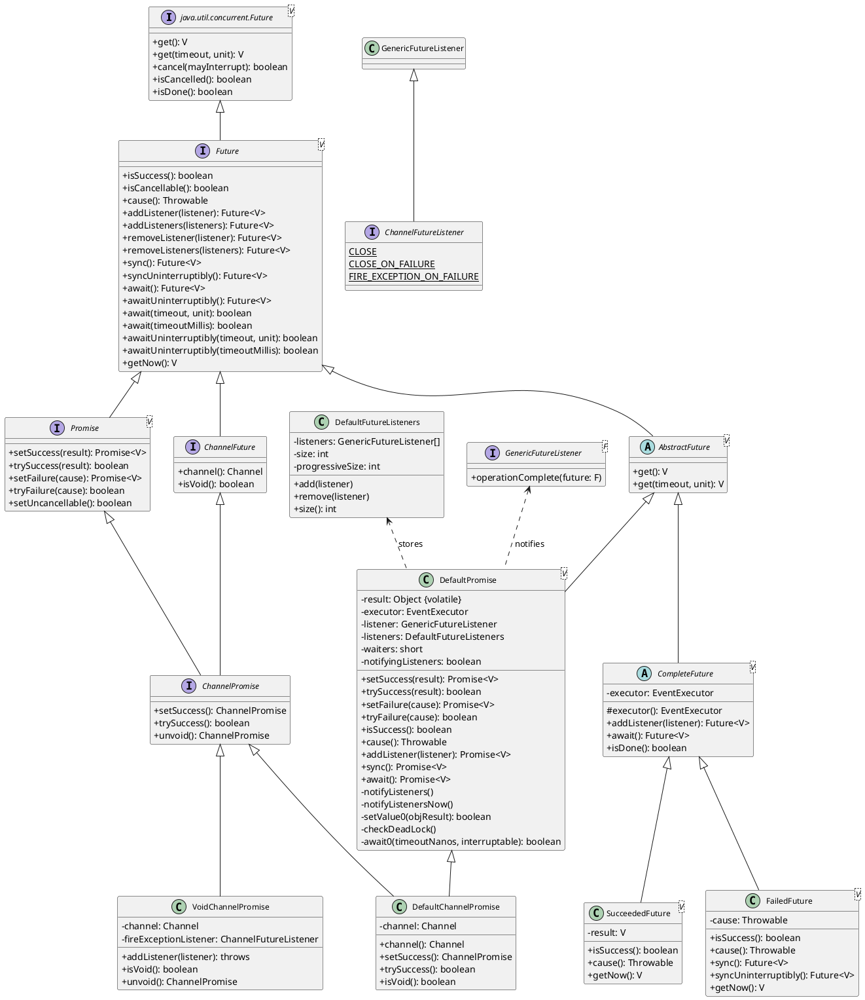
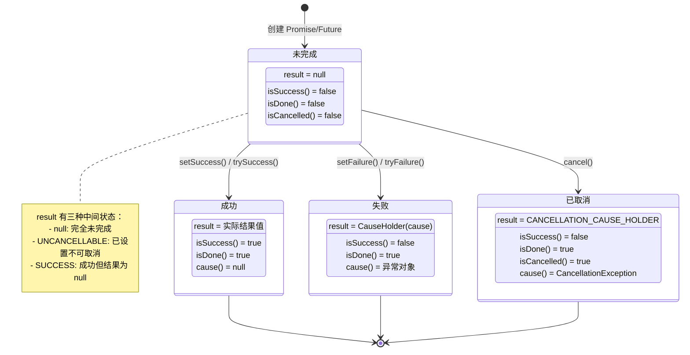
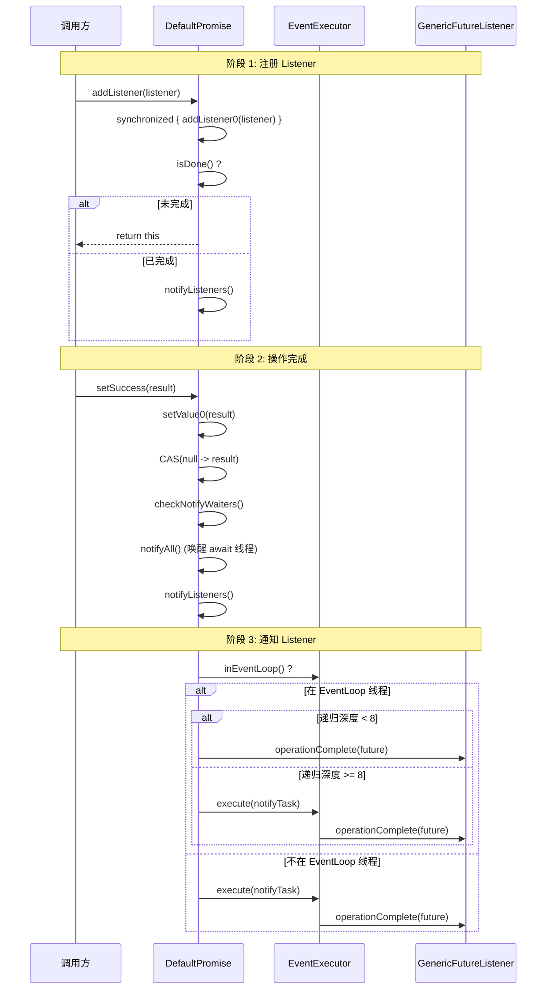
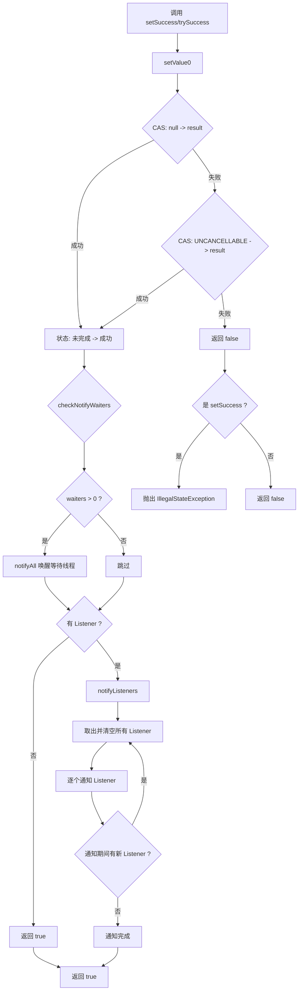
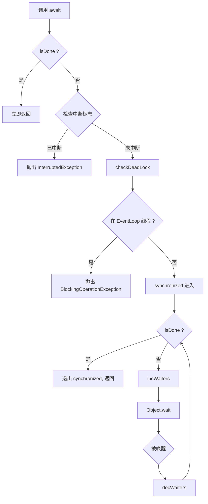

# Future/Promise 体系

## 概述

### Future/Promise 解决什么问题

Netty 的所有 I/O 操作都是异步的。当调用 `channel.connect()`、`channel.write()` 等方法时，操作不会立即完成，而是返回一个 `Future` 对象来承载异步操作的最终结果。Future/Promise 模式解决了以下核心问题：

1. **异步结果通知**：调用方无需阻塞等待操作完成，可以通过注册 `Listener` 在操作完成时获得回调通知
2. **异步结果容器**：Future 提供了统一的接口来查询异步操作的状态（成功/失败/取消）和获取结果
3. **可写入结果**：Promise 作为 Future 的可写版本，允许异步操作的执行方在操作完成时设置结果
4. **链式编排**：通过 Listener 机制实现多个异步操作的编排和串联

### 在 Netty 整体架构中的位置

Future/Promise 体系位于 Netty 的 `common` 模块和 `transport` 模块中：

- **`io.netty.util.concurrent` 包**（common 模块）：提供通用的 Future/Promise 接口和实现
- **`io.netty.channel` 包**（transport 模块）：在通用基础上扩展出面向 Channel I/O 的 `ChannelFuture`/`ChannelPromise`

```
┌─────────────────────────────────────────────────────────────────┐
│                        应用层                                    │
│   ChannelFuture / ChannelPromise                                │
│        ↑                                                        │
│   ChannelFutureListener                                         │
├─────────────────────────────────────────────────────────────────┤
│                      transport 模块                              │
│   ChannelFuture ← ChannelPromise ← DefaultChannelPromise        │
│        ↑                                                        │
│   Future ← Promise ← DefaultPromise                             │
├─────────────────────────────────────────────────────────────────┤
│                       common 模块                                │
│   Future / Promise / GenericFutureListener                      │
│   DefaultPromise / CompleteFuture / SucceededFuture / FailedFuture│
│   DefaultFutureListeners / GlobalEventExecutor                  │
└─────────────────────────────────────────────────────────────────┘
```

## 架构图

### Future/Promise 接口体系类图



### Future 状态转换图



## 核心类分析

### 1. Future<V> 接口

**文件位置**：`common/src/main/java/io/netty/util/concurrent/Future.java`

Future 是 Netty 异步操作结果的只读抽象，继承自 `java.util.concurrent.Future<V>`，在其基础上增加了 Netty 特有的能力。

**核心方法分类**：

| 分类 | 方法 | 说明 |
|------|------|------|
| 状态查询 | `isSuccess()` | 操作是否成功完成 |
| 状态查询 | `isCancellable()` | 是否可以取消（result == null） |
| 状态查询 | `cause()` | 获取失败原因，成功或未完成返回 null |
| Listener 管理 | `addListener(listener)` | 添加完成监听器 |
| Listener 管理 | `addListeners(listeners)` | 批量添加监听器 |
| Listener 管理 | `removeListener(listener)` | 移除监听器 |
| 阻塞等待 | `sync()` | 阻塞等待完成，失败时抛出异常 |
| 阻塞等待 | `await()` | 阻塞等待完成，不抛出异常 |
| 阻塞等待 | `syncUninterruptibly()` | 不可中断的 sync |
| 阻塞等待 | `awaitUninterruptibly()` | 不可中断的 await |
| 阻塞等待 | `await(timeout, unit)` | 带超时的 await |
| 结果获取 | `getNow()` | 非阻塞获取结果，未完成返回 null |

**设计要点**：
- 返回 `Future<V>` 本身支持链式调用
- `sync()` 与 `await()` 的区别在于是否将失败异常抛出给调用方

### 2. GenericFutureListener<F> 接口

**文件位置**：`common/src/main/java/io/netty/util/concurrent/GenericFutureListener.java`

```java
public interface GenericFutureListener<F extends Future<?>> extends EventListener {
    void operationComplete(F future) throws Exception;
}
```

- 泛型参数 `F extends Future<?>` 使其可以绑定到特定类型的 Future
- 继承自 `java.util.EventListener`，是一个标记接口
- 单一回调方法 `operationComplete()`，在 Future 完成时被调用
- 回调中可以访问传入的 `future` 参数来获取操作结果

### 3. Promise<V> 接口

**文件位置**：`common/src/main/java/io/netty/util/concurrent/Promise.java`

Promise 是 Future 的可写版本，定义了设置异步操作结果的方法：

```java
public interface Promise<V> extends Future<V> {
    // 设置成功结果，已完成则抛 IllegalStateException
    Promise<V> setSuccess(V result);

    // 尝试设置成功结果，已完成返回 false（不抛异常）
    boolean trySuccess(V result);

    // 设置失败原因，已完成则抛 IllegalStateException
    Promise<V> setFailure(Throwable cause);

    // 尝试设置失败原因，已完成返回 false（不抛异常）
    boolean tryFailure(Throwable cause);

    // 标记为不可取消
    boolean setUncancellable();
}
```

**setSuccess vs trySuccess 的区别**：
- `setSuccess()`：语义上断言"设置一定成功"，失败时抛出 `IllegalStateException`
- `trySuccess()`：语义上表示"尝试设置"，失败时返回 `false`，适用于不确定是否已完成的场景

### 4. ChannelFuture / ChannelPromise / ChannelFutureListener

**文件位置**：`transport/src/main/java/io/netty/channel/`

这三个接口是 Future/Promise 在 Channel I/O 层的特化：

**ChannelFuture**：
- 继承 `Future<Void>`，泛型固定为 `Void`（I/O 操作通常没有返回值）
- 增加 `channel()` 方法获取关联的 Channel
- 增加 `isVoid()` 判断是否为 void promise
- 覆盖所有方法返回 `ChannelFuture` 以支持链式调用

**ChannelPromise**：
- 同时继承 `ChannelFuture` 和 `Promise<Void>`
- 增加无参 `setSuccess()` 和 `trySuccess()` 方法（因为结果类型是 Void）
- 增加 `unvoid()` 方法：如果是 VoidChannelPromise 则返回一个新的 DefaultChannelPromise

**ChannelFutureListener**：
- 继承 `GenericFutureListener<ChannelFuture>`
- 预定义了三个常用监听器常量：

```java
// 操作完成后关闭 Channel
ChannelFutureListener CLOSE = future -> future.channel().close();

// 操作失败时关闭 Channel
ChannelFutureListener CLOSE_ON_FAILURE = future -> {
    if (!future.isSuccess()) {
        future.channel().close();
    }
};

// 操作失败时将异常传播到 Pipeline
ChannelFutureListener FIRE_EXCEPTION_ON_FAILURE = future -> {
    if (!future.isSuccess()) {
        future.channel().pipeline().fireExceptionCaught(future.cause());
    }
};
```

### 5. DefaultPromise<V> -- 核心实现

**文件位置**：`common/src/main/java/io/netty/util/concurrent/DefaultPromise.java`

这是 Future/Promise 体系中最核心的实现类，需要深入分析。

#### 5.1 核心字段

```java
public class DefaultPromise<V> extends AbstractFuture<V> implements Promise<V> {

    // Listener 通知的最大递归深度，防止 StackOverflowError
    public static final String PROPERTY_MAX_LISTENER_STACK_DEPTH = "io.netty.defaultPromise.maxListenerStackDepth";
    private static final int MAX_LISTENER_STACK_DEPTH = Math.min(8,
            SystemPropertyUtil.getInt(PROPERTY_MAX_LISTENER_STACK_DEPTH, 8));

    // CAS 操作所需的 AtomicReferenceFieldUpdater
    private static final AtomicReferenceFieldUpdater<DefaultPromise, Object> RESULT_UPDATER =
            AtomicReferenceFieldUpdater.newUpdater(DefaultPromise.class, Object.class, "result");

    // 特殊标记对象：成功但结果为 null
    private static final Object SUCCESS = new Object();

    // 特殊标记对象：已设置不可取消
    private static final Object UNCANCELLABLE = new Object();

    // 特殊标记对象：已取消（持有 CancellationException）
    private static final CauseHolder CANCELLATION_CAUSE_HOLDER = new CauseHolder(
            StacklessCancellationException.newInstance(DefaultPromise.class, "cancel(...)"));

    // 异步结果，使用 volatile 保证可见性
    // 可能的值：null, SUCCESS, UNCANCELLABLE, 实际结果值, CauseHolder
    private volatile Object result;

    // 用于通知 Listener 的执行器
    private final EventExecutor executor;

    // 单个 Listener（优化：大多数情况只有一个 Listener）
    private GenericFutureListener<? extends Future<?>> listener;

    // 多个 Listener 的容器
    private DefaultFutureListeners listeners;

    // 等待中的线程计数
    private short waiters;

    // 是否正在通知 Listener（防止并发通知）
    private boolean notifyingListeners;
}
```

**result 字段的状态编码**：

| result 值 | 含义 | isSuccess() | isDone() | isCancelled() |
|-----------|------|-------------|----------|---------------|
| `null` | 未完成 | false | false | false |
| `UNCANCELLABLE` | 已标记不可取消，未完成 | false | false | false |
| `SUCCESS` | 成功，结果为 null | true | true | false |
| 实际对象（非 CauseHolder） | 成功，结果为该对象 | true | true | false |
| `CauseHolder(exception)` | 失败 | false | true | false |
| `CANCELLATION_CAUSE_HOLDER` | 已取消 | false | true | true |

#### 5.2 setSuccess / trySuccess 实现

```java
@Override
public Promise<V> setSuccess(V result) {
    if (setSuccess0(result)) {
        return this;
    }
    // 设置失败说明已完成，抛出异常
    throw new IllegalStateException("complete already: " + this);
}

@Override
public boolean trySuccess(V result) {
    return setSuccess0(result);
}

private boolean setSuccess0(V result) {
    // null 结果用 SUCCESS 标记，避免与"未完成"状态冲突
    return setValue0(result == null ? SUCCESS : result);
}
```

#### 5.3 setValue0 -- 状态转换的核心

```java
private boolean setValue0(Object objResult) {
    // CAS 操作：从未完成（null 或 UNCANCELLABLE）转为已完成
    if (RESULT_UPDATER.compareAndSet(this, null, objResult) ||
        RESULT_UPDATER.compareAndSet(this, UNCANCELLABLE, objResult)) {
        // 唤醒等待的线程
        if (checkNotifyWaiters()) {
            // 通知所有注册的 Listener
            notifyListeners();
        }
        return true;
    }
    return false;
}
```

**关键设计**：
- 使用 `AtomicReferenceFieldUpdater` + CAS 实现无锁状态转换
- 两次 CAS 覆盖两种"未完成"状态：`null`（完全未完成）和 `UNCANCELLABLE`（已标记不可取消）
- 状态转换是单向的：一旦变为完成状态，不可再变

#### 5.4 addListener -- Listener 注册

```java
@Override
public Promise<V> addListener(GenericFutureListener<? extends Future<? super V>> listener) {
    checkNotNull(listener, "listener");

    synchronized (this) {
        addListener0(listener);
    }

    // 如果已完成，立即通知
    if (isDone()) {
        notifyListeners();
    }

    return this;
}

private void addListener0(GenericFutureListener<? extends Future<? super V>> listener) {
    if (this.listener == null) {
        if (listeners == null) {
            // 第一个 Listener，直接赋值
            this.listener = listener;
        } else {
            // 已有多个 Listener，追加到数组
            listeners.add(listener);
        }
    } else {
        assert listeners == null;
        // 从单个 Listener 升级为多个 Listener
        listeners = new DefaultFutureListeners(this.listener, listener);
        this.listener = null;
    }
}
```

**Listener 存储优化**：
- 0 个 Listener：`listener == null && listeners == null`
- 1 个 Listener：`listener != null && listeners == null`（最常见的情况，直接存引用）
- 2+ 个 Listener：`listener == null && listeners != null`（使用 `DefaultFutureListeners` 数组）

**竞态处理**：
- `addListener()` 先在 `synchronized` 块内添加 Listener
- 然后在 `synchronized` 块外检查 `isDone()`
- 如果在添加后、检查前 Future 完成，`isDone()` 返回 true，立即通知
- 如果在添加前 Future 已完成，`addListener0` 仍会添加，然后 `isDone()` 为 true，立即通知
- 两种情况都不会丢失通知

#### 5.5 notifyListeners -- Listener 通知

```java
private void notifyListeners() {
    EventExecutor executor = executor();

    // 如果当前在 EventLoop 线程中
    if (executor.inEventLoop()) {
        final InternalThreadLocalMap threadLocals = InternalThreadLocalMap.get();
        final int stackDepth = threadLocals.futureListenerStackDepth();

        // 如果递归深度未超限，直接在当前栈帧通知
        if (stackDepth < MAX_LISTENER_STACK_DEPTH) {
            threadLocals.setFutureListenerStackDepth(stackDepth + 1);
            try {
                notifyListenersNow();
            } finally {
                threadLocals.setFutureListenerStackDepth(stackDepth);
            }
            return;
        }
    }

    // 递归深度超限或不在 EventLoop 线程，提交到 Executor 异步通知
    safeExecute(executor, new Runnable() {
        @Override
        public void run() {
            notifyListenersNow();
        }
    });
}
```

**防 StackOverflow 机制**：
- 使用 ThreadLocal 记录当前线程的 Listener 通知递归深度
- 当 Listener 回调中又触发了新的 Future 完成和通知，深度会递增
- 深度超过 `MAX_LISTENER_STACK_DEPTH`（默认 8）时，将通知任务提交到 Executor 队列
- 这样将递归转换为迭代，避免栈溢出

#### 5.6 notifyListenersNow -- 实际通知逻辑

```java
private void notifyListenersNow() {
    GenericFutureListener listener;
    DefaultFutureListeners listeners;

    synchronized (this) {
        listener = this.listener;
        listeners = this.listeners;

        // 如果没有 Listener 或已经在通知中，直接返回
        if (notifyingListeners || (listener == null && listeners == null)) {
            return;
        }
        notifyingListeners = true;

        // 取出并清空 Listener 引用
        if (listener != null) {
            this.listener = null;
        } else {
            this.listeners = null;
        }
    }

    for (;;) {
        // 通知取出的 Listener(s)
        if (listener != null) {
            notifyListener0(this, listener);
        } else {
            notifyListeners0(listeners);
        }

        synchronized (this) {
            if (this.listener == null && this.listeners == null) {
                // 没有新添加的 Listener，通知完成
                notifyingListeners = false;
                return;
            }
            // 取出通知期间新添加的 Listener
            listener = this.listener;
            listeners = this.listeners;
            if (listener != null) {
                this.listener = null;
            } else {
                this.listeners = null;
            }
        }
    }
}
```

**关键设计**：
- `notifyingListeners` 标志防止并发通知
- `for(;;)` 循环处理通知期间新添加的 Listener
- 在 `synchronized` 块外执行 `notifyListener0`，避免长时间持锁
- `notifyListener0` 内部 catch 所有异常，保证一个 Listener 的异常不影响其他 Listener

### 6. DefaultFutureListeners

**文件位置**：`common/src/main/java/io/netty/util/concurrent/DefaultFutureListeners.java`

Listener 的数组容器，管理多个 Listener 的存储：

```java
final class DefaultFutureListeners {
    private GenericFutureListener<? extends Future<?>>[] listeners;
    private int size;
    private int progressiveSize; // ProgressiveFutureListener 的数量

    // 初始容量为 2（从 DefaultPromise 的单 Listener 升级而来）
    DefaultFutureListeners(GenericFutureListener first, GenericFutureListener second) {
        listeners = new GenericFutureListener[2];
        listeners[0] = first;
        listeners[1] = second;
        size = 2;
        // 统计 ProgressiveFutureListener 数量
    }

    public void add(GenericFutureListener<?> l) {
        if (size == listeners.length) {
            // 扩容为原来的 2 倍
            this.listeners = Arrays.copyOf(listeners, size << 1);
        }
        listeners[size] = l;
        this.size = size + 1;
    }

    public void remove(GenericFutureListener<?> l) {
        // 线性查找并移除，后续元素前移
        // 移除后不做压缩（移除操作较少）
    }
}
```

### 7. GlobalEventExecutor -- Listener 回调的兜底线程

**文件位置**：`common/src/main/java/io/netty/util/concurrent/GlobalEventExecutor.java`

GlobalEventExecutor 是一个单线程的 EventExecutor 单例，主要用于以下场景：

- 当 Promise 没有关联的 EventExecutor 时
- 当 Listener 需要在非 EventLoop 线程执行时

**核心特性**：

```java
public final class GlobalEventExecutor extends AbstractScheduledEventExecutor implements OrderedEventExecutor {
    // 全局单例
    public static final GlobalEventExecutor INSTANCE = new GlobalEventExecutor();

    // 任务队列
    final BlockingQueue<Runnable> taskQueue = new LinkedBlockingQueue<>();

    // 线程工厂
    final ThreadFactory threadFactory;

    // 线程启动标志
    private final AtomicBoolean started = new AtomicBoolean();

    // 工作线程
    volatile Thread thread;
}
```

**线程生命周期**：
- 惰性启动：首次提交任务时才创建线程
- 自动停止：当任务队列为空且超过安静期（默认 1 秒）后自动停止
- 自动重启：停止后再次提交任务会重新启动

**TaskRunner 核心循环**：

```java
final class TaskRunner implements Runnable {
    @Override
    public void run() {
        for (;;) {
            Runnable task = takeTask();  // 阻塞获取任务
            if (task != null) {
                runTask(task);
                if (task != quietPeriodTask) {
                    continue;
                }
            }
            // 检查是否可以停止
            if (taskQueue.isEmpty() && scheduledTaskQueue.size() == 1) {
                // CAS 标记停止
                started.compareAndSet(true, false);
                if (taskQueue.isEmpty()) {
                    break;  // 安全停止
                }
                // 如果有新任务，继续运行
                if (!started.compareAndSet(false, true)) {
                    break;  // 其他线程已启动新线程
                }
            }
        }
    }
}
```

### 8. CompleteFuture -- 已完成 Future 的基类

**文件位置**：`common/src/main/java/io/netty/util/concurrent/CompleteFuture.java`

代表一个已经完成的 Future，所有状态查询方法和等待方法都有固定的行为：

```java
public abstract class CompleteFuture<V> extends AbstractFuture<V> {
    @Override
    public Future<V> addListener(GenericFutureListener<? extends Future<? super V>> listener) {
        // 直接通知，不存储
        DefaultPromise.notifyListener(executor(), this, listener);
        return this;
    }

    @Override
    public Future<V> await() throws InterruptedException {
        // 已完成，无需等待
        if (Thread.interrupted()) {
            throw new InterruptedException();
        }
        return this;
    }

    @Override
    public boolean isDone() {
        return true;
    }

    @Override
    public boolean cancel(boolean mayInterruptIfRunning) {
        return false;  // 已完成，无法取消
    }
}
```

**关键设计**：`addListener` 直接通知而不存储，因为状态不会再变化，无需保留 Listener 引用。

### 9. SucceededFuture / FailedFuture

**文件位置**：`common/src/main/java/io/netty/util/concurrent/`

两个 `CompleteFuture` 的具体实现：

**SucceededFuture**：
```java
public final class SucceededFuture<V> extends CompleteFuture<V> {
    private final V result;

    @Override
    public boolean isSuccess() { return true; }

    @Override
    public Throwable cause() { return null; }

    @Override
    public V getNow() { return result; }
}
```

**FailedFuture**：
```java
public final class FailedFuture<V> extends CompleteFuture<V> {
    private final Throwable cause;

    @Override
    public boolean isSuccess() { return false; }

    @Override
    public Throwable cause() { return cause; }

    @Override
    public Future<V> sync() {
        // sync 会抛出失败异常
        PlatformDependent.throwException(cause);
        return this;
    }

    @Override
    public V getNow() { return null; }
}
```

### 10. DefaultChannelPromise

**文件位置**：`transport/src/main/java/io/netty/channel/DefaultChannelPromise.java`

ChannelFuture/ChannelPromise 的默认实现，继承 `DefaultPromise<Void>` 并实现 `ChannelPromise` 接口：

```java
public class DefaultChannelPromise extends DefaultPromise<Void>
        implements ChannelPromise, FlushCheckpoint {

    private final Channel channel;

    @Override
    protected EventExecutor executor() {
        EventExecutor e = super.executor();
        if (e == null) {
            // 如果没有显式指定 Executor，使用 Channel 的 EventLoop
            return channel().eventLoop();
        }
        return e;
    }

    @Override
    protected void checkDeadLock() {
        // 只有 Channel 已注册时才检查死锁
        if (channel().isRegistered()) {
            super.checkDeadLock();
        }
    }
}
```

**executor() 的降级策略**：如果没有显式指定 EventExecutor，则使用 Channel 关联的 EventLoop。这确保了 Listener 通知在正确的线程中执行。

### 11. VoidChannelPromise -- void Promise 优化

**文件位置**：`transport/src/main/java/io/netty/channel/VoidChannelPromise.java`

VoidChannelPromise 是一个特殊的 ChannelPromise 实现，用于不需要结果通知的场景。它是一个**拒绝一切等待和监听操作**的哨兵对象：

```java
public final class VoidChannelPromise extends AbstractFuture<Void> implements ChannelPromise {

    private final Channel channel;
    private final ChannelFutureListener fireExceptionListener;

    @Override
    public VoidChannelPromise addListener(GenericFutureListener<? extends Future<? super Void>> listener) {
        fail();  // 直接抛出 IllegalStateException
        return this;
    }

    @Override
    public boolean isDone() {
        return false;  // 永远返回 false
    }

    @Override
    public VoidChannelPromise setSuccess(Void result) {
        return this;  // 设置成功是空操作
    }

    @Override
    public boolean trySuccess(Void result) {
        return false;  // 永远返回 false
    }

    @Override
    public ChannelPromise unvoid() {
        // 转换为真正的 DefaultChannelPromise
        ChannelPromise promise = new DefaultChannelPromise(channel);
        if (fireExceptionListener != null) {
            promise.addListener(fireExceptionListener);
        }
        return promise;
    }

    @Override
    public boolean isVoid() {
        return true;
    }

    private static void fail() {
        throw new IllegalStateException("void future");
    }
}
```

**使用场景**：当调用方明确表示"不关心操作结果"时使用，可以避免创建 Promise 对象和分配 Listener 数组的开销。例如：

```java
// 不需要等待写入结果
channel.writeAndFlush(msg, channel.voidPromise());
```

**VoidChannelPromise 的行为特征**：
- `addListener()` / `addListeners()` / `await()` / `sync()` 均抛出 `IllegalStateException`
- `isDone()` 永远返回 false
- `setSuccess()` 是空操作
- `trySuccess()` 永远返回 false
- `setFailure()` 会将异常通过 Pipeline 的 `fireExceptionCaught` 传播
- `unvoid()` 可以转换为真正的 DefaultChannelPromise

## 设计思想

### Future vs Promise 的区别

| 维度 | Future | Promise |
|------|--------|---------|
| 角色 | 异步结果的**消费者** | 异步结果的**生产者** |
| 可写性 | 只读，只能查询状态 | 可写，可以设置结果 |
| 方法 | 状态查询 + Listener + 阻塞等待 | Future 的所有方法 + setSuccess/setFailure |
| 使用方 | 调用异步操作的代码 | 执行异步操作的代码 |
| 典型获取方式 | `channel.connect()` 返回 | `channel.newPromise()` 创建 |

**设计意图**：
- 职责分离：Future 暴露给调用方，Promise 暴露给实现方
- 安全性：调用方无法篡改异步操作的结果
- 类型安全：通过泛型区分只读和可写

### Listener 通知机制

**通知时机**：

```
addListener() 调用
    │
    ├── Future 未完成 → 存储 Listener，等待 Future 完成时通知
    │
    └── Future 已完成 → 立即通知 Listener
```

**通知线程的选择**：

```
notifyListeners()
    │
    ├── 当前在 Executor 的 EventLoop 线程中
    │   ├── 递归深度 < MAX_LISTENER_STACK_DEPTH
    │   │   └── 直接在当前线程同步通知（性能最优）
    │   └── 递归深度 >= MAX_LISTENER_STACK_DEPTH
    │       └── 提交到 Executor 队列异步通知（防 StackOverflow）
    │
    └── 当前不在 Executor 的 EventLoop 线程中
        └── 提交到 Executor 队列异步通知（保证线程安全）
```

**为什么要在 EventLoop 线程中通知**：
1. 保证 Listener 回调的线程安全性
2. 避免线程切换的开销
3. 保持与 Channel Pipeline 处理的线程一致性

### sync() vs await() 的设计

| 方法 | 阻塞 | 中断 | 失败时行为 |
|------|------|------|-----------|
| `sync()` | 是 | 可中断 | **抛出**失败异常 |
| `syncUninterruptibly()` | 是 | 不可中断 | **抛出**失败异常 |
| `await()` | 是 | 可中断 | **不抛出**异常 |
| `awaitUninterruptibly()` | 是 | 不可中断 | **不抛出**异常 |

**实现差异**：

```java
// sync() = await() + rethrowIfFailed()
public Promise<V> sync() throws InterruptedException {
    await();
    rethrowIfFailed();
    return this;
}

private void rethrowIfFailed() {
    Throwable cause = cause();
    if (cause == null) {
        return;
    }
    // 添加 suppressed 异常以保留调用栈信息
    if (!(cause instanceof CancellationException) && cause.getSuppressed().length == 0) {
        cause.addSuppressed(new CompletionException("Rethrowing promise failure cause", null));
    }
    // 通过 PlatformDependent 的技巧抛出受检异常
    PlatformDependent.throwException(cause);
}
```

**使用建议**：
- `sync()`：当你需要在失败时立即获得异常信息
- `await()`：当你想自己检查 `isSuccess()` 和 `cause()`
- 优先使用 Listener 模式而非阻塞等待

### 死锁检测

```java
protected void checkDeadLock() {
    EventExecutor e = executor();
    if (e != null && e.inEventLoop()) {
        throw new BlockingOperationException(toString());
    }
}
```

在 EventLoop 线程中调用 `await()` / `sync()` 会抛出 `BlockingOperationException`。这是因为 EventLoop 线程被阻塞后无法处理 I/O 事件，而它等待的 I/O 操作可能正是需要该线程来完成的，从而导致死锁。

## 与其他模块的交互

### Future 与 Channel 的协作

```java
// Channel 创建 Promise
ChannelPromise promise = channel.newPromise();

// I/O 操作返回 ChannelFuture
ChannelFuture future = channel.connect(remoteAddress);

// 注册 Listener 处理结果
future.addListener(ChannelFutureListener.CLOSE);
```

**Channel 对 Future 的使用**：
- 每个 I/O 操作（connect, write, flush, close, deregister）都会创建一个 ChannelPromise
- ChannelPipeline 中的 Handler 通过 `ChannelHandlerContext` 获取 Promise 并在操作完成时设置结果
- Channel 的 EventLoop 作为默认的 Executor 负责通知 Listener

### Future 与 EventLoop 的协作

```java
// EventLoop 创建 Promise
Promise<String> promise = eventLoop.newPromise();

// EventLoop 创建已完成的 Future
Future<String> success = eventLoop.newSucceededFuture("result");
Future<String> failure = eventLoop.newFailedFuture(new Exception());
```

**EventLoop 的职责**：
- 提供 `newPromise()` / `newSucceededFuture()` / `newFailedFuture()` 工厂方法
- 作为 Promise 的 Executor，负责 Listener 通知的线程调度
- 通过 `inEventLoop()` 判断是否需要异步提交通知任务

## 关键流程

### Future 完成和 Listener 通知流程



### Promise 设置结果流程



### await() 阻塞等待流程



## 学习要点

1. **状态编码的精巧设计**：DefaultPromise 使用单个 `volatile Object result` 字段编码了 5 种状态（未完成、不可取消、成功、失败、取消），通过特殊哨兵对象（SUCCESS、UNCANCELLABLE、CANCELLATION_CAUSE_HOLDER）和 CauseHolder 包装器实现，避免了额外的状态字段

2. **CAS 的无锁并发**：状态转换使用 `AtomicReferenceFieldUpdater` 的 CAS 操作，保证了线程安全而无需加锁。两次 CAS 覆盖了从 null 和 UNCANCELLABLE 两种初始状态的转换

3. **Listener 存储的渐进式优化**：从单个引用（最常见情况）到数组容器，避免了大多数情况下创建数组对象的开销

4. **防 StackOverflow 的递归深度控制**：通过 ThreadLocal 记录递归深度，超限时将同步通知转为异步提交，优雅地解决了 Listener 链式触发的栈溢出问题

5. **同步等待与 Listener 回调的统一**：`waiters` 字段和 `notifyAll()` 实现了 Object 端的等待/通知，而 `listener/listeners` 字段实现了 Observer 模式的回调通知，两者共存于同一个 Promise 对象中

6. **VoidChannelPromise 的零开销优化**：通过拒绝一切等待和监听操作，为"不关心结果"的场景提供了零分配的 Promise 哨兵实现

7. **GlobalEventExecutor 的惰性生命周期**：按需创建线程，空闲时自动停止，既保证了 Listener 通知总有线程可用，又不会长期占用系统资源

8. **死锁检测的安全网**：在 EventLoop 线程中调用阻塞方法会立即抛出 `BlockingOperationException`，将潜在的死锁问题尽早暴露

9. **sync() 与 await() 的语义差异**：`sync()` 是"同步等待并传播失败"，`await()` 是"仅同步等待"。`sync()` 通过 `PlatformDependent.throwException()` 技巧抛出受检异常，打破了 Java 受检异常的限制

10. **Channel 与通用 Future 的分层**：通用层（`io.netty.util.concurrent`）提供与 Channel 无关的异步能力，传输层（`io.netty.channel`）在其基础上增加 Channel 语义，实现了良好的关注点分离
