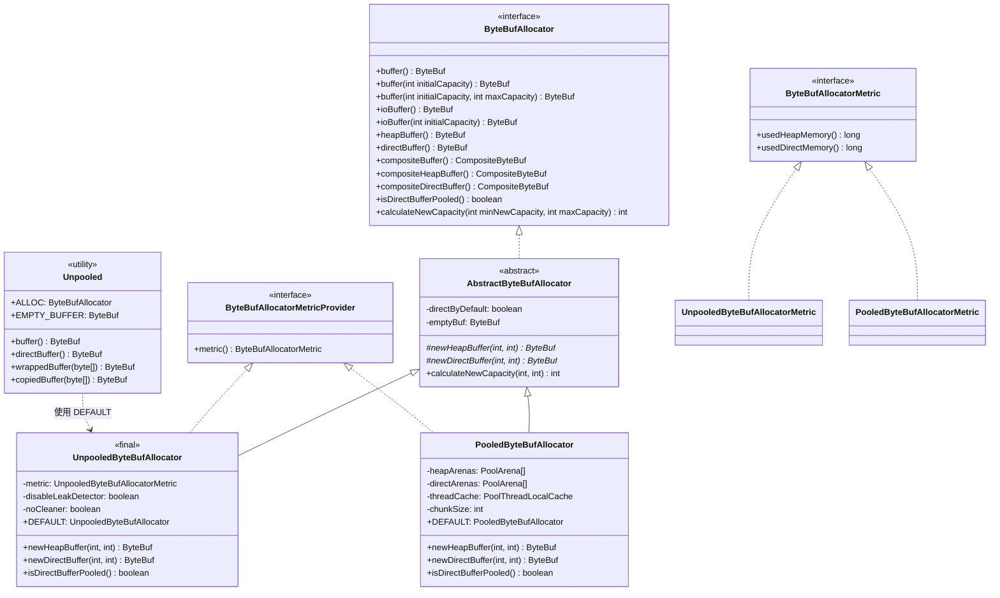
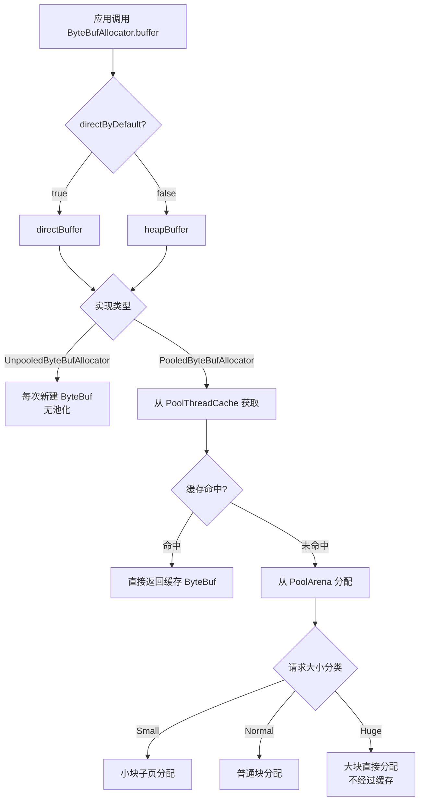
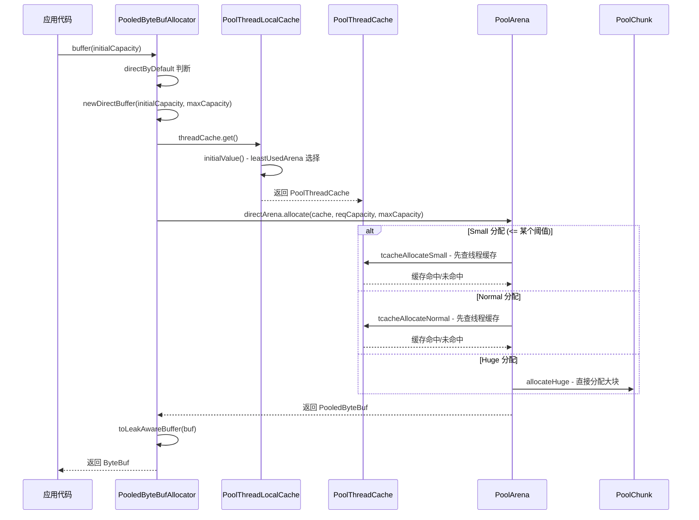
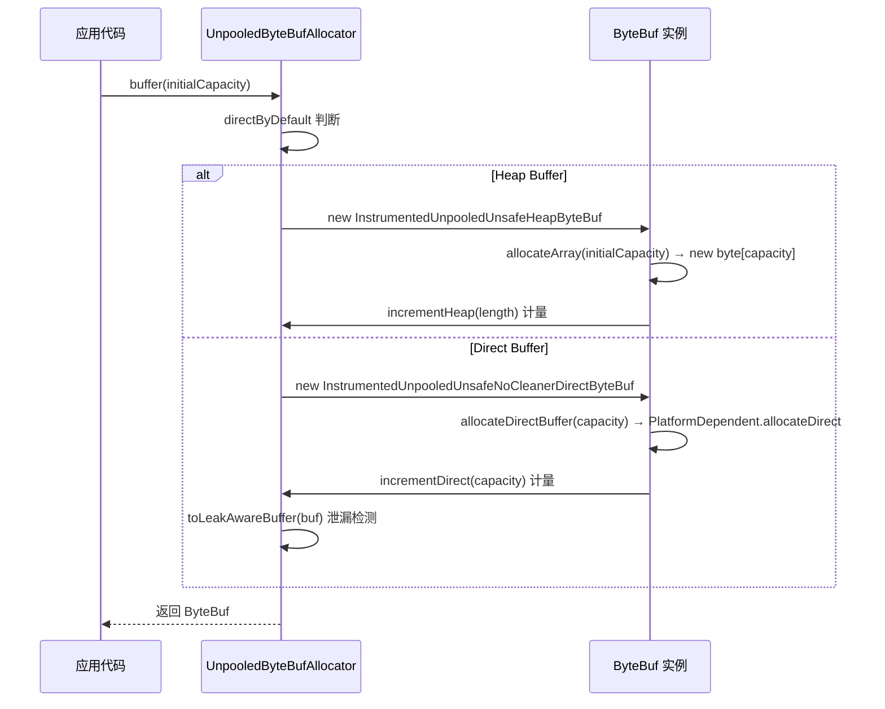

# Buffer 分配器（ByteBufAllocator）深度分析

## 概述

Buffer 分配器是 Netty 内存管理体系的核心入口，负责为上层应用提供 `ByteBuf` 实例的创建能力。它解决了两个关键问题：

1. **内存分配效率**：通过池化（Pooling）机制避免频繁的系统调用和 GC 压力
2. **内存类型抽象**：统一封装堆内存（Heap）和堆外内存（Direct）的分配差异

在 Netty 整体架构中，`ByteBufAllocator` 处于 `Channel → Pipeline → Handler → ByteBuf → ByteBufAllocator` 链路的最底层，是所有 I/O 读写操作的数据载体来源。

## 架构图

### 类继承体系



### 分配器选择策略



## 核心类分析

### 1. ByteBufAllocator 接口

**文件位置**：`buffer/src/main/java/io/netty/buffer/ByteBufAllocator.java`

这是所有分配器的顶层接口，定义了 ByteBuf 分配的完整契约。

#### 方法分类

| 类别 | 方法 | 说明 |
|------|------|------|
| **通用分配** | `buffer()` / `buffer(int)` / `buffer(int, int)` | 由实现决定 heap 或 direct |
| **I/O 优化** | `ioBuffer()` / `ioBuffer(int)` / `ioBuffer(int, int)` | 优先分配 direct buffer，适合零拷贝 I/O |
| **堆内存** | `heapBuffer()` / `heapBuffer(int)` / `heapBuffer(int, int)` | 明确分配堆内存 |
| **堆外内存** | `directBuffer()` / `directBuffer(int)` / `directBuffer(int, int)` | 明确分配堆外内存 |
| **组合缓冲区** | `compositeBuffer()` / `compositeHeapBuffer()` / `compositeDirectBuffer()` | 零拷贝组合多个 buffer |
| **查询** | `isDirectBufferPooled()` | 查询 direct buffer 是否池化 |
| **容量计算** | `calculateNewCapacity(int, int)` | 计算扩容后的新容量 |

#### 关键设计点

```java
// ByteBufAllocator.java 第24行
ByteBufAllocator DEFAULT = ByteBufUtil.DEFAULT_ALLOCATOR;
```

全局默认分配器通过 `ByteBufUtil.DEFAULT_ALLOCATOR` 提供，可在启动前通过系统属性 `io.netty.allocator.type` 配置为 `pooled` 或 `unpooled`。

### 2. AbstractByteBufAllocator 抽象基类

**文件位置**：`buffer/src/main/java/io/netty/buffer/AbstractByteBufAllocator.java`

#### 核心常量

```java
// AbstractByteBufAllocator.java 第31-34行
static final int DEFAULT_INITIAL_CAPACITY = 256;       // 默认初始容量
static final int DEFAULT_MAX_CAPACITY = Integer.MAX_VALUE; // 默认最大容量
static final int DEFAULT_MAX_COMPONENTS = 16;           // CompositeByteBuf 默认最大组件数
static final int CALCULATE_THRESHOLD = 1048576 * 4;     // 4 MiB，容量增长策略的阈值
```

#### directByDefault 决策逻辑

```java
// AbstractByteBufAllocator.java 第80-82行
protected AbstractByteBufAllocator(boolean preferDirect) {
    // 只有当平台能可靠释放 direct buffer 时，才启用 direct 优先
    directByDefault = preferDirect && PlatformDependent.canReliabilyFreeDirectBuffers();
    emptyBuf = new EmptyByteBuf(this);
}
```

这个构造函数揭示了一个重要细节：即使用户请求 `preferDirect=true`，如果平台无法可靠释放堆外内存（例如某些 JVM 不支持 `DirectByteBuffer` 的 cleaner），分配器会回退到堆内存优先。

#### buffer() 方法的路由逻辑

```java
// AbstractByteBufAllocator.java 第86-91行
@Override
public ByteBuf buffer() {
    if (directByDefault) {
        return directBuffer();  // 路由到 direct 分配
    }
    return heapBuffer();        // 路由到 heap 分配
}
```

所有无参和单参数的 `buffer()` 方法都遵循相同的路由模式：检查 `directByDefault` 标志，然后委托给对应的 `directBuffer()` 或 `heapBuffer()` 方法。

#### ioBuffer() 的特殊判断

```java
// AbstractByteBufAllocator.java 第110-115行
@Override
public ByteBuf ioBuffer() {
    // 即使 directByDefault 为 false，只要平台能可靠释放或 direct buffer 已池化
    // 也优先使用 direct buffer（因为 direct buffer 在 I/O 场景下性能更优）
    if (PlatformDependent.canReliabilyFreeDirectBuffers() || isDirectBufferPooled()) {
        return directBuffer(DEFAULT_INITIAL_CAPACITY);
    }
    return heapBuffer(DEFAULT_INITIAL_CAPACITY);
}
```

`ioBuffer()` 比 `buffer()` 更激进地优先 direct buffer，因为 I/O 操作使用 direct buffer 可以避免一次用户态到内核态的内存拷贝。

#### calculateNewCapacity 扩容策略

这是 Netty 最精妙的设计之一，采用分段增长策略避免小 buffer 过度浪费和大 buffer 增长过快：

```java
// AbstractByteBufAllocator.java 第232-259行
@Override
public int calculateNewCapacity(int minNewCapacity, int maxCapacity) {
    checkPositiveOrZero(minNewCapacity, "minNewCapacity");
    if (minNewCapacity > maxCapacity) {
        throw new IllegalArgumentException(...);
    }
    final int threshold = CALCULATE_THRESHOLD; // 4 MiB

    // 策略1：恰好等于阈值，直接返回
    if (minNewCapacity == threshold) {
        return threshold;
    }

    // 策略2：超过阈值，每次增长 4 MiB（线性增长，避免内存暴涨）
    if (minNewCapacity > threshold) {
        int newCapacity = minNewCapacity / threshold * threshold;
        if (newCapacity > maxCapacity - threshold) {
            newCapacity = maxCapacity;
        } else {
            newCapacity += threshold;
        }
        return newCapacity;
    }

    // 策略3：低于阈值，从64开始翻倍增长（指数增长，减少扩容次数）
    final int newCapacity = MathUtil.findNextPositivePowerOfTwo(Math.max(minNewCapacity, 64));
    return Math.min(newCapacity, maxCapacity);
}
```

**增长策略总结**：

| 容量范围 | 增长方式 | 说明 |
|----------|----------|------|
| [0, 64) | 直接跳到 64 | 最小分配单元 |
| [64, 4MiB) | 翻倍增长（2的幂） | 指数增长，减少扩容次数 |
| [4MiB, maxCapacity) | 每次 +4MiB | 线性增长，避免内存浪费 |

#### 泄漏检测集成

```java
// AbstractByteBufAllocator.java 第40-50行
protected static ByteBuf toLeakAwareBuffer(ByteBuf buf) {
    ResourceLeakTracker<ByteBuf> leak = AbstractByteBuf.leakDetector.track(buf);
    if (leak != null) {
        if (AbstractByteBuf.leakDetector.isRecordEnabled()) {
            buf = new AdvancedLeakAwareByteBuf(buf, leak);  // 记录详细分配栈
        } else {
            buf = new SimpleLeakAwareByteBuf(buf, leak);    // 仅追踪引用
        }
    }
    return buf;
}
```

每个子类在创建 ByteBuf 后都会调用 `toLeakAwareBuffer()` 进行泄漏检测包装。这体现了 **装饰器模式** 的应用。

### 3. UnpooledByteBufAllocator 非池化分配器

**文件位置**：`buffer/src/main/java/io/netty/buffer/UnpooledByteBufAllocator.java`

#### 类定义

```java
// UnpooledByteBufAllocator.java 第28行
public final class UnpooledByteBufAllocator extends AbstractByteBufAllocator
        implements ByteBufAllocatorMetricProvider {
```

#### 核心字段

```java
// UnpooledByteBufAllocator.java 第30-32行
private final UnpooledByteBufAllocatorMetric metric = new UnpooledByteBufAllocatorMetric();
private final boolean disableLeakDetector;  // 是否禁用泄漏检测
private final boolean noCleaner;            // 是否使用 NoCleaner 方式分配 direct memory
```

#### newHeapBuffer 实现

```java
// UnpooledByteBufAllocator.java 第82-86行
@Override
protected ByteBuf newHeapBuffer(int initialCapacity, int maxCapacity) {
    return PlatformDependent.hasUnsafe() ?
            new InstrumentedUnpooledUnsafeHeapByteBuf(this, initialCapacity, maxCapacity) :
            new InstrumentedUnpooledHeapByteBuf(this, initialCapacity, maxCapacity);
}
```

有 Unsafe 时使用 `UnsafeHeapByteBuf`（通过 `sun.misc.Unsafe` 直接操作数组内存），否则使用普通的 `HeapByteBuf`（通过数组下标访问）。

#### newDirectBuffer 实现

```java
// UnpooledByteBufAllocator.java 第89-98行
@Override
protected ByteBuf newDirectBuffer(int initialCapacity, int maxCapacity) {
    final ByteBuf buf;
    if (PlatformDependent.hasUnsafe()) {
        buf = noCleaner ?
                new InstrumentedUnpooledUnsafeNoCleanerDirectByteBuf(this, initialCapacity, maxCapacity) :
                new InstrumentedUnpooledUnsafeDirectByteBuf(this, initialCapacity, maxCapacity);
    } else {
        buf = new InstrumentedUnpooledDirectByteBuf(this, initialCapacity, maxCapacity);
    }
    return disableLeakDetector ? buf : toLeakAwareBuffer(buf);
}
```

三种 direct buffer 实现的选择逻辑：

| 条件 | 实现类 | 特点 |
|------|--------|------|
| hasUnsafe + noCleaner | `UnpooledUnsafeNoCleanerDirectByteBuf` | 绕过 Cleaner，使用 `PlatformDependent.allocateDirect()` |
| hasUnsafe | `UnpooledUnsafeDirectByteBuf` | 使用 Unsafe 访问 direct memory |
| 无 Unsafe | `UnpooledDirectByteBuf` | 使用 `ByteBuffer` API |

#### 内存计量（Instrumented 包装）

UnpooledByteBufAllocator 内部定义了多个 `Instrumented*` 内部类，用于追踪内存使用量：

```java
// UnpooledByteBufAllocator.java 第138-156行
private static final class InstrumentedUnpooledUnsafeHeapByteBuf extends UnpooledUnsafeHeapByteBuf {
    @Override
    protected byte[] allocateArray(int initialCapacity) {
        byte[] bytes = super.allocateArray(initialCapacity);
        ((UnpooledByteBufAllocator) alloc()).incrementHeap(bytes.length); // 分配时计数增加
        return bytes;
    }

    @Override
    protected void freeArray(byte[] array) {
        int length = array.length;
        super.freeArray(array);
        ((UnpooledByteBufAllocator) alloc()).decrementHeap(length); // 释放时计数减少
    }
}
```

Direct memory 的计量通过 `DecrementingCleanableDirectBuffer` 实现：

```java
// UnpooledByteBufAllocator.java 第264-301行
private static final class DecrementingCleanableDirectBuffer implements CleanableDirectBuffer {
    private final UnpooledByteBufAllocator alloc;
    private final CleanableDirectBuffer delegate;

    private DecrementingCleanableDirectBuffer(
            ByteBufAllocator alloc, CleanableDirectBuffer delegate, int capacityConsumed) {
        this.alloc = (UnpooledByteBufAllocator) alloc;
        this.alloc.incrementDirect(capacityConsumed); // 构造时增加
        this.delegate = delegate;
    }

    @Override
    public void clean() {
        int capacity = delegate.buffer().capacity();
        delegate.clean();
        alloc.decrementDirect(capacity); // 清理时减少
    }
}
```

#### 单例实例

```java
// UnpooledByteBufAllocator.java 第37-38行
public static final UnpooledByteBufAllocator DEFAULT =
        new UnpooledByteBufAllocator(PlatformDependent.directBufferPreferred());
```

### 4. PooledByteBufAllocator 池化分配器

**文件位置**：`buffer/src/main/java/io/netty/buffer/PooledByteBufAllocator.java`

这是 Netty 内存管理最复杂的类，实现了基于 jemalloc 思想的内存池。

#### 系统属性配置

PooledByteBufAllocator 通过大量系统属性进行调优，以下是关键属性及其默认值：

| 系统属性 | 默认值 | 说明 |
|----------|--------|------|
| `io.netty.allocator.numHeapArenas` | `2 * CPU核心数` | 堆内存 Arena 数量 |
| `io.netty.allocator.numDirectArenas` | `2 * CPU核心数` | 堆外内存 Arena 数量 |
| `io.netty.allocator.pageSize` | `8192` (8KB) | 页大小 |
| `io.netty.allocator.maxOrder` | `9` | 最大阶数，chunkSize = pageSize << 9 = 4MiB |
| `io.netty.allocator.smallCacheSize` | `256` | 小块缓存大小 |
| `io.netty.allocator.normalCacheSize` | `64` | 普通块缓存大小 |
| `io.netty.allocator.maxCachedBufferCapacity` | `32768` (32KB) | 缓存 buffer 的最大容量 |
| `io.netty.allocator.cacheTrimInterval` | `8192` | 缓存清理间隔（分配次数） |
| `io.netty.allocator.useCacheForAllThreads` | `false` | 是否为所有线程启用缓存 |

#### 核心字段

```java
// PooledByteBufAllocator.java 第190-198行
private final PoolArena<byte[]>[] heapArenas;      // 堆内存 Arena 数组
private final PoolArena<ByteBuffer>[] directArenas; // 堆外内存 Arena 数组
private final int smallCacheSize;                    // 小块线程缓存大小
private final int normalCacheSize;                   // 普通块线程缓存大小
private final PoolThreadLocalCache threadCache;      // 线程本地缓存（FastThreadLocal）
private final int chunkSize;                         // chunk 大小 = pageSize << maxOrder
private final PooledByteBufAllocatorMetric metric;   // 指标
```

#### Arena 数量计算

```java
// PooledByteBufAllocator.java 第95-117行
// 默认 Arena 数量 = min(2 * CPU核心数, maxMemory / chunkSize / 2 / 3)
final int defaultMinNumArena = NettyRuntime.availableProcessors() * 2;
final int defaultChunkSize = DEFAULT_PAGE_SIZE << DEFAULT_MAX_ORDER; // 8192 << 9 = 4MiB

DEFAULT_NUM_HEAP_ARENA = Math.max(0,
        SystemPropertyUtil.getInt(
                "io.netty.allocator.numHeapArenas",
                (int) Math.min(
                        defaultMinNumArena,
                        runtime.maxMemory() / defaultChunkSize / 2 / 3)));
```

设计考量：每个 Arena 假设持有 3 个 chunk，总内存消耗不超过最大内存的 50%。Arena 数量与 EventLoop 数量对齐（2 * CPU），减少锁竞争。

#### newDirectBuffer 分配流程

```java
// PooledByteBufAllocator.java 第397-409行
@Override
protected ByteBuf newDirectBuffer(int initialCapacity, int maxCapacity) {
    // 步骤1：获取当前线程的缓存
    PoolThreadCache cache = threadCache.get();
    // 步骤2：从缓存中获取绑定的 direct Arena
    PoolArena<ByteBuffer> directArena = cache.directArena;

    final AbstractByteBuf buf;
    if (directArena != null) {
        // 步骤3a：通过 Arena 分配（优先从线程缓存获取）
        buf = directArena.allocate(cache, initialCapacity, maxCapacity);
    } else {
        // 步骤3b：无 Arena 时降级为非池化分配
        buf = UnsafeByteBufUtil.newDirectByteBuf(this, initialCapacity, maxCapacity);
        onAllocateBuffer(buf, false, false);
    }
    // 步骤4：包装泄漏检测
    return toLeakAwareBuffer(buf);
}
```

#### PoolThreadLocalCache —— 线程本地缓存与 Arena 选择

```java
// PooledByteBufAllocator.java 第516-578行
private final class PoolThreadLocalCache extends FastThreadLocal<PoolThreadCache> {
    private final boolean useCacheForAllThreads;

    @Override
    protected synchronized PoolThreadCache initialValue() {
        // 关键：选择负载最低的 Arena（轮转均衡）
        final PoolArena<byte[]> heapArena = leastUsedArena(heapArenas);
        final PoolArena<ByteBuffer> directArena = leastUsedArena(directArenas);

        final Thread current = Thread.currentThread();
        final EventExecutor executor = ThreadExecutorMap.currentExecutor();

        if (useCacheForAllThreads ||
                FastThreadLocalThread.currentThreadHasFastThreadLocal() ||
                executor != null) {
            // 为高并发线程创建带缓存的 PoolThreadCache
            return new PoolThreadCache(
                    heapArena, directArena, smallCacheSize, normalCacheSize,
                    DEFAULT_MAX_CACHED_BUFFER_CAPACITY, DEFAULT_CACHE_TRIM_INTERVAL, ...);
        }
        // 普通线程不使用缓存（cache size = 0）
        return new PoolThreadCache(heapArena, directArena, 0, 0, 0, 0, false);
    }

    private <T> PoolArena<T> leastUsedArena(PoolArena<T>[] arenas) {
        if (arenas == null || arenas.length == 0) {
            return null;
        }
        PoolArena<T> minArena = arenas[0];
        // 优化：如果第一个 Arena 未被使用，直接返回（减少循环比较）
        if (minArena.numThreadCaches.get() == CACHE_NOT_USED) {
            return minArena;
        }
        // 选择绑定线程数最少的 Arena
        for (int i = 1; i < arenas.length; i++) {
            PoolArena<T> arena = arenas[i];
            if (arena.numThreadCaches.get() < minArena.numThreadCaches.get()) {
                minArena = arena;
            }
        }
        return minArena;
    }
}
```

**Arena 选择策略详解**：

1. 每个线程首次分配时，通过 `FastThreadLocal` 创建 `PoolThreadCache`
2. `PoolThreadCache` 绑定一个 heapArena 和一个 directArena
3. Arena 的选择采用 **最少使用优先（Least-Used）** 策略，基于 `numThreadCaches` 原子计数器
4. 非 `FastThreadLocalThread` 且非 `EventExecutor` 线程默认不使用缓存（除非 `useCacheForAllThreads=true`）

#### PoolArena 分配三级跳

```java
// PoolArena.java 第135-148行
private void allocate(PoolThreadCache cache, PooledByteBuf<T> buf, final int reqCapacity) {
    final int sizeIdx = sizeClass.size2SizeIdx(reqCapacity);

    if (sizeIdx <= sizeClass.smallMaxSizeIdx) {
        tcacheAllocateSmall(cache, buf, reqCapacity, sizeIdx);   // 小块：从线程缓存或子页分配
    } else if (sizeIdx < sizeClass.nSizes) {
        tcacheAllocateNormal(cache, buf, reqCapacity, sizeIdx);  // 普通：从线程缓存或 chunk 分配
    } else {
        int normCapacity = sizeClass.directMemoryCacheAlignment > 0
                ? sizeClass.normalizeSize(reqCapacity) : reqCapacity;
        allocateHuge(buf, normCapacity);                          // 大块：直接分配，不经过缓存
    }
}
```

### 5. Unpooled 工厂类

**文件位置**：`buffer/src/main/java/io/netty/buffer/Unpooled.java`

`Unpooled` 是一个纯静态工具类，内部使用 `UnpooledByteBufAllocator.DEFAULT` 作为分配器。

#### 静态工厂方法汇总

| 方法族 | 方法 | 说明 |
|--------|------|------|
| **buffer** | `buffer()` / `buffer(int)` / `buffer(int, int)` | 创建堆内存 buffer |
| **directBuffer** | `directBuffer()` / `directBuffer(int)` / `directBuffer(int, int)` | 创建堆外内存 buffer |
| **wrappedBuffer** | `wrappedBuffer(byte[])` | 包装已有数组（零拷贝，共享数据） |
| | `wrappedBuffer(byte[], int, int)` | 包装数组的子区域 |
| | `wrappedBuffer(ByteBuffer)` | 包装 NIO ByteBuffer |
| | `wrappedBuffer(long, int, boolean)` | 包装内存地址 |
| | `wrappedBuffer(ByteBuf)` | 包装已有 ByteBuf 的可读区域 |
| | `wrappedBuffer(byte[]...)` | 包装多个数组为 CompositeByteBuf |
| | `wrappedBuffer(ByteBuf...)` | 包装多个 ByteBuf 为 CompositeByteBuf |
| | `wrappedBuffer(ByteBuffer...)` | 包装多个 NIO ByteBuffer 为 CompositeByteBuf |
| **copiedBuffer** | `copiedBuffer(byte[])` | 深拷贝数组 |
| | `copiedBuffer(byte[], int, int)` | 深拷贝数组子区域 |
| | `copiedBuffer(ByteBuffer)` | 深拷贝 NIO ByteBuffer |
| | `copiedBuffer(ByteBuf)` | 深拷贝 ByteBuf |
| | `copiedBuffer(byte[]...)` | 合并并深拷贝多个数组 |
| | `copiedBuffer(ByteBuf...)` | 合并并深拷贝多个 ByteBuf |
| | `copiedBuffer(ByteBuffer...)` | 合并并深拷贝多个 ByteBuffer |
| | `copiedBuffer(CharSequence, Charset)` | 字符串编码后拷贝 |
| **copyXxx** | `copyInt()` / `copyShort()` / `copyMedium()` / `copyLong()` / `copyBoolean()` / `copyFloat()` / `copyDouble()` | 创建包含基本类型值的 buffer |
| **工具** | `unreleasableBuffer(ByteBuf)` | 包装为不可释放的 buffer |
| | `wrappedUnmodifiableBuffer(ByteBuf...)` | 包装为不可修改的 CompositeByteBuf |
| | `compositeBuffer()` | 创建空的 CompositeByteBuf |

#### wrappedBuffer 与 copiedBuffer 的本质区别

```java
// Unpooled.java 第156-161行 —— wrappedBuffer：零拷贝，共享底层数组
public static ByteBuf wrappedBuffer(byte[] array) {
    if (array.length == 0) {
        return EMPTY_BUFFER;
    }
    return new UnpooledHeapByteBuf(ALLOC, array, array.length); // 直接引用原数组
}

// Unpooled.java 第362-367行 —— copiedBuffer：深拷贝，数据独立
public static ByteBuf copiedBuffer(byte[] array) {
    if (array.length == 0) {
        return EMPTY_BUFFER;
    }
    return wrappedBuffer(array.clone()); // 先 clone 再包装
}
```

#### wrappedBuffer(ByteBuffer) 的类型分支

```java
// Unpooled.java 第185-211行
public static ByteBuf wrappedBuffer(ByteBuffer buffer) {
    if (!buffer.hasRemaining()) {
        return EMPTY_BUFFER;
    }
    if (!buffer.isDirect() && buffer.hasArray()) {
        // 堆 ByteBuffer 且有 backing array → 直接包装数组
        return wrappedBuffer(
                buffer.array(),
                buffer.arrayOffset() + buffer.position(),
                buffer.remaining()).order(buffer.order());
    } else if (PlatformDependent.hasUnsafe()) {
        if (buffer.isReadOnly()) {
            return buffer.isDirect() ?
                    new ReadOnlyUnsafeDirectByteBuf(ALLOC, buffer) :
                    new ReadOnlyByteBufferBuf(ALLOC, buffer);
        } else {
            return new UnpooledUnsafeDirectByteBuf(ALLOC, buffer, buffer.remaining());
        }
    } else {
        // 无 Unsafe 时的回退路径
        return buffer.isReadOnly() ?
                new ReadOnlyByteBufferBuf(ALLOC, buffer) :
                new UnpooledDirectByteBuf(ALLOC, buffer, buffer.remaining());
    }
}
```

#### EMPTY_BUFFER 的设计

```java
// Unpooled.java 第90-91行
public static final ByteBuf EMPTY_BUFFER = ALLOC.buffer(0, 0);

// 静态块验证确保 EMPTY_BUFFER 是 EmptyByteBuf 实例
static {
    assert EMPTY_BUFFER instanceof EmptyByteBuf: "EMPTY_BUFFER must be an EmptyByteBuf.";
}
```

`EmptyByteBuf` 是一个特殊的 ByteBuf 实例，容量为 0，所有读写操作都会抛出异常。它避免了返回 `null` 导致的空指针问题。

### 6. ByteBufAllocatorMetric 接口

**文件位置**：`buffer/src/main/java/io/netty/buffer/ByteBufAllocatorMetric.java`

```java
public interface ByteBufAllocatorMetric {
    long usedHeapMemory();   // 已使用的堆内存字节数
    long usedDirectMemory(); // 已使用的堆外内存字节数
}
```

UnpooledByteBufAllocator 的计量实现：

```java
// UnpooledByteBufAllocator.java 第303-322行
private static final class UnpooledByteBufAllocatorMetric implements ByteBufAllocatorMetric {
    final LongAdder directCounter = new LongAdder(); // 使用 LongAdder 保证并发安全
    final LongAdder heapCounter = new LongAdder();

    @Override
    public long usedHeapMemory() {
        return heapCounter.sum();
    }

    @Override
    public long usedDirectMemory() {
        return directCounter.sum();
    }
}
```

## 设计思想

### 1. 策略模式（Strategy Pattern）

`ByteBufAllocator` 接口定义了分配策略的抽象，`UnpooledByteBufAllocator` 和 `PooledByteBufAllocator` 是两种具体策略。上层代码只需依赖接口，无需关心具体实现。

### 2. 模板方法模式（Template Method Pattern）

`AbstractByteBufAllocator` 定义了分配流程的骨架（参数校验、路由决策、泄漏检测），将实际的 buffer 创建延迟到子类的 `newHeapBuffer()` / `newDirectBuffer()` 抽象方法。

### 3. 工厂方法模式（Factory Method Pattern）

`Unpooled` 类提供了大量静态工厂方法，封装了 ByteBuf 的创建细节，简化了用户 API。

### 4. 装饰器模式（Decorator Pattern）

泄漏检测通过 `SimpleLeakAwareByteBuf` / `AdvancedLeakAwareByteBuf` 装饰原始 ByteBuf 实现，不侵入原有逻辑。

### 5. Thread-Local Storage 模式

`PooledByteBufAllocator` 使用 `FastThreadLocal` 为每个线程维护独立的 `PoolThreadCache`，避免线程间的锁竞争。

### 6. jemalloc 分级分配思想

PoolArena 的 Small/Normal/Huge 三级分类，以及 ChunkList 的使用率分级（qInit/q000/q025/q050/q075/q100），直接借鉴了 jemalloc 的设计理念。

## 与其他模块的交互

### 与 Channel/Pipeline 的交互

```
Channel.read() → ByteBufAllocator.buffer() → ByteBuf → Pipeline.fireChannelRead(ByteBuf)
Channel.write() → ByteBuf → ChannelOutboundBuffer → ByteBufAllocator.directBuffer()（I/O 时）
```

每个 `Channel` 的 `ChannelConfig` 中持有一个 `ByteBufAllocator` 引用，默认使用 `ByteBufAllocator.DEFAULT`。

### 与 Recycler 的交互

`PooledByteBuf` 对象本身也使用 `Recycler` 进行对象池化，实现"内存池 + 对象池"的双重池化。

### 与 ResourceLeakDetector 的交互

分配器通过 `toLeakAwareBuffer()` 方法集成泄漏检测，当 ByteBuf 未被正确 `release()` 时，`ResourceLeakDetector` 会报告泄漏栈信息。

### 与 EventLoop 的交互

`PooledByteBufAllocator` 的 `PoolThreadLocalCache` 检查当前线程是否为 `EventExecutor`，EventLoop 线程默认启用线程缓存以获得最佳性能。

## 关键流程

### PooledByteBufAllocator 分配时序图



### UnpooledByteBufAllocator 分配流程



## 学习要点

### 需要重点理解的关键点

1. **容量增长策略的分段设计**：小容量翻倍（减少扩容次数）vs 大容量线性增长（避免内存浪费），阈值为 4MiB
2. **Arena 选择的负载均衡**：基于 `numThreadCaches` 原子计数器的最少使用优先策略
3. **线程缓存的分级启用**：只有 `FastThreadLocalThread` 和 `EventExecutor` 线程默认启用缓存
4. **wrappedBuffer vs copiedBuffer**：零拷贝共享 vs 深拷贝隔离，选择依据是数据是否需要独立
5. **ioBuffer 的特殊语义**：比 `buffer()` 更激进地优先 direct buffer，用于 I/O 场景
6. **泄漏检测的装饰器集成**：透明地为 ByteBuf 添加泄漏追踪能力

### 常见面试问题

**Q1：Netty 的 ByteBufAllocator 有哪些实现？区别是什么？**

A：两个主要实现：`UnpooledByteBufAllocator`（每次分配都创建新的 ByteBuf，无池化，适合低频分配场景）和 `PooledByteBufAllocator`（基于 jemalloc 思想的内存池，通过 Arena + ThreadLocal Cache 实现高效的并发分配，适合高吞吐场景）。

**Q2：PooledByteBufAllocator 如何减少线程竞争？**

A：采用三层设计：(1) 多个 Arena（默认 2*CPU 核心数），线程通过最少使用优先策略分散到不同 Arena；(2) 每个线程持有 `PoolThreadCache`（通过 `FastThreadLocal`），小块和普通块优先从线程缓存分配；(3) Arena 内部使用 `ReentrantLock` 保护共享状态。

**Q3：calculateNewCapacity 的增长策略是什么？为什么这样设计？**

A：三段式增长 —— 容量 < 64 时直接设为 64；64 ~ 4MiB 时翻倍增长（2的幂）；超过 4MiB 后每次增加 4MiB。这样设计的原因是：小容量时翻倍减少扩容次数（摊还 O(1)），大容量时线性增长避免内存浪费（例如从 8MiB 翻倍到 16MiB 可能远超实际需求）。

**Q4：`Unpooled.buffer()` 和 `Unpooled.wrappedBuffer()` 有什么区别？**

A：`buffer()` 分配新的内存并创建 ByteBuf；`wrappedBuffer()` 包装已有数据（数组/ByteBuffer/ByteBuf），不分配新内存，与原数据共享底层存储。如果需要数据独立，应使用 `copiedBuffer()` 进行深拷贝。

**Q5：`ioBuffer()` 和 `buffer()` 的区别是什么？**

A：`buffer()` 根据 `directByDefault` 标志决定分配类型；`ioBuffer()` 更激进地优先 direct buffer —— 即使 `directByDefault` 为 false，只要平台能可靠释放 direct 内存或 direct buffer 已池化，就分配 direct buffer。这是因为 direct buffer 在 I/O 操作中可以避免一次用户态到内核态的内存拷贝（零拷贝）。

**Q6：PooledByteBufAllocator 中 Arena 数量如何确定？为什么是 2 * CPU 核心数？**

A：默认为 `min(2 * CPU核心数, maxMemory / chunkSize / 2 / 3)`。数量与 EventLoop 线程数对齐（Netty 默认也使用 2 * CPU 个 EventLoop），这样每个 EventLoop 线程可以相对均匀地绑定到不同 Arena，减少同一 Arena 上的并发竞争。
