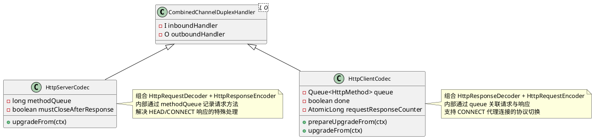

# HTTP/1.1 编解码

## 概述

### HTTP 编解码解决什么问题

HTTP/1.1 是应用最广泛的文本协议之一，其编解码面临以下核心挑战：

| 挑战 | 具体问题 | Netty 的解决方案 |
|------|---------|-----------------|
| 流式解析 | HTTP 报文可能分多次到达，需增量解析 | 基于 `ByteToMessageDecoder` 的有限状态机 |
| 多种传输模式 | Content-Length、Chunked、无长度三种模式 | 状态机中的 `READ_FIXED_LENGTH_CONTENT`、`READ_CHUNK_SIZE`、`READ_VARIABLE_LENGTH_CONTENT` 三条分支 |
| 内存安全 | 超大报文可能撑爆内存 | `maxInitialLineLength`、`maxHeaderSize`、`maxChunkSize` 三级保护 |
| 消息聚合 | Chunked 消息需拆分/聚合两种使用场景 | `HttpObjectAggregator` 将分片聚合为 `FullHttpMessage` |
| 协议升级 | HTTP 可升级为 WebSocket 等协议 | 状态机中的 `UPGRADED` 状态 |
| 压缩传输 | gzip/deflate/br/zstd/snappy 多种压缩 | `HttpContentCompressor` / `HttpContentDecompressor` |

### 在 Netty 整体架构中的位置

HTTP 编解码器位于 Pipeline 的前端，是字节流与业务对象之间的桥梁：

```
网络字节流 (ByteBuf)
    |
    v
HttpObjectDecoder —— 状态机解析，输出 HttpMessage + HttpContent
    |
    v
HttpObjectAggregator —— 可选，聚合为 FullHttpMessage
    |
    v
业务 Handler —— 处理完整的 HTTP 请求/响应
    |
    v
HttpObjectEncoder —— 将 HttpMessage/HttpContent 编码回字节流
    |
    v
网络字节流 (ByteBuf)
```

---

## 架构图

### HTTP 编解码器类继承体系

```plantuml
@startuml
skinparam classAttributeIconSize 0
skinparam classFontSize 12

abstract class ByteToMessageDecoder {
  + {abstract} decode(ctx, buffer, out)
}

abstract class HttpObjectDecoder {
  - State currentState
  - HttpMessage message
  - long contentLength
  - boolean chunked
  + decode(ctx, buffer, out)
  # {abstract} isDecodingRequest(): boolean
  # {abstract} createMessage(initialLine): HttpMessage
  # {abstract} createInvalidMessage(): HttpMessage
}

class HttpRequestDecoder {
  + isDecodingRequest(): true
  + createMessage(): DefaultHttpRequest
  + splitHeaderName(): AsciiString (优化)
  + splitFirstWordInitialLine(): String (优化)
}

class HttpResponseDecoder {
  + isDecodingRequest(): false
  + createMessage(): DefaultHttpResponse
}

abstract class MessageToMessageEncoder {
  + {abstract} encode(ctx, msg, out)
}

abstract class HttpObjectEncoder<H> {
  - int state
  - float headersEncodedSizeAccumulator
  + encode(ctx, msg, out)
  # {abstract} encodeInitialLine(buf, message)
  # sanitizeHeadersBeforeEncode(msg, isAlwaysEmpty)
  # isContentAlwaysEmpty(msg): boolean
}

class HttpResponseEncoder {
  + encodeInitialLine(): "HTTP/1.1 200 OK"
  + isContentAlwaysEmpty(): 1xx/204/304
  + sanitizeHeadersBeforeEncode()
}

class HttpRequestEncoder {
  + encodeInitialLine(): "GET / HTTP/1.1"
}

HttpObjectDecoder <|-- HttpRequestDecoder
HttpObjectDecoder <|-- HttpResponseDecoder
HttpObjectEncoder <|-- HttpResponseEncoder
HttpObjectEncoder <|-- HttpRequestEncoder
@enduml
```

### 组合编解码器（CombinedChannelDuplexHandler）



---

## 核心类分析

### HttpObjectDecoder —— HTTP 解码的状态机核心

`HttpObjectDecoder` 是所有 HTTP 解码器的抽象基类，继承自 `ByteToMessageDecoder`。它实现了一个完整的有限状态机，将原始字节流逐步解析为结构化的 `HttpMessage` 和 `HttpContent` 对象。

#### 状态定义

```java
private enum State {
    SKIP_INITIAL_LINE_CHARS,  // 跳过初始行前的控制字符（如空行）
    SKIP_CONTROL_CHARS,       // 跳过无内容消息后的控制字符
    READ_INITIAL,             // 读取请求行/状态行
    READ_HEADER,              // 读取 Header 区域
    READ_VARIABLE_LENGTH_CONTENT, // 无 Content-Length，读到连接关闭
    READ_FIXED_LENGTH_CONTENT,    // 有 Content-Length，按长度读取
    READ_CHUNK_SIZE,              // Chunked: 读取 chunk 大小
    READ_CHUNKED_CONTENT,         // Chunked: 读取 chunk 数据
    READ_CHUNK_DELIMITER,         // Chunked: 读取 chunk 尾部 CRLF
    READ_CHUNK_FOOTER,            // Chunked: 读取 trailer headers
    BAD_MESSAGE,                  // 错误状态，丢弃所有后续数据
    UPGRADED                      // 协议升级，透传所有后续数据
}
```

#### 状态机完整流程

```
                    ┌──────────────────────┐
                    │ SKIP_INITIAL_LINE_CHARS│ ← 初始状态
                    │  (跳过前导控制字符)     │
                    └──────────┬───────────┘
                               │ 找到非控制字符
                               v
                    ┌──────────────────────┐
                    │     READ_INITIAL      │ ← 解析请求行/状态行
                    │  "GET / HTTP/1.1"     │   或 "HTTP/1.1 200 OK"
                    └──────────┬───────────┘
                               │ createMessage()
                               v
                    ┌──────────────────────┐
                    │     READ_HEADER       │ ← 逐行解析 Headers
                    │  readHeaders(buffer)  │   支持多行折叠
                    └──────────┬───────────┘
                               │ 根据 Headers 决定下一状态
                               │
          ┌────────────────────┼────────────────────┐
          │                    │                    │
          v                    v                    v
  ┌──────────────┐   ┌──────────────┐   ┌──────────────┐
  │ SKIP_CONTROL  │   │ READ_CHUNK   │   │ READ_FIXED   │
  │ _CHARS        │   │ _SIZE        │   │ _LENGTH      │
  │ (无内容)      │   │ (Chunked)    │   │ (有长度)     │
  │ → 输出 Last   │   │              │   │              │
  └──────────────┘   └──────┬───────┘   └──────┬───────┘
                            │                   │
                            v                   v
                   ┌──────────────┐     ┌──────────────┐
                   │ READ_CHUNKED │     │ READ_VARIABLE│
                   │ _CONTENT     │     │ _LENGTH      │
                   │ → HttpContent│     │ → HttpContent│
                   └──────┬───────┘     │ (连接关闭结束)│
                          │             └──────────────┘
                          v
                   ┌──────────────┐
                   │ READ_CHUNK   │
                   │ _DELIMITER   │
                   │ (跳过 CRLF)  │
                   └──────┬───────┘
                          │
                          v
                   ┌──────────────┐
                   │ READ_CHUNK   │
                   │ _SIZE        │ ← 循环读取下一个 chunk
                   │ chunkSize==0 │
                   │ → FOOTER     │
                   └──────┬───────┘
                          │ chunkSize == 0
                          v
                   ┌──────────────┐
                   │ READ_CHUNK   │
                   │ _FOOTER      │
                   │ → LastHttp   │
                   │   Content    │
                   └──────────────┘
```

#### readHeaders() —— Header 解析与内容长度判定

`readHeaders()` 方法是状态机的核心枢纽，它不仅解析所有 HTTP Headers，还根据解析结果决定下一状态：

```java
private State readHeaders(ByteBuf buffer) {
    // 1. 逐行解析 headers（支持多行折叠）
    ByteBuf line = headerParser.parse(buffer, defaultStrictCRLFCheck);
    while (lineLength > 0) {
        // 以空格/Tab 开头 → 多行折叠（拼接到上一个 header 值）
        // 否则 → 新的 header（splitHeader 解析 name:value）
        line = headerParser.parse(buffer, defaultStrictCRLFCheck);
    }

    // 2. 处理 Content-Length（处理重复值、规范化）
    contentLength = HttpUtil.normalizeAndGetContentLength(contentLengthFields, ...);

    // 3. 判断下一状态
    if (isContentAlwaysEmpty(message)) {
        return State.SKIP_CONTROL_CHARS;      // 1xx/204/304 无内容
    }
    if (HttpUtil.isTransferEncodingChunked(message)) {
        return State.READ_CHUNK_SIZE;         // Chunked 传输
    }
    if (contentLength >= 0) {
        return State.READ_FIXED_LENGTH_CONTENT; // 定长传输
    }
    return State.READ_VARIABLE_LENGTH_CONTENT;  // 不定长（读到连接关闭）
}
```

#### Chunked 传输的完整循环

Chunked 传输编码的状态机子循环：

```
READ_CHUNK_SIZE → 解析十六进制长度（如 "1a\r\n"）
    │ chunkSize > 0
    v
READ_CHUNKED_CONTENT → 按 chunkSize 读取数据，输出 HttpContent
    │ 读完一个 chunk
    v
READ_CHUNK_DELIMITER → 跳过 chunk 后的 CRLF
    │ 回到 READ_CHUNK_SIZE
    v
READ_CHUNK_SIZE → chunkSize == 0
    │
    v
READ_CHUNK_FOOTER → 读取 trailer headers（如 Content-MD5）
    │ 输出 LastHttpContent（含 trailer）
    v
resetNow() → 回到 SKIP_INITIAL_LINE_CHARS
```

#### 防御性参数

| 参数 | 默认值 | 保护目标 |
|------|-------|---------|
| `maxInitialLineLength` | 4096 | 请求行/状态行长度，防止超长 URL 攻击 |
| `maxHeaderSize` | 8192 | 所有 Header 总长度，防止 Header 溢出攻击 |
| `maxChunkSize` | 8192 | 单个 HttpContent 的最大大小 |

超过限制时分别抛出 `TooLongHttpLineException`、`TooLongHttpHeaderException`、`TooLongFrameException`。

---

### HttpRequestDecoder —— 请求解码器的性能优化

`HttpRequestDecoder` 继承 `HttpObjectDecoder`，实现了请求侧的解码。除了基础功能外，它包含了大量针对高频 Header 名和 HTTP 方法的**字节级整数比较优化**。

#### 字节级整数比较优化

```java
// 将常见 HTTP 方法的字节序列预计算为整数/长整数
private static final int GET_AS_INT = 'G' | 'E' << 8 | 'T' << 16;
private static final int POST_AS_INT = 'P' | 'O' << 8 | 'S' << 16 | 'T' << 24;
private static final long HTTP_1_1_AS_LONG = 'H' | 'T' << 8 | ... | (long) '1' << 56;
```

这种优化将字符串比较转化为整数比较，单次比较即可完成整个单词的匹配，避免了逐字节比较的开销。在高并发 HTTP 服务中，请求行和 Header 的解析频率极高，此优化效果显著。

覆盖的关键方法：
- `splitFirstWordInitialLine()` —— 识别 GET/POST 方法
- `splitThirdWordInitialLine()` —— 识别 HTTP/1.0 和 HTTP/1.1
- `splitHeaderName()` —— 识别 Host、Connection、Content-Type、Content-Length、Accept

---

### HttpObjectEncoder —— HTTP 编码的状态机

`HttpObjectEncoder` 是所有 HTTP 编码器的抽象基类，继承自 `MessageToMessageEncoder`。它维护一个编码状态机，处理 `HttpMessage`、`HttpContent`、`LastHttpContent` 的有序编码。

#### 编码状态

```java
private static final int ST_INIT = 0;              // 初始状态，等待 HttpMessage
private static final int ST_CONTENT_NON_CHUNK = 1; // 非 Chunked 内容编码
private static final int ST_CONTENT_CHUNK = 2;     // Chunked 内容编码
private static final int ST_CONTENT_ALWAYS_EMPTY = 3; // 无内容（HEAD 响应等）
```

#### 编码流程

```
ST_INIT → 收到 HttpMessage
    │ encodeInitialLine() — 编码请求行/状态行
    │ encodeHeaders()     — 编码所有 Headers
    │ 写入 CRLF
    │ 判断 isContentAlwaysEmpty → ST_CONTENT_ALWAYS_EMPTY
    │ 判断 isTransferEncodingChunked → ST_CONTENT_CHUNK
    │ 否则 → ST_CONTENT_NON_CHUNK
    v
ST_CONTENT_NON_CHUNK → 收到 HttpContent
    │ 直接输出 content ByteBuf
    │ 收到 LastHttpContent → 回到 ST_INIT
    v
ST_CONTENT_CHUNK → 收到 HttpContent
    │ 输出: 十六进制长度 + CRLF + content + CRLF
    │ 收到 LastHttpContent:
    │   有 trailer → "0\r\n" + trailers + "\r\n"
    │   无 trailer → "0\r\n\r\n"
    │   → 回到 ST_INIT
```

#### 缓冲区分配优化

编码器使用指数移动平均（EMA）来预估 Header 和 Trailer 的编码大小：

```java
private float headersEncodedSizeAccumulator = 256;
// 更新公式：
headersEncodedSizeAccumulator = HEADERS_WEIGHT_NEW * padSizeForAccumulation(buf.readableBytes())
                              + HEADERS_WEIGHT_HISTORICAL * headersEncodedSizeAccumulator;
```

这避免了频繁的 buffer 扩容，特别在高吞吐场景下减少了内存分配开销。

---

### HttpResponseEncoder —— 响应编码的特殊处理

`HttpResponseEncoder` 继承 `HttpObjectEncoder<HttpResponse>`，处理响应侧的编码特殊性。

#### 空内容判断

```java
protected boolean isContentAlwaysEmpty(HttpResponse msg) {
    // 1xx 信息响应无内容
    // 特例：101 Switching Protocols 在 WebSocket 场景下可能有内容
    if (statusClass == HttpStatusClass.INFORMATIONAL) {
        return !(code == 101 && !res.headers().contains(SEC_WEBSOCKET_ACCEPT)
                 && res.headers().contains(UPGRADE, WEBSOCKET, true));
    }
    // 204 No Content、304 Not Modified 无内容
    return code == 204 || code == 304;
}
```

#### Header 清理

在编码前，`sanitizeHeadersBeforeEncode()` 会根据状态码清理不合法的 Header：

- **1xx / 204**：移除 `Content-Length` 和 `Transfer-Encoding`
- **205 Reset Content**：移除 `Transfer-Encoding`，设置 `Content-Length: 0`

---

### HttpServerCodec / HttpClientCodec —— 组合编解码器

#### HttpServerCodec

`HttpServerCodec` 继承 `CombinedChannelDuplexHandler<HttpRequestDecoder, HttpResponseEncoder>`，将请求解码和响应编码组合在一个 Handler 中。

**方法队列机制**：服务器需要根据请求方法决定响应行为（HEAD 响应无内容，CONNECT 响应需特殊处理）。`HttpServerCodec` 使用一个**位压缩的内联队列**来跟踪请求方法：

```java
private long methodQueue;  // 64 位，每 2 位存储一个方法标记
// METHOD_FLAG_HEAD = 1, METHOD_FLAG_CONNECT = 2, METHOD_FLAG_OTHER = 3
// 最多可内联存储 32 个请求的方法标记
// 超过 32 个后溢出到 ArrayDeque<Byte>
```

当编码响应时，从队列中 poll 出对应的请求方法，从而正确处理 HEAD 响应的空内容和 CONNECT 响应的 Header 清理。

#### HttpClientCodec

`HttpClientCodec` 继承 `CombinedChannelDuplexHandler<HttpResponseDecoder, HttpRequestEncoder>`，组合了响应解码和请求编码。

**请求-响应关联**：客户端需要将响应与之前的请求关联起来。`HttpClientCodec` 使用 `Queue<HttpMethod>` 来追踪未完成的请求。当收到响应时，从队列中 poll 出对应的请求方法，从而正确处理：

- **HEAD 响应**：标记为内容始终为空
- **CONNECT 200 响应**：设置 `done = true`，停止 HTTP 解码，进入透传模式
- **连接关闭检测**：通过 `requestResponseCounter` 计数器检测是否有未收到响应的请求，若有则抛出 `PrematureChannelClosureException`

---

### HttpContentCompressor / HttpContentDecompressor —— 内容压缩

#### HttpContentCompressor

`HttpContentCompressor` 继承 `HttpContentEncoder`，根据客户端的 `Accept-Encoding` 头自动选择压缩算法。

**支持的压缩算法**（按优先级排序）：

| 算法 | Accept-Encoding 值 | 依赖 |
|------|-------------------|------|
| Brotli | `br` | 需要 Brotli 库在类路径 |
| Zstd | `zstd` | 需要 Zstd 库在类路径 |
| Snappy | `snappy` | 内置 |
| Gzip | `gzip` | 内置 |
| Deflate | `deflate` | 内置 |

**编码协商逻辑**（`determineEncoding()`）：

1. 解析 `Accept-Encoding` 中每个编码的 q 值（质量因子）
2. 按 q 值从高到低尝试匹配已配置的压缩器
3. 支持 `*` 通配符（匹配任意未明确指定的编码）
4. 若无匹配，返回 null（不压缩）

**内容大小阈值**：`contentSizeThreshold` 参数可设置一个最小压缩阈值，小于该值的响应体不压缩，避免小报文的压缩开销超过收益。

#### HttpContentDecompressor

`HttpContentDecompressor` 继承 `HttpContentDecoder`，根据响应的 `Content-Encoding` 头自动解压。支持 gzip、deflate、br、snappy、zstd 五种编码。

内部使用 `EmbeddedChannel` 创建独立的编解码管道，将压缩数据解压后替换原始 `HttpContent`。

---

### HttpObjectAggregator —— 消息聚合

`HttpObjectAggregator` 继承 `MessageAggregator`，将 `HttpMessage` + N 个 `HttpContent` + `LastHttpContent` 聚合为单个 `FullHttpMessage`。

#### 聚合流程

```
HttpMessage → beginAggregation()，创建 AggregatedFullHttpRequest/Response
HttpContent → aggregate()，追加 content 到 ByteBuf
LastHttpContent → aggregate() + finishAggregation()
    → 设置 trailingHeaders
    → 自动设置 Content-Length（如果未设置）
    → 输出 FullHttpMessage
```

#### 100-Continue 处理

当请求包含 `Expect: 100-continue` 时，聚合器会在开始聚合前检查 `Content-Length`：

- **Content-Length <= maxContentLength**：自动发送 `100 Continue` 响应
- **Content-Length > maxContentLength**：发送 `413 Request Entity Too Large`，可选关闭连接
- **不支持的 Expect 值**：发送 `417 Expectation Failed`

---

## 设计思想

### 1. 有限状态机驱动的增量解析

HTTP 协议的解析本质上是一个文本流的增量解析问题。Netty 使用显式的状态枚举 + switch-case 驱动，而非隐式的 if-else 链，优势在于：

- **状态可见性**：每个状态都有明确的语义，便于调试和理解
- **增量处理**：每次 `decode()` 调用都可能只处理部分数据，状态在方法返回后被保留
- **错误隔离**：`BAD_MESSAGE` 状态会持续丢弃数据直到连接关闭，防止错误扩散

### 2. 组合优于继承

`HttpServerCodec` 和 `HttpClientCodec` 使用 `CombinedChannelDuplexHandler` 而非继承来组合编解码器。这种设计允许：

- 编码器和解码器独立演进
- 在组合层添加跨编解码器的状态管理（如方法队列）
- 支持协议升级时的整体移除

### 3. 渐进式解码输出

HTTP 消息被分解为 `HttpMessage` + 多个 `HttpContent` + `LastHttpContent` 的流式输出。这种设计：

- 避免将整个消息体缓存在内存中
- 支持无限长度的响应（如 Server-Sent Events）
- 允许业务层按 chunk 处理数据，实现背压控制

### 4. 防御性编码

多层防护机制确保系统安全：

- **Header 验证**：默认开启，防止 HTTP Response Splitting 攻击（CWE-113）
- **大小限制**：初始行、Header、Chunk 三级大小限制
- **重复 Content-Length 检测**：默认拒绝，防止请求走私攻击
- **Transfer-Encoding 与 Content-Length 共存检测**：遵循 RFC 9112，默认拒绝

---

## 模块交互

### 服务端 Pipeline 配置

```java
ChannelPipeline p = channel.pipeline();

// 方式一：组合编解码器
p.addLast("codec", new HttpServerCodec());
p.addLast("aggregator", new HttpObjectAggregator(65536));
p.addLast("compressor", new HttpContentCompressor());
p.addLast("handler", new MyHttpHandler());

// 方式二：分离编解码器
p.addLast("decoder", new HttpRequestDecoder());
p.addLast("encoder", new HttpResponseEncoder());
p.addLast("aggregator", new HttpObjectAggregator(65536));
p.addLast("handler", new MyHttpHandler());
```

### 消息流转全景

```
客户端发送请求:
  "POST /api HTTP/1.1\r\nContent-Length: 13\r\n\r\nHello, World!"

Pipeline 处理流程:
  ByteBuf (原始字节)
      │
      v
  HttpObjectDecoder.decode()
      │ → DefaultHttpRequest (method=POST, uri=/api, headers={Content-Length:13})
      │ → DefaultLastHttpContent (content="Hello, World!")
      v
  HttpObjectAggregator
      │ → AggregatedFullHttpRequest (method=POST, uri=/api, content="Hello, World!")
      v
  业务 Handler 处理并返回响应
      │ → DefaultHttpResponse (status=200)
      │ → DefaultHttpContent (content="<html>...")
      │ → DefaultLastHttpContent (trailing headers)
      v
  HttpContentCompressor (可选)
      │ → 压缩后的 HttpContent
      v
  HttpObjectEncoder.encode()
      │ → ByteBuf "HTTP/1.1 200 OK\r\nTransfer-Encoding: chunked\r\n\r\n..."
      v
  网络写出
```

### 协议升级交互

当 HTTP 需要升级为 WebSocket 等协议时：

```
1. 解码器收到 101 Switching Protocols 响应
2. isSwitchingToNonHttp1Protocol() 返回 true
3. resetNow() 将状态设为 UPGRADED
4. 后续所有字节直接透传给下一个 handler
5. WebSocket handshaker 调用 HttpServerCodec.upgradeFrom()
6. HttpServerCodec 从 Pipeline 中移除自身
```

---

## 关键流程

### 流程一：Chunked 请求的完整解码

```java
// 原始字节流：
// POST /upload HTTP/1.1\r\n
// Transfer-Encoding: chunked\r\n
// \r\n
// 7\r\n
// Mozilla\r\n
// 9\r\n
// Developer\r\n
// 0\r\n
// Content-MD5: ...\r\n
// \r\n

// 解码输出序列：
// 1. DefaultHttpRequest(method=POST, uri=/upload, headers={Transfer-Encoding: chunked})
// 2. DefaultHttpContent(content="Mozilla")
// 3. DefaultHttpContent(content="Develop")
// 4. DefaultHttpContent(content="er")
// 5. DefaultLastHttpContent(content="", trailingHeaders={Content-MD5: ...})
```

状态机在 chunk 间循环：`READ_CHUNK_SIZE → READ_CHUNKED_CONTENT → READ_CHUNK_DELIMITER → READ_CHUNK_SIZE → ... → READ_CHUNK_FOOTER`

### 流程二：HEAD 请求的响应处理

HEAD 请求的响应体必须为空，但 `Content-Length` 头应保留（表示如果用 GET 会返回多少字节）。

```java
// HttpServerCodec 内部流程：
// 1. 收到 HEAD 请求 → enqueueMethod(HEAD) → methodQueue 标记 METHOD_FLAG_HEAD
// 2. 编码响应时 → isContentAlwaysEmpty() → pollMethod() 返回 HEAD
//    → 返回 true，跳过响应体编码
// 3. sanitizeHeadersBeforeEncode() → 调用 super（移除 Transfer-Encoding）
```

### 流程三：CONNECT 代理连接

CONNECT 方法用于建立隧道代理：

```java
// HttpClientCodec 内部流程：
// 1. 发送 CONNECT 请求 → queue.offer(CONNECT)
// 2. 收到 200 响应 → poll() 返回 CONNECT
//    → isContentAlwaysEmpty() 返回 true
//    → 设置 done = true，后续数据透传
// 3. 后续字节直接作为原始 TCP 流转发（如 TLS 握手）
```

---

## 学习要点

### 核心设计模式

1. **状态机模式**：`HttpObjectDecoder` 展示了如何用枚举状态 + switch-case 实现复杂的协议解析，这是网络编程的基础模式
2. **模板方法模式**：`HttpObjectDecoder` 定义解析骨架，子类通过 `createMessage()`、`isDecodingRequest()` 等钩子方法定制行为
3. **组合模式**：`CombinedChannelDuplexHandler` 展示了如何在不使用继承的情况下组合编解码器
4. **生产者-消费者模式**：解码器产出 `HttpMessage`/`HttpContent` 流，聚合器消费并合并

### 性能优化技巧

1. **字节级整数比较**：将短字符串比较转化为整数比较，减少分支预测失败
2. **EMA 缓冲区预估**：使用指数移动平均预估 Header 编码大小，减少 buffer 扩容
3. **位压缩队列**：`HttpServerCodec` 用 64 位长整数内联存储方法标记，避免小对象分配
4. **零拷贝切片**：`buffer.readRetainedSlice()` 避免数据拷贝

### 常见陷阱

1. **忘记 HttpObjectAggregator**：不解聚合的话，业务 Handler 需要自行处理 `HttpMessage` + `HttpContent` 流
2. **HEAD/CONNECT 处理遗漏**：使用 `HttpResponseDecoder` 而非 `HttpClientCodec` 时，需手动处理这两种方法的响应
3. **Chunked 与 Content-Length 共存**：RFC 9112 要求拒绝此类请求，Netty 默认遵循此规范
4. **引用计数管理**：聚合器会接管 `HttpContent` 的引用计数，聚合完成后原始 `HttpContent` 会被释放

### 源码阅读路径建议

```
1. HttpObjectDecoder.decode() —— 理解状态机主循环
2. HttpObjectDecoder.readHeaders() —— 理解 Header 解析和状态判定
3. HttpRequestDecoder / HttpResponseDecoder —— 理解模板方法的具体实现
4. HttpObjectEncoder.encode() —— 理解编码侧的状态管理
5. HttpServerCodec —— 理解组合编解码器的方法队列机制
6. HttpObjectAggregator —— 理解消息聚合的生命周期
7. HttpContentCompressor.determineEncoding() —— 理解压缩协商逻辑
```
