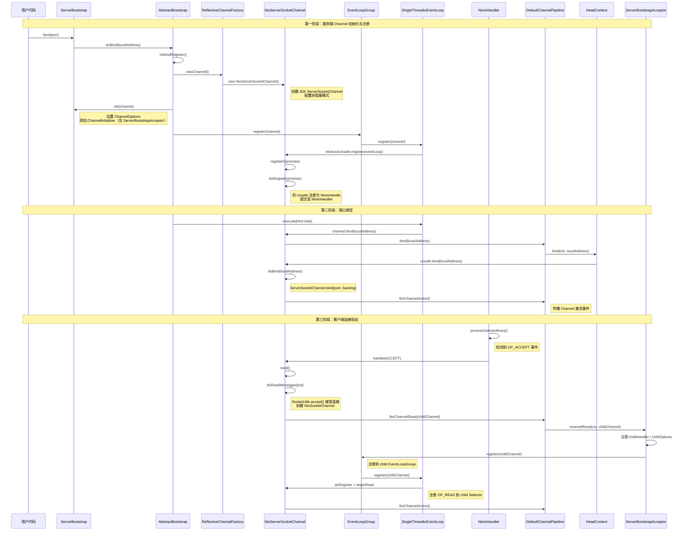

# TCP 连接全链路：从 ServerBootstrap.bind() 到 Channel 激活

## 概述

本文追踪一次完整的 TCP 服务端连接建立流程：从用户调用 `ServerBootstrap.bind(port)` 开始，经历 Channel 创建、Pipeline 初始化、EventLoop 注册、端口绑定，到最终客户端连接到达后新 SocketChannel 的 accept 与注册激活。整个过程跨越 **bootstrap**、**transport**、**common** 三大模块，涉及 NIO Selector 的 ACCEPT 事件处理和双 EventLoopGroup 架构。

## 架构图



## 逐步分析

### 第一阶段：服务端 Channel 创建与注册

#### 步骤 1：ServerBootstrap.bind(port)

**类**：`ServerBootstrap`（继承自 `AbstractBootstrap`）
**方法**：`bind(int inetPort)`
**模块**：bootstrap

```java
// AbstractBootstrap.java:265
public ChannelFuture bind(int inetPort) {
    return bind(new InetSocketAddress(inetPort));
}
```

用户调用 `bind(port)` 后，会经过 `validate()` 校验参数（确认 group 和 channelFactory 已设置），然后进入 `doBind()` 方法。

#### 步骤 2：AbstractBootstrap.doBind()

**类**：`AbstractBootstrap`
**方法**：`doBind(SocketAddress localAddress)`
**模块**：bootstrap

```java
// AbstractBootstrap.java:291-322
private ChannelFuture doBind(final SocketAddress localAddress) {
    final ChannelFuture regFuture = initAndRegister();
    final Channel channel = regFuture.channel();
    // ... 省略错误处理
    if (regFuture.isDone()) {
        ChannelPromise promise = channel.newPromise();
        doBind0(regFuture, channel, localAddress, promise);
        return promise;
    } else {
        // 异步场景：等注册完成后再绑定
        regFuture.addListener(future -> {
            // ...
            doBind0(regFuture, channel, localAddress, promise);
        });
    }
}
```

`doBind()` 分两步：先 `initAndRegister()` 创建并注册 Channel，再 `doBind0()` 执行绑定。

#### 步骤 3：initAndRegister() — Channel 创建

**类**：`AbstractBootstrap`
**方法**：`initAndRegister()`
**模块**：bootstrap

```java
// AbstractBootstrap.java:324-359
final ChannelFuture initAndRegister() {
    Channel channel = null;
    try {
        channel = channelFactory.newChannel();  // 步骤 3a
        init(channel);                           // 步骤 3b
    } catch (Throwable t) { /* 错误处理 */ }

    final ChannelFuture regFuture = config().group().register(channel);  // 步骤 3c
    return regFuture;
}
```

三个关键子步骤：

**3a. ReflectiveChannelFactory.newChannel()**（模块：transport）

```java
// ReflectiveChannelFactory.java:42-48
public T newChannel() {
    try {
        return constructor.newInstance();  // 反射调用无参构造器
    } catch (Throwable t) {
        throw new ChannelException("Unable to create Channel from class " + constructor.getDeclaringClass(), t);
    }
}
```

对于 `ServerBootstrap`，这里创建的是 `NioServerSocketChannel` 实例。其构造器调用链：
- `NioServerSocketChannel()` → `NioServerSocketChannel(SelectorProvider)` → `NioServerSocketChannel(ServerSocketChannel)`
- 内部通过 `provider.openServerSocketChannel()` 创建 JDK `ServerSocketChannel`
- 调用父类 `AbstractNioChannel` 构造器，将 `ch.configureBlocking(false)` 设置为非阻塞模式

```java
// NioServerSocketChannel.java:104-107
public NioServerSocketChannel(ServerSocketChannel channel) {
    super(null, channel, SelectionKey.OP_ACCEPT);  // 注册兴趣事件为 ACCEPT
    config = new NioServerSocketChannelConfig(this, javaChannel().socket());
}
```

**3b. ServerBootstrap.init(channel)**（模块：bootstrap）

```java
// ServerBootstrap.java:133-174
void init(Channel channel) throws Throwable {
    setChannelOptions(channel, newOptionsArray(), logger);
    setAttributes(channel, newAttributesArray());

    ChannelPipeline p = channel.pipeline();
    // 捕获 child 配置
    final EventLoopGroup currentChildGroup = childGroup;
    final ChannelHandler currentChildHandler = childHandler;
    // ...

    p.addLast(new ChannelInitializer<Channel>() {
        @Override
        public void initChannel(final Channel ch) {
            final ChannelPipeline pipeline = ch.pipeline();
            ChannelHandler handler = config.handler();
            if (handler != null) {
                pipeline.addLast(handler);
            }
            // 在 EventLoop 中异步添加 ServerBootstrapAcceptor
            ch.eventLoop().execute(new Runnable() {
                @Override
                public void run() {
                    pipeline.addLast(new ServerBootstrapAcceptor(
                            ch, currentChildGroup, currentChildHandler,
                            currentChildOptions, currentChildAttrs, extensions));
                }
            });
        }
    });
}
```

关键：`init()` 不会立即添加 `ServerBootstrapAcceptor`，而是通过 `eventLoop().execute()` 延迟到注册完成后执行。

**3c. EventLoopGroup.register(channel)**（模块：transport）

```java
// AbstractChannel.AbstractUnsafe.java:324-364
public final void register(EventLoop eventLoop, final ChannelPromise promise) {
    AbstractChannel.this.eventLoop = eventLoop;
    if (eventLoop.inEventLoop()) {
        register0(promise);
    } else {
        eventLoop.execute(() -> register0(promise));
    }
}
```

`register()` 将 Channel 绑定到指定的 EventLoop，然后在 EventLoop 线程中执行实际注册。

#### 步骤 4：register0() — 注册到 Selector

**类**：`AbstractChannel.AbstractUnsafe`
**方法**：`register0(ChannelPromise promise)`
**模块**：transport

```java
// AbstractChannel.java:366-406
private void register0(ChannelPromise promise) {
    if (!promise.setUncancellable() || !ensureOpen(promise)) {
        return;
    }
    ChannelPromise registerPromise = newPromise();
    boolean firstRegistration = neverRegistered;
    registerPromise.addListener(future -> {
        if (future.isSuccess()) {
            neverRegistered = false;
            registered = true;
            pipeline.invokeHandlerAddedIfNeeded();  // 触发 handlerAdded 回调
            safeSetSuccess(promise);
            pipeline.fireChannelRegistered();         // 触发 channelRegistered 事件
            if (isActive()) {
                if (firstRegistration) {
                    pipeline.fireChannelActive();     // 如果已 active，触发 channelActive
                }
            }
        }
    });
    doRegister(registerPromise);  // 实际注册到 Selector
}
```

`doRegister()` 的 NIO 实现在 `AbstractNioChannel` 中：

```java
// AbstractNioChannel.java:460-470
protected void doRegister(ChannelPromise promise) {
    assert registration == null;
    ((IoEventLoop) eventLoop()).register((AbstractNioUnsafe) unsafe()).addListener(f -> {
        if (f.isSuccess()) {
            registration = (IoRegistration) f.getNow();
            promise.setSuccess();
        } else {
            promise.setFailure(f.cause());
        }
    });
}
```

最终在 `NioIoHandler.register()` 中完成：

```java
// NioIoHandler.java:393-416
public IoRegistration register(IoHandle handle) throws Exception {
    NioIoHandle nioHandle = nioHandle(handle);
    NioIoOps ops = NioIoOps.NONE;  // 初始无关注事件
    // ...
    IoRegistration registration = new DefaultNioRegistration(executor, nioHandle, ops, unwrappedSelector());
    handle.registered();
    return registration;
}
```

`DefaultNioRegistration` 构造器中完成 JDK 级注册：

```java
// NioIoHandler.java:323-327
DefaultNioRegistration(ThreadAwareExecutor executor, NioIoHandle handle, NioIoOps initialOps, Selector selector)
        throws IOException {
    this.handle = handle;
    key = handle.selectableChannel().register(selector, initialOps.value, this);
    // this 作为 SelectionKey 的 attachment
}
```

### 第二阶段：端口绑定

#### 步骤 5：doBind0() — 触发绑定操作

**类**：`AbstractBootstrap`
**方法**：`doBind0()`
**模块**：bootstrap

```java
// AbstractBootstrap.java:371-387
private static void doBind0(
        final ChannelFuture regFuture, final Channel channel,
        final SocketAddress localAddress, final ChannelPromise promise) {
    channel.eventLoop().execute(new Runnable() {
        @Override
        public void run() {
            if (regFuture.isSuccess()) {
                channel.bind(localAddress, promise)
                    .addListener(ChannelFutureListener.CLOSE_ON_FAILURE);
            }
        }
    });
}
```

注意：`doBind0()` 通过 `eventLoop().execute()` 提交到 EventLoop 线程执行，确保绑定操作在注册完成后进行。

#### 步骤 6：Pipeline 传播 bind 事件

`channel.bind()` 触发出站事件，沿 Pipeline **从尾到头**传播：

```
DefaultChannelPipeline.bind()
  → TailContext.bind()           // 出站传播起点
    → ... (用户出站 Handler) ...
      → HeadContext.bind()       // 出站传播终点
```

**类**：`DefaultChannelPipeline.HeadContext`
**方法**：`bind(ChannelHandlerContext, SocketAddress, ChannelPromise)`
**模块**：transport

```java
// DefaultChannelPipeline.java:1351-1354
@Override
public void bind(ChannelHandlerContext ctx, SocketAddress localAddress, ChannelPromise promise) {
    unsafe.bind(localAddress, promise);
}
```

#### 步骤 7：AbstractUnsafe.bind() — 执行实际绑定

**类**：`AbstractChannel.AbstractUnsafe`
**方法**：`bind(SocketAddress, ChannelPromise)`
**模块**：transport

```java
// AbstractChannel.java:409-448
public final void bind(final SocketAddress localAddress, final ChannelPromise promise) {
    boolean wasActive = isActive();
    try {
        doBind(localAddress);  // 调用子类实现
    } catch (Throwable t) {
        safeSetFailure(promise, t);
        return;
    }
    if (!wasActive && isActive()) {
        invokeLater(() -> pipeline.fireChannelActive());
    }
    safeSetSuccess(promise);
}
```

`doBind()` 在 `NioServerSocketChannel` 中：

```java
// NioServerSocketChannel.java:147-149
protected void doBind(SocketAddress localAddress) throws Exception {
    javaChannel().bind(localAddress, config.getBacklog());
    // 调用 JDK ServerSocketChannel.bind()
}
```

绑定成功后，`isActive()` 返回 `true`（`isOpen() && socket.isBound()`），触发 `fireChannelActive()` 事件。

#### 步骤 8：HeadContext.channelActive() — 激活后触发自动读取

```java
// DefaultChannelPipeline.java:1416-1420
@Override
public void channelActive(ChannelHandlerContext ctx) {
    ctx.fireChannelActive();
    readIfIsAutoRead();  // 如果 autoRead=true，触发首次 read()
}
```

这会最终调用 `AbstractNioChannel.doBeginRead()`，向 Selector 注册 `OP_ACCEPT` 事件：

```java
// AbstractNioChannel.java:482-492
protected void doBeginRead() throws Exception {
    IoRegistration registration = this.registration;
    if (registration == null || !registration.isValid()) {
        return;
    }
    readPending = true;
    addAndSubmit(readOps);  // 提交 OP_ACCEPT 事件
}
```

### 第三阶段：客户端连接到达

#### 步骤 9：NioIoHandler 处理 ACCEPT 事件

**类**：`NioIoHandler`
**方法**：`run(IoHandlerContext)` → `processSelectedKeys()` → `processSelectedKey(SelectionKey)`
**模块**：transport

```java
// NioIoHandler.java:586-597
private void processSelectedKey(SelectionKey k) {
    final DefaultNioRegistration registration = (DefaultNioRegistration) k.attachment();
    if (!registration.isValid()) {
        // ...
        return;
    }
    registration.handle(k.readyOps());  // 分发就绪事件
}
```

```java
// NioIoHandler.java:384-389
void handle(int ready) {
    if (!isValid()) {
        return;
    }
    handle.handle(this, NioIoOps.eventOf(ready));
}
```

这里调用 `AbstractNioChannel.AbstractNioUnsafe.handle()`：

```java
// AbstractNioChannel.java:421-450
public void handle(IoRegistration registration, IoEvent event) {
    NioIoEvent nioEvent = (NioIoEvent) event;
    NioIoOps nioReadyOps = nioEvent.ops();
    // ...
    if (nioReadyOps.contains(NioIoOps.READ_AND_ACCEPT) || nioReadyOps.equals(NioIoOps.NONE)) {
        read();  // 触发读取（对 ServerSocketChannel 来说就是 accept）
    }
}
```

#### 步骤 10：NioMessageUnsafe.read() — 接受连接

**类**：`AbstractNioMessageChannel.NioMessageUnsafe`
**方法**：`read()`
**模块**：transport

```java
// AbstractNioMessageChannel.java:70-129
public void read() {
    final ChannelConfig config = config();
    final ChannelPipeline pipeline = pipeline();
    final RecvByteBufAllocator.Handle allocHandle = unsafe().recvBufAllocHandle();
    allocHandle.reset(config);

    try {
        do {
            int localRead = doReadMessages(readBuf);  // 步骤 10a
            if (localRead == 0) break;
            if (localRead < 0) { closed = true; break; }
            allocHandle.incMessagesRead(localRead);
        } while (continueReading(allocHandle));

        int size = readBuf.size();
        for (int i = 0; i < size; i++) {
            readPending = false;
            pipeline.fireChannelRead(readBuf.get(i));  // 步骤 10b
        }
        readBuf.clear();
        allocHandle.readComplete();
        pipeline.fireChannelReadComplete();
    }
}
```

**10a. doReadMessages() — accept() 创建 NioSocketChannel**

```java
// NioServerSocketChannel.java:157-176
protected int doReadMessages(List<Object> buf) throws Exception {
    SocketChannel ch = SocketUtils.accept(javaChannel());
    try {
        if (ch != null) {
            buf.add(new NioSocketChannel(this, ch));
            return 1;
        }
    } catch (Throwable t) {
        logger.warn("Failed to create a new channel from an accepted socket.", t);
        ch.close();
    }
    return 0;
}
```

`SocketUtils.accept()` 封装了 JDK 的 `ServerSocketChannel.accept()`，返回一个新的 `SocketChannel`。然后包装为 `NioSocketChannel`，parent 设为当前 `NioServerSocketChannel`。

**10b. fireChannelRead() 传播到 ServerBootstrapAcceptor**

#### 步骤 11：ServerBootstrapAcceptor.channelRead() — 注册 child Channel

**类**：`ServerBootstrap.ServerBootstrapAcceptor`
**方法**：`channelRead(ChannelHandlerContext, Object)`
**模块**：bootstrap

```java
// ServerBootstrap.java:222-255
public void channelRead(ChannelHandlerContext ctx, Object msg) {
    final Channel child = (Channel) msg;

    child.pipeline().addLast(childHandler);  // 添加用户配置的业务 Handler

    try {
        setChannelOptions(child, childOptions, logger);
    } catch (Throwable cause) {
        forceClose(child, cause);
        return;
    }
    setAttributes(child, childAttrs);

    try {
        childGroup.register(child).addListener(future -> {
            if (!future.isSuccess()) {
                forceClose(child, future.cause());
            }
        });
    } catch (Throwable t) {
        forceClose(child, t);
    }
}
```

关键流程：
1. 将用户配置的 `childHandler` 添加到 child Channel 的 Pipeline
2. 应用 `childOptions` 和 `childAttrs`
3. 调用 `childGroup.register(child)` — 将 child Channel 注册到 child EventLoopGroup

#### 步骤 12：child Channel 注册与激活

`childGroup.register()` 的流程与步骤 3c 相同：
1. 选择一个 child EventLoop
2. 调用 `AbstractUnsafe.register()` → `register0()`
3. `doRegister()` 将 `NioSocketChannel` 的 Unsafe 注册到 child EventLoop 的 Selector
4. 注册成功后触发 `pipeline.fireChannelRegistered()`
5. `isActive()` 返回 `true`（Channel 已 open 且 connected）
6. 触发 `pipeline.fireChannelActive()`

```java
// AbstractNioChannel.java:482-492
protected void doBeginRead() throws Exception {
    IoRegistration registration = this.registration;
    if (registration == null || !registration.isValid()) {
        return;
    }
    readPending = true;
    addAndSubmit(readOps);  // 对 NioSocketChannel 是 OP_READ
}
```

child Channel 激活后，通过 `doBeginRead()` 注册 `OP_READ` 事件，至此该连接可以接收数据。

## 设计思想

### 1. 双 EventLoopGroup 架构

Netty 使用 `parentGroup`（Boss）和 `childGroup`（Worker）两个 EventLoopGroup：
- **Boss Group**：负责接受新连接（处理 `OP_ACCEPT` 事件），通常只需 1 个线程
- **Worker Group**：负责处理已建立连接的 I/O 读写（处理 `OP_READ`/`OP_WRITE` 事件），线程数默认为 CPU 核心数 x 2

这种设计将**连接建立**和**数据处理**分离，避免慢速连接接受影响已有连接的数据处理。

### 2. 延迟初始化 Pipeline

`ServerBootstrap.init()` 中添加 `ServerBootstrapAcceptor` 的操作被 `eventLoop.execute()` 延迟执行。这确保了：
- Channel 已完成注册后再添加 Handler
- 用户在 `channelRegistered()` 回调中添加的 Handler 有机会先执行

### 3. ChannelInitializer 模式

`ChannelInitializer` 是一个特殊的 Handler，在 `handlerAdded()` 时执行一次初始化逻辑，然后自动从 Pipeline 中移除。这提供了一种优雅的方式来配置 Pipeline，避免了初始化代码与运行时代码混杂。

### 4. SelectionKey Attachment 模式

每个 Channel 的 `AbstractNioUnsafe` 作为 `NioIoHandle` 被注册到 Selector，而 `DefaultNioRegistration` 作为 `SelectionKey` 的 attachment 存储。当事件到达时，通过 `key.attachment()` 获取 registration，再通过 `registration.handle()` 回调到 Channel 处理。这是一个典型的 attachment 模式，避免了额外的 Map 查找。

### 5. 事件传播的出站/入站分离

- **出站事件**（bind/connect/write/flush）：从 Pipeline 尾部向头部传播，最终由 `HeadContext` 调用 `Unsafe` 执行实际 I/O 操作
- **入站事件**（channelRead/channelActive）：从 Pipeline 头部向尾部传播，最终由 `TailContext` 处理未被消费的事件

## 涉及模块清单

| 模块 | 主要类 | 职责 |
|------|--------|------|
| bootstrap | `ServerBootstrap`, `AbstractBootstrap` | 服务端引导配置、Channel 初始化 |
| transport | `NioServerSocketChannel`, `NioSocketChannel` | NIO Server/Client Channel 实现 |
| transport | `AbstractNioChannel`, `AbstractNioMessageChannel` | NIO Channel 抽象基类 |
| transport | `SingleThreadIoEventLoop`, `NioEventLoop` | 事件循环实现 |
| transport | `NioIoHandler` | NIO Selector 封装、事件分发 |
| transport | `DefaultChannelPipeline`, `HeadContext`, `TailContext` | Pipeline 实现与事件传播 |
| transport | `AbstractChannel`, `AbstractUnsafe` | Channel 骨架实现、Unsafe 操作 |
| transport | `ReflectiveChannelFactory` | 反射创建 Channel 实例 |
| common | `DefaultChannelId`, `AttributeMap` | Channel ID 生成、属性存储 |

## 学习要点

1. **Channel 创建时机**：`initAndRegister()` 中先通过反射创建 Channel 实例，再注册到 EventLoop。创建和注册是两个独立步骤。

2. **注册与绑定分离**：Channel 先注册到 EventLoop（获得 Selector 关注），再执行 bind 操作。这使得 `channelRegistered()` 回调中可以安全地执行绑定相关操作。

3. **ServerBootstrapAcceptor 的作用**：它是 Pipeline 中处理 `channelRead` 的核心 Handler，负责 accept 到新连接后将其注册到 child EventLoopGroup。

4. **autoRead 机制**：`HeadContext.channelActive()` 中检查 `autoRead` 配置，如果为 `true` 则自动触发 `read()`，进而注册 `OP_ACCEPT`/`OP_READ` 事件。这形成了"事件驱动的读取循环"。

5. **NioSocketChannel 构造时机**：新连接的 `NioSocketChannel` 在 `doReadMessages()` 中创建，此时它还未注册到任何 EventLoop，后续由 `ServerBootstrapAcceptor` 完成注册。

6. **SelectionKey 与 IoRegistration 的关系**：Netty 4.2 引入了 `IoRegistration` 抽象，封装了 JDK 的 `SelectionKey`，通过 `NioIoHandler.DefaultNioRegistration` 实现。每个 Channel 对应一个 registration，registration 作为 SelectionKey 的 attachment 存储。
