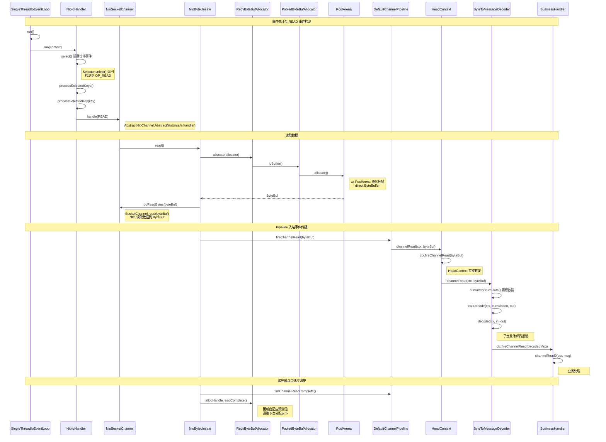

# 数据读取全链路：从网卡到业务 Handler

## 概述

本文追踪一次完整的数据读取流程：从 `NioEventLoop` 事件循环检测到 `OP_READ` 事件开始，经历 ByteBuf 分配、NIO 读取、Pipeline 入站传播、解码器解码，到最终业务 Handler 处理解码后的消息。整个过程跨越 **transport**、**buffer**、**codec**、**common** 四大模块，展示了 Netty 零拷贝思想和自适应缓冲区管理机制。

## 架构图



## 逐步分析

### 第一阶段：事件循环检测 READ 事件

#### 步骤 1：SingleThreadIoEventLoop.run() — 事件循环

**类**：`SingleThreadIoEventLoop`
**方法**：`run()`
**模块**：transport

```java
// SingleThreadIoEventLoop.java:192-205
protected void run() {
    assert inEventLoop();
    ioHandler.initialize();
    do {
        runIo();                                // 处理 I/O 事件
        if (isShuttingDown()) {
            ioHandler.prepareToDestroy();
        }
        runAllTasks(maxTaskProcessingQuantumNs); // 处理任务队列
    } while (!confirmShutdown() && !canSuspend());
}
```

`run()` 是 EventLoop 的核心循环，不断交替执行 I/O 事件处理和任务队列处理。

#### 步骤 2：NioIoHandler.run() — Selector 选择

**类**：`NioIoHandler`
**方法**：`run(IoHandlerContext)`
**模块**：transport

```java
// NioIoHandler.java:419-496
public int run(IoHandlerContext context) {
    int handled = 0;
    try {
        switch (selectStrategy.calculateStrategy(selectNowSupplier, !context.canBlock())) {
            case SelectStrategy.CONTINUE:
                return 0;
            case SelectStrategy.SELECT:
                select(context, wakenUp.getAndSet(false));
                if (wakenUp.get()) {
                    selector.wakeup();
                }
                // fall through
            default:
        }
        cancelledKeys = 0;
        needsToSelectAgain = false;
        handled = processSelectedKeys();  // 处理就绪事件
    } catch (Throwable t) {
        handleLoopException(t);
    }
    return handled;
}
```

`select()` 方法中调用 JDK 的 `Selector.select(timeoutMillis)` 阻塞等待事件。当有 Channel 就绪时返回。

#### 步骤 3：processSelectedKeys() — 遍历就绪事件

**类**：`NioIoHandler`
**方法**：`processSelectedKeysOptimized()`（优化路径）或 `processSelectedKeysPlain()`
**模块**：transport

```java
// NioIoHandler.java:563-584
private int processSelectedKeysOptimized() {
    int handled = 0;
    for (int i = 0; i < selectedKeys.size; ++i) {
        final SelectionKey k = selectedKeys.keys[i];
        selectedKeys.keys[i] = null;  // 置空帮助 GC
        processSelectedKey(k);
        ++handled;
    }
    return handled;
}
```

优化路径使用 Netty 自定义的 `SelectedSelectionKeySet`（数组实现）替代 JDK 默认的 `HashSet`，避免了 Iterator 分配和哈希计算开销。

```java
// NioIoHandler.java:586-597
private void processSelectedKey(SelectionKey k) {
    final DefaultNioRegistration registration = (DefaultNioRegistration) k.attachment();
    if (!registration.isValid()) {
        try { registration.handle.close(); } catch (Exception e) { }
        return;
    }
    registration.handle(k.readyOps());  // 调用 Channel 的 handle 方法
}
```

#### 步骤 4：AbstractNioUnsafe.handle() — 分发 READ 事件

**类**：`AbstractNioChannel.AbstractNioUnsafe`
**方法**：`handle(IoRegistration, IoEvent)`
**模块**：transport

```java
// AbstractNioChannel.java:421-450
public void handle(IoRegistration registration, IoEvent event) {
    NioIoEvent nioEvent = (NioIoEvent) event;
    NioIoOps nioReadyOps = nioEvent.ops();

    if (nioReadyOps.contains(NioIoOps.CONNECT)) {
        removeAndSubmit(NioIoOps.CONNECT);
        unsafe().finishConnect();
    }

    if (nioReadyOps.contains(NioIoOps.WRITE)) {
        forceFlush();
    }

    if (nioReadyOps.contains(NioIoOps.READ_AND_ACCEPT) || nioReadyOps.equals(NioIoOps.NONE)) {
        read();  // 进入读取流程
    }
}
```

注意事件处理的优先级：CONNECT > WRITE > READ。优先处理写事件可以尽快释放内存。

### 第二阶段：ByteBuf 分配与 NIO 读取

#### 步骤 5：NioByteUnsafe.read() — 读取循环

**类**：`AbstractNioByteChannel.NioByteUnsafe`
**方法**：`read()`
**模块**：transport

```java
// AbstractNioByteChannel.java:145-199
public final void read() {
    final ChannelConfig config = config();
    if (shouldBreakReadReady(config)) {
        clearReadPending();
        return;
    }
    final ChannelPipeline pipeline = pipeline();
    final ByteBufAllocator allocator = config.getAllocator();
    final RecvByteBufAllocator.Handle allocHandle = recvBufAllocHandle();
    allocHandle.reset(config);

    ByteBuf byteBuf = null;
    boolean close = false;
    try {
        do {
            byteBuf = allocHandle.allocate(allocator);      // 步骤 5a：分配 ByteBuf
            allocHandle.lastBytesRead(doReadBytes(byteBuf)); // 步骤 5b：NIO 读取
            if (allocHandle.lastBytesRead() <= 0) {
                byteBuf.release();
                byteBuf = null;
                close = allocHandle.lastBytesRead() < 0;    // EOF
                break;
            }

            allocHandle.incMessagesRead(1);
            readPending = false;
            pipeline.fireChannelRead(byteBuf);               // 步骤 5c：触发入站事件
            byteBuf = null;
        } while (allocHandle.continueReading());             // 自适应判断是否继续读

        allocHandle.readComplete();
        pipeline.fireChannelReadComplete();
    } catch (Throwable t) {
        handleReadException(pipeline, byteBuf, t, close, allocHandle);
    } finally {
        if (!readPending && !config.isAutoRead()) {
            removeReadOp();
        }
    }
}
```

`read()` 方法在一个循环中不断读取数据，直到：
- 没有更多数据可读（`lastBytesRead() == 0`）
- 连接关闭（`lastBytesRead() < 0`）
- `allocHandle.continueReading()` 返回 `false`（自适应策略判断）

**5a. ByteBuf 分配 — 池化分配器**

`allocHandle.allocate(allocator)` 最终调用到 `PooledByteBufAllocator`：

```java
// AbstractByteBufAllocator.java:110-115
public ByteBuf ioBuffer() {
    if (PlatformDependent.canReliabilyFreeDirectBuffers() || isDirectBufferPooled()) {
        return directBuffer(DEFAULT_INITIAL_CAPACITY);
    }
    return heapBuffer(DEFAULT_INITIAL_CAPACITY);
}
```

`ioBuffer()` 优先分配直接内存（direct buffer），因为：
- 直接内存可以在 NIO 的 `Channel.read(ByteBuffer)` 中使用，避免用户态到内核态的额外拷贝
- 池化分配避免了频繁的 `malloc/free` 调用

`PooledByteBufAllocator.directBuffer()` 内部通过 `PoolArena.allocate()` 从内存池中获取一块预分配的内存区域。

**5b. NIO 读取**

```java
// NioSocketChannel.java:347-351
protected int doReadBytes(ByteBuf byteBuf) throws Exception {
    final RecvByteBufAllocator.Handle allocHandle = unsafe().recvBufAllocHandle();
    allocHandle.attemptedBytesRead(byteBuf.writableBytes());
    return byteBuf.writeBytes(javaChannel(), allocHandle.attemptedBytesRead());
}
```

`byteBuf.writeBytes(javaChannel(), ...)` 最终调用 JDK 的 `SocketChannel.read(ByteBuffer)`，将数据从内核缓冲区读取到 ByteBuf 的底层 ByteBuffer 中。

**5c. 触发入站事件**

`pipeline.fireChannelRead(byteBuf)` 将读取到的原始字节数据通过 Pipeline 传播给入站 Handler。

### 第三阶段：Pipeline 入站传播与解码

#### 步骤 6：DefaultChannelPipeline.fireChannelRead() — 入站传播起点

**类**：`DefaultChannelPipeline`
**方法**：`fireChannelRead(Object)`
**模块**：transport

```java
// DefaultChannelPipeline.java:915-926
public final ChannelPipeline fireChannelRead(Object msg) {
    if (head.executor().inEventLoop()) {
        if (head.invokeHandler()) {
            head.channelRead(head, msg);  // 直接调用 HeadContext
        } else {
            head.fireChannelRead(msg);
        }
    } else {
        head.executor().execute(() -> fireChannelRead(msg));
    }
    return this;
}
```

入站事件从 `HeadContext` 开始传播。

#### 步骤 7：HeadContext — 透传入站事件

**类**：`DefaultChannelPipeline.HeadContext`
**方法**：`channelRead(ChannelHandlerContext, Object)`
**模块**：transport

```java
// DefaultChannelPipeline.java:1428-1430
@Override
public void channelRead(ChannelHandlerContext ctx, Object msg) {
    ctx.fireChannelRead(msg);  // 直接向下一个入站 Handler 传播
}
```

`HeadContext` 对入站的 `channelRead` 事件不做任何处理，直接透传。这是正确的——`HeadContext` 主要处理出站事件（最终调用 Unsafe 执行 I/O），入站事件只是经过它。

#### 步骤 8：AbstractChannelHandlerContext.fireChannelRead() — 查找下一个入站 Handler

**类**：`AbstractChannelHandlerContext`
**方法**：`fireChannelRead(Object)`
**模块**：transport

```java
// AbstractChannelHandlerContext.java:341-369
public ChannelHandlerContext fireChannelRead(final Object msg) {
    AbstractChannelHandlerContext next = findContextInbound(MASK_CHANNEL_READ);
    if (next.executor().inEventLoop()) {
        final Object m = pipeline.touch(msg, next);
        if (next.invokeHandler()) {
            try {
                final ChannelHandler handler = next.handler();
                final DefaultChannelPipeline.HeadContext headContext = pipeline.head;
                if (handler == headContext) {
                    headContext.channelRead(next, m);
                } else if (handler instanceof ChannelDuplexHandler) {
                    ((ChannelDuplexHandler) handler).channelRead(next, m);
                } else {
                    ((ChannelInboundHandler) handler).channelRead(next, m);
                }
            } catch (Throwable t) {
                next.invokeExceptionCaught(t);
            }
        } else {
            next.fireChannelRead(m);
        }
    } else {
        next.executor().execute(() -> fireChannelRead(msg));
    }
    return this;
}
```

`findContextInbound(MASK_CHANNEL_READ)` 沿 Pipeline 链表向前查找下一个实现了 `channelRead` 方法的入站 Handler。找到后根据 Handler 类型直接调用对应的 `channelRead()` 方法。

#### 步骤 9：ByteToMessageDecoder.channelRead() — 解码器核心

**类**：`ByteToMessageDecoder`
**方法**：`channelRead(ChannelHandlerContext, Object)`
**模块**：codec

```java
// ByteToMessageDecoder.java:286-341
public void channelRead(ChannelHandlerContext ctx, Object input) throws Exception {
    if (decodeState == STATE_INIT) {
        do {
            if (input instanceof ByteBuf) {
                selfFiredChannelRead = true;
                CodecOutputList out = CodecOutputList.newInstance();
                try {
                    first = cumulation == null;
                    // 累积数据：将新读取的 ByteBuf 与之前的累积 Buffer 合并
                    cumulation = cumulator.cumulate(ctx.alloc(),
                            first ? EMPTY_BUFFER : cumulation, (ByteBuf) input);
                    callDecode(ctx, cumulation, out);  // 调用子类 decode()
                } catch (DecoderException e) {
                    throw e;
                } catch (Exception e) {
                    throw new DecoderException(e);
                } finally {
                    try {
                        if (cumulation != null && !cumulation.isReadable()) {
                            cumulation.release();
                            cumulation = null;
                        }
                        int size = out.size();
                        firedChannelRead |= out.insertSinceRecycled();
                        fireChannelRead(ctx, out, size);  // 向下传播解码结果
                    } finally {
                        out.recycle();
                    }
                }
            } else {
                ctx.fireChannelRead(input);  // 非 ByteBuf 直接传播
            }
        } while (inputMessages != null && (input = inputMessages.poll()) != null);
    } else {
        // 重入调用：加入队列，由原始调用处理
        if (inputMessages == null) {
            inputMessages = new ArrayDeque<>(2);
        }
        inputMessages.offer(input);
    }
}
```

解码器的核心逻辑：

1. **累积**：通过 `Cumulator` 将新数据与已有数据合并。默认使用 `MERGE_CUMULATOR`（内存拷贝合并），也可以使用 `COMPOSITE_CUMULATOR`（零拷贝组合）
2. **解码**：`callDecode()` 反复调用子类的 `decode()` 方法，直到没有更多可解码的数据
3. **传播**：将解码后的消息通过 `ctx.fireChannelRead()` 传播给下一个 Handler

`callDecode()` 的关键循环：

```java
// ByteToMessageDecoder.java (callDecode 方法)
protected void callDecode(ChannelHandlerContext ctx, ByteBuf in, List<Object> out) {
    while (in.isReadable()) {
        int outSize = out.size();
        if (outSize > 0) {
            // 已有解码结果，先传播
            fireChannelRead(ctx, out, outSize);
            out.clear();
        }
        int oldInputLength = in.readableBytes();
        decode(ctx, in, out);  // 调用子类的 decode()
        if (outSize == out.size()) {
            // 没有新消息被解码
            if (oldInputLength == in.readableBytes()) {
                break;  // 数据不够，等待更多数据
            }
        }
    }
}
```

#### 步骤 10：业务 Handler 处理解码后的消息

**类**：用户自定义的 `SimpleChannelInboundHandler<T>`
**方法**：`channelRead(ChannelHandlerContext, Object)` → `channelRead0(ChannelHandlerContext, T)`
**模块**：用户代码

```java
// SimpleChannelInboundHandler 的 channelRead 内部逻辑：
// 1. 通过 TypeParameterMatcher 匹配消息类型
// 2. 类型匹配则调用 channelRead0(ctx, msg)
// 3. 自动释放 msg 的引用计数（因为是 SimpleChannelInboundHandler）
```

### 第四阶段：读完成与自适应调整

#### 步骤 11：fireChannelReadComplete() — 读完成通知

读取循环结束后，触发 `channelReadComplete` 事件沿 Pipeline 传播：

```java
// DefaultChannelPipeline.java:929-940
public final ChannelPipeline fireChannelReadComplete() {
    if (head.executor().inEventLoop()) {
        if (head.invokeHandler()) {
            head.channelReadComplete(head);
        } else {
            head.fireChannelReadComplete();
        }
    }
    return this;
}
```

`HeadContext.channelReadComplete()` 中会检查 `autoRead`，如果为 `true` 则触发下一次读取：

```java
// DefaultChannelPipeline.java:1433-1437
public void channelReadComplete(ChannelHandlerContext ctx) {
    ctx.fireChannelReadComplete();
    readIfIsAutoRead();  // 自动触发下一次 read()
}
```

#### 步骤 12：allocHandle.readComplete() — 自适应预测

**类**：`DefaultMaxMessagesRecvByteBufAllocator.MaxMessageHandle`（默认实现）
**模块**：transport

`readComplete()` 方法更新内部统计信息，用于预测下次读取应该分配多大的 ByteBuf。核心算法基于历史读取量动态调整：
- 如果本次读满了分配的缓冲区，下次分配更大的缓冲区
- 如果本次读取量远小于缓冲区大小，下次缩小缓冲区
- 使用指数移动平均（EMA）算法平滑调整

这种自适应机制确保：
- 高吞吐场景下缓冲区足够大，减少系统调用次数
- 低流量场景下缓冲区不会过大，避免内存浪费

## 设计思想

### 1. 零拷贝与池化内存

Netty 的数据读取路径涉及两次关键的内存优化：
- **直接内存**（Direct Buffer）：避免了 JVM 堆内存到内核缓冲区的额外拷贝。NIO 的 `Channel.read(ByteBuffer)` 要求使用直接内存时才能实现真正的零拷贝
- **池化分配**（Pooled Allocator）：`PooledByteBufAllocator` 预先分配大块内存，通过 `PoolArena` 管理子区域的分配与回收，避免频繁的系统调用

### 2. 自适应读取策略

`RecvByteBufAllocator.Handle` 实现了自适应读取策略：
- **循环读取**：在一个 READ 事件中尽可能多地读取数据，减少事件通知开销
- **动态缓冲区大小**：根据历史读取量预测下次需要的缓冲区大小
- **读取上限**：通过 `maxMessagesPerRead` 或 `continueReading()` 控制单次读取的最大消息数，避免长时间占用 EventLoop

### 3. 责任链模式的入站传播

Pipeline 使用双向链表实现责任链模式：
- `findContextInbound()` 沿链表向前查找实现了特定入站方法的 Handler
- 支持按需处理：Handler 可以选择消费消息（不再传播）或转发给下一个 Handler
- 支持异步切换：如果目标 Handler 的 executor 与当前线程不同，自动提交到目标 executor 执行

### 4. ByteToMessageDecoder 的累积模式

解码器使用累积模式处理流式数据：
- **状态保持**：未解码完的数据保留在 `cumulation` 缓冲区中，下次读取时继续处理
- **反复解码**：`callDecode()` 循环调用 `decode()`，一次读取可能产生多个解码结果
- **自动释放**：累积缓冲区在不再可读时自动释放，避免内存泄漏

### 5. 事件处理的线程安全

所有 I/O 操作都在 EventLoop 单线程中执行，避免了同步开销。但入站事件传播中会检查 executor：
- 如果下一个 Handler 的 executor 就是当前 EventLoop，直接调用
- 如果不同（例如业务 Handler 绑定了独立的线程池），则提交任务到目标 executor

## 涉及模块清单

| 模块 | 主要类 | 职责 |
|------|--------|------|
| transport | `SingleThreadIoEventLoop`, `NioIoHandler` | 事件循环、Selector 管理 |
| transport | `AbstractNioByteChannel.NioByteUnsafe` | 读取循环核心逻辑 |
| transport | `NioSocketChannel` | NIO `SocketChannel.read()` 实现 |
| transport | `AbstractNioChannel.AbstractNioUnsafe.handle()` | I/O 事件分发 |
| transport | `DefaultChannelPipeline`, `HeadContext` | 入站事件传播 |
| transport | `AbstractChannelHandlerContext` | Handler 查找与事件调用 |
| transport | `RecvByteBufAllocator`, `DefaultMaxMessagesRecvByteBufAllocator` | 自适应读取策略 |
| buffer | `PooledByteBufAllocator`, `PoolArena` | 池化 ByteBuf 分配 |
| buffer | `AbstractByteBufAllocator` | `ioBuffer()` 直接内存分配 |
| codec | `ByteToMessageDecoder` | 流式解码、数据累积 |
| codec | `CodecOutputList` | 解码结果收集（零分配） |
| common | `SimpleChannelInboundHandler` | 类型匹配与自动释放 |

## 学习要点

1. **read() 不是用户调用的**：虽然有 `Channel.read()` API，但数据读取是由 EventLoop 自动驱动的。`OP_READ` 事件就绪后，EventLoop 自动调用 `NioByteUnsafe.read()` 执行读取。

2. **自适应读取循环**：一次 READ 事件可能读取多次数据。`allocHandle.continueReading()` 根据已读取量和分配缓冲区大小决定是否继续读。这比"一次事件读一次"效率更高。

3. **ByteBuf 的分配与释放**：分配的 ByteBuf 在 `pipeline.fireChannelRead(byteBuf)` 后由下游 Handler 负责释放。`SimpleChannelInboundHandler` 会自动释放匹配的消息，但 `ChannelInboundHandlerAdapter` 需要手动管理。

4. **ByteToMessageDecoder 的状态管理**：解码器维护一个 `cumulation` 累积缓冲区，在多次 `channelRead()` 调用间保持状态。`decodeState` 字段防止重入调用导致的状态混乱。

5. **NIO 读取与 EOF 处理**：`doReadBytes()` 返回 -1 表示连接关闭（EOF），返回 0 表示当前无数据可读。这两种情况的处理逻辑完全不同。

6. **SelectedSelectionKeySet 优化**：Netty 替换了 JDK Selector 内部的 `HashSet<SelectionKey>` 为自定义的数组实现，避免了 Iterator 分配和哈希计算的开销。这是一个典型的"微优化累积成大收益"的例子。

7. **findContextInbound() 的类型检查**：事件传播时通过位掩码（`MASK_CHANNEL_READ`）快速判断 Handler 是否支持特定事件，避免了运行时的反射调用。
