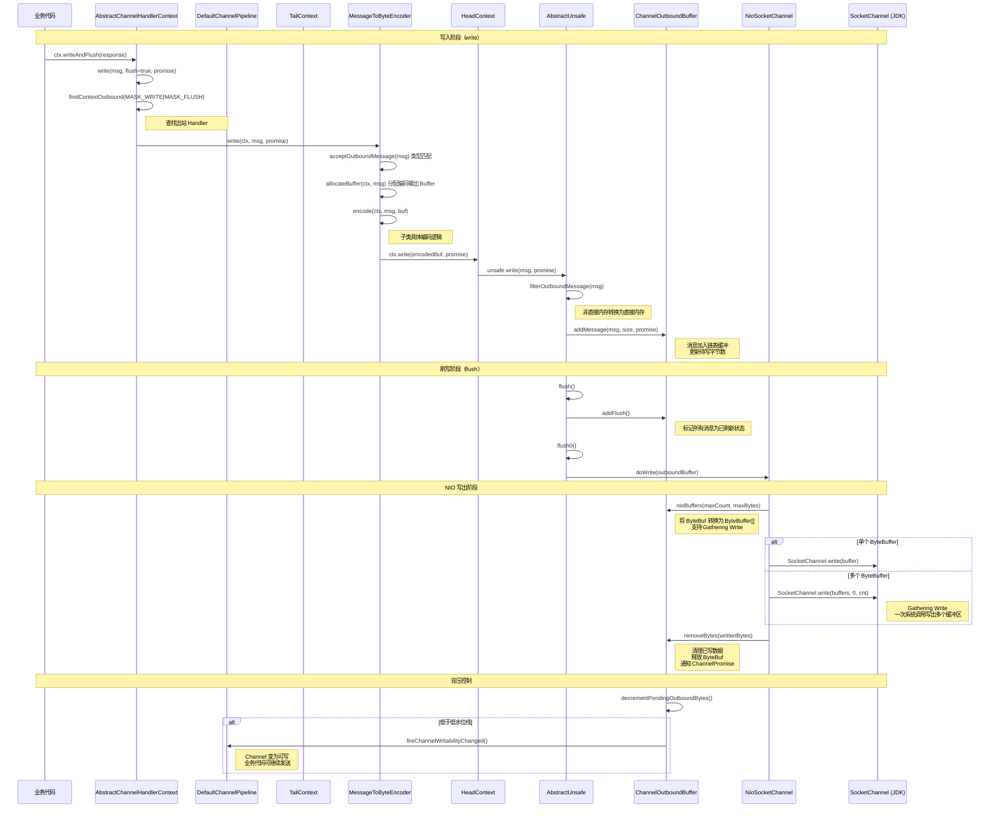

# 数据写出全链路：从业务代码到网卡

> **前置知识**：先读 04-03 数据读写与 02-流水线三篇。

## 概述

本文追踪一次完整的数据写出流程：从业务代码调用 `ctx.writeAndFlush(response)` 开始，经历 Pipeline 出站传播、编码器编码、ChannelOutboundBuffer 缓冲、NIO Gathering Write，到最终数据通过 `SocketChannel.write()` 写入内核缓冲区。整个过程跨越 **transport**、**buffer**、**codec**、**common** 四大模块，展示了 Netty 的写缓冲区管理、背压控制和批量写出优化机制。

## 架构图



## 逐步分析

### 第一阶段：业务代码发起写入

#### 步骤 1：ctx.writeAndFlush(response)

**类**：`AbstractChannelHandlerContext`
**方法**：`writeAndFlush(Object, ChannelPromise)`
**模块**：transport

```java
// AbstractChannelHandlerContext.java:775-778
@Override
public ChannelFuture writeAndFlush(Object msg, ChannelPromise promise) {
    write(msg, true, promise);  // flush=true，表示写完后立即刷写
    return promise;
}
```

`writeAndFlush()` 等价于 `write()` + `flush()`，但内部实现更高效——出站传播只做一次。

#### 步骤 2：write() — 出站传播核心

**类**：`AbstractChannelHandlerContext`
**方法**：`write(Object msg, boolean flush, ChannelPromise promise)`
**模块**：transport

```java
// AbstractChannelHandlerContext.java:780-841
void write(Object msg, boolean flush, ChannelPromise promise) {
    if (validateWrite(msg, promise)) {
        final AbstractChannelHandlerContext next = findContextOutbound(flush ?
                MASK_WRITE | MASK_FLUSH : MASK_WRITE);
        final Object m = pipeline.touch(msg, next);
        EventExecutor executor = next.executor();
        if (executor.inEventLoop()) {
            if (next.invokeHandler()) {
                promise = ensurePromiseUseCorrectExecutor(promise);
                try {
                    final ChannelHandler handler = next.handler();
                    final DefaultChannelPipeline.HeadContext headContext = pipeline.head;
                    if (handler == headContext) {
                        headContext.write(next, msg, promise);  // 到达 HeadContext
                    } else if (handler instanceof ChannelDuplexHandler) {
                        ((ChannelDuplexHandler) handler).write(next, msg, promise);
                    } else if (handler instanceof ChannelOutboundHandlerAdapter) {
                        ((ChannelOutboundHandlerAdapter) handler).write(next, msg, promise);
                    } else {
                        ((ChannelOutboundHandler) handler).write(next, msg, promise);
                    }
                } catch (Throwable t) {
                    notifyOutboundHandlerException(t, promise);
                }
                if (flush) {
                    // flush 逻辑紧随 write 之后在同一 Handler 中执行
                    try {
                        if (handler == headContext) {
                            headContext.flush(next);
                        } else if (handler instanceof ChannelDuplexHandler) {
                            ((ChannelDuplexHandler) handler).flush(next);
                        } else if (handler instanceof ChannelOutboundHandlerAdapter) {
                            ((ChannelOutboundHandlerAdapter) handler).flush(next);
                        } else {
                            ((ChannelOutboundHandler) handler).flush(next);
                        }
                    } catch (Throwable t) {
                        next.invokeExceptionCaught(t);
                    }
                }
            } else {
                next.write(msg, flush, promise);
            }
        } else {
            // 异步提交到目标 Handler 的 executor
            final WriteTask task = WriteTask.newInstance(this, m, promise, flush);
            if (!safeExecute(executor, task, promise, m, !flush)) {
                task.cancel();
            }
        }
    }
}
```

关键点：
- `findContextOutbound()` 沿 Pipeline 链表**从当前 Handler 向前**查找下一个出站 Handler
- 如果 `flush=true`，write 和 flush 在同一个传播循环中完成，避免两次链表遍历
- 出站事件的传播方向与入站相反：**从尾到头**

#### 步骤 3：Pipeline 中的出站传播路径

典型的 Pipeline 配置中，出站消息的传播路径：

```
ctx.writeAndFlush(msg)
  → TailContext（出站起点，透传）
    → ... (业务出站 Handler，如编码器) ...
      → HeadContext（出站终点，调用 Unsafe）
```

注意：`DefaultChannelPipeline.write()` 从 `tail` 开始传播：

```java
// DefaultChannelPipeline.java:1035-1037
@Override
public final ChannelFuture write(Object msg, ChannelPromise promise) {
    return tail.write(msg, promise);
}
```

### 第二阶段：编码器处理

#### 步骤 4：MessageToByteEncoder.write() — 编码

**类**：`MessageToByteEncoder<I>`
**方法**：`write(ChannelHandlerContext, Object, ChannelPromise)`
**模块**：codec

```java
// MessageToByteEncoder.java:99-131
@Override
public void write(ChannelHandlerContext ctx, Object msg, ChannelPromise promise) throws Exception {
    ByteBuf buf = null;
    try {
        if (acceptOutboundMessage(msg)) {
            @SuppressWarnings("unchecked")
            I cast = (I) msg;
            buf = allocateBuffer(ctx, cast, preferDirect);  // 步骤 4a
            try {
                encode(ctx, cast, buf);                      // 步骤 4b
            } finally {
                ReferenceCountUtil.release(cast);            // 释放原始消息
            }

            if (buf.isReadable()) {
                ctx.write(buf, promise);                     // 步骤 4c：继续传播
            } else {
                buf.release();
                ctx.write(Unpooled.EMPTY_BUFFER, promise);
            }
            buf = null;
        } else {
            ctx.write(msg, promise);  // 类型不匹配，直接传播
        }
    } catch (EncoderException e) {
        throw e;
    } catch (Throwable e) {
        throw new EncoderException(e);
    } finally {
        if (buf != null) {
            buf.release();
        }
    }
}
```

**4a. allocateBuffer() — 分配编码输出缓冲区**

```java
// MessageToByteEncoder.java:137-144
protected ByteBuf allocateBuffer(ChannelHandlerContext ctx, I msg, boolean preferDirect) throws Exception {
    if (preferDirect) {
        return ctx.alloc().ioBuffer();   // 优先直接内存
    } else {
        return ctx.alloc().heapBuffer();
    }
}
```

默认 `preferDirect=true`，分配直接内存用于编码输出。这是因为最终写入 NIO Channel 时使用直接内存效率更高。

**4b. encode() — 子类具体编码逻辑**

`encode()` 是抽象方法，由具体编码器实现。例如 HTTP 响应编码器会将 HTTP 响应对象编码为字节序列。

**4c. ctx.write(encodedBuf, promise) — 继续出站传播**

编码完成后，将编码后的 `ByteBuf` 继续向 Pipeline 前方传播，直到到达 `HeadContext`。

#### 步骤 5：HeadContext.write() — 出站终点

**类**：`DefaultChannelPipeline.HeadContext`
**方法**：`write(ChannelHandlerContext, Object, ChannelPromise)`
**模块**：transport

```java
// DefaultChannelPipeline.java:1385-1387
@Override
public void write(ChannelHandlerContext ctx, Object msg, ChannelPromise promise) {
    unsafe.write(msg, promise);
}
```

`HeadContext` 将写操作委托给 `Unsafe`。这是 Pipeline 出站传播的终点。

### 第三阶段：写入缓冲区

#### 步骤 6：AbstractUnsafe.write() — 写入 ChannelOutboundBuffer

**类**：`AbstractChannel.AbstractUnsafe`
**方法**：`write(Object, ChannelPromise)`
**模块**：transport

```java
// AbstractChannel.java:710-746
public final void write(Object msg, ChannelPromise promise) {
    assertEventLoop();

    ChannelOutboundBuffer outboundBuffer = this.outboundBuffer;
    if (outboundBuffer == null) {
        ReferenceCountUtil.release(msg);
        safeSetFailure(promise, newClosedChannelException(initialCloseCause, "write(Object, ChannelPromise)"));
        return;
    }

    int size;
    try {
        msg = filterOutboundMessage(msg);          // 过滤消息（转为直接内存）
        size = pipeline.estimatorHandle().size(msg);
        if (size < 0) {
            size = 0;
        }
    } catch (Throwable t) {
        ReferenceCountUtil.release(msg);
        safeSetFailure(promise, t);
        return;
    }

    outboundBuffer.addMessage(msg, size, promise); // 添加到缓冲区
}
```

关键步骤：
1. `filterOutboundMessage(msg)`：对非直接内存的 ByteBuf 进行转换，确保写入 NIO Channel 的是直接内存
2. `outboundBuffer.addMessage()`：将消息添加到 `ChannelOutboundBuffer` 的链表中

#### 步骤 7：ChannelOutboundBuffer.addMessage() — 消息入缓冲区

**类**：`ChannelOutboundBuffer`
**方法**：`addMessage(Object, int, ChannelPromise)`
**模块**：transport

```java
// ChannelOutboundBuffer.java:114-140
public void addMessage(Object msg, int size, ChannelPromise promise) {
    Entry entry = Entry.newInstance(msg, size, total(msg), promise);
    if (tailEntry == null) {
        flushedEntry = null;
    } else {
        Entry tail = tailEntry;
        tail.next = entry;
    }
    tailEntry = entry;
    if (unflushedEntry == null) {
        unflushedEntry = entry;
    }

    // Touch for leak detection
    if (msg instanceof AbstractReferenceCountedByteBuf) {
        ((AbstractReferenceCountedByteBuf) msg).touch();
    } else {
        ReferenceCountUtil.touch(msg);
    }

    incrementPendingOutboundBytes(entry.pendingSize, false);
}
```

`ChannelOutboundBuffer` 使用**单向链表**管理待写消息，维护三个指针：
- `flushedEntry`：已刷新消息链表的头
- `unflushedEntry`：未刷新消息链表的头
- `tailEntry`：链表尾部

新消息通过 `addMessage()` 添加到尾部，此时消息处于"未刷新"状态。

`incrementPendingOutboundBytes()` 更新待写字节数，如果超过高水位线，将 Channel 标记为不可写：

```java
// ChannelOutboundBuffer.java:180-189
private void incrementPendingOutboundBytes(long size, boolean invokeLater) {
    if (size == 0) return;
    long newWriteBufferSize = TOTAL_PENDING_SIZE_UPDATER.addAndGet(this, size);
    if (newWriteBufferSize > channel.config().getWriteBufferHighWaterMark()) {
        setUnwritable(invokeLater);
    }
}
```

### 第四阶段：flush — 标记消息为已刷新

#### 步骤 8：HeadContext.flush() — 触发刷写

```java
// DefaultChannelPipeline.java:1390-1392
@Override
public void flush(ChannelHandlerContext ctx) {
    unsafe.flush();
}
```

#### 步骤 9：AbstractUnsafe.flush() — 标记与执行

**类**：`AbstractChannel.AbstractUnsafe`
**方法**：`flush()`
**模块**：transport

```java
// AbstractChannel.java:749-759
public final void flush() {
    assertEventLoop();

    ChannelOutboundBuffer outboundBuffer = this.outboundBuffer;
    if (outboundBuffer == null) {
        return;
    }

    outboundBuffer.addFlush();  // 标记所有消息为已刷新
    flush0();                   // 执行实际刷写
}
```

#### 步骤 10：ChannelOutboundBuffer.addFlush() — 将消息标记为可写出

**类**：`ChannelOutboundBuffer`
**方法**：`addFlush()`
**模块**：transport

```java
// ChannelOutboundBuffer.java:146-170
public void addFlush() {
    Entry entry = unflushedEntry;
    if (entry != null) {
        if (flushedEntry == null) {
            flushedEntry = entry;
        }
        do {
            flushed++;
            if (!entry.promise.setUncancellable()) {
                int pending = entry.cancel();
                decrementPendingOutboundBytes(pending, false, true);
            }
            entry = entry.next;
        } while (entry != null);
        unflushedEntry = null;
    }
}
```

`addFlush()` 将 `unflushedEntry` 到 `tailEntry` 之间的所有消息标记为"已刷新"，使它们在下次 `doWrite()` 中被写出。

#### 步骤 11：flush0() — 执行实际刷写

**类**：`AbstractChannel.AbstractUnsafe`
**方法**：`flush0()`
**模块**：transport

```java
// AbstractChannel.java:762-800
protected void flush0() {
    if (inFlush0) return;  // 防止重入

    final ChannelOutboundBuffer outboundBuffer = this.outboundBuffer;
    if (outboundBuffer == null || outboundBuffer.isEmpty()) {
        return;
    }

    inFlush0 = true;

    if (!isActive()) {
        // Channel 已关闭，标记所有消息为失败
        try {
            if (!outboundBuffer.isEmpty()) {
                if (isOpen()) {
                    outboundBuffer.failFlushed(new NotYetConnectedException(), true);
                } else {
                    outboundBuffer.failFlushed(newClosedChannelException(initialCloseCause, "flush0()"), false);
                }
            }
        } finally {
            inFlush0 = false;
        }
        return;
    }

    try {
        doWrite(outboundBuffer);  // 调用子类的实际写出实现
    } catch (Throwable t) {
        handleWriteError(t);
    } finally {
        inFlush0 = false;
    }
}
```

### 第五阶段：NIO 实际写出

#### 步骤 12：NioSocketChannel.doWrite() — Gathering Write

**类**：`NioSocketChannel`
**方法**：`doWrite(ChannelOutboundBuffer)`
**模块**：transport

```java
// NioSocketChannel.java:379-439
protected void doWrite(ChannelOutboundBuffer in) throws Exception {
    SocketChannel ch = javaChannel();
    int writeSpinCount = config().getWriteSpinCount();
    do {
        if (in.isEmpty()) {
            clearOpWrite();  // 所有数据已写出，清除 OP_WRITE
            return;
        }

        int maxBytesPerGatheringWrite = ((NioSocketChannelConfig) config).getMaxBytesPerGatheringWrite();
        ByteBuffer[] nioBuffers = in.nioBuffers(1024, maxBytesPerGatheringWrite);  // 步骤 12a
        int nioBufferCnt = in.nioBufferCount();

        switch (nioBufferCnt) {
            case 0:
                // 非 ByteBuf 消息（如 FileRegion），使用普通写
                writeSpinCount -= doWrite0(in);
                break;
            case 1: {
                // 单个 ByteBuffer，非 Gathering 写
                ByteBuffer buffer = nioBuffers[0];
                int attemptedBytes = buffer.remaining();
                final int localWrittenBytes = ch.write(buffer);    // NIO 写出
                if (localWrittenBytes <= 0) {
                    incompleteWrite(true);
                    return;
                }
                adjustMaxBytesPerGatheringWrite(attemptedBytes, localWrittenBytes, maxBytesPerGatheringWrite);
                in.removeBytes(localWrittenBytes);
                --writeSpinCount;
                break;
            }
            default: {
                // 多个 ByteBuffer，Gathering Write
                long attemptedBytes = in.nioBufferSize();
                final long localWrittenBytes = ch.write(nioBuffers, 0, nioBufferCnt);  // NIO Gathering Write
                if (localWrittenBytes <= 0) {
                    incompleteWrite(true);
                    return;
                }
                adjustMaxBytesPerGatheringWrite((int) attemptedBytes, (int) localWrittenBytes,
                        maxBytesPerGatheringWrite);
                in.removeBytes(localWrittenBytes);
                --writeSpinCount;
                break;
            }
        }
    } while (writeSpinCount > 0);

    incompleteWrite(writeSpinCount < 0);
}
```

**12a. ChannelOutboundBuffer.nioBuffers() — 转换为 NIO ByteBuffer 数组**

```java
// ChannelOutboundBuffer.java:432-496
public ByteBuffer[] nioBuffers(int maxCount, long maxBytes) {
    long nioBufferSize = 0;
    int nioBufferCount = 0;
    ByteBuffer[] nioBuffers = NIO_BUFFERS.get();
    Entry entry = flushedEntry;
    while (isFlushedEntry(entry) && entry.msg instanceof ByteBuf) {
        if (!entry.cancelled) {
            ByteBuf buf = (ByteBuf) entry.msg;
            final int readerIndex = buf.readerIndex();
            final int readableBytes = buf.writerIndex() - readerIndex;
            if (readableBytes > 0) {
                if (maxBytes - readableBytes < nioBufferSize && nioBufferCount != 0) {
                    break;  // 超过最大字节数限制
                }
                nioBufferSize += readableBytes;
                int count = buf.nioBufferCount();
                if (count == 1) {
                    // 单片段 ByteBuf，直接获取内部 ByteBuffer
                    ByteBuffer nioBuf = buf.internalNioBuffer(readerIndex, readableBytes);
                    nioBuffers[nioBufferCount++] = nioBuf;
                } else {
                    // 多片段 ByteBuf（如 CompositeByteBuf）
                    ByteBuffer[] nioBufs = buf.nioBuffers();
                    for (ByteBuffer nioBuf : nioBufs) {
                        if (nioBuf.hasRemaining()) {
                            nioBuffers[nioBufferCount++] = nioBuf;
                        }
                    }
                }
            }
        }
        entry = entry.next;
    }
    this.nioBufferCount = nioBufferCount;
    this.nioBufferSize = nioBufferSize;
    return nioBuffers;
}
```

这个方法将 `ChannelOutboundBuffer` 中所有已刷新的 `ByteBuf` 转换为 JDK 的 `ByteBuffer` 数组，为 Gathering Write 做准备。

**Gathering Write 的优势**：一次系统调用写出多个缓冲区，减少了用户态到内核态的切换次数。操作系统会依次将每个 ByteBuffer 的数据写入 Socket，实现"聚集写出"。

#### 步骤 13：incompleteWrite() — 处理写不完的情况

**类**：`AbstractNioByteChannel`
**方法**：`incompleteWrite(boolean setOpWrite)`
**模块**：transport

```java
// AbstractNioByteChannel.java:299-313
protected final void incompleteWrite(boolean setOpWrite) {
    if (setOpWrite) {
        setOpWrite();  // 注册 OP_WRITE 事件，等待 Socket 可写时继续
    } else {
        clearOpWrite();
        eventLoop().execute(flushTask);  // 调度稍后重试
    }
}
```

当 Socket 缓冲区满（`write()` 返回 0）时，不能继续写入。此时注册 `OP_WRITE` 事件，等待 Selector 通知 Socket 可写后再继续写入。

#### 步骤 14：ChannelOutboundBuffer.removeBytes() — 清理已写数据

**类**：`ChannelOutboundBuffer`
**方法**：`removeBytes(long writtenBytes)`
**模块**：transport

```java
// ChannelOutboundBuffer.java:365-392
public void removeBytes(long writtenBytes) {
    for (;;) {
        Object msg = current();
        if (!(msg instanceof ByteBuf)) {
            assert writtenBytes == 0;
            break;
        }

        final ByteBuf buf = (ByteBuf) msg;
        final int readerIndex = buf.readerIndex();
        final int readableBytes = buf.writerIndex() - readerIndex;

        if (readableBytes <= writtenBytes) {
            if (writtenBytes != 0) {
                progress(readableBytes);
                writtenBytes -= readableBytes;
            }
            remove();  // 整个消息已写出，移除
        } else {
            if (writtenBytes != 0) {
                buf.readerIndex(readerIndex + (int) writtenBytes);  // 部分写出，移动读指针
                progress(writtenBytes);
            }
            break;
        }
    }
    clearNioBuffers();
}
```

`removeBytes()` 逐个处理已写出的 Entry：
- 如果整个 Entry 的数据都已写出，调用 `remove()` 移除 Entry，释放 ByteBuf，通知 ChannelPromise
- 如果只写出部分数据，更新 readerIndex，下次继续

`remove()` 方法释放 ByteBuf 并通知 Promise：

```java
// ChannelOutboundBuffer.java:275-310
public boolean remove() {
    Entry e = flushedEntry;
    if (e == null) {
        clearNioBuffers();
        return false;
    }
    Object msg = e.msg;
    ChannelPromise promise = e.promise;
    int size = e.pendingSize;

    removeEntry(e);

    if (!e.cancelled) {
        // 释放 ByteBuf
        if (msg instanceof AbstractReferenceCountedByteBuf) {
            ((AbstractReferenceCountedByteBuf) msg).release();
        } else {
            ReferenceCountUtil.safeRelease(msg);
        }
        safeSuccess(promise);  // 通知写入成功
        decrementPendingOutboundBytes(size, false, true);
    }

    e.unguardedRecycle();
    return true;
}
```

#### 步骤 15：背压控制 — Writability 变化通知

**类**：`ChannelOutboundBuffer`
**模块**：transport

```java
// ChannelOutboundBuffer.java:199-208
private void decrementPendingOutboundBytes(long size, boolean invokeLater, boolean notifyWritability) {
    if (size == 0) return;
    long newWriteBufferSize = TOTAL_PENDING_SIZE_UPDATER.addAndGet(this, -size);
    if (notifyWritability && newWriteBufferSize < channel.config().getWriteBufferLowWaterMark()) {
        setWritable(invokeLater);
    }
}
```

当待写字节数降到低水位线以下时，Channel 重新变为"可写"状态，触发 `channelWritabilityChanged` 事件。业务代码可以通过 `Channel.isWritable()` 检查可写状态，实现背压控制：

```java
// 典型的背压控制用法
if (ctx.channel().isWritable()) {
    ctx.writeAndFlush(response);
} else {
    // 暂停写入，等待 channelWritabilityChanged 事件
}
```

## 设计思想

### 1. 写缓冲与批量写出

Netty 不会立即将数据写入 NIO Channel，而是先缓冲到 `ChannelOutboundBuffer` 中，直到 `flush()` 调用时才实际写出。这种设计的好处：
- **批量写出**：一次 flush 可以写出多条消息，减少系统调用次数
- **Gathering Write**：多个 ByteBuf 合并为一次 `writev()` 调用，减少用户态/内核态切换
- **写合并**：如果短时间内有多次 write，只需一次 flush

### 2. 背压控制机制

Netty 通过高低水位线实现背压：
- **高水位线**（默认 64KB）：待写字节数超过此值，`isWritable()` 返回 `false`
- **低水位线**（默认 32KB）：待写字节数降到此值以下，`isWritable()` 返回 `true`
- 业务代码根据 `isWritable()` 决定是否继续写入
- `channelWritabilityChanged()` 事件通知状态变化

这防止了快速生产者压垮慢速消费者导致 OOM。

### 3. write 与 flush 分离

将 write 和 flush 分离为两个独立操作的设计哲学：
- **write**：只将消息放入缓冲区，不触发 I/O 操作。代价很小
- **flush**：将缓冲区中的消息实际写出。涉及系统调用

用户可以根据场景选择：
- `write(msg)`：只缓冲，稍后统一 flush
- `flush()`：单独刷写
- `writeAndFlush(msg)`：立即写入并刷写（最常用）

这种分离使得多个 write 可以合并为一次 flush，提高吞吐量。

### 4. writeSpinCount 自旋写

`doWrite()` 中使用 `writeSpinCount`（默认 16）控制单次 flush 的写入尝试次数。这避免了：
- 写不完时立即注册 OP_WRITE 导致的 Selector 重建开销
- 一次 write 事件中写入过多数据导致其他 Channel 饥饿

### 5. MaxBytesPerGatheringWrite 自适应调整

```java
// NioSocketChannel.java:365-376
private void adjustMaxBytesPerGatheringWrite(int attempted, int written, int oldMaxBytesPerGatheringWrite) {
    if (attempted == written) {
        if (attempted << 1 > oldMaxBytesPerGatheringWrite) {
            ((NioSocketChannelConfig) config).setMaxBytesPerGatheringWrite(attempted << 1);
        }
    } else if (attempted > MAX_BYTES_PER_GATHERING_WRITE_ATTEMPTED_LOW_THRESHOLD
               && written < attempted >>> 1) {
        ((NioSocketChannelConfig) config).setMaxBytesPerGatheringWrite(attempted >>> 1);
    }
}
```

根据实际写入量动态调整 Gathering Write 的最大字节数：
- 如果写满了，下次翻倍
- 如果写入量远小于尝试量，下次减半
- 初始值为 `SO_SNDBUF * 2`

这使得写入策略能自适应网络状况变化。

## 涉及模块清单

| 模块 | 主要类 | 职责 |
|------|--------|------|
| transport | `AbstractChannelHandlerContext` | 出站事件传播、Handler 查找 |
| transport | `DefaultChannelPipeline`, `HeadContext`, `TailContext` | Pipeline 出站传播起点与终点 |
| transport | `AbstractChannel.AbstractUnsafe` | write/flush 核心逻辑 |
| transport | `ChannelOutboundBuffer` | 写缓冲区管理、Gathering Write 支持 |
| transport | `NioSocketChannel` | NIO `SocketChannel.write()` 实现 |
| transport | `AbstractNioByteChannel` | incompleteWrite、OP_WRITE 管理 |
| codec | `MessageToByteEncoder` | 编码器基类、类型匹配与缓冲区分配 |
| buffer | `PooledByteBufAllocator` | 编码输出 ByteBuf 分配 |
| buffer | `ByteBuf` | 数据容器、NIO ByteBuffer 转换 |

## 学习要点

1. **write 不等于实际写出**：`ctx.write()` 只是将消息放入 `ChannelOutboundBuffer`，真正的 NIO 写出发生在 `flush()` → `doWrite()` 调用时。理解这一点对于性能调优至关重要。

2. **出站传播方向**：与入站事件（Head→Tail）相反，出站事件从 Tail 向 Head 传播。`HeadContext` 是出站的终点，也是唯一调用 `Unsafe` 执行实际 I/O 的地方。

3. **ChannelOutboundBuffer 的链表结构**：使用三个指针（flushedEntry、unflushedEntry、tailEntry）将消息分为"已刷新"和"未刷新"两段。`addMessage()` 添加到尾部，`addFlush()` 将未刷新的标记为已刷新。

4. **Gathering Write 的零拷贝优势**：通过 `nioBuffers()` 将多个 ByteBuf 转换为 ByteBuffer 数组，一次 `SocketChannel.write(ByteBuffer[])` 系统调用写出所有数据，避免了多次系统调用的开销。

5. **背压控制是协作式的**：Netty 只通过 `isWritable()` 和 `channelWritabilityChanged()` 通知状态变化，实际的流控逻辑需要业务代码自己实现。这是"框架提供机制，用户决定策略"的设计哲学。

6. **filterOutboundMessage 的隐式转换**：`AbstractUnsafe.write()` 中会自动将堆内存 ByteBuf 转换为直接内存。这个转换对用户透明，但如果用户频繁写入堆内存数据，会产生额外的内存拷贝开销。最佳实践是在编码器中直接分配直接内存。

7. **Promise 的生命周期**：写操作的 `ChannelPromise` 在 `remove()` 调用时（数据实际写入 Socket 后）才被通知成功。如果 Channel 关闭导致写入失败，所有未完成的 Promise 会被标记为失败。
